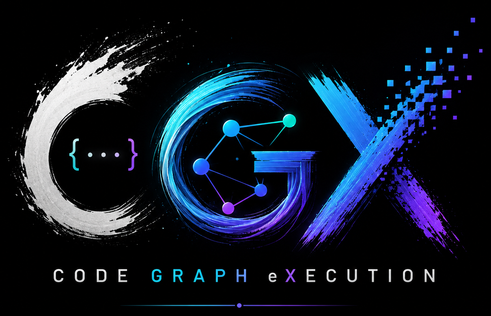

<p align="center">
  <picture>
    <source media="(prefers-color-scheme: dark)" srcset="docs/images/logo.png">
    
  </picture>
</p>

<p align="center">
<a href="https://www.mlwithramin.com/CGX">
  
</a>
  <a href="https://github.com/raminmohammadi/CGX/actions/workflows/ci.yml?branch=main"></a>
  <a href="https://github.com/raminmohammadi/CGX/releases"></a>
  <a href="LICENSE"></a>
    <a href="https://github.com/raminmohammadi/CGX/actions/workflows/pages.yml?branch=main"></a>
  <a href="https://github.com/raminmohammadi/CGX/wiki"></a>
</p>

# CGX -- Code Graph eXecution

**A local-first coding AI agent harness, codebase indexer, and search-and-response engine for self-testing code generation.**

CGX is a highly modular orchestration layer that transforms LLMs from passive chat bots into autonomous developers. As a dedicated coding AI agent harness, it is fundamentally agentic: rather than relying on free-form loops, CGX drives deterministic, plan-driven agents—including a Swarm Agent architecture featuring a Tech Lead (planner), Developer (implementer), and Verifier (tester)—to execute complex engineering tasks.

Beyond answering architectural questions, CGX generates entirely new code. It features robust code scaffolding with an AST-based symbol-level generation fallback, allowing it to dynamically parse expected project skeletons and generate functions and classes individually to bypass file-level syntax errors. To ground these agents with absolute precision, CGX indexes your repository and retrieves context via a hybrid search engine (semantic + lexical + graph).

Model-agnostic by design, the harness ships with a React/Vite web UI served by a FastAPI backend, streaming execution progress and live agent telemetry over Server-Sent Events. 

Point CGX at a repo and ask in plain English. Whether you're onboarding to
an unfamiliar codebase, planning a refactor, or scaffolding a brand-new
project, CGX grounds every answer and every code change in your actual
source -- with citations to the exact files and lines -- and keeps it all on
your machine unless you explicitly opt into a cloud model.

CGX ensures all data, embeddings, and executions remain strictly on your machine, unless you explicitly opt into a cloud provider.


> **Who is this for?**
> - **New to CGX?** Start with [Install](#install) and [Quick start](#quick-start),
>   then ask your first question. You don't need to understand the internals to use it.
> - **Power users** who want to tune retrieval, script the CLI, or pick the
>   right local model: jump to [Tuning hybrid retrieval](#tuning-hybrid-retrieval),
>   the [CLI](#cli) reference, and the [Hardware picker](#hardware-aware-model-picker).
> - **Contributors:** the [architecture](docs/architecture.md), the
>   [agent internals](docs/Agent.md), and [CONTRIBUTING.md](CONTRIBUTING.md)
>   explain how it works and how to extend it (start with a **Skill**).

## Contents

- [Highlights](#highlights) · [Install](#install) · [Quick start](#quick-start)
- [How it works](#how-it-works) · [Session-based Agent](#session-based-agent-agent) · [Self-testing code generation](#self-testing-code-generation)
- [Tuning retrieval](#tuning-hybrid-retrieval) · [Incremental indexing](#incremental-indexing) · [Hardware picker](#hardware-aware-model-picker)
- [Privacy & data flow](#privacy--data-flow) · [Architecture](#architecture)
- [MLOps & production](#mlops--production) · [Tests](#tests)

## Highlights

- **Local-first.** Indexing, embedding, retrieval, sessions, and
  telemetry **never leave the machine.** Works fully offline with
  [Ollama](https://ollama.com/).
- **Universal LLM provider.** Ollama (local), OpenAI-compatible
  endpoints, native **Google Gemini**, **Hugging Face** Inference
  Providers, or any self-hosted server with a custom IP, path, and
  optional auth-bypass -- switchable from the Settings page with a live
  **Ping** latency check. API keys live in your OS keyring.
- **Robust Code Scaffolding.** Features an AST-based symbol-level generation fallback. When scaffolding files fail repeatedly, CGX dynamically parses the expected project skeleton and uses the LLM to generate functions and classes individually, bypassing tricky file-level syntax errors.
- **Hybrid retrieval.** Two-view semantic + BM25 + graph expansion,
  fused with Reciprocal Rank Fusion and an optional cross-encoder
  rerank.
- **Session-based Agent (default `/agent`).** Describe a goal and the
  agent works toward it one step at a time, pausing at every branch so
  **you approve each decision** -- nothing reaches disk until you say so.
  It picks one of two modes automatically: **explore** an existing
  codebase (investigate → recommend → plan → apply) or **greenfield**-
  generate a new project from a plain-language idea (clarify → scaffold
  → set up the environment → run the tests, repairing failures on its
  own). Sessions are saved and resumable. Full walkthrough:
  [Session-based Agent](#session-based-agent-agent) and
  [docs/Agent.md](docs/Agent.md).
- **Swarm Agent.** A deterministic, plan-driven agent architecture that replaces free-form loops with a Tech Lead (planner), Developer (implementer), and Verifier (tester). Features an advanced **Swarm Operations Dashboard** with live telemetry, and multiple Auto-Repair capabilities (AST Import Injection, AST Function Logic Repair, Contract Renegotiation, Semantic Repair with Dynamic Temperature Scaling) to ensure reliable, compilation-ready code.
- **New project generation.** Give CGX a plain-language idea
  (*"create a FastAPI todo app"*, *"create a React calculator app"*),
  point it at an empty folder, and the greenfield agent scaffolds a
  complete, working project from scratch -- no existing codebase or
  index required. Every write is backed up under
  `<project_root>/.cgx-backups/` and the whole run is reversible via
  `POST /api/rollback`.
- **Modular skills registry** (`skills/`). Each supported technology
  lives in its own folder (`skills/react/`, `skills/fastapi/`,
  `skills/nextjs/`, `skills/vue/`, `skills/tailwind/`, `skills/flask/`,
  `skills/django/`, `skills/express/`, `skills/python_cli/`,
  `skills/sqlite/`) and bundles three things: detection from the goal,
  the prompt fragment the LLM sees while generating, and a structural
  validator that runs on the produced diffs. The SCAFFOLD executor
  invokes `skills.validate_scaffold` after each generation, and a fatal
  verdict (e.g. a React goal that emitted no JS/TS source) drives a
  whole-tree regenerate rather than silently applying a Python-only
  output. Multi-skill goals compose naturally -- *"React UI
  + FastAPI backend"* activates both, so the scaffold prompt carries
  both layouts and both validators run. Adding a new framework is a single-folder change with
  no agent-layer edits. See
  [docs/usage.md](docs/usage.md#skills-technology-aware-scaffolding)
  for the full table and [docs/architecture.md](docs/architecture.md#skills)
  for the protocol.
- **Persistent chat sessions.** Conversations are saved as JSONL
  threads under `~/.cgx/sessions/`; resume them later from the
  Contextual Ask page's session sidebar.
- **Self-testing code generation.** Diffs are parsed, syntax-checked,
  and optionally run against impacted pytest tests in a sandbox before
  being surfaced. The sandbox now auto-installs missing Python packages
  before running pytest (`cgx.codegen.env_manager`) so a model choosing
  a new library doesn't mask real failures.
- **Granular error slicing.** Retry prompts include ±5 lines of source
  context around the first traceback line number rather than a raw
  1 200-character pytest dump, keeping small models focused on the precise
  failure site.
- **Incremental indexing.** A content-addressed embedding cache
  (per-view `.npz` keyed on sha256 of the corpus text) makes
  re-indexing a touched-only-a-few-files repo nearly instant.
- **Hardware-aware model picker.** The **Settings → Hardware** panel
  reports ✅/⚠️/❌ verdicts for 21 curated local models against your
  detected RAM/VRAM (merging any you've already pulled), sizes arbitrary
  Hugging Face repos, and shows a local-vs-cloud trade-off table.
- **Client-side rate limiting + 429 retry** on every provider, with
  per-profile budgets persisted alongside the model config.
- **Thought-process panel.** Live streaming of the model's reasoning
  sketch, followed by the final grounded answer.
- **VS Code extension scaffold** (`extension/`) that hosts the
  CGX web UI inside an editor webview.
- **Task registry & cancel.** Every operation is tracked in
  `~/.cgx/tasks.db`; cancel any running task with
  `DELETE /api/tasks/{id}` or the in-UI Cancel button.
- **Cancel button on every page.** Stop a streaming request mid-flight
  from Ask (Stop), Plan, Agent, or Index (Cancel).
- **Page persistence.** Switching between pages mid-task no longer loses
  the running view -- state is held in a session-scoped Zustand store
  (`frontend/src/store/tasks.ts`) and the SSE stream continues in the
  background via `frontend/src/lib/connections.ts`.
- 🖥️ **Terminal observability.** All operations emit structured
  `[INFO]`/`[WARNING]` log lines to stdout from startup
  (`setup_logging(INFO)` in `launch.py`).
- 📊 **Production MLOps layer.** Prometheus metrics (`/api/metrics`),
  curated function-call tracing, per-run activity + admin explorers,
  an offline eval + CI quality gate, AIOps drift/quality/cost alerts, a
  user-feedback flywheel, per-owner cost/quota budgets, PII/retention
  governance, `/healthz` + `/readyz` probes, and a container / Compose /
  Helm deployment path -- all local-first and zero-config. See
  [docs/mlops.md](docs/mlops.md).
- ⚡ **Parallel two-view execution.** FAISS index building
  (`run_index_auto`) and semantic retrieval (`HybridRetriever.search`)
  both run the intent and impl views concurrently via
  `ThreadPoolExecutor`.

---

## Install

CGX has a **small core** and a **separately-installable ML stack**. Pick
the path that matches how you plan to use it.

CGX runs natively on **Linux**, **macOS** (Intel and Apple Silicon),
and **Windows**, on Python 3.10 / 3.11 / 3.12. The only OS-specific
step is venv activation; everything else (CLI, UI, indexing, agent
loop) is identical across platforms. See [Platform notes](#platform-notes)
for Apple Silicon (Metal) and Windows-specific paths.

### Core install (no torch)

Use this if you'll point CGX at an Ollama server or an OpenAI-compatible
endpoint and supply your own embeddings via a BYO embedder callable.

```bash
git clone https://github.com/raminmohammadi/CGX.git
cd CGX
python -m venv .venv

# Linux / macOS
source .venv/bin/activate

# Windows (PowerShell)
# .venv\Scripts\Activate.ps1

pip install -r requirements.txt
pip install -e ".[codegen]"
```

This installs FAISS, FastAPI/Uvicorn, NetworkX, and the codegen pieces
but skips `torch` / `transformers` / `sentence-transformers` entirely.
Heavy ML modules are imported lazily, so the UI and CLI work out of the
box.

### Full install (with local embeddings)

Use this if you want CGX to load the default Jina embedding model
locally and/or run the optional cross-encoder reranker. Activate the
venv first as shown above, then:

```bash
pip install -r requirements.txt -r requirements-ml.txt
pip install -e ".[codegen]"
# or, equivalently, via extras:
# pip install -e ".[ui,embeddings,faiss,codegen]"
```

Optional extras:

| Extra        | Adds                                              |
|--------------|---------------------------------------------------|
| `ui`         | FastAPI + Uvicorn web UI backend                  |
| `embeddings` | `sentence-transformers`, `transformers`, `torch`  |
| `faiss`      | `faiss-cpu` (large speedup over numpy fallback)   |
| `codegen`    | `unidiff` (stricter diff parsing)                 |
| `keyring`    | OS keyring for API-key storage                    |
| `parsers`    | tree-sitter grammars for JS / TS / TSX ingestion  |
| `mcp`        | Model Context Protocol SDK (external tool servers)|
| `viz`        | `matplotlib` (regenerate the docs book diagrams)  |
| `dev`        | `pytest`, `ruff`, `mypy`                          |

Pull a small local model (recommended default):

```bash
ollama pull qwen2.5-coder:3b
```

### Platform notes

- **Linux** -- no extra steps. NVIDIA users wanting GPU embeddings or
  rerank need a CUDA-enabled `torch` build, **and the wheel's CUDA
  series must match your driver**. The default `pip install torch`
  from PyPI tracks the newest CUDA release, which is frequently ahead
  of installed drivers and silently falls back to CPU at runtime.
  Check `nvidia-smi`'s "CUDA Version" column, then install the
  matching wheel:
  ```bash
  # Driver supports CUDA 12.8 (most 5xx series drivers):
  pip install --index-url https://download.pytorch.org/whl/cu128 torch
  # Older drivers: substitute cu124 / cu121 as appropriate. See
  # https://pytorch.org/get-started/locally/ for the full matrix.
  ```
  Symptom of a mismatch: `torch.cuda.is_available()` is False despite
  `nvidia-smi` reporting the GPU, embeddings run on CPU (~10x slower),
  and the index metadata shows `used_gpu: false`.
- **macOS -- Intel** -- CPU-only by default; same install path as Linux.
- **macOS -- Apple Silicon** -- works natively on arm64. The embedding
  model loads on CPU by default; to use the Metal backend, install the
  ML extras and set `CGX_EMBED_DEVICE=mps` before launching:
  ```bash
  CGX_EMBED_DEVICE=mps cgx-ui
  ```
  Ollama also runs natively on Apple Silicon -- no Rosetta needed.
- **Windows** -- use PowerShell or `cmd.exe`. The venv activates with
  `.venv\Scripts\Activate.ps1` (PowerShell) or `.venv\Scripts\activate.bat`
  (cmd). The CGX config directory resolves to `%USERPROFILE%\.cgx`
  (override with `CGX_CONFIG_DIR`). The `0600` file-permission fallback
  used for `~/.cgx/secrets.json` is a POSIX no-op on NTFS, so install
  the `keyring` extra (`pip install -e ".[keyring]"`) so API keys are
  stored in Windows Credential Manager instead of a plain file.

---

## Quick start

### UI (recommended)

```bash
cgx-ui               # after `pip install -e ".[ui]"`
# or
python app.py
# or via the unified CLI
cgx serve
```

### Binding & remote access

`cgx-ui` (and `python app.py` / `cgx serve`) bind the FastAPI server
to `127.0.0.1:8765` by default, so the UI is only reachable from the
same host. Override with `--host` / `--port` flags or the `CGX_HOST` /
`CGX_PORT` environment variables:

```bash
cgx-ui --host 0.0.0.0 --port 8765
# or
CGX_HOST=0.0.0.0 CGX_PORT=8765 cgx-ui
```

The server has **no built-in authentication** -- anything that can
reach the bound `host:port` can drive the agent loop, read sessions,
and write to disk under the configured Project Root. Bind to a
non-loopback address only on a trusted LAN/VPN (Tailscale, WireGuard,
…) or behind a reverse proxy that adds auth (Caddy, nginx + basic
auth, oauth2-proxy, …). Do not expose port 8765 directly to the
public internet.

Navigation is a grouped left **sidebar** (not a flat tab row). The
**Overview** (`/`) landing page shows provider, index and session status at a
glance; the groups below hold the working pages:

1. **Converse → Contextual Ask** (`/ask`) -- natural-language question with a
   streaming "thought process" panel and a final grounded answer. The sidebar
   holds the **session list** (➕ New / 🗑️ Delete / dropdown to resume an
   existing thread). A **Stop** button halts the stream mid-flight; switching
   pages preserves the answer in progress.
2. **Build → Self-Testing Plan** (`/plan`) -- request a change plan; optionally
   tick *Validate diffs* and *Run impacted tests* to have CGX self-check its own
   output before returning. The full self-test report renders inline. A
   **Cancel** button is available while planning is in progress; page switching
   is non-destructive.
3. **Build → Agent Loop** (`/agent`) -- the **session-based** view. Start a
   session with an objective, pick a **mode** (auto / explore /
   greenfield -- *auto* defers to `detect_mode`), and watch the
   agent walk the appropriate chain. Explore mode runs
   `EXPLORE → INVESTIGATE → RECOMMEND → PLAN_CHANGE → APPLY →
   VERIFY` against an existing codebase; greenfield mode runs
   `CLARIFY_REQUIREMENTS → DECOMPOSE → SCAFFOLD → APPLY → VERIFY`
   to bootstrap a new project. Both pause at every branch for a
   typed choice. The task tree shows the full DAG with status
   icons, depth-based indentation, and a side panel surfacing the
   Knowledge Base (facts) and Artifacts (`DIRECTIONS_LIST`,
   `FINDINGS_BUNDLE`, `RECOMMENDATION_LIST`, `CODE_CHANGE_PLAN`,
   `REQUIREMENTS_SHEET`, `WORK_PLAN`, `SCAFFOLD_PATCHES`,
   `APPLIED_CHANGES`, `VERIFY_REPORT`). Nothing reaches disk until
   you tick the approval checkpoint, and an `Undo` button rolls
   the run back via `POST /api/rollback`. Session state is
   persisted to `<project_root>/.cgx/sessions.db`; the active
   session id and selection are persisted client-side so a page
   switch / reload resumes the same view. The same loop backs the
   `cgx agent` CLI, which runs a single unattended turn (clarify /
   approval questions answered with sensible defaults) for one-shot
   goals. A **Cancel** button is surfaced on long-running tasks.
4. **Retrieval → Incremental Index** (`/index`) -- point at a project root or
   upload a `.zip`. Honours `.gitignore` and a 1 MB file-size cap; emits
   `indices/`, `records.jsonl`, `chunks.jsonl`, `graph.json` and per-view
   `emb_cache_<view>.npz` for incremental re-indexing. Intent and impl views
   are indexed in parallel. A **Cancel** button is available while indexing is
   in progress.
5. **Observability → Ops & Observability** (`/ops`) -- the unified MLOps hub:
   ten tabs of live metrics, per-run activity, AIOps alerts, cost & quota,
   feedback, data governance, health probes, and a **Trace** explorer that
   browses each project's redacted `@traced` log (full prompt + response per LLM
   call). Every card, chart and button is documented in the
   [Ops & Observability](wiki/Ops-and-Observability.md) wiki page. See also
   [MLOps & production](#mlops--production).
6. **System → Profiles & Setup** (`/settings`) -- a searchable category list:
   - **Active Provider** -- choose a **Provider Type** (Ollama, OpenAI, Google
     Gemini, Hugging Face, or Custom Server), fill in the model and credentials,
     and click **Ping** to verify the connection with a live latency check. API
     keys are stored in your OS keyring.
   - **Saved Profiles** -- save/use/edit provider configurations for any
     supported kind (`ollama`, `openai-compat`, `gemini`, `huggingface`,
     `custom`). Custom profiles expose an **Endpoint Path** field and a **Skip
     auth** toggle for private-subnet servers; optional per-profile `rate_limit`
     (req/sec) and `max_retries` apply automatically to every call.
   - **Browse Hugging Face** -- lists GGUF repositories from the Hub, sizes them
     against your hardware with **Check fit**, and **Pull**s them straight into
     your local Ollama daemon, re-aliasing each download to a clean local name
     (e.g. `ornith-1.0-9b-gguf`) instead of the full `hf.co/<repo>` web address.
   - **Observability** -- a single **tracing toggle** (equivalent to
     `CGX_TRACE=1`) that turns on the rich `@traced` records read by the Ops
     hub's Trace tab.
   - **Hardware** -- click **Detect Hardware Budget** to probe RAM + GPU VRAM
     and annotate the local model catalogue with ✅/⚠️/❌ fit verdicts, flag
     already-downloaded models, size any Hugging Face repo, and show the
     editorial local-vs-cloud trade-off across privacy, cost, quality ceiling,
     latency, offline use, setup effort, and operational risk. The catalogue is
     pure-offline; no network call fires from annotating it.

### CLI

The `cgx` command exposes every capability as a scriptable subcommand
(`cgx <command> --help` for the full flag list):

```bash
# 1. Build an index into the auto-discovered .cgx/index location
cgx index --project-root . --out-dir .cgx/index

# 2. Raw hybrid retrieval as JSON (no LLM)
cgx query --index-dir .cgx/index/indices \
          --records  .cgx/index/records.jsonl \
          --query "What does parse_codebase do?"

# 3. Grounded, streamed LLM answer over the index
cgx ask "What does parse_codebase do?" --think

# 4. Generate a self-tested code-change plan
cgx plan "Add a --json flag to the query command" --self-test --run-tests

# 5. Run an unattended turn of the session agent loop
cgx agent "Add docstrings to every public function in cgx.parser"

# Provider + hardware + index status
cgx status
```

`ask`, `plan`, `agent`, and `status` share provider flags
(`--provider`, `--model`, `--base-url`, `--profile`) and auto-discover the
index at `<project-root>/.cgx/index` (override with
`--index-dir` / `--records`). They stream tokens live and cancel cleanly
on **Ctrl-C**. See [docs/usage.md](docs/usage.md#the-cli-non-interactive-subcommands)
for the full reference. `cgx serve` launches the web UI; bare `cgx` (or
`cgx dash`) opens the interactive dashboard.

### Python

```python
from cgx.pipeline.auto import run_index_auto, run_query_auto
from cgx.answer.engine import answer_with_llm, generate_code_plan
from cgx.answer.providers import OllamaProvider, GeminiProvider, OpenAICompatProvider

run_index_auto(project_root="./", out_dir="/tmp/cgx_index")

# Local Ollama
prov = OllamaProvider(model="qwen2.5-coder:3b")

# Google Gemini
# prov = GeminiProvider(model="gemini-1.5-flash", api_key="YOUR_KEY")

# Hugging Face Inference Providers (OpenAI-compatible router)
# prov = OpenAICompatProvider(
#     model="openai/gpt-oss-20b",
#     base_url="https://router.huggingface.co",
#     api_key="hf_YOUR_TOKEN",  # or set HF_TOKEN in the environment
# )

# Custom self-hosted server (no auth, non-standard path)
# prov = OpenAICompatProvider(
#     model="my-model", base_url="http://100.10.20.10:8080",
#     endpoint_path="/completion", allow_no_auth=True,
# )

ans = answer_with_llm(
    "/tmp/cgx_index/indices",
    "/tmp/cgx_index/records.jsonl",
    "What does parse_codebase do?",
    prov,
)
print(ans["answer_md"])
```

---

## How it works

Three picture-first views of the same system live in
[docs/flowcharts.md](docs/flowcharts.md):

- **For users** (see [User Flow](docs/flowcharts.md#for-users)) -- the
  install → index → ask/plan/agent → grounded-answer journey.
- **For developers** (see [Developer Flow](docs/flowcharts.md#for-developers)) --
  the session loop's Router → executor dispatch and the full SSE
  event timeline.
- **For companies** (see [Trust Boundaries](docs/flowcharts.md#for-companies)) --
  trust boundaries: what stays on the local machine, where credentials
  live, and the single opt-in egress path to a remote LLM.

---

## Tuning hybrid retrieval

`HybridConfig` (in `cgx.retrieval.orchestrator`) exposes the knobs that
shape post-RRF reranking. The defaults are reasonable, but each signal can
be disabled or amplified independently:

| Field             | Default | Effect                                                    |
|-------------------|---------|-----------------------------------------------------------|
| `graph_bonus`     | `0.2`   | Score bump (RRF-scaled) for chunks reached via the import/call graph. Set to `0.0` to ignore graph-only neighbors. |
| `symbol_boost`    | `0.5`   | RRF-scaled bonus for chunks whose identifier or file path matches a token in the question. |
| `enable_reranker` | `False` | Run an optional cross-encoder over the top-N fused chunks. |
| `reranker_model`  | `cross-encoder/ms-marco-MiniLM-L-6-v2` | Hugging Face model id. |
| `reranker_top_n`  | `30`    | How many head candidates to re-score.                     |
| `reranker_weight` | `1.0`   | Convex blend between cross-encoder and RRF score (`1.0` = CE only). |

The reranker lazy-loads `sentence_transformers` only when
`enable_reranker=True`; if the ML stack isn't installed it silently falls
back to the RRF order. Install it via `requirements-ml.txt` to opt in.

```python
from cgx.retrieval.orchestrator import HybridConfig
cfg = HybridConfig(enable_reranker=True, reranker_top_n=20, graph_bonus=0.3)
```

When `graph_bonus > 0` surfaces neighbors of the top hits, the answer
pipeline automatically switches to a **two-tier "Code Map" prompt**:
direct matches keep their full code bodies, while graph-expanded
neighbors collapse to one-line `name(signature) -- docstring` stubs
tagged `tier=neighbor`. This keeps small local models (3B/7B Ollama,
etc.) from spending their entire context window on structural
references they only need to *know about*. The per-tier budget scales
by the provider's model window -- see
[docs/usage.md § Tiered SOURCES (Code Map)](docs/usage.md#tiered-sources-code-map)
and the architecture doc for the full treatment.

---

## Self-testing code generation

When you tick **Validate diffs** in the Plan tab (or pass `self_test=True`
to `generate_code_plan`), CGX will:

1. Parse fenced ```diff path=...``` blocks from the model output.
2. Dry-apply each diff in memory.
3. Run `ast.parse` on the projected file contents.
4. If **Run impacted tests** is enabled, copy the project to a sandbox,
   materialise the diffs, and run pytest scoped to impacted files.
5. If anything fails, retry once with the concrete failures as feedback.

The full report is attached to the result as `codegen_report` and rendered
under the plan in the UI.

---

## Session-based Agent (`/agent`)

The default Agent tab drives a **persistent, session-shaped** loop
defined in `cgx.session`. Every interaction belongs to a `Session`
whose state survives process restarts under
`<project_root>/.cgx/sessions.db`. A session walks one of two
chains -- the **mode** is auto-detected by
`cgx.session.mode.detect_mode` at session creation (or set
explicitly via the launcher / API), and dictates which root task
the router seeds. Both shapes pause at every `ASK_USER` for a typed
user decision:

```
# Explore mode (existing codebase + FAISS index)
EXPLORE -> ASK_USER(choose_path)
              -> INVESTIGATE -> RECOMMEND -> ASK_USER(choose_recommendation)
                                                -> investigate_more (loop)
                                                -> plan_change
                                                     -> PLAN_CHANGE
                                                        -> ASK_USER(approve)
                                                           -> APPLY -> VERIFY
                                                -> ask_followup / done

# Greenfield mode (empty / non-indexed project root)
CLARIFY_REQUIREMENTS -> ASK_USER(clarify_answers)
                          -> DECOMPOSE -> ASK_USER(approve_plan)
                                            -> SCAFFOLD -> APPLY
                                                 -> BOOTSTRAP_ENV -> VERIFY <---+
                                            -> (reject halts the loop)        |
                                                                              | (greenfield
                                                                              | fixable
# Autonomous repair (greenfield only; progress-aware LoopBudget,              | failures)
# absolute ceiling 4 rounds, signature-gated)
VERIFY (fail) -> REPAIR -> APPLY (skips BOOTSTRAP_ENV) -> VERIFY -------------+
              \ (empty plan)
               -> ASK_USER(freeform)
```

Three modules own every transition:

* `cgx.session.router.Router` -- pure-Python deterministic state
  machine. No LLM calls, no I/O; returns a typed `RouterPlan` of
  `CreateTask` / `UpdateTaskStatus` / `UpdateSessionStatus` /
  `RecordDecision` / `AttachDecisionToTask` / `RecordLesson` actions
  (vocabulary in `cgx.session.actions`, greenfield edges in
  `cgx.session.greenfield_edges`, retry counters in
  `cgx.session.budget.LoopBudget`). Reads `session.mode` to choose
  the root task and the `TASK_SUCCESSOR` chain.
* `cgx.session.runner.SessionRunner` -- per-session lock, executor
  dispatch, failure handling, persistence sequencing, and the
  session-budget check (`max_task_runs` / `max_wall_seconds`) that
  escalates a runaway autonomous loop to `ASK_USER` (interactive) or
  terminal `FAILED` (headless) before dispatching the next task.
* `cgx.session.tasks.*` -- one registered executor per `TaskKind`:
  explore-mode (`EXPLORE`, `INVESTIGATE`, `RECOMMEND`,
  `PLAN_CHANGE`), greenfield-mode (`CLARIFY_REQUIREMENTS`,
  `DECOMPOSE`, `SCAFFOLD`, `BOOTSTRAP_ENV`, `API_CHECK`, `SMOKE`,
  `RUNTIME_VERIFY`, `REPAIR`), and shared (`APPLY`, `VERIFY`,
  `ASK_USER`).

**Environment bootstrap and autonomous repair (greenfield).** Before
tests run, `BOOTSTRAP_ENV` provisions a project-local environment (a
`.venv` for Python; the JS toolchain for a `package.json` project) and
installs both declared and detected-undeclared dependencies, so a
missing package surfaces as a collection error on the `BUILD_REPORT`
rather than masquerading as a test failure. `VERIFY` then runs the
project's tests through a pluggable runner registry (pytest for Python,
`npm test` / `npm run build` for JS/TS -- a polyglot repo is verified in
one pass). A failed `VERIFY` spawns a `REPAIR` task that first tries
deterministic, LLM-free classifiers (a pytest class missing
`unittest.TestCase`, a `ModuleNotFoundError` for a project-root module,
a missing fixture, a third-party import break fixed via a PyPI-computed
version pin) and, for ordinary logic / assertion failures with no
mechanical fix, falls back to a **bounded LLM repair** that rewrites the
smallest set of files (≤5) and re-validates their syntax before
applying. The loop continues only while the failing-test count strictly
drops (absolute ceiling of 4 rounds, all counters in one typed
`cgx.session.budget.LoopBudget`) and is gated by a failure-signature
hash, so identical repeated failures escalate rather than loop. A
session-level budget (`max_task_runs` / `max_wall_seconds`) backstops
the whole autonomous run: interactive sessions pause on an `ASK_USER`
when spent, headless ones end terminally `FAILED`.

The HTTP surface at `/api/agent-session/*` has eight endpoints:
seven JSON (create / list / get / message / decision / cancel /
delete) plus a `GET /{sid}/events` **SSE** stream. Mutating endpoints
return the full `AgentSessionState` snapshot so the React UI
re-renders the tree in one round-trip; `DELETE /api/agent-session/
{sid}` discards a session and its aggregate (`ON DELETE CASCADE`)
and returns `{deleted: sid}`. The UI follows a running session over
the SSE feed and falls back to polling
`GET /api/agent-session/{sid}` only when the stream is unhealthy.

Drive it programmatically (no UI required):

```python
from cgx.answer.providers import OllamaProvider
from cgx.session import SessionRunner, SessionStore
from cgx.session.models import Decision, DecisionKind
import cgx.session.tasks  # noqa: F401 -- registers executors
from cgx.session.tasks.base import ExecutorDeps

store = SessionStore(project_root="/path/to/proj")
runner = SessionRunner(store)
session = runner.start_session(
    objective="how should we refactor the parser layer?",
    project_root="/path/to/proj",
)
deps = ExecutorDeps(
    project_root="/path/to/proj",
    index_dir="/tmp/cgx_index/indices",
    records_path="/tmp/cgx_index/records.jsonl",
    provider=OllamaProvider(model="qwen2.5-coder:3b"),
    store=store,
)
task = runner.run_next(session_id=session.session_id, deps=deps)
# `task` is now an ASK_USER waiting on a `choose_path` decision.
```

See [docs/Agent.md](docs/Agent.md), [docs/usage.md](docs/usage.md#6-session-based-agent-agent),
and [docs/flowcharts.md](docs/flowcharts.md#session-shaped-write-loop-agent)
for full reference.

---

## Persistent chat sessions

The Ask tab's sidebar manages local conversation history:

- **➕ New** -- creates a session, returns a UUID, and starts an empty
  thread.
- **🗑️ Delete** -- removes the selected session file.
- Selecting a session from the dropdown renders prior turns inline
  and routes new questions through that thread; user + assistant
  turns are appended automatically as the answer stream finishes.

Storage layout (under `~/.cgx/sessions/`, or `$CGX_CONFIG_DIR/sessions/`):

```
~/.cgx/sessions/
├── index.json                 # session headers (id, title, counts, timestamps)
└── <session-uuid>.jsonl       # one append-only message per line
```

Programmatic access:

```python
from cgx import sessions
meta = sessions.create_session(title="refactor parse_codebase")
sessions.append_message(meta.id, role="user", content="What does it return?")
for m in sessions.list_sessions():
    print(m.id, m.title, m.message_count)
```

Sessions are stdlib-only (no extra deps) and written atomically via
`os.replace`.

---

## Incremental indexing

`run_index_auto` is incremental by default. On every re-index it
consults a per-view content-addressed cache that lives next to the
FAISS indices:

```
<out_dir>/
├── indices/...
├── records.jsonl
├── emb_cache_intent.npz       # ← cache, keyed on sha256(corpus_text)
└── emb_cache_impl.npz
```

The cache stores `{sha256(corpus_text): np.ndarray}` pairs. Unchanged
chunks reuse their cached vectors; only modified chunks reach the
embedder. The cache is auto-invalidated when the embedding
`model_name`, `dim`, or `normalize` flag changes -- there is no risk of
serving stale vectors against a different model.

Inspect the hit/miss ratio:

```python
result = run_index_auto(project_root="./", out_dir="/tmp/cgx_index")
print(result["incremental"])         # True
print(result["embedding_cache"])
# {'intent': {'hits': 412, 'misses': 5, 'dim': 768},
#  'impl':   {'hits': 410, 'misses': 7, 'dim': 768}}
```

Disable for a clean rebuild:

```python
run_index_auto(project_root="./", out_dir="/tmp/cgx_index", incremental=False)
```

---

## Hardware-aware model picker

The **Settings → 📊 Hardware** panel annotates a static catalogue of 21
locally-runnable models (families: `coder`, `reasoning`, `general`)
against the RAM/VRAM detected by
`cgx.answer.ollama_discovery.detect_hardware()`, merging in any models you
have already pulled into Ollama so the table matches what's on disk. Each
row reports:

| Column        | Meaning                                                                                        |
|---------------|------------------------------------------------------------------------------------------------|
| `name`                | Ollama tag (e.g. `qwen2.5-coder:3b`, `llama3.1:8b-instruct`).                          |
| `params_b`            | Approx parameter count in billions.                                                   |
| `min_ram_gb`          | Lower bound for 4-bit quantised inference.                                            |
| `recommended_vram_gb` | VRAM at which throughput is smooth.                                                   |
| `ctx_window`          | Maximum prompt window the model advertises.                                           |
| `family`              | `coder`, `reasoning`, or `general`.                                                   |
| `fit`                 | ✅ *fits* / ⚠️ *tight* / ❌ *won't fit* against your detected budget.                  |
| `reason`              | The numeric comparison behind the verdict.                                            |

The second table shows the editorial local-vs-cloud trade-off across
**privacy, marginal cost, quality ceiling, cold/warm latency,
offline use, setup effort, and operational risk**. Every number is
computed locally -- annotating the catalogue does **not** make any network
call (only the optional Hugging Face fit check reaches the Hub). The same
data is exported as
[`docs/hardware_matrix.json`](docs/hardware_matrix.json) for downstream
tooling and documented in
[`docs/hardware_matrix.md`](docs/hardware_matrix.md).

---

## Rate limiting and retries

Every HTTP-backed provider goes through `cgx.answer.ratelimit`, which
adds a thread-safe token-bucket limiter plus exponential-backoff
retry (honouring `Retry-After` when present) on HTTP **429** and
**5xx** responses.

Configure per-profile in the **Profiles** tab (or programmatically):

```python
from cgx.answer.profiles import Profile, save_profile
save_profile(Profile(
    name="my-cloud",
    kind="openai-compat",
    model="gpt-4o-mini",
    base_url="https://api.openai.com/v1",
    rate_limit=2.0,   # 2 requests/sec, bucket capacity = rate
    max_retries=4,    # default is 0 (no retry); 4 ≈ ~30s ceiling
))
```

Setting `rate_limit=None` (the default) makes the limiter a no-op so
existing call sites keep their pre-feature behaviour.

---

## VS Code extension scaffold

[`extension/`](extension/) is a minimal TypeScript extension that hosts
the running CGX web UI inside a VS Code webview panel. It is **not**
packaged into a `.vsix` from the repo -- build it locally:

```bash
cd extension
npm install
npm run compile
# then press F5 in VS Code to launch an Extension Development Host
```

Commands contributed: **CGX: Open UI**, **CGX: Reload UI**.
The server URL is read from the `cgx.ui.url` setting (default
`http://localhost:8765`). The extension does not spawn the server --
start it with `cgx-ui` (or `python app.py`) first.

See [`extension/README.md`](extension/README.md) for the full setup.

---

## Architecture

See [`docs/architecture.md`](docs/architecture.md) for a deeper dive.

---

## MLOps & production

Beyond the request pipeline, CGX ships a full MLOps layer for running the
service in production -- observability, evaluation, monitoring, governance,
and deployment -- built with the same local-first, stdlib-first, zero-config
philosophy as the rest of the tool. Every store is SQLite (WAL,
`$CGX_CONFIG_DIR`-aware), metrics are collected in-process, and every
recorder is best-effort so an observability failure can never break a request.

| Area | What it gives you |
|------|-------------------|
| **Observability** | In-process Prometheus metrics at `GET /api/metrics` (RED-style LLM latency/cost/token series) + a curated `@traced` function-call tracer (`CGX_TRACE`) with secret redaction. Traced ask/plan/agent runs log every LLM call's full redacted prompt + response to the project `agent.log`. |
| **User activity & admin** | A per-run activity store (grounding + token/cost/latency) and an admin explorer that stitches logs, metrics, alerts and feedback into one redacted view. The Ops → Trace hub browses per-project traces and can purge trace logs (log-files-only, symlink-safe) via `DELETE /api/admin/logs`. |
| **Evaluation** | An offline retrieval + codegen harness over golden sets under `evals/`, wired into CI as a quality gate (`python -m cgx.eval`). |
| **Lineage** | A prompt/model registry + per-run `run_id` join key + index lineage so any record joins back to exactly what produced it. |
| **AIOps monitoring** | Groundedness / retrieval-drift / cost-anomaly / repair-health checks that persist `Alert` records (`CGX_MON_*`), surfaced at `GET /api/monitor/alerts`. |
| **Feedback flywheel** | Thumbs up/down + comments that export down-votes into eval candidates and unify with cross-session lessons. |
| **Cost & quota** | Truthful token/cost accounting (`CGX_MODEL_PRICING`) plus per-owner day budgets with soft-warn / hard-stop (`CGX_BUDGET_*`). |
| **Reliability** | `/healthz` (liveness) + `/readyz` (readiness) probes and Prometheus SLO rules. |
| **Guardrails** | Prompt-injection heuristics (direct + indirect), secret-in-output / path-escape checks, and an `CGX_LLM_DISABLED` kill-switch. |
| **Data governance** | Configurable retention/TTL, right-to-erasure, and a PII scan/scrub pass beyond credential redaction (`/api/govdata/*`). |
| **Packaging** | Multi-stage Docker image, a Compose stack (CGX + Prometheus + Grafana), and a Helm chart under `deploy/`. |

Full operator guide: [`docs/mlops.md`](docs/mlops.md). Deployment guide:
[`deploy/README.md`](deploy/README.md).

---

## Privacy & data flow

CGX is built around **local-first** processing. The following table is
the complete list of network egress paths in the product:

| Activity                          | Network egress? | Where it goes                                     |
|-----------------------------------|-----------------|---------------------------------------------------|
| Parsing, embedding, indexing      | **No**          | All on-device.                                    |
| Hybrid retrieval / reranking      | **No**          | All on-device.                                    |
| Asking a question / planning code | Yes             | Only the LLM endpoint you configure.              |
| Local LLM (default: Ollama)       | Yes (loopback)  | `http://localhost:11434` -- never leaves your box. |
| OpenAI-compatible providers       | Yes             | The exact base URL / endpoint path you configure. |
| Google Gemini provider            | Yes             | `generativelanguage.googleapis.com` only.         |
| Hugging Face Inference provider   | Yes             | `router.huggingface.co` only.                     |
| Session history, profiles, cache  | **No**          | `~/.cgx/` (locked-down `0600` files).             |
| Anonymous startup telemetry       | **Opt-in**      | Disabled by default; see below.                   |

### Server access & secrets

- **No authentication on the local API.** The FastAPI server does not
  ship with login, tokens, or CSRF protection -- any process that can
  reach the bound `host:port` can drive the agent loop, read sessions,
  and write to disk under the configured Project Root. This is safe at
  the default `127.0.0.1:8765` loopback bind; do not bind to `0.0.0.0`
  (via `--host`, `CGX_HOST`, or otherwise) without putting an auth-
  enforcing reverse proxy in front. See
  [Binding & remote access](#binding--remote-access).
- **Disk-writing capabilities.** `apply` and `scaffold_file` tasks
  write inside the configured **Project Root**. Every overwrite is
  mirrored under `<project_root>/.cgx-backups/<run_id>/` and the whole
  run can be undone via `POST /api/rollback`. Set the Project Root
  deliberately -- a stray value lets the agent write anywhere the
  launching user can.
- **Secrets at rest.** API keys go to the OS keyring when the
  `keyring` extra is installed: macOS **Keychain**, GNOME
  **Keyring** / KDE **KWallet** on Linux, **Windows Credential
  Manager** on Windows. The fallback is `~/.cgx/secrets.json` with
  `0600` permissions on POSIX. On Windows NTFS the POSIX bits are not
  enforced, so install the `keyring` extra for production use.
- **Config directory hardening.** `~/.cgx/` is chmodded to `0700` on
  POSIX once a profile is saved. Override the location on any OS with
  the `CGX_CONFIG_DIR` environment variable; it resolves to
  `%USERPROFILE%\.cgx` by default on Windows.

### Telemetry

A single, anonymous startup ping is available for measuring active
installs. It is **off by default** and contains *only* a random install
UUID generated on first run and the CGX version -- no prompts, no
code, no file paths, no model names, no PII.

Enable:
```bash
export CGX_TELEMETRY=1
```
Disable: unset the variable, or set `CGX_TELEMETRY=0`. To rotate the
install id, delete `~/.cgx/install_id` and restart.

The exact payload shape and source live in
[`src/cgx/telemetry.py`](src/cgx/telemetry.py).

---

## Tests

```bash
pip install -e ".[dev]"
pytest -q
```

The suite covers parser, embeddings cache, hybrid retrieval / rerank,
codegen pipeline, the session agent loop (router / executors / store),
hardware matrix, rate limiter, telemetry, profiles, and an end-to-end
index → query smoke test with a deterministic fake embedder (no model
download, no GPU).

CI is configured in [`.github/workflows/ci.yml`](.github/workflows/ci.yml)
as a **two-job matrix**:

- **core** -- runs on Python 3.10 / 3.11 / 3.12 with only
  `requirements.txt`. Asserts the lazy-import path stays clean (no
  hard dependency on `torch`).
- **ml** (optional) -- installs `requirements-ml.txt` too and exercises
  the embedding + reranker stack.

---

## License

MIT.
