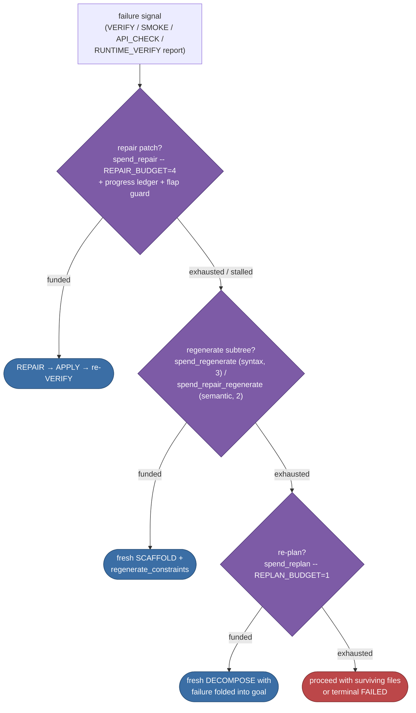
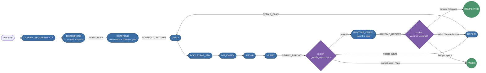
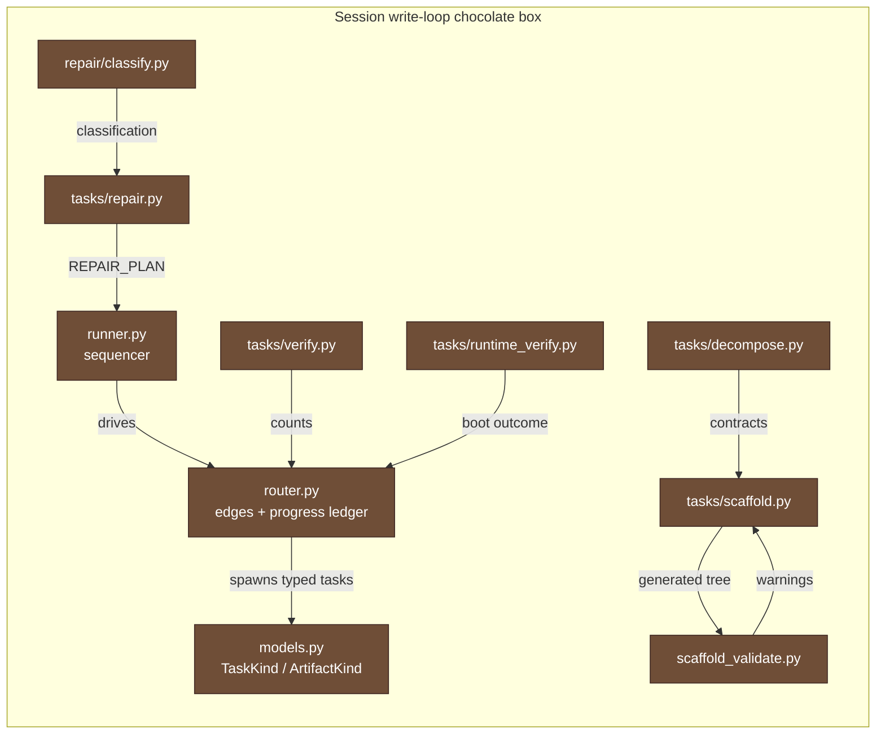

# The CGX Agent

This document describes the **agent layer** of CGX -- the component that
turns a natural-language goal into grounded answers, recommendations,
and applied code changes against a real codebase. It is intended for
community contributors who want to understand how the agent works
today and where it could be pushed further.

CGX ships **one agent shape**: the **session-based agent** -- a
persistent DAG of typed tasks with structured human-in-the-loop
checkpoints. Code under [`src/cgx/session/`](../src/cgx/session/);
HTTP at `/api/agent-session/*`; UI at `/agent`; terminal surface via
the interactive dashboard and the one-shot `cgx agent` CLI. It is
designed for multi-turn exploration that may or may not end in a code
change, and reuses the same retrieval, codegen, and provider stacks as
the ask/plan surfaces (a `PLAN_CHANGE` task goes through the same
`generate_code_plan` path that `cgx plan` does).

**In this document:** [Why this shape](#1a1-why-this-shape) ·
[Data model](#1a2-data-model) · [The Router](#1a3-the-router) ·
[Runner & executors](#1a4-the-runner-and-executors) ·
[Decision contract](#1a5-decision-contract) ·
[Greenfield walk-through](#1a6-greenfield-walk-through) ·
[The write loop (two maps)](#1a6b-the-contract-first-write-loop-two-maps) ·
[Persistence](#1a7-persistence) · [HTTP surface](#1a8-http-surface) ·
[React UI](#1a9-react-ui-agent) ·
[Where to look for what](#1a10-where-to-look-for-what)

---

## 1A. Session-Based Agent

The session-based agent treats every interaction as part of an
ongoing **Session**: a persistent record of the user's objective, the
task tree the router has spawned, the facts surfaced into the
knowledge base, the artifacts produced by finished tasks, and the
decision log of typed user choices. State survives process restarts;
the user can return to a session days later and pick up where they
left off.

### 1A.1 Why this shape?

A one-shot agent treats every goal as a single job: plan up front,
execute, judge, return. That works for well-scoped goals ("add
docstrings", "create a FastAPI todo app") but breaks down for
exploratory work ("how should we refactor the parser layer?") where
the user wants to **see options before committing to a direction**,
and where the conversation may branch repeatedly before any code is
written. The session-based agent makes those branches first-class:
every divergence point is an explicit `ASK_USER` task with a typed
decision contract, and every choice is replayable.

A session runs in one of two **modes** (`Session.mode`):

* **`explore`** -- modify an existing, indexed codebase. The router
  starts with an `EXPLORE` task that runs retrieval-grounded
  `clarify_paths` against the FAISS index. Used for refactors,
  bug-fixes, feature additions.
* **`greenfield`** -- scaffold a new project from scratch. The router
  starts with `CLARIFY_REQUIREMENTS` (no index, no retrieval) and
  walks the user through a structured clarify → decompose → approve
  → scaffold loop. Used when the project root is empty, doesn't
  exist yet, or has no FAISS index.

Mode is resolved in `cgx.session.mode.detect_mode`: empty / missing
`project_root` → greenfield; populated root but no usable
`meta.json` + records file → greenfield; everything else → explore.
The webui route honors an explicit `mode` field on the create
request and falls back to `detect_mode` only when none is given.

### 1A.2 Data model

All session state lives under `src/cgx/session/models.py` as plain
:mod:`dataclasses` (no Pydantic at the core layer -- Pydantic stays at
the webui wire boundary in `cgx.webui.models`).

| Type           | Purpose                                                                 |
|----------------|-------------------------------------------------------------------------|
| `Session`      | Root aggregate: original objective, project root, root task id, status. |
| `TaskNode`     | One node in the per-session DAG; carries `kind`, `inputs`, `outputs`, `parent_task_id`, `produced_artifact_id`, `consumed_decision_ids`, lifecycle timestamps. |
| `Fact`         | An append-only piece of session knowledge (`FILE`, `SYMBOL`, `PARAMETER`, `ANCHOR`, or `LLM_CALL`). `LLM_CALL` facts (**Phase 5.1**) carry `{provider, model, sampling_params, prompt, response, latency_ms, tokens_in, tokens_out, source_task_id, role}` recorded by every LLM call site in `cgx.answer.engine`, `clarify_requirements.py`, `decompose.py`, and `scaffold.py`. Updates set `stale=True` rather than mutating `content`. |
| `Artifact`     | A typed output produced by a finished task (e.g. `DIRECTIONS_LIST`, `FINDINGS_BUNDLE`, `CODE_CHANGE_PLAN`). Survives across turns. |
| `Decision`     | Structured record of a user choice resolving an `ASK_USER` task; downstream tasks reference decisions by id rather than re-parsing free text. |
| `KnowledgeBase`| Per-session view over the facts table.                                  |
| `DecisionLog`  | Per-session view over the decisions table.                              |

Task kinds (`TaskKind`):

| Kind                    | Role |
|-------------------------|------|
| `EXPLORE`               | Survey the codebase for directions that bear on the user's objective. Produces a `DIRECTIONS_LIST` artifact and anchor facts. *(explore mode)* |
| `INVESTIGATE`           | Deeper retrieval anchored on a single chunk; produces a `FINDINGS_BUNDLE`. *(explore mode)* |
| `RECOMMEND`             | Synthesize concrete next-step recommendations from the investigation; produces a `RECOMMENDATION_LIST`. *(explore mode)* |
| `CLARIFY_REQUIREMENTS`  | Structured LLM call (or deterministic fallback) producing 3–6 clarification questions about the user's greenfield goal; emits a `REQUIREMENTS_SHEET`. **Schema-constrained (Phase 3.1)**: `CLARIFY_QUESTIONS_SCHEMA` (`cgx.answer.schemas`) rides as `json_schema` on the provider call so a schema-capable local backend decodes valid JSON by construction; the reply is checked by `validate_json_schema` with one bounded re-ask that folds the concrete violations back into the prompt before the deterministic fallback bank fires. *(greenfield mode)* |
| `DECOMPOSE`             | Folds the user's clarify answers into the goal, runs `plan_scaffold_manifest`, and emits a `WORK_PLAN` (`plan_md` + layered file manifest). **Programmatic Topological Order**: The file manifest is intercepted and hard-bucketed into 4 strict layers (Models -> Core -> API -> Tests) to enforce dependency resolution. **Schema-constrained (Phase 3.1)**: `MANIFEST_SCHEMA` rides as `json_schema` on the planning `provider.chat` call and the parsed reply gets one `validate_json_schema` re-ask (violations folded into the prompt) before the executor sees it. **Contract-first (P0)**: the plan now also carries a `contracts` block -- the *shared interfaces* every file must agree on, normalised by `_coerce_contracts` over four categories: `endpoints` (method + path, plus an optional success status code and message string -- P0c), `schemas` (model/class names), `functions` (name + owning module), `constants` (module-level names), and **a mandatory `project_skeleton`**. **Skeleton Generation Pass**: After planning, the pipeline calls `generate_project_skeleton` to write interface stubs for the entire tree and injects it into the contracts block. The block is threaded verbatim into every per-file generation so cross-file assumptions are declared once, not re-derived per file. **Mandatory cross-seam contracts (P0a)**: a manifest that pairs a JS/TS/Vue frontend caller (`.jsx`/`.tsx`/`.vue`) with a Python backend route (`_is_client_server_manifest` -- a canonical entry basename like `app.py`/`main.py`, a Flask/FastAPI/Django/Express skill or goal keyword, or a route signal in a file's description) talks over HTTP, so a request-key rename slips past every Python-only gate. When such a seam carries no `endpoints` contract, `_ensure_cross_seam_endpoints` runs one bounded, temperature-0 `extract_endpoint_contracts` pass (`cgx.answer.engine`) over the goal + file manifest to recover it; if that still yields nothing the executor fails **closed** with a non-`retryable` (terminal) error rather than scaffold the seam contract-free -- so P0b always has a contract to enforce. Pure-frontend or pure-backend manifests are unaffected. *(greenfield mode)* |
| `SCAFFOLD`              | Walks the `WORK_PLAN` layers, calls `generate_single_scaffold_file` per entry while accumulating sibling-file context, emits `SCAFFOLD_PATCHES`. **Phase B robustness**: each generated file is syntax-validated inline (Python `ast`, JSON, TOML, and the JS/TS/JSX/Vue family via tree-sitter) with one hardened per-file retry surfacing the concrete error (`_SYNTAX_RETRY_INSTR`); additional single-file gates (extension/content mismatch, duplicate content, undefined first-party imports, and a pytest test-collectability check) each get one targeted retry before the file is dropped. When the primary JSON-mode call yields no usable body, the generator falls back to a freeform fenced block (also its escape hatch for a newline-collapsed body) and, for this single-file request, accepts that block even when the fence omits its `path=` label (`_first_fenced_block_body`); if both still come back empty, one hardened empty-body retry (`_EMPTY_BODY_RETRY_INSTR`) runs before the file is dropped, so a transient generation miss on a manifest like `package.json` is recovered in place rather than escalated. Streamed empty-body outcomes are traced (`logger.debug` in `_scaffold_primary_call`) since a streamed call leaves no prompt/response preview in `agent.log`. Only the failed paths are regenerated on a retry (prior-good diffs are reused verbatim). Files within a layer can be generated concurrently via a bounded worker pool (`CGX_SCAFFOLD_CONCURRENCY`, default 1/serial). Progress is checkpointed after every layer (`_checkpoint_progress`) so a crash mid-run is resumable (`_resume_generated_files` seeds completed files on the next attempt). Each `generate_single_scaffold_file` call receives the `WORK_PLAN` `contracts` block (**P0**) so every file honours the same declared interfaces. After the per-file loop, four best-effort static gates from `cgx.session.scaffold_validate` run before `APPLY`: a **coherence pass** (`_reconcile_import_warnings` + `cross_check_first_party_imports`, **#2**) that regenerates *only* importer files referencing a first-party symbol no sibling defines (bounded by `_COHERENCE_PASS_BUDGET`), a **contract enforcement gate** (`check_contract_compliance`, **#1**) that verifies the tree satisfies the declared endpoints/schemas/functions/constants, and a **client/server payload-coherence gate** (`check_client_server_payload_coherence`, **P0b**) -- the JS↔Python analogue of the import cross-check: for every backend Flask/FastAPI route a frontend `fetch` also targets, it compares the JSON body keys the client POSTs against the keys the handler reads (and the declared `request` schema when present), firing only on a *rename* (client sends a key the server never reads while the server reads one the client never sends -- e.g. `operator` vs `operation`, the ses_4cbf963cdc67435a defect) so a mere optional-field super/subset is ignored; the mismatch is folded into `contract_warnings` as a `payload` kind and the router (`_scaffold_payload_regenerate_actions`, ahead of the whole-tree contract regenerate) re-authors *only* the offending client/server file against the prior `SCAFFOLD_PATCHES`, bounded by `REGENERATE_BUDGET` and the flap signature. A fourth **response-contract coherence gate** (`check_response_contract_coherence`, **P0c**) closes the *return* seam the request-key check is blind to: when the `endpoints` contract carries a success `status` (e.g. `201` for a create) both the paired test and the handler are generated against it, so `_python_route_statuses` extracts the explicit status each Flask/FastAPI handler sets (a trailing status in a `return` tuple or a `status=`/`status_code=` keyword) and a handler that returns a *different* 2xx status -- or relies on an implicit 200 where a non-200 is declared -- is folded in as a `response` kind that routes through the same `_scaffold_payload_regenerate_actions` edge (an implicit 200 is never inferred, so an absent status abstains rather than guesses; the contract's optional success `message` steers generation but is not statically enforced). All record `import_warnings` / `contract_warnings` on `SCAFFOLD_PATCHES` (the router can fold any into a regenerate constraint) rather than failing the scaffold. Three newer gates *do* fail concrete files into the `failed` list (feeding the Fix G1 regenerate edge with per-file constraints): a per-file **requirements-content gate** (`_requirements_content_error` in the generator validates every `requirements*.txt` line against a permissive PEP-508-ish shape with one targeted repair retry and, if that also fails, a deterministic salvage (`_deterministic_requirements_repair`: keep every comment/specifier line, drop the rest, and backfill from the generated `.py` files' third-party imports when no specifier survives) so a model that pastes Python source into the manifest is stopped before pip provisions a corrupted venv and `requirements.txt` is never *dropped* for a content fault -- a drop would misdetect a node-only project and skip Python venv provisioning entirely), a batch-level **import-coherence gate** (`_import_coherence_failures` fails generated `.py` files whose absolute import roots resolve nowhere -- not stdlib, not a manifest/batch module, not on disk, not a declared requirement), and a batch-level **circular-import gate** (`_circular_import_failures` builds the directed first-party import graph over the batch, finds strongly-connected components via Tarjan's algorithm, and fails one file per cycle with a constraint naming the exact offending imports -- preferring the *foundational* member (`models` / `db` / `config` / ... per `_FOUNDATION_MODULE_NAMES`) so the retry converges on conventional one-way layering instead of arbitrarily rewriting the higher-level module). Two further passes close the JS/TS analogue of these gates: a **frontend stylesheet backfill** (`_synthesize_missing_frontend_stylesheets`) scans every generated JS/TS/Vue source for relative stylesheet imports (`./index.css`, `.scss/.sass/.less/.styl`) whose resolved target was never generated and is not on disk, and splices an empty stub into the diff bundle + in-memory manifest -- the zero-risk conventional fix, since an empty stylesheet carries no behaviour and builds cleanly (live: ses_aa99f1fb6914488d, where a missing `src/index.css` imported by `src/main.jsx` made the whole tree unbuildable and the ensuing whole-tree regenerate reproduced the identical miss); bounded by `_SYNTH_STYLESHEET_BUDGET`. A **JS test-harness backfill** (`_synthesize_js_test_harness`, **P1a**) closes the runnability seam: when the scaffold authored JS/TS test files (`*.test.jsx`, `*.spec.ts`, `__tests__/*`) but the plan omitted the toolchain to run them, VERIFY's `NpmRunner` finds no `test` script and the suite is silently skipped while `npm run build` still reports green (the ses_4cbf963cdc67435a blind spot -- React tests scaffolded, never run, broken app shipped). It deterministically folds a `vitest run` `test` script plus the harness devDeps (`vitest`, `jsdom`, `@testing-library/react`/`jest-dom`/`user-event`, and `@vitejs/plugin-react` for a React tree) into `package.json` -- never clobbering a real script or a declared dependency -- and synthesizes a jsdom `vitest.config.js` + a `vitest.setup.js` only when no config already exists (a model-authored `vitest.config.*` or a `vite.config` `test:` block is left intact). The synthesized setup wires `@testing-library/jest-dom` matchers **and** a `jest`→`vi` alias (`globalThis.jest = vi`) so a scaffolded suite written in the jest dialect (`jest.spyOn`/`jest.fn`) runs under the vitest harness unchanged instead of dying with `jest is not defined` (the ses_e2ff45ded4544679 follow-on). Vue trees are skipped (a React-shaped harness would be wrong). A **frontend script-import coherence gate** (`_js_import_coherence_failures`, symmetric with `_import_coherence_failures`) fails any generated JS/TS/Vue file with a relative *script* import (`./Foo` / `./Foo.jsx`, resolved through the bundler's extension- and `index`-probing) that matches no generated sibling and no file on disk -- a stub would be wrong for a module that carries behaviour, so the importer is failed into the `failed` list and the regenerate edge re-authors it against the real sibling inventory; stylesheet specifiers (handled by the stub backfill) and non-script asset specifiers (images/fonts/json) are skipped. *(greenfield mode)* |
| `PLAN_CHANGE`           | Turn an approved recommendation into a unified-diff change plan; produces a `CODE_CHANGE_PLAN`. *(explore mode)* |
| `APPLY`                 | Write an approved plan's (or scaffold's) diffs to disk; produces `APPLIED_CHANGES` (with `backup_dir`). |
| `BOOTSTRAP_ENV`         | Provision a project-local `.venv`, install declared requirements, and preflight-install undeclared imports found in the applied files; produces a `BUILD_REPORT` carrying `project_type`, `venv_path`, `python_exe`, `installed_from`, `installed_packages` (parsed `[{name, version}, …]` from `pip freeze --all`, **Phase 1.1**), `freeze_text` (the raw freeze output for diagnostics), `failed_installs`, an `outcome` token (`succeeded` / `failed` / `no_venv` / `skipped` / `partial`), and a `style_issues` list populated by an AST lint over the applied test files (catches `self.assert*` calls in non-`TestCase` classes ahead of `VERIFY`; informational, does not change the outcome). The `installed_packages` snapshot is what the Phase 3.2 PyPI-aware repair proposer reads to compute corrective pins. Two further preflight paths close transitive-dependency gaps: `_testclient_extra_roots` scans the applied files for `fastapi.testclient` / `starlette.testclient` usage and pre-installs `httpx` (the optional extra the TestClient needs at import time that no first-party file imports directly), and any `missing_modules` threaded through `task.inputs` by an `install_deps` REPAIR verdict are installed the same way -- both sync successful adds back into `requirements.txt`. **Polyglot provisioning (Part 5)**: when the repo *also* declares a `package.json` beside the Python manifests, the same pass provisions the JS stack in one shot -- a bounded `npm install` via `_provision_node_modules` folds a `node` sub-report (`{outcome, note, log_tail}`) into the `BUILD_REPORT` and surfaces `node_outcome` in the executor outputs. It is deliberately non-fatal (a missing `npm` binary or an offline registry degrades to `skipped`) and never changes the Python `outcome`/`failure`, and `project_type` stays `python` so the Python-only gates (`API_CHECK` / `SMOKE` / `RUNTIME_VERIFY`) are unaffected -- previously `node_modules` was left to VERIFY's best-effort install, which silently verified the JS half against no dependencies when it could not run. *(greenfield mode)* |
| `API_CHECK`             | After `BOOTSTRAP_ENV`, statically walks every applied file and resolves every `from <third_party> import <name>` and aliased `pkg.attr` access under the bootstrapped venv via `importlib` + `inspect.getmembers`. Unresolved references surface as a structured `API_CHECK_REPORT` (`outcome ∈ {passed, failed, skipped}`, `unresolved: [{file, line, module, name}]`, `failure_signature`). A clean run chains to `SMOKE`; `failed` routes to `REPAIR` carrying the `API_CHECK_REPORT` as the source artifact. Unresolved roots are split by installability: a root pip *already failed to install* (per the `BUILD_REPORT`) is a hallucinated import and stays on the code-repair path, while a plausibly-installable absent package classifies as `missing_dependency` and routes to `strategy=install_deps` (a BOOTSTRAP_ENV re-run) instead of a doomed source rewrite. The resolver probe runs `python -I` with `cwd=<project_root>`, isolated from the CGX server's own environment. *(greenfield mode, **Phase 2.2**)* |
| `SMOKE`                 | Cheap fail-fast gate between `API_CHECK` and `VERIFY`: spawns `<venv>/bin/python -c "import <pkg>"` for every top-level module the applied files declare, with a 30s wall-clock budget. Produces a `SMOKE_REPORT` (`outcome`, `imports: [{module, ok, stderr_tail}]`, `failure_signature`). On `passed` / `skipped` chains to `VERIFY`; on `failed` routes to `REPAIR` (typical trigger: `ImportError: cannot import name 'url_quote' from 'werkzeug.urls'` -- the Flask/Werkzeug peer pin mismatch that motivated the whole plan). Each probe runs `python -I` with `cwd=<project_root>`, isolated from the CGX server's own cwd and environment. *(greenfield mode, **Phase 2.1**)* |
| `VERIFY`                | Run impacted tests against the working tree. Stack detection is delegated to a pluggable test-runner registry (`cgx.codegen.test_runners`): every registered runner whose markers match the project (pytest for Python, `npm test`/`npm run build` for JS/TS) is executed and their outcomes merged worst-case-wins, so a polyglot repo (Python backend beside a JS frontend) is verified in one pass and an unknown stack degrades to a soft skip rather than a hard failure. The JS/TS runner (`NpmRunner`) runs the real `test` script (`vitest`/`jest`) when one exists -- recording `ran_tests=True` -- and only falls back to `npm run build` as a buildability smoke (`ran_tests=False`, classified `no_tests`, never a passing suite) when the project wired up none. **JS coverage signal (P1b)**: independently of what ran, the runner reports `tests_present` (`_has_js_test_files` walks the tree, pruning `node_modules`/build dirs, for `*.test.*` / `*.spec.*` / `__tests__/*`), which VERIFY threads into the report as `js_tests_present` / `js_tests_ran`. This closes the ses_4cbf963cdc67435a masking hole: a scaffolded React suite that only got a build smoke would report `no_tests` for the JS half, but the combined worst-case token stays `passed` because the Python half's pytest passed -- so `js_tests_present=True` with `js_tests_ran=False` is surfaced explicitly for P2's terminal fail-closed policy to key on rather than being hidden behind the green Python signal. For the Python runner it produces a `VERIFY_REPORT` whose `outcome` token classifies pytest's exit code (`passed` / `assertions_failed` / `collection_error` / `no_tests_collected` / `timeout` / `pytest_missing` / `skipped`). Uses `BUILD_REPORT.python_exe` when available so pytest runs inside the project venv, not CGX's interpreter. Pytest is now invoked with `--junitxml=<tmp> -rN --tb=long` and the XML is parsed via stdlib `xml.etree` into a structured `failures: [{nodeid, type, message, traceback}]` list (**Phase 3.1**) so the classifier can consume types rather than re-regexing stdout. Also surfaces `reproduce_cmd` -- a single `shlex.quote`-escaped shell line that re-runs the exact failing pytest invocation under the project venv (**Phase 1.2**) -- and a `failure_signature` (sha1 of outcome + returncode + first error line) used by the autonomous repair loop. Also emits `passing_count` and `collected_count` (**#5**) so the router's coverage-aware progress ledger can tell a repair that traded a failure for a new pass apart from one that merely moved the failure. On a *non-executing* outcome (`collection_error` / `timeout` / `pytest_missing`) an empty junit means "nothing ran", not "nothing failed", so `_progress_counts` (**#1**) forces `passing_count=0` -- leaving `failing_count` unknown unless junit actually enumerated an erroring module -- rather than emitting a false "0 failing / N passing" the router would read as forward progress. |
| `RUNTIME_VERIFY`        | Post-`VERIFY` runtime gate (**greenfield only, P1**). A unit suite the model wrote can pass while the app never boots (an import-time `NameError`, a broken `create_app`, a config read that throws at module load). For each detected entry module (`app.py` / `main.py` / a file that statically references `Flask(` / `FastAPI(` / `create_app`) `run_runtime_verify` runs an import-and-call smoke *under the bootstrapped venv* -- importing the module and, when present, invoking the `create_app` factory -- and emits a `RUNTIME_REPORT`. **Whole-tree entry detection (P1c)**: `_entry_candidates` no longer looks only at the last APPLY's `applied_files`; it unions those with a bounded whole-tree scan (`_scan_tree_for_entries`, pruning `node_modules`/`.venv`/build/cache dirs via `_TREE_SCAN_SKIP_DIRS`, capped at `_MAX_ENTRY_CANDIDATES`) so a nested `backend/app.py` scaffolded in an earlier chain -- and therefore absent from the final applied-files list -- is still probed instead of letting the boot gate skip (the ses_4cbf963cdc67435a blind spot: a real Flask server that never booted because it was not in the last APPLY). Applied files keep priority in the probe order; the tree scan only backfills. The `RUNTIME_REPORT`'s `probes` pair each entry with `ok` / `kind` (`ok` / `import_error` / `timeout` / `launch_error`) / `stderr_tail`. The `outcome` token (`passed` / `failed` / `timeout` / `error` / `skipped`) drives the terminal branch: `passed` / `skipped` COMPLETE the session; a hard boot outcome routes to `REPAIR` with the `RUNTIME_REPORT` as the source artifact (**#3**). Like `SMOKE` it never returns `ExecutorResult.failure` for a boot failure -- the structured report is always persisted so the classifier has something to work with. **Terminal fail-closed policy (hardening P2)**: a `passed` / `skipped` terminal is not automatically green -- `_coverage_gap` (consulted by both `_verify_terminal_session_actions` and `_runtime_verify_terminal_session_actions`) downgrades a would-be `COMPLETED` to `FAILED` on two blind spots that mean the app was never actually exercised: (a) a scaffolded JS suite present on disk (`js_tests_present`) that no JS runner executed (`js_tests_ran` falsy -- threaded forward from VERIFY onto the RUNTIME_VERIFY node by `_runtime_verify_node`, read from `outputs` with an `inputs` fallback), and (b) a RUNTIME_VERIFY that `skipped` while its whole-tree scan still surfaced a bootable entry (`entry_files` non-empty -- a server the tree contains that was never booted, typically a missing bootstrapped interpreter). Both are environmental coverage gaps a regenerate cannot re-author (an absent toolchain / interpreter, not broken source), so the policy fails closed rather than loop; the productive code-shaped repairs (a boot crash, a JS build/resolve error) are already routed to `REPAIR` upstream, so a `completed` greenfield session provably ran every scaffolded suite and booted every detected server (the direct ses_4cbf963cdc67435a fix -- that session shipped `completed` with an unrun React suite and a skipped boot gate). *(greenfield mode)* |
| `REPAIR`                | Classify a failed `VERIFY` / `SMOKE` / `API_CHECK` and emit a typed `REPAIR_PLAN` (diffs + rationale + located classes + `strategy` + `extra_constraints`). The classifier is a small registry in `cgx.session.repair.classify`; v1 ships: `unittest_pytest_mix` (rewrite class header to inherit `unittest.TestCase`), `missing_module_pythonpath` (create/extend project-root `conftest.py` so pytest can resolve scaffolded packages -- but **Fix G2**: `locate_missing_module_pythonpath` only proposes the `conftest.py` fix when the target's *full* dotted path resolves on disk; a missing *leaf* module such as `tests.auth` where `tests/` exists but `tests/auth.py` does not yields no diff and, because `missing_module_pythonpath` is in `_REGENERATE_CLASSES`, routes to `strategy=regenerate` rather than a no-op pythonpath patch), `missing_fixture` (hoist an `@pytest.fixture` definition into `tests/conftest.py` or project-root `conftest.py`), `hallucinated_api` (rename / drop the broken symbol surfaced by `API_CHECK`), and `third_party_import_break` (**Phase 3.2** -- recognises `ImportError: cannot import name '<x>' from '<pkg>'` and `ModuleNotFoundError` for third-party modules, then `propose_third_party_pin` queries the PyPI JSON API via `cgx.session.repair.pypi_client` -- with an on-disk cache under `~/.cgx/pypi-cache/` -- to compute a corrective version pin and emit a `requirements.txt` diff), `first_party_symbol_mismatch` (**Part 3** -- a `cannot import name '<x>' from '<Y>'` where `Y` resolves to a *first-party* module on disk under `project_root`; the pure classifier stays disk-free and reports the raw `third_party_import_break` shape, but the REPAIR executor re-checks each imported-from module via `locate._dotted_path_resolves` and, when `Y` is first-party -- it imported cleanly but never bound `<x>`, which no PyPI pin can add -- re-classifies to this token, extracts the exact `symbol`/`module` pairs via `classify.import_name_breaks`, and routes to `strategy=regenerate` naming them and forbidding a dependency pin, rather than flapping the loop with a doomed pin against a package that does not exist), `missing_dependency` (a `RuntimeError: ... requires the <pkg> package to be installed` guard -- e.g. the fastapi/starlette TestClient's `httpx` -- names the exact distribution, extracted by `required_package_names`; a `ModuleNotFoundError` whose top-level name no file or directory under the project root claims falls back here via `_pip_installable_roots`), `circular_import` (`partially initialized module ... (most likely due to a circular import)` -- no single-file patch can decide which import to break, so `circular_import_modules` extracts the cycle members and the plan routes to `strategy=regenerate` with a constraint naming them), `relative_import_error` (`attempted relative import beyond top-level package` -- likewise regenerate-only), `empty_test_suite` (pytest exit 5 with test files selected -- `def test_*` nested inside fixtures -- routed to a re-scaffold), and `collection_error` (**#2** -- pytest exit 2/3/4: a first-party import/usage error surfaced at collection time that a blind re-scaffold structurally cannot fix, so `classify_verify_report` returns it as its own first-class token instead of burning the regenerate budget looping; when the deterministic plan is empty the router escalates to `ASK_USER`). A failure with no deterministic fix no longer escalates straight to the user: **Phase D** adds a *bounded LLM repair* fallback (`_propose_llm_logic_repair` -> `cgx.answer.engine.generate_repair_files`) that hands the model the goal, the failing test tail, and the complete contents of the most relevant source/test files (capped at `_PATCH_DIFF_LIMIT=5`) and takes back complete corrected file bodies, each re-validated by `_validate_repair_source` (the same per-language syntax gate as scaffold) before it reaches `APPLY`. Only when the model declines (`{"files": []}`) or every candidate fails validation does the plan stay empty and escalate to `ASK_USER(freeform)`. Repair has three branches (**Phase 6.1**): `strategy=patch` writes the proposed diffs through the shared `APPLY` executor (≤5 diffs in a patchable class); `strategy=regenerate` abandons the failed `SCAFFOLD` subtree and re-queues a fresh `SCAFFOLD` with `regenerate_constraints` folded into the goal so the per-file generator avoids the failure mode this time -- the failed chain's `prior_failure_signatures` are folded into the fresh SCAFFOLD (`propose_regenerate`) and threaded down its APPLY → … → VERIFY chain (`_scaffold_to_apply`), so a regenerate that reproduces the identical signature is stopped by the flap detector instead of burning the regenerate budget. A JS build-smoke resolution error (`Could not resolve "<spec>" from "<file>"`) whose importer was actually generated is repaired *proportionately*: `_build_smoke_target_files` (via `classify.unresolved_import_sources`) names the on-disk importer(s) under `extra_constraints.target_files`, and the router regenerates only those files against the prior `SCAFFOLD_PATCHES` artifact (`regenerate_files` + `prior_scaffold_artifact_id`, reusing every prior-good diff) rather than re-authoring the whole tree -- the whole-tree regenerate reproduced the identical miss in ses_aa99f1fb6914488d. `strategy=install_deps` (`missing_dependency` only, no diffs) re-queues a `BOOTSTRAP_ENV` whose preflight installs the explicit `missing_modules` and syncs `requirements.txt`, then flows back through `API_CHECK` → `SMOKE` → `VERIFY` under the shared repair budget. Greenfield-only. **Traceback-localized (#4)**: `_propose_llm_logic_repair` builds its candidate file set failure-first -- `traceback_source_files` surfaces the files named in the crash frames (which may be a source file `APPLY` never touched this attempt) *before* the files `APPLY` wrote/selected. **Retrieval-fed (#6)**: any file slot the localized candidates leave unused (up to `_LLM_REPAIR_MAX_FILES`) is filled by hybrid retrieval over the project index (`_retrieval_relevant_files` -> `run_query_auto`) so a fix reaching a symbol neither the traceback nor `APPLY` named is still in scope -- a no-op in greenfield (no index) and self-disabling on any retrieval error. **Progress-aware budget (P2 / #5)**: the old flat 2-shot cap is replaced by `_repair_progress_stalled` -- the loop keeps going while the failing-test count strictly drops round over round (backed by the passing-count trend), gated by a `failure_signature` flap backstop and the absolute `REPAIR_BUDGET` (4, `cgx.session.budget`); the regenerate branch is double-capped by `REGENERATE_BUDGET=3` (syntax churn per manifest) and `REPAIR_REGENERATE_BUDGET=2` (semantic whole-tree rewrites per ancestor chain). The LLM repair reply is itself schema-constrained (**Phase 3.1**): `REPAIR_FILES_SCHEMA` rides as `json_schema` on the call with one `validate_json_schema` re-ask. |
| `ASK_USER`              | Structured pause; carries an `expected_kind` indicating which decision contract the UI must satisfy. |
| `SEARCH` / `SUMMARIZE`  | Utility kinds the router may interleave. |

### 1A.3 The Router

`cgx.session.router.Router` is the central state machine. It is **pure
Python with no LLM calls and no I/O**: every method takes the current
session state plus an event and returns a `RouterPlan` of typed
actions (`CreateTask`, `UpdateTaskStatus`, `UpdateSessionStatus`,
`RecordDecision`, `AttachDecisionToTask`, `RecordLesson`) that the
caller applies to the store. The router is split across three
modules: the action vocabulary and `RouterPlan` live in
`cgx.session.actions`, the greenfield edge helpers it dispatches to
live in `cgx.session.greenfield_edges`, and every bounded retry
counter is read and spent through the typed
`cgx.session.budget.LoopBudget` (see the budget table below) rather
than hand-copied dict keys.

Five entry points cover every transition:

* `on_user_message(session, message, tasks)` -- user posts a fresh
  objective or a follow-up. If no tasks exist, spawn the root task:
  `EXPLORE` in explore mode, `CLARIFY_REQUIREMENTS` in greenfield
  mode. If a pending `ASK_USER` is open, return an empty plan so
  the caller can route the message to `on_decision_recorded`
  instead. Otherwise spawn a sibling EXPLORE (explore mode) under
  the current root (treats the message as a course-correction
  objective).
* `on_task_completed(session, completed, tasks)` -- an executor
  finished a task. An explicit `_COMPLETION_GUARDS` chain (REPAIR
  install-deps / regenerate / terminal-failure, SCAFFOLD failed-files
  / payload-regenerate / contract-regenerate, APPLY failed-files --
  guard bodies in
  `cgx.session.greenfield_edges`) is consulted in declaration order
  first; each guard returns pre-empting actions or declines, falling
  through to the `TASK_SUCCESSOR` table:
  - Explore loop: `EXPLORE → ASK_USER(choose_path)`,
    `INVESTIGATE → RECOMMEND`,
    `RECOMMEND → ASK_USER(choose_recommendation)`,
    `PLAN_CHANGE → ASK_USER(approve)`,
    `APPLY → VERIFY`. `VERIFY` is terminal.
  - Greenfield loop: `CLARIFY_REQUIREMENTS → ASK_USER(clarify_answers)`,
    `DECOMPOSE → ASK_USER(approve_plan)`,
    `SCAFFOLD → APPLY` (with `mode=greenfield` threaded into the
    APPLY inputs),
    `APPLY (clean) → BOOTSTRAP_ENV` (greenfield-only edge, threading
    `apply_artifact_id` and `scaffold_artifact_id` through inputs),
    `APPLY (failed_files) → SCAFFOLD` (**Fix G1** -- an APPLY that
    parses-and-drops an invalid-syntax file leaves a core module
    missing, so instead of limping into BOOTSTRAP_ENV the router
    re-scaffolds within `REGENERATE_BUDGET=3`, carrying an
    `invalid_scaffold_syntax` constraint that enumerates each dropped
    file with its concrete error; no SCAFFOLD ancestor or spent
    budget → terminal `FAILED`. A dropped *foundational* manifest
    (`requirements*.txt` / `pyproject.toml` / `setup.{py,cfg}` /
    `package.json`) that failed a **structural** gate (a syntax/content
    fault the same model would reproduce, detected by
    `_structural_foundational_failures`) skips the per-file regenerate
    budget entirely and escalates straight to a re-plan
    (`_replan_or_fail`, `REPLAN_BUDGET=1`) that restructures the plan so
    each manifest is re-emitted as a minimal valid file; the same guard
    fronts the SCAFFOLD-failed edge. A manifest dropped only for a bare
    *empty patch* (`generator returned empty patch`) is **excluded** from
    that guard -- an empty body is a transient generation miss the
    generator now recovers in place (a path-less freeform fence is
    accepted and, failing that, one hardened empty-body retry runs before
    the drop), so it takes the proportionate per-file regenerate rather
    than the heavier DECOMPOSE + re-approval),
    `BOOTSTRAP_ENV → API_CHECK` (**Phase 2.2**, threading
    `build_artifact_id`),
    `API_CHECK (passed | skipped) → SMOKE` (**Phase 2.1**),
    `API_CHECK (failed) → REPAIR` (subject to the shared retry
    budget + flap guard, carrying `API_CHECK_REPORT` as the source
    artifact),
    `SMOKE (passed | skipped) → VERIFY`,
    `SMOKE (failed) → REPAIR` (same guards, `SMOKE_REPORT` as
    source).  Explore mode keeps the direct `APPLY → VERIFY` edge
    and never spawns `API_CHECK` / `SMOKE`.
  - Repair loop (greenfield only): `VERIFY (assertions_failed |
    collection_error) → REPAIR` (funded via `LoopBudget.spend_repair`:
    the progress ledger keeps the loop alive while the failing-test
    count strictly drops round over round, under the absolute
    `REPAIR_BUDGET=4` ceiling, and the new `failure_signature` must
    not already be in `prior_failure_signatures`);
    `REPAIR (strategy=patch, can_apply) → APPLY` (carrying
    `build_artifact_id` forward so BOOTSTRAP_ENV is skipped);
    `REPAIR (strategy=regenerate) → SCAFFOLD` (**Phase 6.1** -- the
    router walks up to the nearest `SCAFFOLD` ancestor, marks every
    live descendant `ABANDONED`, and re-queues a fresh `SCAFFOLD`
    via `propose_regenerate` with the failure-derived
    `regenerate_constraints` appended to its `inputs`; syntax churn
    is capped at `REGENERATE_BUDGET=3` per manifest and semantic
    rewrites of an already-applied tree at
    `REPAIR_REGENERATE_BUDGET=2` per ancestor chain; the failed
    chain's `prior_failure_signatures` survive the regenerate --
    `propose_regenerate` folds them into the new SCAFFOLD's inputs
    and `_scaffold_to_apply` threads them down the fresh
    APPLY → … → VERIFY chain, so a regenerated tree that reproduces
    the identical failure is stopped by the flap detector);
    `REPAIR (classification=assertion_drift) → APPLY | SCAFFOLD`
    (**Part A** -- a plain assertion / status-code / message-string
    failure with no mechanical locator: the executor first tries a
    bounded LLM logic-repair patch (`_propose_llm_logic_repair`) and,
    when that is a no-op (no provider or the repair budget is spent),
    falls back to a *targeted* regenerate of only the implementation
    file(s) the failure traceback named (`_assertion_impl_targets`,
    carried as `target_files` with test modules excluded) so the handler
    is aligned to the test's asserted contract instead of a whole-tree
    regenerate that re-rolls both sides of the seam and reproduces the
    same divergence (ses_a60d67a2f0164dcb); degrades to a whole-tree
    regenerate when the traceback named no implementation file);
    `REPAIR (strategy=install_deps) → BOOTSTRAP_ENV` (a
    `missing_dependency` verdict re-provisions the venv to install
    the absent package(s) and sync `requirements.txt`, then
    re-probes via `API_CHECK` → `SMOKE` → `VERIFY`; the shared
    repair budget + flap guard bounds the install loop);
    `REPAIR (empty plan) → ASK_USER(freeform)`. The cycle re-enters
    `VERIFY` and either terminates (`passed`) or escalates once the
    budget / signature guard fires.
  - Lesson-recording (**Phase 7.1**): whenever a `VERIFY` finishes
    with `outcome=passed` AND a `REPAIR` is found on its ancestor
    chain, the router emits a `RecordLesson(verify_task_id,
    repair_task_id, scaffold_task_id?)` action. The runner resolves
    it into a `record_lesson(...)` call against
    `~/.cgx/lessons.jsonl` (override via `$CGX_LESSONS_PATH`) so
    future `SCAFFOLD` runs in any session can re-use the rule.
* `on_task_failed(session, failed, tasks, retryable=False)` --
  terminal transition for a *hard* failure (**Fix F3**): an executor
  that returned `ExecutorResult.failure` or crashed produced no
  `outputs`, so the `outputs`-keyed successor table can never run.
  Greenfield write loops must always reach a terminal status, so any
  unrecoverable hard failure (e.g. a BOOTSTRAP_ENV whose `pip
  install` failed) ends the session `FAILED` rather than hanging in
  `active` with a dead FAILED leaf and no successor. One recoverable
  exception: a `DECOMPOSE` whose executor marked the failure
  `retryable` (an empty or unbuildable manifest -- a plan-quality
  problem, not a crash) is re-queued once by
  `_decompose_retry_actions` with the concrete failure folded into
  its goal as a constraint, bounded by `DECOMPOSE_RETRY_BUDGET=1`; a
  second identical failure is terminal. Explore-mode sessions keep
  their user-driven lifecycle (empty plan); a no-op once the session
  is already `COMPLETED` / `FAILED` / `ABANDONED`.
* `on_budget_exhausted(session, over_task, tasks, reason)` --
  session-level circuit breaker (**Phase E**) for autonomous loops
  that slip past the per-loop regenerate/repair caps. The `Session`
  carries a budget (`max_task_runs`, `max_wall_seconds`, `headless`;
  explore defaults to unlimited/off, but a greenfield session seeds a
  finite `GREENFIELD_MAX_TASK_RUNS=60` / `GREENFIELD_MAX_WALL_SECONDS=3600`
  backstop in `SessionRunner.start_session` unless the caller passes an
  explicit cap) plus live counters (`task_runs`,
  `first_task_started_at`) that only compute-bearing tasks charge --
  an `ASK_USER` wait-state is free, so escalation itself can always
  surface. The runner checks the budget in `run_next` before
  dispatching a non-`ASK_USER` task and, when it is exceeded, calls
  this transition instead of executing. It diverges by mode: an
  **interactive** session blocks every still-READY work task, spawns
  one `ASK_USER(freeform)` describing the exhaustion, and goes
  `PAUSED` for the user to redirect or stop it; a **headless** session
  abandons the READY work and ends terminally `FAILED` (there is no
  user to ask). `_make_budget_ask` builds the escalation prompt.
* `on_decision_recorded(session, decision, tasks)` -- user resolved
  an `ASK_USER` via a typed `Decision`. The router records the
  decision, attaches it to the ASK_USER, marks the ASK_USER `DONE`,
  and spawns the successor implied by the decision shape (see §1A.5).

#### Loop budgets: `cgx.session.budget.LoopBudget`

Every bounded recovery loop above spends one typed, immutable
`LoopBudget` object instead of hand-copied dict keys. Router edges
read it with `LoopBudget.from_inputs(task.inputs)`, spend it with the
`spend_*` helpers, and serialize it back onto successor tasks with
`repair_chain_inputs()`. The wire format is unchanged -- the same
flat input keys as before -- so persisted in-flight sessions resume
cleanly.

| Budget constant | Cap | Bounds |
|-----------------|-----|--------|
| `REPAIR_BUDGET` | 4 | Absolute ceiling on repair rounds per greenfield write loop; the progress ledger usually ends a loop sooner. |
| `REGENERATE_BUDGET` | 3 | Targeted re-scaffolds per SCAFFOLD ancestor chain for *syntax churn* (files dropped before the tree is applied). |
| `REPAIR_REGENERATE_BUDGET` | 2 | Whole-tree *semantic* rewrites of an already-applied tree per ancestor chain -- kept separate so syntax churn cannot starve the first semantic repair. |
| `REPLAN_BUDGET` | 1 | Escalations to a fresh `DECOMPOSE` when a manifest spends its regenerate budget; once spent the loop proceeds with the surviving files rather than failing terminally. |
| `DECOMPOSE_RETRY_BUDGET` | 1 | Constraint-folded `DECOMPOSE` retries after a `retryable` executor failure (empty / unbuildable manifest). |

Two further caps live on the `Session` (not `LoopBudget`) and bound the
*whole* autonomous greenfield run rather than a single recovery loop:

| Session budget | Default | Bounds |
|----------------|---------|--------|
| `GREENFIELD_MAX_TASK_RUNS` | 60 | Outer circuit breaker on compute-bearing task runs per greenfield session (`ASK_USER` waits are free). |
| `GREENFIELD_MAX_WALL_SECONDS` | 3600 | Wall-clock ceiling measured from the first work task. |

`SessionRunner.start_session` seeds both on a greenfield session when the
caller leaves them unset; an explicit value (including an opt-back-in to
unlimited) always wins, and explore mode stays unlimited by default. The
re-plan chain carries the per-loop ledgers across the
`DECOMPOSE → ASK_USER(approve_plan) → SCAFFOLD` hop -- `regenerate_attempt`
and `prior_failure_signatures` are threaded through the fresh DECOMPOSE's
inputs and back onto the re-queued SCAFFOLD -- so a re-plan cannot silently
reset a spent regenerate budget and re-open an infinite loop.

The recovery ladder these budgets fund, cheapest rung first:

### 1A.4 The Runner and executors

`cgx.session.runner.SessionRunner` sits between the router and the
SQLite-backed `SessionStore`. All write paths funnel through it so a
single sequencer enforces:

* Router plans applied in order: creates, decisions, attaches,
  status updates, lesson recording.
* Per-session locking so concurrent requests for the same session
  can't interleave half-applied plans.
* Centralised executor dispatch + failure handling.
* Project-local JSONL agent log: one line per task transition + per
  executor exception, written to `<project_root>/.cgx/agent.log`
  via a rotating handler wired in `cgx.logging_setup`
  (**Phase 1.3**). The handler is best-effort -- log failures are
  swallowed so they never break the loop. When the curated trace
  toggle (**Phase TR**, see 1A.7 below) is ON, the same `agent.log`
  also receives `trace_enter` / `trace_exit` / `trace_error` records
  for every `@traced` entry point along the router → runner →
  executor → LLM / retrieval / codegen chain, so a single tail on
  the project log shows both business events and function-call
  timings inline.
* `RecordLesson` resolution: when the router emits one, the runner
  fetches the `REPAIR_PLAN` artifact and the SCAFFOLD's inputs,
  derives the `applied_fix` (`{strategy, diff_count, files,
  extra_constraints}`) and `scope` (`{stack, objective_keywords}`)
  payloads, and calls `cgx.session.lessons.record_lesson` against
  `~/.cgx/lessons.jsonl`. Any exception is logged + swallowed.

An **executor** is a pure function `(TaskNode, ExecutorDeps) ->
ExecutorResult` registered against a `TaskKind` via
`@register_executor` in `cgx.session.tasks.base`. Each kind has at
most one executor; importing the `cgx.session.tasks` package
side-effect-registers them all (`explore.py`, `ask.py`,
`investigate.py`, `recommend.py`, `plan_change.py`,
`clarify_requirements.py`, `decompose.py`, `scaffold.py`,
`apply.py`, `bootstrap_env.py`, `api_check.py`, `smoke.py`,
`verify.py`, `runtime_verify.py`, `repair.py`).

Executors do **not** write to the store directly -- the runner
persists their outputs, facts, and artifacts after the call. This
keeps executors easy to unit-test without a database and gives the
runner a single place to enforce ordering. LLM-issuing executors
(`clarify_requirements`, `decompose`, `scaffold`, and the
`cgx.answer.engine` helpers they call) additionally record an
`LLM_CALL` fact per provider invocation via
`cgx.session.llm_trace.trace_llm_call` so the UI's task card can
surface model name, sampling params, latency, and a redacted
prompt/response preview (**Phase 5.1**).

### 1A.5 Decision contract

Every `ASK_USER` task carries `inputs["expected_kind"]` indicating
which `DecisionKind` the UI must satisfy. The frontend posts
`{task_id, chosen, rationale?}` to
`/api/agent-session/{sid}/decision`; the route layer calls
`build_decision` in `cgx.session.tasks.ask` which validates the
slot shape and raises `400` on mismatch:

| `expected_kind`           | `chosen` shape                                                                            | Successor spawned by router |
|---------------------------|-------------------------------------------------------------------------------------------|-----------------------------|
| `choose_path`             | `{anchor_chunk_id: str, title?: str}`                                                     | `INVESTIGATE` on the chosen anchor |
| `choose_recommendation`   | `{id, title, rationale, kind, anchor_chunk_id?}` where `kind ∈ {investigate_more, plan_change, ask_followup, done}` | `INVESTIGATE` / `PLAN_CHANGE` / freeform `ASK_USER` / no successor |
| `approve`                 | `{approved: bool}`                                                                        | `APPLY` on approval; no successor on decline (user can pivot via a fresh objective) |
| `clarify_answers`         | `{answers: {question_id: str}}` (non-empty dict)                                          | `DECOMPOSE` carrying the answers + the prior goal |
| `approve_plan`            | `{approved: bool}` (against a `WORK_PLAN` artifact)                                       | `SCAFFOLD` on approval; no successor on decline |
| `freeform`                | `{text: str}`                                                                             | None (handled as a new user message by the caller) |

A `done` recommendation closes the session focus and lets a follow-up
message spawn a fresh sibling EXPLORE -- this is how the user signals
"I'm satisfied with what we found; let's move on".

### 1A.6 Greenfield walk-through

A greenfield session for *"build a Python app with a Flask API and a
frontend where users enter their information and the server saves it
as JSON on disk"* walks through nine executor calls and two user
checkpoints. Every line below corresponds to one row in the session
store; the React UI renders each as a node in the task tree.

1. `CLARIFY_REQUIREMENTS` runs on the raw objective. The executor
   calls the configured LLM with a JSON-forced prompt asking for
   3–6 clarification questions about stack, storage strategy,
   schema, and target environment. If the provider is unavailable
   or returns fewer than three well-formed questions, the executor
   falls back to a deterministic question bank so the loop never
   stalls on a network blip. Output: a `REQUIREMENTS_SHEET`
   artifact (`questions: [{id, prompt, hint?, suggested?}, …]`,
   `source: "llm" | "fallback"`).

2. `ASK_USER(clarify_answers)` is spawned by the router. The UI
   renders one textarea per question and posts
   `{answers: {q1: …, q2: …, …}}`. `build_decision` rejects empty
   payloads or non-dict `answers` with HTTP 400.

3. `DECOMPOSE` runs once the answers are in. The executor folds
   each `Q: A` pair into the goal text, calls
   `cgx.answer.engine.plan_scaffold_manifest`, and emits a
   `WORK_PLAN` artifact carrying `plan_md` (human-readable
   markdown) plus `layers: [{name, files: [{path, description}]}]`.
   An empty manifest is treated as a failure so the router can
   spawn a retry rather than push the session into a broken state.

4. `ASK_USER(approve_plan)` is spawned by the router. The UI shows
   the layered file list and a `[Approve & Scaffold | Reject]`
   pair. Rejection halts the loop and keeps `SCAFFOLD` / `APPLY`
   / `VERIFY` off the tree.

5. `SCAFFOLD` walks the approved manifest. For each file it calls
   `cgx.answer.engine.generate_single_scaffold_file` with the
   previously generated files passed as
   `existing_files_with_content` so cross-file imports resolve
   correctly. Each generation produces a unified diff; failures
   are captured into `failed: [{file, error}]` rather than
   aborting the loop, so a partial scaffold is recoverable. Before
   the executor writes `requirements.txt` it runs the **Phase 4.1**
   PyPI-aware pin validator (`cgx.session.scaffold_validate`): for
   every declared pin it queries the package metadata through the
   shared PyPI client + on-disk cache, inspects `requires_dist`,
   and auto-tightens upper bounds on a curated peer table
   (`Flask ↔ Werkzeug`, `Pydantic v1 ↔ v2`, `NumPy ↔ SciPy`,
   `SQLAlchemy ↔ alembic`) so a hard `Flask==2.1.2` no longer pulls
   in a Werkzeug 3.x that breaks `url_quote` at import time. The
   executor also queries `cgx.session.lessons.relevant_lessons`
   (filtered by the WORK_PLAN's stack + the goal's keyword
   tokeniser) and folds the top-3 hits into the per-file generator
   goal under a `Lessons from prior sessions to apply:` header so
   the first token is generated (**Phase 7.1**). If the scaffold repeatedly
   fails for the same files (or repeats the exact same mistakes), the router
   transitions to an `AST_REGENERATE` fallback task, which extracts symbols
   from the `project_skeleton` and prompts the LLM to generate code
   symbol-by-symbol instead of whole-file. Output: a `SCAFFOLD_PATCHES`
   artifact (`diffs`, `generated`, `failed`).

6. `APPLY` consumes the `SCAFFOLD_PATCHES` artifact -- the
   executor accepts either `CODE_CHANGE_PLAN` (explore mode) or
   `SCAFFOLD_PATCHES` (greenfield) as upstream artifact -- and
   writes the diffs via `cgx.codegen.disk_apply.apply_diffs_to_disk`
   under a session-tagged backup directory. Successors carry
   `mode=greenfield` in their inputs.

7. `BOOTSTRAP_ENV` provisions a project-local runtime. For Python
   projects (detected via `requirements.txt` / `pyproject.toml` /
   `setup.{py,cfg}`) it calls
   `cgx.codegen.test_runner.ensure_project_venv` to create or
   refresh `.venv` and pip-install declared requirements, then
   `cgx.codegen.env_manager.preflight_install` to detect undeclared
   top-level imports in the applied files and install them into the
   same venv; successful adds are appended back to
   `requirements.txt` via `update_requirements` so the manifest
   stays in sync. The preflight also pre-installs `httpx` when any
   applied file uses `fastapi.testclient` / `starlette.testclient`
   (a transitive extra no first-party import declares) and consumes
   any `missing_modules` threaded into its inputs by an
   `install_deps` repair verdict. At the end of the run the executor calls
   `<venv>/bin/pip freeze --all` and stores the parsed
   `installed_packages: [{name, version}, …]` plus the raw
   `freeze_text` on the report (**Phase 1.1**) so the repair
   classifier has the resolved peer-dep graph available without
   re-shelling pip. The executor emits a `BUILD_REPORT` artifact
   with the venv path, the manifests installed from, the list of
   preflight-installed and failed packages, and a single `outcome`
   token the UI surfaces as a coloured badge. A `package.json`-only
   project resolves to `project_type=node` and runs a bounded
   `npm install` instead; a **polyglot** repo that declares both a
   Python manifest and a `package.json` keeps `project_type=python`
   for the primary path but provisions `node_modules` in the *same*
   pass (`_provision_node_modules`), folding a `node` sub-report into
   the `BUILD_REPORT` (**Part 5**) -- non-fatal, so an offline `npm`
   never fails the Python bootstrap. Projects with no recognised
   manifest short-circuit with `outcome=skipped` so the loop still
   reaches `VERIFY`.

8. `API_CHECK` (**Phase 2.2**) statically walks every applied file
   under the bootstrapped venv and resolves each
   `from <third_party> import <name>` and aliased `pkg.attr`
   reference via `importlib` + `inspect.getmembers`. Unresolved
   references surface in an `API_CHECK_REPORT` (`outcome`,
   `unresolved: [{file, line, module, name}]`,
   `failure_signature`). The point is to catch hallucinated symbols
   -- the LLM imagining a `flask.legacy.url_quote` that does not
   exist -- before pytest even starts collection. A clean report
   hands off to `SMOKE`; `failed` routes to `REPAIR` carrying the
   `API_CHECK_REPORT` as the source artifact. Unresolved roots pip
   already failed to install are treated as hallucinations (code
   repair); a genuinely-absent installable package routes as
   `missing_dependency` → `strategy=install_deps`.

9. `SMOKE` (**Phase 2.1**) is the cheapest possible runtime gate:
   `<venv>/bin/python -c "import <pkg>"` for every top-level
   module the applied files declare, capped at a 30s wall-clock
   budget for the whole batch. Result is a `SMOKE_REPORT`
   (`outcome`, `imports: [{module, ok, stderr_tail}]`,
   `failure_signature`). On `passed` / `skipped` the router chains
   to `VERIFY`; on `failed` (e.g. `ImportError: cannot import name
   'url_quote' from 'werkzeug.urls'`) it routes to `REPAIR` with
   the `SMOKE_REPORT` as the source artifact, gated by the same
   retry budget + flap detector as the VERIFY-driven loop.

10. `VERIFY` is the same executor as the explore loop, but it now
    classifies pytest's exit code into an explicit `outcome` token
    (`passed` / `assertions_failed` / `collection_error` /
    `no_tests_collected` / `timeout` / `pytest_missing` /
    `skipped`) and reads `python_exe` from the upstream
    `BUILD_REPORT` when present, so a `ModuleNotFoundError: flask`
    shows up as `collection_error` rather than masquerading as a
    real test failure. Pytest is invoked with `--junitxml=<tmp>
    -rN --tb=long` (**Phase 3.1**) and the XML is parsed into a
    structured `failures: [{nodeid, type, message, traceback}]`
    list so the classifier consumes typed records rather than
    re-regexing stdout. The report also carries
    `reproduce_cmd` -- a single `shlex.quote`-escaped shell line
    that re-runs the exact failing pytest invocation under the
    project venv (**Phase 1.2**) -- which the UI renders above the
    stdout pane. When `mode=greenfield` and no tests have been
    discovered yet the report carries `ran=False` with a
    `skipped_reason` so the UI marks the loop terminal-clean.

11. `RUNTIME_VERIFY` (**P1**, greenfield-only) is the final gate on a
    passing `VERIFY`: a green unit suite still does not prove the app
    boots. For each detected entry module (here `app.py`, matched on a
    static `Flask(` / `create_app` reference) `run_runtime_verify`
    imports the module under the bootstrapped venv and, when present,
    invokes the `create_app` factory, emitting a `RUNTIME_REPORT`
    (`outcome`, `probes: [{entry, ok, kind, stderr_tail}]`). `passed` /
    `skipped` completes the session; a boot crash routes to `REPAIR`
    with the `RUNTIME_REPORT` as the source artifact. The terminal
    fail-closed policy (**P2**) refuses to mark a session `COMPLETED`
    when a scaffolded JS suite never ran or a bootable entry was left
    un-probed, so a `completed` greenfield session provably booted
    every detected server.

Five router-level guardrails keep the loop honest:

* The `ASK(approve_plan)` checkpoint is mandatory. Even if the
  manifest looks great, the user has to confirm before any file is
  written -- this is the inflection point where a greenfield
  session can pivot at zero disk cost.
* If `SCAFFOLD` records any entry in `failed`, the result still
  surfaces a `SCAFFOLD_PATCHES` artifact -- the `failed` list is
  preserved so the UI can show which file slipped and the user can
  choose whether to apply the partial scaffold or restart.
* Phases 2.1 / 2.2 keep `BOOTSTRAP_ENV` isolated from `VERIFY`:
  environment failures surface as `outcome=failed` / `no_venv` on
  the `BUILD_REPORT` (with a `pip_log_tail` for diagnosis),
  hallucinated APIs surface on the `API_CHECK_REPORT`, and
  third-party import breakage surfaces on the `SMOKE_REPORT` --
  each as a structured signal in <1 s rather than an opaque pytest
  collection error 30 s later.
* The autonomous `REPAIR` cycle is greenfield-only and bounded by
  three orthogonal guards, all read and spent through the typed
  `cgx.session.budget.LoopBudget` (§1A.3). The progress-aware
  budget keeps the loop alive while the failing-test count strictly
  drops round over round, under the absolute `REPAIR_BUDGET=4`
  ceiling. The flap detector (a sha1 over the verify outcome,
  returncode, and first error line, tracked in
  `prior_failure_signatures` on every downstream task) refuses a
  second attempt when the signature matches a prior failure, so a
  fix that "succeeds" but leaves the same crash in place escalates
  instead of looping forever. The ledger survives a repair-driven
  regenerate: `propose_regenerate` folds the failed chain's
  signatures into the fresh `SCAFFOLD` and the router threads them
  down its new APPLY → … → VERIFY chain, so a regenerated tree that
  reproduces the identical failure stops immediately instead of
  spending the whole regenerate budget. The regenerate branch is double-capped
  (**Phase 6.1**): `REGENERATE_BUDGET=3` bounds syntax churn per
  manifest and `REPAIR_REGENERATE_BUDGET=2` bounds semantic
  whole-tree rewrites of an already-applied tree per SCAFFOLD
  ancestor chain.
* Every greenfield failure path is terminal. A hard executor
  failure that never returns `outputs` ends the session `FAILED`
  via `on_task_failed` (**Fix F3**) rather than hanging in
  `active`; and an APPLY that parses-and-drops an invalid-syntax
  file re-scaffolds within `REGENERATE_BUDGET=3` with an
  `invalid_scaffold_syntax` constraint enumerating the dropped
  files, then falls to terminal `FAILED` once no SCAFFOLD ancestor
  remains or the budget is spent (**Fix G1**). The loop never limps
  forward on a tree with a silently-missing module, and never asks
  the user to hand-fix AI-generated code.

### 1A.6b The contract-first write loop (two maps)

The greenfield chain above is the highest-leverage part of the agent
for a contributor to understand, so here it is twice: once as **flow**
(what moves where) and once as **components** (what talks to what). The
underlying transitions are the same `TaskKind`s described in the table
in §1A.2 and the router edges in §1A.3.

**Map 1 -- the interstate highway system (flow).** Tasks are highways,
the router is the interchange system, and artifacts are the freight
trucked between exits. A truck only takes the on-ramp to `REPAIR` while
the progress ledger (the roadside weigh-station) says the load is still
getting lighter.

**Map 2 -- the chocolate box map (components).** Each module is a
chocolate; a connector is a flavour pairing (a typed value handed from
one module to the next).

Flavour-pairing key: `runner -> router` (the sequencer asks the pure
state machine what to do next), `decompose -> scaffold` (contracts
sweeten every file), `scaffold <-> scaffold_validate` (a bitter warning
returned for one regenerate hop), `verify` / `runtime_verify -> router`
(counts and boot outcomes season the budget), and `classify -> repair`
(the localisation that points the fix at the right file).

### 1A.7 Persistence

`cgx.session.store.SessionStore` is a thin SQLite wrapper. One
database file holds every session for a given project root, at
`<project_root>/.cgx/sessions.db` (or `~/.cgx/sessions.db` when no
project root is provided). Tables: `sessions`, `tasks`, `facts`,
`decisions`, `artifacts`. Each row stores the dataclass as a JSON
blob plus a few indexed columns (session_id, status, timestamps) so
common queries don't have to parse JSON. Connections use WAL mode for
concurrent reader tolerance.

Four sibling files live alongside `sessions.db`:

* `<project_root>/.cgx/agent.log` -- rotating JSONL agent log
  (one line per task transition + per executor exception),
  written by the project-local handler wired in
  `cgx.logging_setup` (**Phase 1.3**). Survives the lifetime of
  the project, not the session, so it's also the place to look
  when a session row was deleted but the user wants to know what
  happened. When the curated function-call trace toggle
  (**Phase TR**) is ON, `trace_enter` / `trace_exit` /
  `trace_error` records join the same file so business events
  and per-call timings live in one JSONL stream.
* `~/.cgx/lessons.jsonl` -- cross-session lessons store
  (**Phase 7.1**). Append-only JSONL; each row carries
  `{lesson_id, created_at, session_id, trigger_signature,
  classification, applied_fix: {strategy, diff_count, files,
  extra_constraints}, scope: {stack, objective_keywords}}`. The
  path is `~/.cgx/lessons.jsonl` by default; override via
  `$CGX_LESSONS_PATH` (used by tests for isolation). Disk
  failures, malformed JSON, and missing files are all swallowed
  silently -- learning is best-effort and must not break the
  agent loop.
* `~/.cgx/pypi-cache/` -- on-disk JSON cache for
  `cgx.session.repair.pypi_client` (**Phases 3.2 + 4.1**), keyed
  by `{pkg}/{version}.json`. Reused by both the SCAFFOLD pin
  validator and the third-party-import repair proposer.
* `~/.cgx/cgx-trace.log` (**Phase TR**) -- fallback rotating JSONL
  trace log written by `cgx.trace` for any `@traced` call whose
  runtime does not carry a `project_root` in the trace ContextVar
  (HTTP middleware, batch CLI, retrieval / codegen invoked outside
  a session). Rotates at 2 MiB with 3 backups; irrelevant when a
  session is active because those records reach the project
  `agent.log` instead.

#### Curated function-call tracing (Phase TR)

`cgx.trace` is a single-file, curated instrumentation layer wrapping
the router (`on_user_message`, `on_task_completed`,
`on_decision_recorded`), the runner (`_post_message_traced`,
`_post_decision_traced`, `_run_next_traced`), every executor
(via `dispatch` in `cgx.session.tasks.base`), the repair helpers
(`classify`, `locate`, `propose`), and the LLM / retrieval / codegen
entry points (`cgx.answer.engine`, `cgx.retrieval.orchestrator`,
`cgx.pipeline.auto`, `cgx.codegen.{disk_apply, env_manager,
test_runner}`). The `@traced(category)`
decorator emits a `trace_enter` and either a `trace_exit`
(with `elapsed_ms`) or a `trace_error` (with `error_type` +
truncated message) for every call, routed to
`<project_root>/.cgx/agent.log` when a session context is active
and to `~/.cgx/cgx-trace.log` otherwise. Off by default -- the
hot path is a single `bool` check when disabled.

When tracing is enabled, the agent also emits detailed functional payloads:
* **LLM Calls:** Full `prompt_full` and `response_full` payloads bypass the standard 240-character preview truncation.
* **Scaffold Results:** The raw file generation output (including syntax validation results) is emitted immediately after a file is generated.
* **Project Skeleton:** A snapshot of the exact interface skeleton designed by the API Architect.
* **Generation Rules:** The precise constraints (`_SINGLE_FILE_SYSTEM`) applied to the single-file generator before it authors a file.

Three ways to flip the toggle, in order of precedence:

1. `$CGX_TRACE=1` / `true` / `on` (or `0` / `false` / `off`) pins
   the flag from the environment; the settings endpoint reports
   `source: "env"` and refuses to mutate it (returns HTTP `409`).
2. `POST /api/settings/trace` with `{"enabled": true|false}`
   flips the runtime flag; the UI's Settings page and the amber
   `TRACE` pill in the header both read from the shared Zustand
   store `frontend/src/store/trace.ts`.
3. Programmatic: `cgx.trace.set_trace_enabled(True)` for tests /
   scripts.

Trace context is carried by a `contextvars.ContextVar` so nested
`@traced` calls (including `async def` ones) inherit the active
`session_id`, `task_id`, and `project_root` without threading them
through every argument list. The runner sets the context inside
`start_session`, `post_message`, `post_decision`, `run_next`, and
`_execute` before any decorator fires, so router / runner / executor
records land in the correct project log.

### 1A.8 HTTP surface

`cgx.webui.routes.agent_session` mounts the session API at
`/api/agent-session`:

| Method | Path                              | Purpose |
|--------|-----------------------------------|---------|
| `POST` | `/api/agent-session`              | Create a session, seed the root task (`EXPLORE` or `CLARIFY_REQUIREMENTS` depending on mode), optionally drain READY tasks. Accepts an optional `mode: "explore" | "greenfield"`; falls back to `detect_mode` when absent. |
| `GET`  | `/api/agent-session?project_root` | List sessions for a project. |
| `GET`  | `/api/agent-session/{sid}`        | Full state snapshot (`session + tasks + artifacts + facts + decisions`). |
| `GET`  | `/api/agent-session/{sid}/events` | **SSE** stream of live session events. Subscribes to the process-wide `EventBus` (`cgx.session.events`), sends a `snapshot` frame first (so a late subscriber still renders current state), then one named frame per store write; a `ping` every 15 s detects a vanished client. |
| `POST` | `/api/agent-session/{sid}/message` | Post a follow-up message (spawns a sibling EXPLORE when no ASK is open). |
| `POST` | `/api/agent-session/{sid}/decision` | Resolve a pending ASK_USER with a typed `chosen` payload. |
| `POST` | `/api/agent-session/{sid}/cancel` | Cooperative stop (**P2.2**): flag the session so its background drain halts after the current task finishes -- no task is aborted mid-flight. Returns the snapshot immediately; a later message/decision re-drives from where it stopped. |
| `DELETE` | `/api/agent-session/{sid}` | Discard a session and its full aggregate (tasks / facts / decisions / artifacts) via SQLite `ON DELETE CASCADE`. Returns `{deleted: sid}` or 404. |

Every mutating endpoint returns the full snapshot so the React UI can
render the updated tree in one round-trip. While a task is in-flight
(running executors, not a pending `ASK_USER`) the UI follows progress
over the `GET /{sid}/events` SSE feed (`RunTab.tsx` opens an
`EventSource`) and falls back to polling
`GET /api/agent-session/{sid}` only when the stream is unhealthy.

A per-`project_root` runner cache (`_RUNNERS` in
`agent_session.py`) reuses one `SessionStore` (and its SQLite WAL
connection) across requests.

### 1A.9 React UI (`/agent`)

`frontend/src/pages/AgentPage.tsx` is the session-shaped page; modular
components live under `frontend/src/components/agent/`:

* `RunTab.tsx` -- the top-level run pane: composes `SessionLauncher`
  and `LiveView`, opens the `GET /{sid}/events` `EventSource`
  (`api.agentSessionEventsUrl`) to stream live task updates, and
  drives a 2.5 s polling fallback that only fires while a task is
  in-flight *and* the SSE stream is unhealthy.
* `SessionLauncher.tsx` -- create a new session (objective + project
  root + mode picker: *auto / explore / greenfield*). *Auto* defers
  to `detect_mode`; the two explicit choices override it.
* `TaskTree.tsx` -- hierarchical DAG renderer keyed on
  `parent_task_id`; depth-based indentation, status icons, selection
  highlighting. Orphaned tasks re-surface at the top level. Carries
  badges for the greenfield kinds (`clarify`, `decompose`,
  `scaffold`).
* `ActiveTask.tsx` -- detail panel for the currently selected task;
  shows description, status, outputs, and (for `ASK_USER`) the
  appropriate decision form.
* `AskUserForm.tsx` -- dispatch on `expected_kind` to one of
  `ChoosePathForm`, `ChooseRecommendationForm`, `ApproveForm`,
  `ClarifyAnswersForm`, `ApprovePlanForm`, `FreeformForm`. Each
  form posts the typed `chosen` payload that `build_decision`
  expects. `ClarifyAnswersForm` reads the linked
  `REQUIREMENTS_SHEET` and renders one labeled textarea per
  question; `ApprovePlanForm` renders the layered file manifest
  with `[Approve & Scaffold | Reject]`.
* `ArtifactPreview.tsx` -- per-kind renderers for the artifacts the
  panel can carry; the greenfield kinds (`requirements_sheet`,
  `work_plan`, `scaffold_patches`) have dedicated bodies showing
  questions, layered manifests, and generated/failed file lists
  with combined unified diffs.
* `LiveView.tsx` -- the right-hand active-task pane, with a mode
  badge in the session header (`explore` / `greenfield`) so the
  loop shape is visible at a glance.
* `SidePanel.tsx` -- tabbed view of the Knowledge Base (facts) and
  Artifacts; `ArtifactPreview.tsx` renders each artifact by kind.

Selection and active-session id are persisted to `localStorage` via
`frontend/src/store/agentSession.ts` (Zustand + `persist`) so a tab
switch / reload comes back to the same view. `AgentPage.loadState`
catches the typed `ApiError` exported from `frontend/src/lib/api.ts`
and, on `status === 404` for the active id, clears the persisted
`activeId` / `selectedTaskId` and refreshes the sidebar -- so a
session deleted out-of-band or a `project_root` swap to a different
SQLite file lands the user on the launcher instead of re-firing the
same 404 on every mount.

### 1A.10 Where to look for what

| To understand…                    | Read… |
|-----------------------------------|-------|
| The state model                   | `src/cgx/session/models.py` |
| Mode auto-detection               | `src/cgx/session/mode.py` :: `detect_mode` |
| Transitions / successor table     | `src/cgx/session/router.py` |
| Typed router actions / `RouterPlan` | `src/cgx/session/actions.py` |
| Greenfield edge helpers / completion guards | `src/cgx/session/greenfield_edges.py` |
| Loop budgets (`LoopBudget`)       | `src/cgx/session/budget.py` |
| LLM JSON schemas (Phase 3.1)      | `src/cgx/answer/schemas.py` |
| The runner sequencer              | `src/cgx/session/runner.py` |
| Persistence schema                | `src/cgx/session/store.py` |
| Project-local agent log (Phase 1.3) | `src/cgx/session/agent_log.py`, `src/cgx/logging_setup.py` |
| Curated function-call trace (Phase TR) | `src/cgx/trace.py`, `src/cgx/webui/routes/settings.py`, `frontend/src/store/trace.ts` |
| Explore-mode executors            | `src/cgx/session/tasks/{explore,investigate,recommend,plan_change}.py` |
| Greenfield executors              | `src/cgx/session/tasks/{clarify_requirements,decompose,scaffold,ast_scaffold,bootstrap_env,api_check,smoke,runtime_verify,repair}.py` |
| Shared write executors            | `src/cgx/session/tasks/{apply,verify,ask}.py` |
| Repair classify / locate / propose | `src/cgx/session/repair/{classify,locate,propose}.py` |
| PyPI client + cache (Phases 3.2 / 4.1) | `src/cgx/session/repair/pypi_client.py` |
| Scaffold-time pin validator (Phase 4.1) | `src/cgx/session/scaffold_validate.py` |
| LLM tracing (Phase 5.1)           | `src/cgx/session/llm_trace.py` |
| Cross-session lessons (Phase 7.1) | `src/cgx/session/lessons.py` |
| Decision validation               | `src/cgx/session/tasks/ask.py` :: `build_decision` |
| HTTP surface                      | `src/cgx/webui/routes/agent_session.py` |
| Wire models                       | `src/cgx/webui/models.py` :: `AgentSession*` |
| UI                                | `frontend/src/pages/AgentPage.tsx` + `frontend/src/components/agent/` |
| Integration tests                 | `tests/test_webui_agent_session.py`, `tests/test_session.py` |

---

See [`docs/architecture.md`](architecture.md) for the broader
system context and [`docs/book.md`](book.md) for the deep technical
history of the pipeline.

