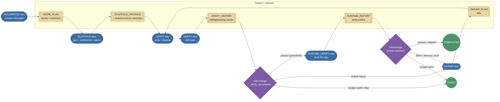
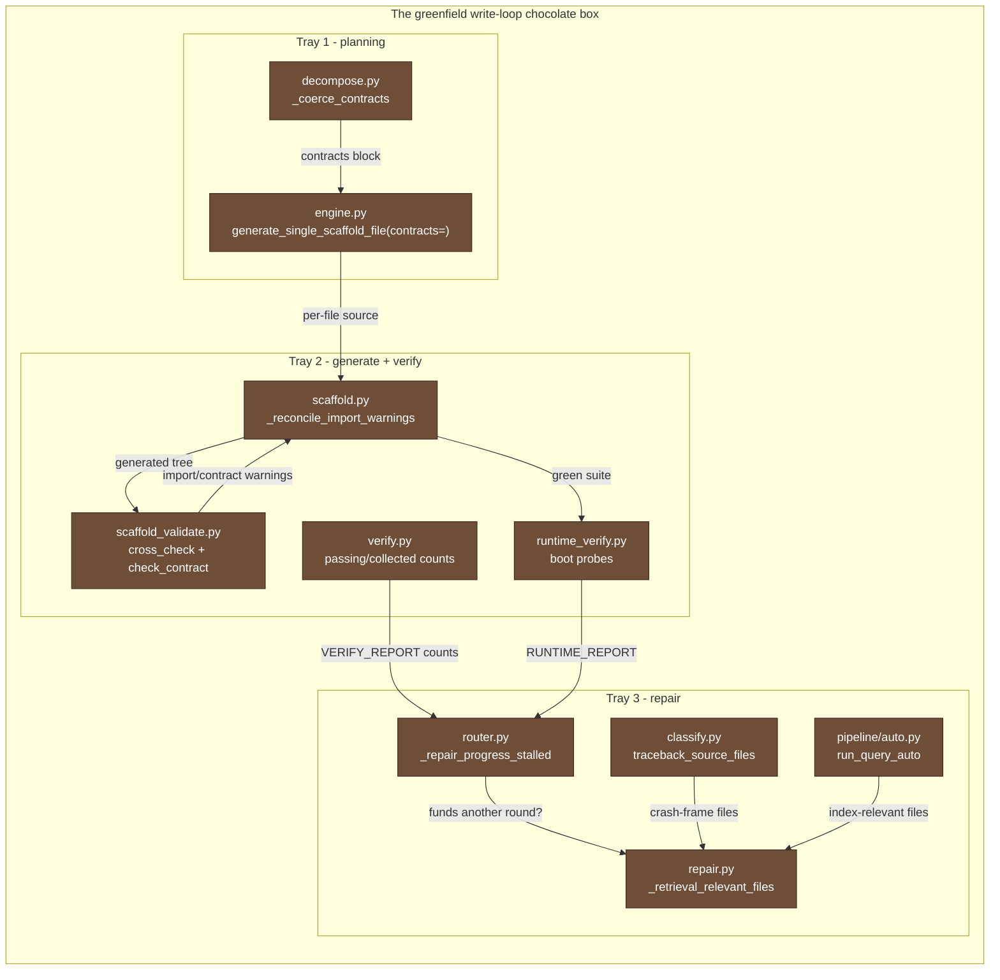

# Architecture

CGX is structured as a small set of cooperating layers under `cgx.*`.

## Layers

```
cgx.parser              -- language-aware tree walker → chunk records
cgx.parser.schema       -- TypedDicts pinning the chunk + call-relation shapes
cgx.parser.base         -- BaseParser ABC; the per-language seam
cgx.parser.python_parser -- PythonASTParser (stdlib ast); always registered
cgx.parser.treesitter_base -- shared tree-sitter loader for non-Python grammars
cgx.parser.js_ts_parser -- JavaScript / TypeScript / TSX parsers ([parsers] extra)
cgx.parser.incremental  -- file-hash/mtime-keyed re-parse + parse_cache.json
cgx.parser.module_path  -- repo-root-aware dotted-name resolver for imports
cgx.graph               -- NetworkX call/containment graph over chunks
cgx.graph.aggregation   -- node/edge projections consumed by retrieval + viz
cgx.graph.backend       -- CodeGraphBackend facade isolating retrieval from nx
cgx.embeddings          -- two-view (intent / impl) corpora, FAISS indices
cgx.embeddings.loader   -- shared embedder loaders (spec / model_name, lazy ML)
cgx.embeddings.cache    -- content-addressed embedding cache (.npz)
cgx.retrieval           -- hybrid retriever (semantic + BM25 + graph) + RRF
cgx.retrieval.tokenize  -- symmetric sub-word tokenizer (camelCase / snake_case)
cgx.answer              -- LLM providers, intent detection, prompt registry
cgx.answer.context_map  -- tiered ("Code Map") SOURCES builder for the prompt
cgx.answer.model_caps   -- model-window-aware budgets + capability tiers
cgx.answer.repo_map     -- hierarchical repo map (cached) for whole-repo prompt context
cgx.answer.schemas      -- JSON schemas for provider-native constrained decoding
cgx.answer.providers    -- OllamaProvider, OpenAICompatProvider, GeminiProvider
cgx.answer.ratelimit    -- token-bucket limiter + 429/5xx retry
cgx.answer.profiles     -- provider config + keyring-backed secret store
cgx.answer.hardware_matrix -- offline local-model catalogue + tradeoffs
cgx.answer.ollama_discovery -- installed-model listing + hardware probe
cgx.codegen             -- diff parse / dry-apply / syntax & test validation
cgx.codegen.ast_insert  -- AST-anchored insertion planner (sibling-anchor → PatchResult)
cgx.codegen.disk_apply  -- write applied diffs to disk + per-run backup mirror
cgx.codegen.env_manager -- pre-flight dependency scan, pip-install, requirements update
cgx.io.persist          -- JSON/JSONL/FAISS writers shared by the index pipeline
cgx.pipeline            -- high-level orchestrators (run_index_auto, run_query_auto)
cgx.session             -- session-shaped agent backbone (/agent)
cgx.session.models      -- Session, TaskNode, Fact, Artifact, Decision dataclasses
cgx.session.router      -- deterministic state machine (TASK_SUCCESSOR table)
cgx.session.runner      -- SessionRunner: per-session lock, executor dispatch
cgx.session.store       -- SQLite persistence at <project_root>/.cgx/sessions.db
cgx.session.mode        -- detect_mode: explore vs greenfield auto-detection
cgx.session.tasks       -- registered executors (EXPLORE/INVESTIGATE/RECOMMEND/CLARIFY_REQUIREMENTS/DECOMPOSE/SCAFFOLD/BOOTSTRAP_ENV/APPLY/VERIFY/REPAIR/...)
cgx.session.repair      -- deterministic, LLM-free classifier / locator / proposer for the REPAIR executor
cgx.sessions            -- append-only JSONL conversation store (Ask tab history)
cgx.telemetry           -- opt-in anonymous startup ping
cgx.logging_setup       -- shared setup_logging() invoked once from launch.py
cgx.webui.task_store    -- SQLite task registry + threading.Event cancel tokens
cgx.webui.routes.tasks  -- REST API for task list / get / event-replay / cancel
cgx.webui.routes.rollback -- POST /api/rollback restores from an apply backup dir
cgx.webui.routes.setup  -- discovery endpoints + POST /api/provider/ping
cgx.webui.routes.agent_session -- /api/agent-session/* JSON routes for the session backbone
cgx.cli / cgx.webui     -- terminal + FastAPI/React surfaces (uvicorn on :8765)
```

## Data flow

1. `parse_codebase` walks the repo (respecting `.gitignore`, ignore globs
   and a 1 MB file-size cap) and emits one chunk per file/class/function.
   Files are dispatched by extension through `_PARSER_REGISTRY`: Python is
   parsed with the stdlib `ast`, while JavaScript / TypeScript / TSX are
   parsed via tree-sitter (`cgx.parser.js_ts_parser`) when the optional
   `parsers` extra is installed -- absent it, those files are simply
   skipped and Python-only indexing still works. Re-indexing runs
   incrementally by default (`cgx.parser.incremental`): a
   `parse_cache.json` manifest keyed on each file's mtime/sha lets
   unchanged files reuse their cached chunks so only edited files are
   re-parsed. A hierarchical repo map (`cgx.answer.repo_map`) is also
   emitted and cached (`repo_map.json`) for cheap whole-repo planning
   context.
2. `build_knowledge_graph` derives a NetworkX graph with `calls`, `module`,
   `attr` and `defined_in` edges.
3. `make_index_records` materialises chunk records, then
   `prepare_embedding_corpus` builds two views:
   - **intent** -- NL-friendly summary (docstrings, names).
   - **impl** -- implementation text (signatures + bodies).
4. `build_embeddings` + `build_faiss_index` persist per-view ANN indices.
   Embeddings flow through a content-addressed cache
   (`cgx.embeddings.cache`, one `.npz` per view) keyed on the sha256 of
   the corpus text. Subsequent `run_index_auto` invocations re-embed
   only changed chunks; the cache is invalidated automatically when the
   embedding model or its dim/normalisation flag changes. Disable with
   `run_index_auto(..., incremental=False)`. **Both the intent-view and
   impl-view builds now run concurrently** inside a `ThreadPoolExecutor`
   in `run_index_auto()`, reducing total indexing time roughly 2× on
   multi-core machines. `build_embeddings` auto-detects CUDA > MPS > CPU
   at runtime and selects the fastest available device.
5. `HybridRetriever.search` (in `cgx.retrieval.orchestrator`) fuses
   three signals using Reciprocal Rank Fusion, then applies a
   tunable post-fusion rerank pass. **The intent-view and impl-view ANN
   searches now run concurrently** inside a `ThreadPoolExecutor`; the
   results are joined before RRF fusion so ordering is unchanged:
   - semantic search on each view (intent + impl),
   - BM25 lexical search,
   - graph expansion from the top hits (`graph_bonus`),
   - symbol-match boosting (`symbol_boost`) for chunks whose identifier
     or path matches a token in the question,
   - optional cross-encoder rerank (`enable_reranker`) that lazy-loads
     `sentence_transformers` and silently falls back to the RRF order
     if the ML stack is absent.
6. `answer_with_llm` selects an intent-conditioned system prompt
   (`SYSTEM_PROMPTS`), builds line-windowed SOURCES around the focus
   symbol, and asks the configured `LLMProvider` for a JSON answer.
   When the retriever surfaced graph-expanded neighbors the prompt
   SOURCES are built by `cgx.answer.context_map.build_tiered_context`
   (see [Tiered SLM context (Code Map)](#tiered-slm-context-code-map))
   so neighbor chunks contribute compact stubs instead of full bodies.
7. `generate_code_plan` does the same but routes through a
   diff-aware retry loop in `cgx.codegen.pipeline.validate_and_test`.

## Tiered SLM context (Code Map)

`cgx.answer.context_map` builds the prompt-time SOURCES list as **two
tiers** so that the small / mid-sized LLMs CGX targets locally
(3B–8B Ollama models, etc.) don't have their entire context window
consumed by graph-expanded neighbors that only need to be *named*, not
*read*. The retriever already labels neighbors via
`HybridRetriever._expand_multi_hop`, which writes
`provenance.graph_depth = d` (1, 2, …) on every hit that was pulled in
by walking the call/import graph from a primary seed; everything else
is depth `0`.

**Classification rule** (`classify_hits`): a hit with
`provenance.graph_depth >= 1` goes into the `neighbor` tier; anything
else (semantic match, BM25 match, symbol-boosted seed) is `primary`.

**Tier shapes**

- **Primary** sources reuse `engine._as_sources_with_meta` unchanged
  and carry the focus-windowed code body. They get the larger per-chunk
  char cap so the LLM has enough text to ground its answer or its
  diff.
- **Neighbor** sources are rendered by `format_neighbor_stub` as
  ``[class.]name(signature) -- doc_first_sentence``. Each component is
  dropped silently when the record doesn't supply it (e.g. methods
  prepend their class, free functions don't). The signature, first-doc
  sentence, and parent class name are pulled from `records.jsonl` via
  `load_records_by_id(records_path)`. If the record carries no
  enrichment at all the stub falls back to a trimmed view-text slice
  so the neighbor stays visible.

Each emitted source dict carries the same keys as the legacy
`_as_sources_with_meta` output (`chunk_id`, `path`, `kind`, `symbol`,
`signature`, `start_line`, `end_line`, `parent_class_id`, `text`,
`hit_meta`) **plus** a `tier` field of either `"primary"` or
`"neighbor"`. `engine._fmt_source` consults `tier` and, when it equals
`neighbor`, appends `tier=neighbor` to the bracketed metadata line so
the LLM sees an explicit hint that the block is a structural reference,
not the focal body.

**Budget** (`cgx.answer.model_caps.get_context_map_budget`)

`get_context_map_budget(provider)` returns a five-key dict scaled by
the provider's model context window. Every budget / prompt-strategy
accessor now keys off a single classification,
`get_capability_tier(provider_or_model)` -> `small | medium | large |
xlarge` (context-window bands at 16K / 64K / 200K), so a new model only
needs a window entry and never a per-model branch at a call site. The
tier indexes flat tables (`_SUMMARY_BUDGETS`, `_CONTEXT_MAP_BUDGETS`,
`_PROMPT_STRATEGIES`); `get_summary_budget`, `get_context_map_budget`,
and `get_prompt_strategy` are thin lookups returning copies. The
context-map budget uses a separate, more generous set of numbers tuned
for SOURCES rather than summary prose:

| Window           | `primary_chars` | `neighbor_chars` | `primary_max` | `neighbor_max` | `total_chars` |
|------------------|-----------------|------------------|---------------|----------------|---------------|
| < 16 K (small)   | 900             | 220              | 8             | 12             | 6 000         |
| < 64 K (mid)     | 1 400           | 320              | 12            | 24             | 18 000        |
| < 200 K (large)  | 2 200           | 420              | 20            | 40             | 48 000        |
| ≥ 200 K (huge)   | 3 500           | 520              | 32            | 60             | 120 000       |

The five keys are consumed exactly once each by `build_tiered_context`:
`primary_chars` and `primary_max` go through `_as_sources_with_meta`
(per-chunk char window, total chunk count); `neighbor_chars` and
`neighbor_max` cap the stub length and the neighbor count respectively;
`total_chars` is enforced as a deterministic global ceiling -- the
builder walks the ordered list primary-first and drops trailing items
once the cumulative `text` length would exceed the cap (the first item
is always kept). Call sites never hard-code budget numbers; they always
go through `get_context_map_budget(provider)`.

**Ordering** is fixed: primary sources first (in retrieval order), then
neighbor stubs. This makes the prompt deterministic for a given hit
list + provider pair and keeps citation indices stable across reruns.

**Wiring**

`cgx.answer.engine` activates the Code Map opportunistically -- only
when the retriever actually surfaced a neighbor. Both entry points
share the same gate:

```python
_has_neighbors = any(
    int(((h.get("provenance") or {}) if isinstance(h, dict) else {})
        .get("graph_depth", 0) or 0) >= 1
    for h in hits
)
if _has_neighbors:
    from cgx.answer.context_map import build_tiered_context, load_records_by_id
    from cgx.answer.model_caps import get_context_map_budget
    sources = build_tiered_context(
        hits, cmap, load_records_by_id(records_path),
        budget=get_context_map_budget(provider),
        focus_terms=focus_terms or None,
    )
else:
    sources = _as_sources_with_meta(hits, cmap, max_chunks=…, max_chars=…)
```

`answer_with_llm` runs this branch in the SOURCES-build phase (engine.py
around line 730), and `generate_code_plan` runs the same branch
unchanged (engine.py around line 915). When `_has_neighbors` is false
the legacy single-tier builder is used, so questions whose hit list
contains no graph-expanded chunks behave bit-identically to the
pre-Phase-3 prompt format.

**Public API** (`cgx.answer.context_map`)

| Symbol                                        | Purpose |
|-----------------------------------------------|---------|
| `load_records_by_id(records_path)`            | Read `records.jsonl` and key it by `id`. Returns `{}` on missing / unreadable file (the caller treats absence as "no enrichment"). |
| `classify_hits(hits)`                         | Split a hit list into `(primary, neighbors)` using the `graph_depth >= 1` rule. |
| `format_neighbor_stub(record, symbol)`        | Compose the `[class.]name(signature) -- doc_first_sentence` string with silent drop of missing parts. Pure: no I/O. |
| `build_tiered_context(hits, cmap, records_by_id, *, budget, focus_terms=None)` | The full builder. Returns the final source-dict list, each carrying a `tier` key. |

The module owns a lazy import of `engine._as_sources_with_meta` to
avoid a load-time cycle (`engine` imports `context_map`, and
`context_map` reuses the legacy primary-tier formatter from `engine`).

**Tests**: `tests/test_context_map.py` exercises the classifier rule,
the stub formatter (with and without each enrichment field), the
budget contract (per-chunk char clipping, primary/neighbor caps,
total-chars ceiling, ordering), and the engine-level branch
(deterministic switch on `_has_neighbors`).

## Self-test loop

`validate_and_test` is the orchestrator:

1. `parse_fenced_diffs` extracts ` ```diff path=... ``` blocks.
2. `apply_diffs_in_memory` projects each patch onto the current file.
3. `validate_patch_results` runs a per-language syntax gate: `ast.parse`
   over Python targets and a tree-sitter parse over JavaScript /
   TypeScript / TSX targets (the latter skipped gracefully when the
   optional `parsers` extra is absent). Grounding the check in a real
   parser rather than the model's self-report keeps quality flat across
   providers.
4. `run_impacted_tests` (when enabled) copies the project into a
   temporary directory, materialises the diffs, and runs
   `pytest <impacted_files>` with a timeout.
5. On failure, `build_retry_feedback` summarises the breakage and the
   loop in `generate_code_plan` re-asks the model in free-form mode.

The whole report is returned under `parsed["codegen_report"]` and rendered
in the UI as a markdown table.

## Structured AST insertion

`cgx.codegen.ast_insert` provides an additive, AST-anchored alternative
to text diffs for the common "insert a new def into this container after
this sibling" case. The retrieval side already speaks in terms of
containers and sibling anchors (`suggest_insertion_points` returns
`{container_type, container_id, anchors}`), and this module bridges
that signal into the same `PatchResult` shape that
`apply_diffs_in_memory` and `validate_patch_results` consume:

1. `AstInsertSpec(rel_path, code, class_name=None, anchor_symbol=None,
   dedupe=True)` declares the target (module level or a named
   top-level class) and the snippet to splice in.
2. `plan_ast_insertion` reads the target file, parses it with the
   stdlib `ast` module, locates the anchor sibling's `end_lineno`,
   detects the container's body indentation, re-emits the snippet via
   `ast.get_source_segment` so user-supplied comments and formatting
   survive, and splices it in. The result is re-parsed before being
   returned, so a broken splice produces `ok=False` rather than a
   corrupted file. Nothing is written to disk.
3. `plan_ast_insertion_from_suggestion(project_root, suggestion, code)`
   accepts a single item from `suggest_insertion_points` directly,
   resolves the `container_id` (including the `::class::<Name>`
   suffix), and prefers the `similar_signature_neighbor` anchor over
   the `likely_caller`.
4. `build_unified_diff(patch_result)` renders the plan as a standard
   unified diff so it routes back through `parse_fenced_diffs` /
   `apply_diffs_to_disk` / `validate_patch_results` without any
   special-casing.

The module is purely additive: it does not modify any existing
signature in `diff_apply`, `validate`, `disk_apply`, or
`orchestrator`. Callers can keep using the text-diff path; the AST
path is opt-in via the entry points above.

## LLM Providers

`cgx.answer.providers` exposes four concrete `LLMProvider` subclasses,
all sharing a uniform `chat()` / `chat_stream()` interface so the
orchestration layer never knows which backend it is talking to.

| Class | Kind string | Notes |
|---|---|---|
| `OllamaProvider` | `"ollama"` | Local Ollama via `/api/chat`; JSON mode via `format: "json"`. |
| `OpenAICompatProvider` | `"openai-compat"` or `"custom"` | Any `/v1/chat/completions`-compatible endpoint. Accepts `endpoint_path` to override the path suffix and `allow_no_auth=True` to skip Bearer auth (private subnets). |
| `GeminiProvider` | `"gemini"` | Google Gemini via `generativelanguage.googleapis.com`. Maps CGX's `messages` to Gemini's `contents` + `systemInstruction`; merges consecutive same-role turns; uses `responseMimeType: "application/json"` for JSON mode; streams via `streamGenerateContent`. |

**Schema-constrained decoding** (`cgx.answer.schemas`): every `chat()`
also accepts an optional `json_schema` dict. When passed together with
`force_json`, each provider requests structured output in its native
form -- Ollama sets `format` to the schema object, `OpenAICompatProvider`
sends `response_format={"type":"json_schema", ...}`, and `GeminiProvider`
sets `generationConfig.responseSchema` (converted to Gemini's OpenAPI
subset via `to_gemini_schema`). Any backend that rejects the schema
(HTTP 4xx) degrades gracefully: Ollama and Gemini retry once in plain
JSON mode, and `OpenAICompatProvider` walks a
`json_schema -> json_object -> plain` ladder, accepting the first
attempt that does not 4xx. Callers keep their `force_json` + balanced-
brace extractor (`_extract_json` / `_extract_json_object`) as the final
safety net, so weaker models fall back cleanly instead of failing. The
translation helpers and reusable schema constants live in
`cgx.answer.schemas`.

**Profile persistence**: `cgx.answer.profiles.Profile` stores `kind`,
`model`, `base_url`, `temperature`, `num_predict`, `has_api_key`,
`rate_limit`, `max_retries`, `endpoint_path`, `allow_no_auth`, and
`enable_reranker`. `build_provider` in `cgx.webui.helpers` instantiates
the correct class from a profile so every code path (inline config,
saved profile) goes through one factory.

**Reranker policy** (`enable_reranker`): an `Optional[bool]` whose
`None` value means "auto" and resolves through
`default_reranker_for_kind(kind)` -- cloud kinds (`openai-compat`,
`gemini`) opt in by default, local / private kinds (`ollama`, `custom`)
opt out. Explicit `True` / `False` on the profile wins.
`resolve_enable_reranker(profile)` is the single helper that returns
the effective flag. The value threads from `Profile` →
`cgx.pipeline.auto.run_query_auto(enable_reranker=…)` →
`cgx.retrieval.orchestrator.hybrid_retrieve_two_view(enable_reranker=…,
reranker_model=…, reranker_top_n=…, reranker_weight=…)` →
`HybridConfig`. `None` at the threading layer preserves the
`HybridConfig` defaults (reranker off), so existing callers that don't
pass the flag keep their pre-feature behaviour.

**Live connection test** (`POST /api/provider/ping`): returns
`{ok, latency_ms, error}` after hitting the provider's cheapest
available endpoint (Ollama `GET /api/tags`; Gemini `generateContent`
with `maxOutputTokens: 1`; custom `OPTIONS` / `HEAD` on the endpoint
path). Used by the Settings page Ping button.

## Dynamic Dependency Management

`cgx.codegen.env_manager` intercepts the gap between code generation and
test execution: a generated file may import a package the model chose
that is not listed in `requirements.txt`.

**Pipeline** (called inside the `verify` capability before `pytest`):

1. `scan_imports(generated_files)` -- AST walk (`.py`) or regex
   (`.js`/`.ts`) to collect top-level import roots.
2. `find_missing_python_packages(imports, project_root)` -- cross-references
   against `requirements.txt`; then probes live importability; skips the
   full CPython stdlib (50+ top-level names).
3. `install_packages(packages)` -- `pip install --quiet` per missing
   package; records success/failure per name.
4. If tests pass, `update_requirements(project_root, installed)` appends
   new packages to `requirements.txt` idempotently.

Failures are logged but never abort the test run -- the model may have
misspelled the package name, in which case pytest still runs and gives
the retry loop a real `ImportError` to diagnose.

## Session-shaped agent (`cgx.session`)

The Agent UI at `/agent` is backed by a **stateful, session-based**
orchestrator. It persists a DAG of typed tasks under
`<project_root>/.cgx/sessions.db` and progresses one task at a time
with structured human-in-the-loop checkpoints, sharing the same
retrieval, codegen, and provider stacks as the ask/plan surfaces.

### Session modes (`cgx.session.mode`)

A session runs in one of two **modes** -- `explore` (modify an
existing codebase) or `greenfield` (scaffold a new project from
scratch). The mode is fixed at session creation and dictates which
root task the router seeds and which executor branch the runner
walks. `cgx.session.mode.detect_mode(project_root)` is the
deterministic auto-detector; callers can override it explicitly via
the `POST /api/agent-session` body.

* **`explore`** -- the project root exists, is non-empty, and has a
  usable FAISS index under `<root>/cgx_index/meta.json`. The session
  seeds `EXPLORE` and walks the retrieval-grounded loop below.
* **`greenfield`** -- the project root is missing, empty, or has no
  index. The session seeds `CLARIFY_REQUIREMENTS` and walks the
  scaffold loop (`clarify → decompose → scaffold → apply → verify`).
  No retrieval is performed; everything is goal-driven.

The detector prefers `greenfield` whenever the project signals are
ambiguous, on the principle that mis-seeding `EXPLORE` against a
missing index crashes immediately, whereas mis-seeding
`CLARIFY_REQUIREMENTS` against an existing codebase still produces
useful clarification questions.

### Data model (`cgx.session.models`)

Plain :mod:`dataclasses` (no Pydantic at the core layer -- Pydantic
stays at the webui wire boundary). JSON-serialise via `to_dict()`,
matching the convention already used by `cgx.sessions`.

| Type           | Purpose |
|----------------|---------|
| `Session`      | Root aggregate: `original_objective`, `project_root`, `root_task_id`, `status`, timestamps. Carries the **Phase E** session budget: config `max_task_runs`, `max_wall_seconds`, `headless` (all default to unlimited/off) plus live counters `task_runs` and `first_task_started_at`. The store round-trips the new fields with backward-compatible `.get()` defaults, so pre-existing sessions load unchanged. |
| `TaskNode`     | One node in the per-session DAG. Carries `kind`, `name`, `description`, `parent_task_id`, `status`, `inputs`, `outputs`, `produced_artifact_id`, `consumed_decision_ids`, `error`, lifecycle timestamps. |
| `Fact`         | Append-only piece of session knowledge (`FILE` / `SYMBOL` / `PARAMETER` / `ANCHOR` / `LLM_CALL`). `LLM_CALL` facts (**Phase 5.1**) carry `{provider, model, sampling_params, prompt, response, latency_ms, tokens_in, tokens_out, source_task_id, role}` recorded by every LLM call site in `cgx.answer.engine`, `clarify_requirements.py`, `decompose.py`, and `scaffold.py` via `cgx.session.llm_trace.trace_llm_call`. Updates set `stale=True` rather than mutating `content`. |
| `Artifact`     | Typed output produced by a finished task. Explore-mode kinds: `DIRECTIONS_LIST`, `FINDINGS_BUNDLE`, `RECOMMENDATION_LIST`, `CODE_CHANGE_PLAN`. Greenfield-mode kinds: `REQUIREMENTS_SHEET`, `WORK_PLAN`, `SCAFFOLD_PATCHES`, `BUILD_REPORT`, `API_CHECK_REPORT`, `SMOKE_REPORT`, `REPAIR_PLAN`. Shared write-loop kinds: `APPLIED_CHANGES`, `VERIFY_REPORT`, `SESSION_DIGEST`. |
| `Decision`     | Structured record of a user choice resolving an `ASK_USER`. Downstream tasks reference decisions by `decision_id`. |
| `KnowledgeBase` / `DecisionLog` | Per-session views over the facts and decisions tables. |

`TaskKind` values:

* Explore loop: `EXPLORE`, `INVESTIGATE`, `RECOMMEND`, `PLAN_CHANGE`.
* Greenfield loop: `CLARIFY_REQUIREMENTS`, `DECOMPOSE`, `SCAFFOLD`,
  `BOOTSTRAP_ENV`, `API_CHECK` (**Phase 2.2**), `SMOKE`
  (**Phase 2.1**), `RUNTIME_VERIFY` (**P1**), `REPAIR`.
* Shared: `APPLY`, `VERIFY`, `ASK_USER`, plus utility kinds
  `SEARCH` / `SUMMARIZE`.

`TaskNodeStatus` runs through
`PENDING → BLOCKED → READY → IN_PROGRESS → DONE`/`FAILED`/`ABANDONED`;
`ASK_USER` deliberately stays `IN_PROGRESS` after its executor runs
until a `Decision` arrives.

### Router (`cgx.session.router`)

`Router` is the deterministic planning brain of the loop. **Pure
Python, no LLM calls, no I/O**: every method takes the current session state
plus an event and returns a `RouterPlan` of typed actions
(`CreateTask`, `UpdateTaskStatus`, `UpdateSessionStatus`,
`RecordDecision`, `AttachDecisionToTask`, `RecordLesson`) that the
caller applies to the store. The router is split across three
modules: the action vocabulary and `RouterPlan` live in
`cgx.session.actions`, the greenfield edge helpers (including the
`_COMPLETION_GUARDS` chain consulted before the `TASK_SUCCESSOR`
lookup) live in `cgx.session.greenfield_edges`, and every bounded
retry counter is read and spent through the typed
`cgx.session.budget.LoopBudget` (`REPAIR_BUDGET=4`,
`REGENERATE_BUDGET=3`, `REPAIR_REGENERATE_BUDGET=2`,
`REPLAN_BUDGET=1`, `DECOMPOSE_RETRY_BUDGET=1`) rather than
hand-copied dict keys. The `RecordLesson` action (**Phase 7.1**) is
emitted whenever a `VERIFY` finishes with `outcome=passed` AND a
`REPAIR` is on its ancestor chain -- the runner then writes a
structured row to `~/.cgx/lessons.jsonl` so future `SCAFFOLD` runs
in any session can apply the rule.

Five entry points cover every transition:

* `on_user_message(session, message, tasks)` -- no tasks yet → spawn
  the root task. In explore mode this is `EXPLORE`; in greenfield
  mode it is `CLARIFY_REQUIREMENTS`. Pending `ASK_USER` open →
  return empty plan so the caller routes the message to
  `on_decision_recorded` instead. Otherwise (explore mode) → spawn
  a sibling `EXPLORE` under the current root (course-correction
  objective). Greenfield mode does not spawn course-correction
  siblings: a follow-up message is treated as freeform context.
* `on_task_completed(session, completed, tasks)` -- dispatch via the
  `TASK_SUCCESSOR` table:

  ```
  # Explore loop
  EXPLORE              -> ASK_USER(choose_path)
  INVESTIGATE          -> RECOMMEND
  RECOMMEND            -> ASK_USER(choose_recommendation)
  PLAN_CHANGE          -> ASK_USER(approve)

  # Greenfield loop
  CLARIFY_REQUIREMENTS -> ASK_USER(clarify_answers)
  DECOMPOSE            -> ASK_USER(approve_plan)
  SCAFFOLD             -> APPLY (mode=greenfield in inputs)
  APPLY (greenfield,
         clean)        -> BOOTSTRAP_ENV (threads apply / scaffold ids)
  APPLY (greenfield,
         failed_files) -> SCAFFOLD  (Fix G1: an APPLY that parses-and-drops
                                     an invalid-syntax file leaves a core
                                     module missing, so instead of limping
                                     into BOOTSTRAP_ENV the router walks up
                                     to the nearest SCAFFOLD ancestor,
                                     marks live descendants ABANDONED, and
                                     re-queues a fresh SCAFFOLD carrying an
                                     invalid_scaffold_syntax constraint that
                                     enumerates each dropped file with its
                                     concrete error; capped at
                                     REGENERATE_BUDGET=3 -- no SCAFFOLD
                                     ancestor or spent budget -> terminal
                                     FAILED)
  BOOTSTRAP_ENV        -> API_CHECK    (Phase 2.2, threads build_artifact_id)
  API_CHECK (passed |
             skipped)  -> SMOKE        (Phase 2.1)
  API_CHECK (failed)   -> REPAIR       (source = API_CHECK_REPORT)
  SMOKE (passed |
         skipped)      -> VERIFY
  SMOKE (failed)       -> REPAIR       (source = SMOKE_REPORT)

  # Shared write-loop tail (explore mode keeps the direct edge)
  APPLY (explore)      -> VERIFY
  VERIFY (passed)      -> (terminal; emits RecordLesson when a REPAIR
                           is on the ancestor chain -- Phase 7.1)

  # Autonomous repair loop (greenfield only)
  VERIFY (assertions_failed | collection_error)
                       -> REPAIR  (funded via LoopBudget.spend_repair:
                                   failing-test count still strictly dropping,
                                   repair_attempt < REPAIR_BUDGET=4, and
                                   failure_signature not in prior_failure_signatures)
  REPAIR (strategy=patch, can_apply)
                       -> APPLY   (carries build_artifact_id forward
                                   so BOOTSTRAP_ENV is skipped)
  REPAIR (strategy=regenerate, Phase 6.1)
                       -> SCAFFOLD  (router walks up to nearest
                                     SCAFFOLD ancestor, marks live
                                     descendants ABANDONED, re-queues
                                     fresh SCAFFOLD via
                                     propose_regenerate with
                                     regenerate_constraints in inputs;
                                     syntax churn capped at
                                     REGENERATE_BUDGET=3 per manifest,
                                     semantic rewrites of an applied tree
                                     at REPAIR_REGENERATE_BUDGET=2
                                     per ancestor chain)
  REPAIR (empty plan)  -> ASK_USER(freeform)
  APPLY (repair)       -> VERIFY (no BOOTSTRAP_ENV)
  ```
* `on_task_failed(session, failed, tasks, retryable=False)` --
  terminal transition for a *hard* failure (an executor that returned
  `ExecutorResult.failure` or crashed, so it produced no `outputs`
  and the `outputs`-keyed successor table can never run). Greenfield
  write loops must always reach a terminal status, so any
  unrecoverable hard failure (e.g. a BOOTSTRAP_ENV whose `pip
  install` failed) ends the session `FAILED` rather than leaving it
  hung in `active` with a dead FAILED leaf and no successor -- asking
  the user to hand-fix AI-generated code is never a valid recovery.
  One recoverable exception: a `DECOMPOSE` whose executor marked the
  failure `retryable` (an empty or unbuildable manifest) is re-queued
  once by `_decompose_retry_actions` with the concrete failure folded
  into its goal as a constraint, bounded by
  `DECOMPOSE_RETRY_BUDGET=1`. Explore-mode sessions keep their
  user-driven lifecycle (return an empty plan); a no-op once the
  session is already `COMPLETED` / `FAILED` / `ABANDONED`.
* `on_budget_exhausted(session, over_task, tasks, reason)` --
  session-level circuit breaker (**Phase E**). When the runner detects
  a session over its `max_task_runs` or `max_wall_seconds` budget, an
  *interactive* session sets every still-READY work task `BLOCKED`,
  spawns one `ASK_USER` (`DecisionKind.FREEFORM`, built by
  `_make_budget_ask`, carrying the human-readable `reason`) surfacing
  the exhaustion, and goes `PAUSED`; a *headless* session abandons the
  READY work and ends terminally `FAILED`. Only compute-bearing tasks
  charge the budget -- the `ASK_USER` wait-state stays free so the
  escalation itself can always surface. This catches runaway
  autonomous loops that slip past the per-loop regenerate / repair
  caps.
* `on_decision_recorded(session, decision, tasks)` -- record the
  decision, attach it to the resolved `ASK_USER`, mark the `ASK_USER`
  `DONE`, and spawn the typed successor implied by `decision.kind` +
  `decision.chosen`:

  | `DecisionKind`            | Successor task |
  |---------------------------|----------------|
  | `CHOOSE_PATH`             | `INVESTIGATE` anchored on `chosen.anchor_chunk_id` |
  | `CHOOSE_RECOMMENDATION` `kind=investigate_more` | `INVESTIGATE` on the recommended anchor |
  | `CHOOSE_RECOMMENDATION` `kind=plan_change` | `PLAN_CHANGE` carrying the full recommendation |
  | `CHOOSE_RECOMMENDATION` `kind=ask_followup` | Freeform `ASK_USER` |
  | `CHOOSE_RECOMMENDATION` `kind=done` | No successor (focus closes; a follow-up message spawns a fresh sibling EXPLORE) |
  | `APPROVE` `approved=true` | `APPLY` against the staged `plan_artifact_id` |
  | `APPROVE` `approved=false` | No successor (user can pivot via a fresh objective) |
  | `CLARIFY_ANSWERS`         | `DECOMPOSE` carrying the answers + the prior goal |
  | `APPROVE_PLAN` `approved=true` | `SCAFFOLD` against the approved `WORK_PLAN` artifact |
  | `APPROVE_PLAN` `approved=false` | No successor (loop halts; user can restart with a new objective) |
  | `FREEFORM`                 | None (handled as a new user message by the caller) |

### Contract-first greenfield write loop

The greenfield write loop is the deepest chain the router drives, and
recent work turned it from "generate files, run the tests the model
wrote, hope" into a **contract-first, runtime-verified, progress-gated**
pipeline. A contributor touching any greenfield executor should read
this subsection first; the six moving parts are:

1. **Contract-first `DECOMPOSE`.** The planner emits a `WORK_PLAN`
   artifact that now carries a `contracts` block alongside `layers`.
   `contracts` is a bounded dict over four categories -- `endpoints`
   (HTTP method + path), `schemas` (class/model names), `functions`
   (name + owning module) and `constants` (module-level names) -- the
   *shared interfaces* every file must agree on. `_coerce_contracts`
   (`cgx.session.tasks.decompose`) normalises it defensively;
   `_contract_entry_count` is surfaced on the task output. The block is
   threaded verbatim into each `generate_single_scaffold_file(...,
   contracts=...)` call so cross-file assumptions are *declared once and
   honoured*, not independently re-derived per file (the historical
   source of most cross-file breakage that only surfaced at `VERIFY`).

2. **Contract enforcement gate + coherence pass (`SCAFFOLD`).** After
   the per-file loop, `run_scaffold` runs two best-effort static gates
   from `cgx.session.scaffold_validate` before `APPLY` writes anything:
   * `cross_check_first_party_imports` -- parses every generated `.py`
     file and flags each `from <first-party> import <name>` whose target
     is a sibling module that never defines `<name>`. The
     `_reconcile_import_warnings` **coherence pass** then regenerates
     *only* the importer files that reference an undefined sibling
     symbol, bounded by `_COHERENCE_PASS_BUDGET` (one hop) so a stubborn
     model cannot loop. This closes the window where the parallel path
     froze a per-layer snapshot and a late file referenced a symbol an
     earlier sibling never wrote.
   * `check_contract_compliance` -- verifies the finished tree honours
     the `WORK_PLAN` `contracts` block (declared endpoints appear
     verbatim, declared schemas/functions/constants are defined). Both
     record `import_warnings` / `contract_warnings` on the
     `SCAFFOLD_PATCHES` artifact rather than failing the scaffold; the
     router can fold a warning into a targeted regenerate constraint.

3. **`RUNTIME_VERIFY` -- boot the app, not just its tests.** A brand-new
   `TaskKind.RUNTIME_VERIFY` executor
   (`cgx.session.tasks.runtime_verify`) sits after a *passing* greenfield
   `VERIFY`. A unit suite the model wrote can be green while the app
   never boots (an import-time `NameError`, a broken `create_app`
   wiring, a config read that throws at module load). For each detected
   entry module (`app.py` / `main.py` / a file that statically
   references `Flask(` / `FastAPI(` / `create_app`) it runs an
   import-and-call smoke *under the bootstrapped venv* and emits a
   `RUNTIME_REPORT` whose `probes` pair each entry with `ok` / `kind` /
   `stderr_tail`. The `outcome` token (`passed` / `failed` / `timeout` /
   `error` / `skipped`) drives the terminal branch; a boot failure never
   raises `ExecutorResult.failure`, so the structured report is always
   persisted for the classifier.

4. **Runtime-failure classification + routing.** `_verify_successors`
   is the new fork: greenfield + `passed` hands off to `RUNTIME_VERIFY`;
   everything else keeps the existing repair-or-terminal path.
   `_runtime_verify_to_repair_or_terminal` routes a hard boot outcome
   (`_REPAIRABLE_RUNTIME_OUTCOMES = {failed, timeout, error}`) to
   `REPAIR` with the `RUNTIME_REPORT` as the source artifact, under the
   same shared budget + `failure_signature` flap detector as the
   `SMOKE` / `API_CHECK` gates. `passed` / `skipped` COMPLETE the session
   via `_runtime_verify_terminal_session_actions`.

5. **Progress-aware + coverage-aware budgets.** The old loop gave up
   after two shots even while it was genuinely improving.
   `_repair_progress_stalled` replaces the flat cap with a *ledger*: the
   loop keeps going while the **failing-test count strictly drops** round
   over round, backed by a **passing-count** trend
   (`prior_passing_counts`) so a repair that trades one failure for a new
   pass still counts as forward motion. A `failure_signature` flap
   backstop covers non-assertion outcomes, and everything sits under the
   absolute `REPAIR_BUDGET` (4, `cgx.session.budget`). The counters and
   ledgers (`repair_attempt`, `prior_failing_counts`,
   `prior_passing_counts`, `prior_failure_signatures`) are read, spent,
   and re-serialized through the typed immutable
   `cgx.session.budget.LoopBudget` and threaded onto every intermediate
   node (`REPAIR -> APPLY -> VERIFY -> RUNTIME_VERIFY`) so the router
   stays IO-free and no edge can silently reset a budget.

6. **Traceback-localized, retrieval-fed `REPAIR`.** When no
   deterministic classifier matches, `_propose_llm_logic_repair` builds
   its candidate file set failure-first: `traceback_source_files`
   surfaces the files named in the crash frames (that is where the error
   actually flowed, and may be a file `APPLY` never touched), then the
   files `APPLY` wrote/selected. Any remaining slot up to
   `_LLM_REPAIR_MAX_FILES` is filled by **hybrid retrieval**
   (`_retrieval_relevant_files` -> `run_query_auto`) over the project
   index so a fix that must reach a symbol neither the traceback nor
   `APPLY` named is still in scope -- a no-op in greenfield (no index),
   and self-disabling on any retrieval error.

#### Flow view -- the interstate highway system

Read tasks as **highways**, the router as the **interchange system**
deciding which on-ramp each artifact takes, and artifacts
(`WORK_PLAN`, `SCAFFOLD_PATCHES`, `VERIFY_REPORT`, `RUNTIME_REPORT`,
`REPAIR_PLAN`) as the **freight** trucked between them.



The progress ledger is the **weigh-station** riding along every truck:
`_repair_progress_stalled` reads the failing/passing counts off the
freight and closes the on-ramp to `REPAIR` the moment the load stops
getting lighter.

#### Component view -- the chocolate box map

Each module is a **chocolate** in the box; a connector is a **flavour
pairing** (module A hands a typed value to module B). The box has three
trays: planning, generation/verification, and repair.



Flavour-pairing key: `decompose -> engine` (contracts sweeten every
file), `scaffold <-> scaffold_validate` (a bitter warning sent back for
one regenerate hop), `verify/runtime_verify -> router` (counts and boot
outcomes season the budget), and `classify + auto -> repair` (two
localisation flavours -- crash frames and index relevance -- blended into
one candidate set).

### Runner (`cgx.session.runner`)

`SessionRunner` is the orchestrator the HTTP routes call. It sits
between the deterministic `Router` (state transitions, no IO) and the
`SessionStore` (persistence, no business logic). All write paths
funnel through it so a single sequencer enforces:

* **Router plans applied in order**: creates and decision records
  happen before status updates so a spawned child is visible to
  subscribers by the time a parent flips to `DONE`.
* **Per-session locking** (`Dict[str, threading.Lock]` guarded by an
  outer lock) so concurrent requests for the same session can't
  interleave half-applied plans.
* **Centralised executor dispatch + failure handling**: missing
  executor → `LookupError` → task transitions to `FAILED` with a
  helpful message; uncaught executor exception → same path with the
  exception class + message. Facts surfaced before the error are
  still persisted.
* **Session-budget accounting** (**Phase E**): `run_next` checks the
  budget (`_budget_reason`) for any non-`ASK_USER` task *before*
  dispatch; when `max_task_runs` or `max_wall_seconds` is exceeded it
  routes through `_escalate_budget` → `Router.on_budget_exhausted`
  instead of executing -- pausing an interactive session on an
  `ASK_USER` or ending a headless one `FAILED`. Compute-bearing tasks
  charge the budget in `_execute` (increments `task_runs`; stamps
  `first_task_started_at` on the first work task); the `ASK_USER`
  wait-state is exempt on both the check and the charge, so escalation
  never starves itself.

Public API: `start_session(objective, project_root, title)`,
`post_message(session_id, message)`, `post_decision(session_id,
decision)`, `run_next(session_id, deps)`. Routes never touch the
router or the store directly. The three mutating entry points are
thin wrappers that set the trace `ContextVar` (see the next
subsection) before delegating to `_post_message_traced` /
`_post_decision_traced` / `_run_next_traced`, so the runner's own
`@traced("runner")` enter / exit records route to
`<project_root>/.cgx/agent.log` rather than the global fallback.

### Curated function-call tracing (`cgx.trace`, Phase TR)

`cgx.trace` is a single-file instrumentation layer that surfaces
per-call timings for the high-signal entry points on the agent
loop -- **not** every function in `src/cgx/`. Off by default; the
hot path is a single `bool` check when disabled so the wrapper's
production overhead is negligible.

Decorated with `@traced(category)` today:

* `router` -- `Router.on_user_message`, `on_task_completed`,
  `on_decision_recorded`
* `runner` -- `SessionRunner._post_message_traced`,
  `_post_decision_traced`, `_run_next_traced`
* `executor` -- every task executor via `dispatch` in
  `cgx.session.tasks.base` (wraps the registered function once at
  registration time)
* `repair.classify` / `repair.locate` / `repair.propose` -- the
  three repair helper modules
* `llm` -- the four LLM entry points in `cgx.answer.engine`
  (`answer_with_llm`, `generate_code_plan`,
  `plan_scaffold_manifest`, `generate_single_scaffold_file`)
* `retrieval` -- the three top-level entry points in
  `cgx.retrieval.orchestrator`, plus `pipeline.auto.run_query_auto`
* `codegen` -- `codegen.disk_apply.apply_diffs_to_disk`,
  `codegen.env_manager.preflight_install`, and the two runners in
  `codegen.test_runner`

Each call emits a `trace_enter` and either a `trace_exit`
(with `elapsed_ms`) or a `trace_error` (with `error_type` and a
truncated message). Records are routed by a `contextvars.ContextVar`
that carries `session_id` / `task_id` / `project_root`: when the
context has a project root, records are appended to
`<project_root>/.cgx/agent.log` via `cgx.session.agent_log`; when
it doesn't (HTTP middleware, CLI, retrieval / codegen called
outside a session), records fall through to a rotating fallback
logger at `~/.cgx/cgx-trace.log` (2 MiB, 3 backups).

Toggle precedence:

1. `$CGX_TRACE` env var (`1`/`true`/`yes`/`on` pins ON;
   `0`/`false`/`no`/`off` pins OFF). `set_trace_enabled` becomes a
   no-op while pinned; `trace_source()` returns `"env"`.
2. Runtime flag flipped via `POST /api/settings/trace`
   (`{"enabled": true|false}`). Returns HTTP `409` when the env var
   pins the flag so the UI shows the operator the override source.
3. Programmatic: `cgx.trace.set_trace_enabled(True)` for tests /
   scripts.

The frontend surface lives in `frontend/src/store/trace.ts`
(shared Zustand store), `frontend/src/pages/SettingsPage.tsx`
(the toggle card), `frontend/src/layout/AppShell.tsx` (primes the
store on mount), and `frontend/src/layout/Header.tsx` (amber
`TRACE` pill next to the Mode badge whenever the flag is on;
tooltip explains env-pinned vs UI-toggled).

### Executors (`cgx.session.tasks`)

An **executor** is a pure function `(TaskNode, ExecutorDeps) ->
ExecutorResult` registered via `@register_executor(TaskKind.X)` in
`cgx.session.tasks.base`. Each kind has at most one executor;
importing the `cgx.session.tasks` package side-effect-registers them
all. Executors do **not** write to the store directly -- the runner
persists their outputs (`task.outputs`), facts (`store.add_fact`),
and artifacts (`store.save_artifact` + `task.produced_artifact_id`)
after the call. This keeps executors easy to unit-test without a
database and gives the runner a single place to enforce ordering.

Concrete executors:

| Module                              | Produces |
|-------------------------------------|----------|
| `tasks/explore.py`                  | `DIRECTIONS_LIST` artifact + `ANCHOR` facts (one per option). Bypasses `answer_with_llm`'s Markdown round-trip by reading the structured `debug["options"]` field directly. *(explore mode)* |
| `tasks/investigate.py`              | `FINDINGS_BUNDLE` artifact anchored on the chosen chunk. *(explore mode)* |
| `tasks/recommend.py`                | `RECOMMENDATION_LIST` artifact with typed `kind` per recommendation (`investigate_more` / `plan_change` / `ask_followup` / `done`). *(explore mode)* |
| `tasks/plan_change.py`              | `CODE_CHANGE_PLAN` artifact via `generate_code_plan`. *(explore mode)* |
| `tasks/clarify_requirements.py`     | `REQUIREMENTS_SHEET` artifact: 3–6 clarification questions (LLM-emitted with a deterministic fallback bank). Wraps the LLM call in `cgx.session.llm_trace.trace_llm_call` so the provider, sampling params, prompt, response, latency, and token counts persist as an `LLM_CALL` fact attached to the task (**Phase 5.1**). *(greenfield mode)* |
| `tasks/decompose.py`                | `WORK_PLAN` artifact (`plan_md` + layered file manifest) via `cgx.answer.engine.plan_scaffold_manifest`, with the user's clarify answers folded into the goal text. The underlying engine call is `trace_llm_call`-wrapped (**Phase 5.1**). *(greenfield mode)* |
| `tasks/scaffold.py`                 | `SCAFFOLD_PATCHES` artifact: walks the `WORK_PLAN` layers, calls `cgx.answer.engine.generate_single_scaffold_file` per entry while accumulating sibling-file context, captures per-file failures into a `failed` list rather than aborting. Before composing each per-file goal, the executor (a) calls `cgx.session.lessons.relevant_lessons(objective, stack)` and folds the top-3 matching lessons into the goal under a `Lessons from prior sessions to apply:` header (**Phase 7.1**); (b) augments the goal with any `regenerate_constraints` carried in `inputs` so a regeneration cycle from Phase 6.1 avoids the failure mode that triggered it; and (c) runs the **Phase 4.1** pin validator (`cgx.session.scaffold_validate`) against the proposed `requirements.txt` -- for every declared pin it queries PyPI metadata through the shared client + cache, inspects `requires_dist`, and auto-tightens upper bounds on a curated peer table (`Flask ↔ Werkzeug`, `Pydantic v1 ↔ v2`, `NumPy ↔ SciPy`, `SQLAlchemy ↔ alembic`) so a hard `Flask==2.1.2` no longer pulls in a Werkzeug 3.x that breaks `url_quote` at import. The generator call itself is `trace_llm_call`-wrapped per file. The per-file `failed` list is also mirrored into `outputs` (each `{file, error}`) so the router's Fix G1 regenerate constraint can enumerate the concrete failures -- e.g. an entrypoint whose generation returned an empty patch -- without re-loading the artifact. *(greenfield mode)* |
| `tasks/apply.py`                    | `APPLIED_CHANGES` artifact via `apply_diffs_to_disk` (with the per-run `backup_dir` mirror). Accepts either `CODE_CHANGE_PLAN` (explore) or `SCAFFOLD_PATCHES` (greenfield) as the upstream artifact. Files whose source does not parse are dropped before write and recorded in `failed_files` (`{file, error}`); this list is mirrored into `outputs` so the router can act on it (Fix G1: a greenfield APPLY with any `failed_files` re-scaffolds rather than proceeding with a silently-missing module -- see the `TASK_SUCCESSOR` table). |
| `tasks/bootstrap_env.py`            | `BUILD_REPORT` artifact: detects project type, calls `cgx.codegen.test_runner.ensure_project_venv` to create/refresh `.venv` and install declared deps, then `cgx.codegen.env_manager.preflight_install` for undeclared imports (successful adds are appended back to `requirements.txt` via `update_requirements`). After preflight, runs `cgx.session.repair.locate.lint_test_style` over the applied test files (paths starting with `tests/` or basenames starting with `test_`) and attaches the result as a `style_issues` list (`{kind, file, class_name, lineno, helpers}`) on the artifact; the lint is informational and does not change the outcome -- it names the issue ahead of `VERIFY` so the UI can surface it before REPAIR auto-fixes. The executor also runs `<venv>/bin/pip freeze --all` at the end and persists the parsed `installed_packages: [{name, version}, …]` plus the raw `freeze_text` on the artifact (**Phase 1.1**) so the repair classifier has the resolved peer-dep graph available without re-shelling pip. Surfaces an `outcome` token (`succeeded` / `failed` / `no_venv` / `skipped` / `partial`) plus `python_exe` for downstream tasks to consume. *(greenfield mode)* |
| `tasks/api_check.py` *(Phase 2.2)*  | `API_CHECK_REPORT` artifact: statically walks every applied file under the bootstrapped venv and resolves each `from <third_party> import <name>` and aliased `<pkg>.<attr>` reference via `importlib` + `inspect.getmembers`. Unresolved references surface as a structured `unresolved: [{file, line, module, name}]` list plus an `outcome` token (`passed` / `failed` / `skipped`) and a `failure_signature` for the flap detector. Hands off to `SMOKE` on a clean run; on `failed` the router routes to `REPAIR` with the `API_CHECK_REPORT` as the source artifact. *(greenfield mode)* |
| `tasks/smoke.py` *(Phase 2.1)*      | `SMOKE_REPORT` artifact: for every top-level module the applied files declare, runs `<venv>/bin/python -c "import <pkg>"` with a 30s wall-clock budget for the whole batch; collects `imports: [{module, ok, stderr_tail}]` plus an `outcome` token (`passed` / `failed` / `skipped`) and a `failure_signature`. The point is to catch a third-party import break (e.g. `ImportError: cannot import name 'url_quote' from 'werkzeug.urls'`) before pytest collection. Routes to `REPAIR` on `failed` (source = `SMOKE_REPORT`), otherwise chains to `VERIFY`. *(greenfield mode)* |
| `tasks/verify.py`                   | `VERIFY_REPORT` artifact via the impacted-tests runner. Reads `python_exe` from the upstream `BUILD_REPORT` (when present) so pytest runs inside the project venv; classifies pytest's exit code into an `outcome` token (`passed` / `assertions_failed` / `collection_error` / `no_tests_collected` / `timeout` / `pytest_missing` / `skipped`). Invokes pytest with `--junitxml=<tmp> -rN --tb=long` and parses the XML into a structured `failures: [{nodeid, type, message, traceback}]` list via stdlib `xml.etree` (**Phase 3.1**) so the classifier consumes typed records rather than re-regexing stdout. Persists a `reproduce_cmd` -- a single `shlex.quote`-escaped shell line that re-runs the exact failing pytest invocation under the project venv (**Phase 1.2**) -- which the UI renders above the stdout pane. Also computes and stores a `failure_signature` (sha1 of outcome + returncode + first error line, truncated) so the router's progress detector can compare attempts without re-reading the artifact. In greenfield mode, "no tests discovered yet" reports `ran=False` + `skipped_reason` instead of failing. |
| `tasks/repair.py`                   | `REPAIR_PLAN` artifact: reads the upstream `VERIFY_REPORT` / `SMOKE_REPORT` / `API_CHECK_REPORT`, classifies the failure via `cgx.session.repair.classify` (deterministic, LLM-free; refactored to a small registry in **Phase 3.2**), locates offending classes/modules/fixtures via `cgx.session.repair.locate` (AST scan + project-root resolution), and emits unified diffs via `cgx.session.repair.propose` shaped for the shared APPLY executor. v1 classifications: `unittest_pytest_mix`, `missing_module_pythonpath` (Fix G2: `locate_missing_module_pythonpath` only resolves a target when its *full* dotted path exists on disk via `_dotted_path_resolves` -- a genuine sys.path gap yields a `conftest.py` diff and stays on the `patch` branch, whereas a missing *leaf* module such as `tests.auth` where `tests/` exists but `tests/auth.py` does not produces no diff and, because `missing_module_pythonpath` is now in `_REGENERATE_CLASSES`, routes to `strategy=regenerate` rather than being papered over with an unhelpful pythonpath patch), `missing_fixture`, `hallucinated_api`, and `third_party_import_break` (**Phase 3.2**, recognises `ImportError: cannot import name '<x>' from '<pkg>'` and `ModuleNotFoundError` for third-party modules; `propose_third_party_pin` reads `installed_packages` from BUILD_REPORT, queries `https://pypi.org/pypi/{pkg}/{version}/json` via `cgx.session.repair.pypi_client` -- on-disk cache under `~/.cgx/pypi-cache/`, fake-fetcher DI for tests -- computes a corrective pin from the peer-dependency table, and emits a `requirements.txt` diff). `_select_repair_strategy` then chooses between two branches (**Phase 6.1**): `strategy=patch` (≤5 diffs in a patchable class) writes through the shared APPLY executor; `strategy=regenerate` (no diffs in a regenerate-eligible class, or >5 diffs; always for SMOKE / API_CHECK breaks) -- the router walks up to the nearest `SCAFFOLD` ancestor via `propose_regenerate`, marks every live descendant `ABANDONED`, and re-queues a fresh `SCAFFOLD` with bumped `regenerate_attempt`, `regenerate_constraints` appended to its `inputs`, and a `regenerated_from_task_id` back-pointer (syntax churn capped at `REGENERATE_BUDGET=3` per manifest, semantic rewrites of an applied tree at `REPAIR_REGENERATE_BUDGET=2` per ancestor chain). Content carries `classification`, `failure_signature`, `repair_attempt`, `strategy`, `extra_constraints`, `rationale`, `locations`, and `diffs`. Empty diffs (classification `unknown`, or proposer marker already present) escalate via the router to `ASK_USER(freeform)`. *(greenfield mode)* |
| `tasks/ask.py`                      | Pseudo-executor: surfaces the question payload; the runner keeps the task at `IN_PROGRESS` until `build_decision` consumes a user reply. |

`ExecutorDeps` carries optional `project_root`, `index_dir`,
`records_path`, `embed_model`, `provider`, `store`, and an `extra`
dict. Executors validate the fields they need and return
`ExecutorResult(failure=...)` if a required dep is missing rather
than raising.

### Decision contract (`cgx.session.tasks.ask.build_decision`)

The HTTP route layer calls `build_decision(session_id, task, chosen,
rationale)` on every incoming decision; the function validates
`chosen` against `task.inputs["expected_kind"]` and raises
`ValueError` (rendered as `400`) on mismatch. The validated shapes
are:

| `expected_kind`         | Required slots in `chosen` |
|-------------------------|----------------------------|
| `choose_path`           | `anchor_chunk_id` (non-empty) |
| `choose_recommendation` | `kind ∈ {investigate_more, plan_change, ask_followup, done}`; `kind=investigate_more` additionally requires `anchor_chunk_id` |
| `approve`               | `approved` (boolean) |
| `clarify_answers`       | `answers` (non-empty dict keyed by question id) |
| `approve_plan`          | `approved` (boolean) |
| `freeform`              | (no required slots) |

The frontend's per-form components in
`frontend/src/components/agent/AskUserForm.tsx` post exactly these
shapes, and `tests/test_webui_agent_session.py` pins the contract
end-to-end against the route handlers.

### Persistence (`cgx.session.store`)

`SessionStore` is a thin SQLite wrapper. One database file per
project root at `<project_root>/.cgx/sessions.db` (or
`~/.cgx/sessions.db` when no project root is provided -- typical for
interactive scripts and tests with a tmp `HOME`). Tables: `sessions`,
`tasks`, `facts`, `decisions`, `artifacts`. Each row stores the
dataclass as a JSON blob plus a few indexed columns (session_id,
status, timestamps) so common queries don't have to parse JSON.
Connections use WAL mode (`PRAGMA journal_mode=WAL`) for concurrent
reader tolerance; `PRAGMA foreign_keys=ON` cascades deletes.

Writes funnel through `store.publish` so the in-process `EventBus`
stays in sync with the on-disk state; the bus is what a future
streaming surface will subscribe to.

Two sibling files sit next to `sessions.db` and round out the
session-shaped persistence layout:

* `<project_root>/.cgx/agent.log` (**Phase 1.3**) -- a project-local,
  newline-delimited JSON tail of every router decision, executor
  start / completion, and store mutation, written by
  `cgx.session.agent_log.AgentLog`. The runner opens one append-mode
  handle per session and rotates lazily at ~1 MiB. Each row is a flat
  `{ts, session_id, task_id, kind, event, ...payload}` record. Tests
  redirect the path via `CGX_AGENT_LOG_DIR`; the production default is
  the project root so a failed session leaves a self-contained
  forensic trail without polluting `$HOME`.
* `~/.cgx/lessons.jsonl` (**Phase 7.1**) -- cross-session lesson
  store managed by `cgx.session.lessons`. `record_lesson` appends a
  `{ts, classification, failure_signature, stack, keywords, rule,
  source_session_id}` row whenever a `VERIFY` passes after a
  `REPAIR`; `relevant_lessons(objective, stack)` scores rows by
  stack-overlap then keyword-overlap and returns the top-3 matches for
  `tasks/scaffold.py` to fold into the per-file goal under a
  `Lessons from prior sessions to apply:` header. Both ends are
  best-effort I/O -- a missing file, a partial line, or an unreadable
  row never raises into the router. The path is overridable via
  `CGX_LESSONS_PATH` so tests run hermetically.

### HTTP surface (`cgx.webui.routes.agent_session`)

JSON-only, mounted at `/api/agent-session`.

| Method | Path                                  | Purpose |
|--------|---------------------------------------|---------|
| `POST` | `/api/agent-session`                  | Create a session, seed the root task (`EXPLORE` in explore mode, `CLARIFY_REQUIREMENTS` in greenfield mode), optionally drain READY tasks. Accepts an optional `mode: "explore" | "greenfield"`; falls back to `cgx.session.mode.detect_mode` when absent. Returns the full snapshot. |
| `GET`  | `/api/agent-session?project_root=...` | List sessions for a project. |
| `GET`  | `/api/agent-session/{sid}`            | Full state snapshot (`session + tasks + artifacts + facts + decisions`). |
| `POST` | `/api/agent-session/{sid}/message`    | Post a follow-up message. Spawns a sibling `EXPLORE` when no `ASK_USER` is open. |
| `POST` | `/api/agent-session/{sid}/decision`   | Resolve a pending `ASK_USER` with a typed `{task_id, chosen, rationale?}` payload. |
| `DELETE` | `/api/agent-session/{sid}`          | Discard a session and its aggregate (tasks / facts / decisions / artifacts) via SQLite `ON DELETE CASCADE`. Returns `{deleted: sid}` or 404. |

A per-`project_root` runner cache (`_RUNNERS` in the route module)
reuses one `SessionStore` (and its SQLite WAL connection) across
requests. Mutating endpoints await `runner.run_next` in a thread
loop (`_drain_ready`, capped at four steps) so the request returns
once the synchronous tasks finish or an `ASK_USER` pauses the loop.

Every mutating endpoint returns `AgentSessionState`
(`cgx.webui.models`) so the React UI can render the updated tree in
one round-trip. There is no SSE on this surface today -- the UI
polls while any task is `IN_PROGRESS` other than an `ASK_USER`.

### React UI (`/agent`)

`frontend/src/pages/AgentPage.tsx` is the session-shaped page;
modular components live under `frontend/src/components/agent/`:

* `SessionLauncher.tsx` -- create a session (objective + project
  root + mode picker: *auto / explore / greenfield*; *auto* defers
  to `detect_mode`).
* `TaskTree.tsx` -- hierarchical DAG renderer keyed on
  `parent_task_id`; depth-based indentation, status icons, selection
  highlighting. Orphaned tasks re-surface at the top level so a
  malformed snapshot still renders. Includes badges for the
  greenfield kinds (`clarify`, `decompose`, `scaffold`).
* `ActiveTask.tsx` + `AskUserForm.tsx` -- detail panel for the
  selected task; dispatches on `expected_kind` to one of
  `ChoosePathForm`, `ChooseRecommendationForm`, `ApproveForm`,
  `ClarifyAnswersForm`, `ApprovePlanForm`, `FreeformForm`. Each
  form posts the typed `chosen` payload `build_decision` expects.
  `ClarifyAnswersForm` reads the linked `REQUIREMENTS_SHEET` and
  renders one labeled textarea per question; `ApprovePlanForm`
  renders the layered file manifest with `[Approve & Scaffold |
  Reject]`.
* `SidePanel.tsx` + `ArtifactPreview.tsx` -- tabbed Knowledge-Base
  and Artifacts view; per-kind artifact renderers, including
  dedicated bodies for `requirements_sheet`, `work_plan`,
  `scaffold_patches`, `build_report` (with the Phase 1.1
  `installed_packages` table), `api_check_report` (**Phase 2.2**,
  highlights `unresolved` rows), `smoke_report` (**Phase 2.1**,
  per-import status table), `verify_report` (with the Phase 1.2
  `reproduce_cmd` copy-button and the Phase 3.1 structured
  `failures[]` list), and `repair_plan` (renders `strategy`,
  `extra_constraints`, and `classification` from Phases 3.2 / 6.1).
  An LLM-trace panel reads `LLM_CALL` facts (**Phase 5.1**) and
  surfaces provider, model, latency, and tokens per call.
* `LiveView.tsx` -- right-hand active-task pane with polling and a
  mode badge in the session header (`explore` / `greenfield`).

`frontend/src/store/agentSession.ts` (Zustand + `persist` middleware,
key `cgx-agent-session`) holds the active session id, the selected
task id, and the three-column layout state (session-bar / task-tree
/ side-panel widths plus the collapsed flag for each rail) in
`localStorage` so a tab switch or reload comes back to the same
view and the same panel sizing; the snapshot itself is reloaded
from `/api/agent-session/{sid}` on mount rather than cached
client-side. Resize handles (`ResizeHandle.tsx`) clamp widths to
the bounds exported from the store and collapsed rails render in
place of a panel when its column would otherwise crowd a narrow
viewport.

`frontend/src/lib/api.ts` exports a typed `ApiError extends Error`
(`status`, `path`, `body`) that `jsonReq` throws on non-2xx
responses. `AgentPage.loadState` branches on
`e instanceof ApiError && e.status === 404` for the active id:
the persisted `activeId` / `selectedTaskId` are cleared, the
in-memory snapshot is dropped, and `refreshSessions()` reruns so
the launcher empty-state takes over. This makes the
`cgx-agent-session` store self-correcting against out-of-band
session deletion or a `project_root` switch to a different SQLite
file -- the loop that would otherwise re-fire the same 404 on every
mount terminates after one round-trip.

### Testing

* Core: unit tests over `models.py`, `store.py`, `router.py`,
  `runner.py`, `mode.py`, and each executor under
  `tests/test_session*.py`. Greenfield coverage includes
  mode-detection edge cases, router transitions for the
  `CLARIFY → DECOMPOSE → SCAFFOLD → APPLY → VERIFY` chain, the
  reject-plan halt path, and end-to-end runner walks with stub
  executors. Terminal-state guarantees are covered too: `on_task_failed`
  ends a greenfield session `FAILED` (Fix F3); a greenfield APPLY with
  `failed_files` regenerates within budget, enumerates the dropped
  files in the constraint, and falls to terminal `FAILED` when no
  SCAFFOLD ancestor remains or the budget is spent (Fix G1); and
  `locate_missing_module_pythonpath` resolves nested submodules but
  skips a missing leaf so it routes to `regenerate` (Fix G2).
* HTTP: `tests/test_webui_agent_session.py` drives both write
  loops directly against the FastAPI route handlers through a
  `_HandlerClient` shim. Explore path: `EXPLORE` → choose_path →
  `INVESTIGATE` → `RECOMMEND` → choose_recommendation(plan_change)
  → `PLAN_CHANGE` → approve → `APPLY` → `VERIFY`. Greenfield path:
  explicit `mode="greenfield"` on session creation →
  `CLARIFY_REQUIREMENTS` → clarify_answers → `DECOMPOSE` →
  approve_plan → `SCAFFOLD` → `APPLY` → `VERIFY`. Pydantic still
  parses every payload (so the wire shape is validated) but no
  ASGI transport is required, keeping the test suite free of an
  `httpx` dependency. Stub executors are registered for every
  `TaskKind`.
* UI: `frontend/src/components/agent/AskUserForm.test.tsx` and
  `TaskTree.test.tsx` cover the React decision-posting contract and
  the DAG renderer respectively.

---

## Apply pipeline safeguards

### Cross-file coherence check

`cgx.codegen.validate.check_cross_file_coherence` runs as part of the
`apply_diffs_to_disk` smoke-test step (before anything is written).  It
walks every `.py` file in the patch batch, parses its `import` statements
via `ast`, and flags any `from X.Y import Z` where `X/Y.jsx`, `X/Y.tsx`,
`X/Y.js`, or `X/Y.ts` is present in the same batch or on disk under
`project_root`.  A flagged import causes that Python file to be added to
`failed_files` with a language-mismatch diagnosis, so a downstream
regeneration pass can fix it.

### Partial apply

`apply_diffs_to_disk` previously rejected the entire batch if any file
failed the smoke check.  It now writes files that pass validation and
records the ones that failed in `failed_files`.  `smoke_ok` is `True`
only when every file passed.  This means a regeneration pass only needs
to recreate the failing file(s) -- the correct files are already on disk.

The **SSE bridge** (`cgx.webui.sse.bridge_generator`) records every
emitted event into the task registry (`cgx.webui.task_store`) so
the frontend can replay the full event log when the user switches back to
a tab. The bridge also accepts a `cancel_event: threading.Event`;
when it is set (e.g. via `DELETE /api/tasks/{id}`) the generator
terminates cleanly between yields.

## Skills

The `skills/` package at the repo root holds modular technology-specific
knowledge bundles. Each skill lives in its own folder under
`skills/<name>/` (e.g. `skills/react/`, `skills/fastapi/`) and
implements the `skills.base.Skill` protocol with four orthogonal
responsibilities:

| Method | Purpose |
|--------|---------|
| `detect(goal) -> float`              | Return `[0.0, 1.0]` confidence that *goal* involves this technology. Scores at or above `SKILL_DETECT_THRESHOLD` (0.5) activate the skill. |
| `scaffold_system_prompt() -> str`    | Prompt fragment appended to `_SCAFFOLD_SYSTEM` when generating a brand-new project that uses this technology. |
| `plan_system_prompt() -> str`        | Prompt fragment appended to the plan-time system prompt for code-change goals. |
| `validate_scaffold(diffs, goal)`     | Inspect the produced diffs and return a `SkillVerdict` (or `None` for "no opinion") for structural validation. |
| `validate_plan(diffs, goal)`         | Same shape as `validate_scaffold` but for plan tasks. |

**Registry**: `skills/__init__.py` declares the `SKILLS` list (one
instance per registered skill) and exposes the dispatchers
`detect_skills(goal)`, `compose_scaffold_prompt(active)`,
`compose_plan_prompt(active)`, `validate_scaffold(active, diffs)`,
`validate_plan(active, diffs)`, and `skills_by_names(names)`. The
initial bundle covers React, Next.js, Vue, Tailwind, FastAPI, Flask,
Django, Express, Python CLI, and SQLite.

**Wiring**:

- Sessions carry an optional `Session.skills` name list, set at
  creation (e.g. via the `POST /api/agent-session` body). The
  `session_skills` helper in `cgx.session.tasks.base` reads it and
  threads it into the engine calls made by the greenfield executors
  (`cgx.session.tasks.scaffold` and friends).
- `cgx.answer.engine.generate_project_scaffold` /
  `generate_code_plan` accept a `skills=` kwarg. They resolve the
  provided names back to instances (or re-detect from the goal via
  `detect_skills`), then concatenate `compose_*_prompt(active)` onto
  the base system prompt with an `ACTIVE SKILLS:` header.

Adding a new skill: create `skills/<name>/__init__.py` with a single
`Skill` subclass, import it from `skills/__init__.py`, and append an
instance to `SKILLS`. No agent-layer changes are required.

## Task registry

`cgx.webui.task_store` is a lightweight SQLite store (database at
`~/.cgx/tasks.db`) that records every SSE operation -- `ask`, `plan`,
and `index` -- from the moment the request arrives to the final
`done` / `error` event.

**Schema** (simplified):

- `tasks` table -- one row per operation: `id` (UUID), `kind`, `status`
  (`running` / `done` / `cancelled` / `error`), `created_at`,
  `updated_at`, `goal` / `query` text.
- `task_events` table -- one row per SSE event: `task_id`, `seq`,
  `event_type`, `payload` (JSON), `ts`.

**Cancellation**: a module-level `dict[str, threading.Event]` maps each
running `task_id` to its cancel token. Setting the event causes
`bridge_generator()` to break out of its yield loop and emit a
`cancelled` event. The cancel event is cleared automatically when the
task ends.

**REST API** (`cgx.webui.routes.tasks`, mounted at `/api/tasks`):

| Method   | Path                      | Description                                     |
|----------|---------------------------|-------------------------------------------------|
| `GET`    | `/api/tasks`              | List up to 50 most-recent tasks (newest first). |
| `GET`    | `/api/tasks/{id}`         | Retrieve a single task record.                  |
| `GET`    | `/api/tasks/{id}/events`  | Return the full ordered event log for replay.   |
| `DELETE` | `/api/tasks/{id}`         | Cancel a running task (no-op if already done).  |

## Apply rollback

`cgx.codegen.disk_apply.apply_diffs_to_disk` mirrors every file it is
about to overwrite into a timestamped directory under
`<project_root>/.cgx-backups/<run_id>/` before writing. The path is
returned as `output["backup_dir"]` on the `apply` task and surfaced in
the UI as an **Undo** button.

`cgx.webui.routes.rollback` exposes `POST /api/rollback` which accepts
`{project_root, backup_dir}` and calls
`cgx.codegen.disk_apply.rollback_from_backup` to restore originals and
delete files that did not exist before the run. The response is
`{restored_files, deleted_files, failed_files, error}`.

## Persistent sessions

`cgx.sessions` is stdlib-only and stores conversation history under
`~/.cgx/sessions/` (or `$CGX_CONFIG_DIR/sessions/`):

- `index.json` -- list of `SessionMeta(id, title, created_at, updated_at,
  message_count)` headers.
- `<uuid>.jsonl` -- append-only message stream, one JSON object per line
  with fields `role`, `content`, `at` (unix time), `meta`.

All writes go through a temp file + `os.replace` for atomicity. The
public API (`create_session`, `append_message`, `get_messages`,
`list_sessions`, `delete_session`, `rename_session`) is what the Ask
tab calls on every interaction; failures are swallowed so chat is
never broken by a session-store I/O error.

## Rate limiting

`cgx.answer.ratelimit` adds two primitives shared by every HTTP-backed
provider:

- `RateLimiter(rate, capacity)` -- token bucket guarded by a
  `threading.Lock`. `acquire()` is called before each request;
  `rate <= 0` makes the limiter a no-op so the existing call sites
  keep their pre-feature behaviour when no profile config is set.
- `request_with_retry(func, *, limiter, max_retries)` -- wraps a
  callable returning a `requests.Response`. Retries on HTTP **429**
  and **5xx** using exponential backoff with jitter, honouring the
  `Retry-After` header when present.

`Profile.rate_limit` (req/sec) and `Profile.max_retries` are
serialised with the rest of the provider config so cloud profiles
keep their per-tenant budget across sessions.

## Hardware / model matrix

`cgx.answer.hardware_matrix` is a pure-data offline module:

- `LOCAL_MODEL_CATALOG` -- 8 locally-runnable models with `name`,
  `params_b`, `min_ram_gb`, `recommended_vram_gb`, `ctx_window`,
  `family`, and a one-line `notes` blurb.
- `compute_local_fit(hw)` -- annotates the catalogue with a verdict
  string (`✅ fits` / `⚠️ tight` / `❌ won't fit` / `❓ unknown`) and a
  `reason`. Uses an "effective budget" of
  `max(ram_gb, gpu_vram_gb * 2.0)` when a GPU is detected.
- `TRADEOFFS` -- eight editorial rows comparing local vs cloud across
  privacy, marginal cost, quality ceiling, cold + warm latency,
  offline use, setup effort, and operational risk.

The data is exported as `docs/hardware_matrix.json` and documented in
`docs/hardware_matrix.md`. The Hardware tab in the UI is a thin view
on top of these two functions; no network call is ever made from the
tab.

## Telemetry

`cgx.telemetry.ping()` is invoked once from `cgx.webui.launch.launch()`. It
returns immediately unless `CGX_TELEMETRY=1` is set. The opt-in
payload contains **only** a random install UUID (cached in
`~/.cgx/install_id`) and the CGX package version -- no prompts, no
code, no file paths, no model names, no PII. Implementation is ~50
lines; review it before opting in.

## Observability

`setup_logging(INFO)` is called once at server startup in `launch.py`,
configuring the root logger with a timestamped formatter. Every major
operation then emits structured log lines to stdout:

| Module / layer                   | What it logs                                                             |
|----------------------------------|--------------------------------------------------------------------------|
| `cgx.webui` handlers             | Request received, SSE stream started/ended, error details.               |
| `cgx.webui.task_store`           | Task created, status transitions (`running→done/cancelled/error`).       |
| `cgx.session.runner` / `cgx.session.router` | Task lifecycle transitions, router decisions, session budget events (also mirrored to `<project_root>/.cgx/agent.log`). |
| `cgx.webui.sse` (SSE bridge)     | Stream opened, each event type forwarded, cancellation detected.         |

Log lines use `[INFO]` and `[WARNING]` severity and include the logger
name so they can be filtered in production with standard `logging`
configuration.

## React frontend

The React frontend (`frontend/src/`) supplements the server-side layers
with two client-side modules introduced for tab persistence:

- **`frontend/src/store/tasks.ts`** -- Zustand store backed by
  `sessionStorage`. Holds the in-flight streaming state for each page:
  agent (tasks / events / phase / summary), ask (messages), plan
  (thought / planMd / diff / report), index (progress / result).
  Components read from this store on mount, so a previously running task
  is immediately visible when the user returns to a tab.

- **`frontend/src/lib/connections.ts`** -- module-level
  `Map<string, SseConnection>` that owns live SSE connections outside
  the React component lifecycle. When a component unmounts (tab switch),
  the connection continues streaming and writing into the Zustand store.
  When the component remounts, it reads the accumulated state. This
  eliminates the need to re-issue requests after tab switches.

The left sidebar reads the Zustand tasks store to determine which tabs
have a running task and renders an animated spinner next to those tabs.

## Security model

- Embedder loading via `module:attr` performs `importlib.import_module`,
  which runs the target module's top-level code. Pass trusted specs only.
- File walks honour `.gitignore` patterns, default ignore globs, a 1 MB
  size cap, and skip symbolic links by default.
- API keys live in the OS keyring when available
  (`pip install -e ".[keyring]"`) and otherwise in `~/.cgx/secrets.json`
  with `0600` permissions. They are never echoed back through tool output
  or LLM transcripts.
- The VS Code extension scaffold (`extension/`) frames the CGX web UI
  in a webview with a tight CSP (`frame-src` restricted to
  `http://localhost:*` and `http://127.0.0.1:*`) and a sandboxed
  iframe; the configured `cgx.ui.url` value is HTML-escaped before
  interpolation.
