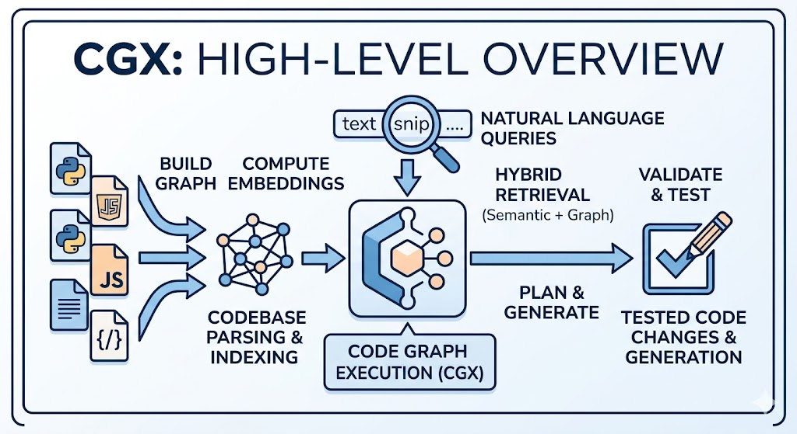
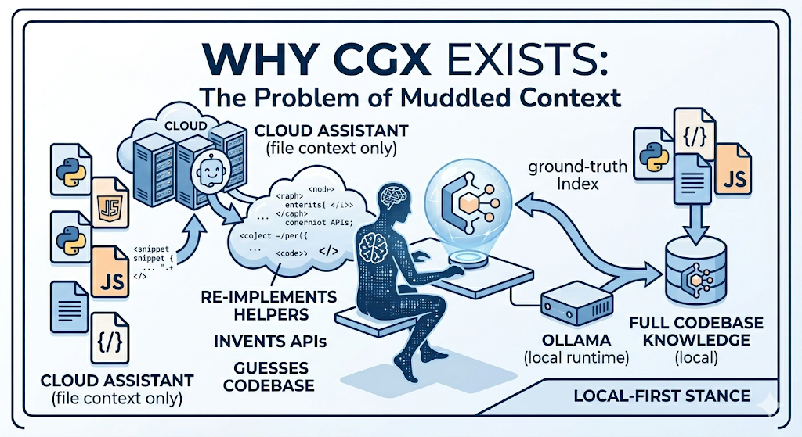
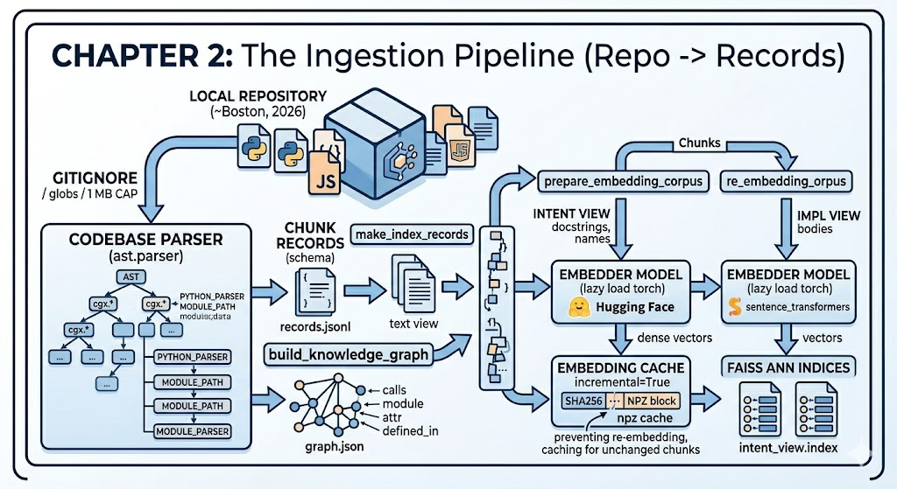
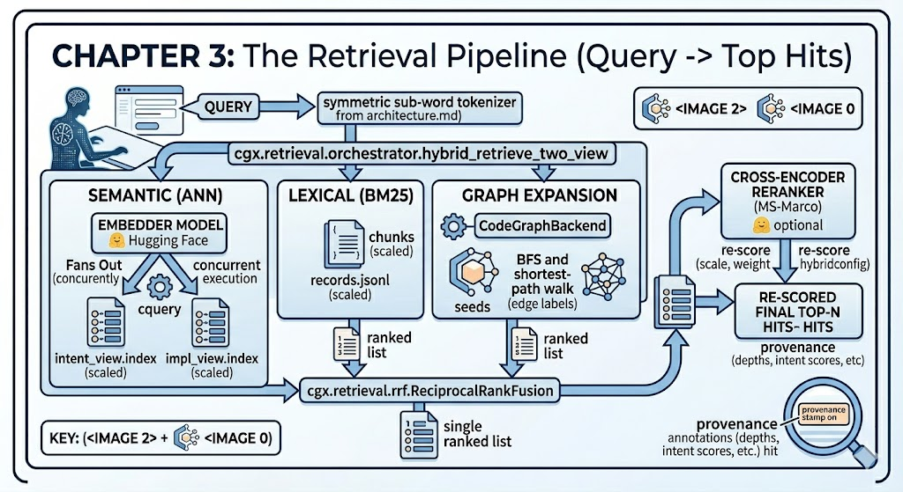
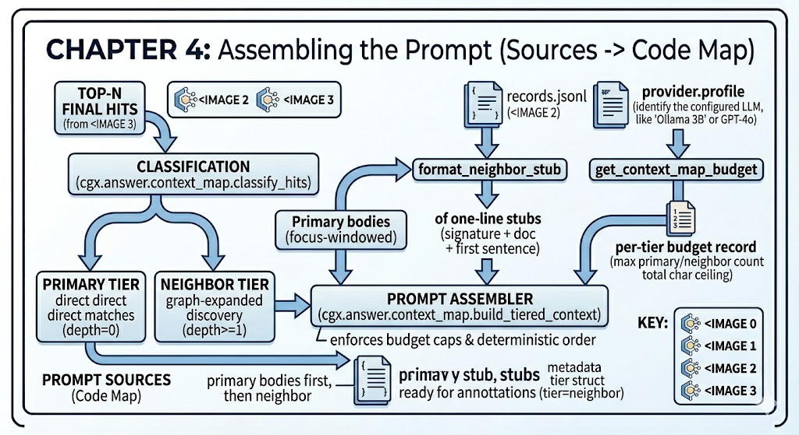
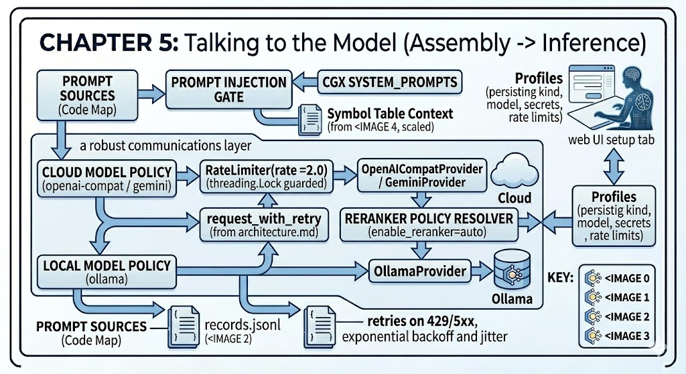
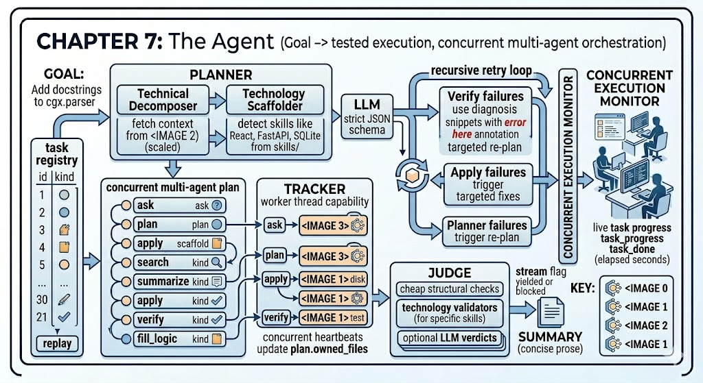

# The CGX Book

A narrative tour of how the codebase actually works. Where
[`architecture.md`](architecture.md) is a reference manual organised by
module, and [`usage.md`](usage.md) is a how-to organised by task, this
document follows a single request as it travels through CGX --
from an unindexed working tree to a tested patch on disk -- and explains
why each layer exists.

If you want the short version, read Chapter 1 (why CGX exists) and
Chapter 10 (the trust model). If you want to learn the system
end-to-end, read in order; each chapter assumes the one before it.

---

## Chapter 1 -- Why CGX exists

Modern code assistants live in the cloud. They are excellent at language
modelling and abysmal at one thing that matters most to people who write
software for a living: knowing what is already in your repository. A
hosted assistant sees the file you opened and the few tabs around it; it
guesses at the rest, and when it guesses wrong it confidently
re-implements a helper you already wrote, imports a package you've
already aliased, or invents an API that does not exist.

CGX is built on the opposite premise. The model is a small,
interchangeable component; the heavy lifting is done by a retrieval
pipeline that runs on the developer's own machine and knows the whole
codebase. The same machine parses the source, computes embeddings,
serves the search index, runs the LLM (by default, through Ollama), and
applies the resulting patch. Nothing has to leave the host, and when it
does -- because the user has explicitly configured a cloud provider --
only the snippets and prompts required for the next turn are sent.

This local-first stance shapes every design decision downstream. The
parser does not require Tree-sitter binaries. The graph layer does not
require a database. The embedding cache is a single `.npz` file. The
session store is JSONL. The task registry is SQLite. There is no daemon
to install and no service to log in to. Open the project, run `cgx web`,
and you are done.

The second design force is *small models matter*. A 3-billion-parameter
local model is a different animal from a 200-billion-parameter cloud
model: it has a smaller context window, it is more easily confused by
irrelevant text, and it cannot self-correct as fluently. Most of the
machinery in CGX exists to put a small model on equal footing with a
big one by feeding it sharper, smaller, more grounded prompts.

---

## Chapter 2 -- From repo to records

Indexing begins with `cgx.parser.parse_codebase`. The walker respects
`.gitignore`, a user-supplied ignore-glob list, and a 1 MB file-size cap
that keeps generated artefacts (lockfiles, minified bundles, vendored
dependencies) out of the corpus. For every file that survives the
filter, an extension-dispatched parser registry produces a stream of
*chunks*. Today only Python is registered; the registry exists so a
future contributor can plug in a JavaScript or Go parser without
touching the rest of the pipeline.

A chunk is a `TypedDict` defined in `cgx.parser.schema`. Its fields are
deliberately frugal: a stable id of the form `path::kind::symbol`, the
source text of the chunk, the kind (`file`, `class`, `function`,
`method`), line and column anchors, an `imports` summary, and a small
`provenance` bag the retrieval layer fills in later. There is one chunk
per file (a *file stub* with module-level docstring and top-level
member signatures), one per class (with method signatures), and one
per function or method (with full body). This three-tier shape is what
lets retrieval return a useful neighbourhood from a single hit -- you can
walk from a function up to its class up to its file.

The Python parser is the canonical implementation. It uses the standard
library `ast` module, lifts helpers like `_build_file_code_stub`,
`_collect_top_level_members`, and `_class_signature` to module scope so
they can be unit-tested, and never imports a third-party parsing library.
That choice has consequences -- CGX understands Python with surgical
precision and other languages only by their file boundaries -- but it
keeps the install footprint tiny.

After parsing comes the graph. `cgx.graph.build_graph.build_knowledge_graph`
walks the chunk list once and emits four kinds of edges: `calls` (a
function references another), `module` (a chunk belongs to a file),
`attr` (an attribute access on a known symbol), and `defined_in`
(a method belongs to a class). The graph is a NetworkX `DiGraph` --
the only place in CGX that depends directly on NetworkX -- and is
persisted as JSON so reload is fast. Retrieval and embeddings never
touch the raw `DiGraph`; they go through `cgx.graph.backend.CodeGraphBackend`,
a small facade that exposes exactly the operations they need
(`neighbors`, `bfs`, `shortest_path`). If the project ever needs to
swap NetworkX for something else, that swap happens in one file.

Finally `cgx.embeddings.records.make_index_records` turns the chunk
stream into the on-disk records and `prepare_embedding_corpus` derives
two text views per chunk. The *intent* view is natural-language-leaning:
the docstring, the symbol name, the module path. The *impl* view is
implementation-leaning: the full source with comments stripped. Each
view is embedded separately, producing two FAISS indices, because a
question phrased in English ("how do we authenticate users?") matches
the intent view well and a question phrased in code (`def login(`)
matches the impl view well. The retriever fuses both at query time.

Embedding the corpus is expensive enough that CGX never does it twice
for the same text. `cgx.embeddings.cache` is a content-addressed store
keyed on the sha256 of the corpus text and tagged with the embedder's
model name, vector dimension, and normalisation flag. On every
re-index, hits skip the model entirely; misses go to the embedder and
are written back. The cache invalidates itself automatically when the
model changes, so there is no risk of serving stale vectors against a
different encoder. In practice this means a typical re-index of a
moderate-sized repository touches the embedder only for the chunks
that actually changed.

---

## Chapter 3 -- The retrieval pipeline

A query enters CGX through `cgx.retrieval.orchestrator.hybrid_retrieve_two_view`.
Three independent retrievers run against the index in parallel.

The first is *semantic* search. The query is embedded once with the
same encoder that produced the corpus vectors, and the resulting vector
is searched against both FAISS indices -- the intent index returns
candidates whose docstring/name view sits close in vector space, the
impl index returns candidates whose source view sits close. Two ranked
lists come back.

The second is *lexical* search. A BM25 ranker scores the query against
the same chunks, treating their text as a bag of tokens. BM25 is
useless at synonyms ("auth" vs "authentication") but unbeatable at
exact-symbol recall -- when the user types a function name verbatim,
BM25 will find it whether the embedding model agrees or not.

Both retrievers depend on a subtlety that took the project several
iterations to get right: the tokenizer. Source code is written in
`camelCase` and `snake_case`, but a user typing "fetch user profile"
will not match a symbol named `fetchUserProfile` unless the tokenizer
splits identifiers the same way at query time as at indexing time.
`cgx.retrieval.tokenize` provides `split_identifier` and
`expand_with_subwords` for exactly this purpose, and the same functions
are wired into both the embeddings helpers (where they shape the impl
view) and the orchestrator's symbol-token extractor (where they shape
the query). The result is a *symmetric* tokenizer: every sub-word the
indexer sees is a sub-word the query can match against, and vice
versa. The lexical and catalog caches are keyed on the schema version
so a tokenizer change invalidates them automatically.

The third retriever is *graph expansion*. The top-N candidates from
the fused list are used as seeds, and `CodeGraphBackend` walks one
hop out -- calls, callers, classmates -- to surface chunks that are
relevant by structure rather than by text. A function and its only
caller usually need to be read together; the graph layer makes sure
they end up in the same result set even when the caller has no
keyword overlap with the question.

The three result sets are fused with *Reciprocal Rank Fusion*. RRF
takes the rank position of each candidate in each list, computes
`1 / (k + rank)` for each appearance (with `k = 60` by default), and
sums. A chunk that lands in the top of all three lists rises to the
top of the fused list; a chunk that lands deep in any one is pushed
down. RRF is rank-based, not score-based, which means it composes
across retrievers that produce wildly different score scales without
needing to learn calibration weights.

After RRF, the orchestrator optionally hands the candidates to a
cross-encoder *reranker* for a final, more expensive pass. Whether
the reranker runs at all is a policy decision, not a per-query flag:
`cgx.answer.profiles` resolves `enable_reranker = "auto"` against the
provider type -- local providers (Ollama, on-disk models) default to
`False` because the whole point of a local stack is that nothing
should require a separately-downloaded encoder; cloud providers
default to `True` because the latency cost is dwarfed by the model
call that follows. Either setting can be overridden in the profile.

---

## Chapter 4 -- Assembling the prompt

Retrieval returns a ranked list of chunks. Turning that into a prompt
that fits in a 3B model's context window is the job of
`cgx.answer.context_map.build_tiered_context`.

The naïve approach is to concatenate the top-K chunks in full until the
budget is exhausted. This works for cloud models and fails for local
ones, because graph expansion deliberately pulls in chunks the user
did not ask about -- neighbours that provide structural context but
whose bodies are mostly noise. A 3B model handed five full function
bodies will weight all five equally and produce muddled answers.

The Code Map classifies every hit into one of two tiers using the
`provenance.graph_depth` field the orchestrator stamps onto each
result. `graph_depth == 0` hits are *primary*: they matched the query
directly and their bodies are rendered in full (focus-windowed if
they are oversized). `graph_depth >= 1` hits are *neighbours*: they
were pulled in by graph expansion and are rendered as a compact stub
of the form `[class.]name(signature) -- first sentence of docstring`.
The neighbour entries also carry a `tier=neighbor` annotation so a
sufficiently sophisticated downstream consumer can re-rank them.

The budget that decides how many primaries and how many neighbours
fit comes from `cgx.answer.model_caps`. It exposes a five-key budget
record (`max_primaries`, `max_neighbors`, `primary_char_cap`,
`neighbor_char_cap`, `total_char_cap`) scaled across four model-window
tiers: below 16K, below 64K, below 200K, and 200K or more. A 3B model
on a 32K-token window gets a tight budget that prioritises one or
two full primaries and many small neighbour stubs; a frontier cloud
model on a 1M-token window gets a generous budget that can afford
several full primaries. The ordering is deterministic -- primaries
first, then neighbours, both in retrieval-rank order -- so citations
remain stable across runs and the same query produces the same
prompt.

`cgx.answer.engine` activates the Code Map automatically: if any hit
has `graph_depth >= 1`, the tiered builder runs; otherwise the engine
falls back to the older full-body formatter. There is no flag to set
and no user intervention required -- the activation is purely a
function of whether graph expansion contributed to the result set.

---

## Chapter 5 -- Talking to the model

The prompt assembled by the Code Map is handed to a provider in
`cgx.answer.providers`. Three are shipped: `OllamaProvider` for
locally-served models, `OpenAICompatProvider` for any HTTP endpoint
that speaks the OpenAI chat API (used for self-hosted llama.cpp,
vLLM, LM Studio, and cloud OpenAI itself), and `GeminiProvider` for
Google's REST API. All three present the same `chat(messages, ...)`
interface so the engine never knows which one it is talking to.

Two cross-cutting concerns wrap every provider call. The first is
*rate limiting*. `cgx.answer.ratelimit` implements a token-bucket
limiter plus an exponential-backoff retry for 429 and 5xx responses.
The numbers -- requests per second, max retries -- come from the
profile, so a cloud account with a strict quota can throttle itself
without leaking the quota into every call site.

The second is *profile resolution*. `cgx.answer.profiles` is a small
keyring-backed config layer where each profile names a provider, a
model, a temperature, a context window, the reranker policy
discussed above, and any secrets. Secrets are stored in the OS
keyring when available and fall back to a plain config file with a
warning otherwise. The web UI's *Setup* tab is the user-facing front
end of this module.

The engine itself lives in `cgx.answer.engine`. Two entry points
matter. `answer_with_llm` handles a read-only question: it runs
retrieval, builds the Code Map, calls the provider, returns the
answer plus the citations. `generate_code_plan` does the same but
asks the provider for a structured plan-with-diffs response,
threading in the symbol-table context from `cgx.codegen.symbol_map`
so the model is reminded what already exists. A third entry point,
`generate_project_scaffold`, drives the new-project branch of the
agent loop where no index exists yet.

`cgx.codegen.symbol_map.build_symbol_map` deserves a paragraph of its
own. It walks the same JSONL records the retriever uses, normalises
each chunk id of the form `path::kind::symbol` to a project-relative
path, and returns a compact `{relative_path: [symbol, ...]}` map. The
engine renders this map as an `# AVAILABLE CONTEXT` block and injects
it into every `plan`-kind prompt. The result, for a small model that
would otherwise re-implement `parse_codebase` from scratch, is a
working-memory aide that says *these symbols already exist; reuse
them.*

---

## Chapter 6 -- Writing to disk

The model returns a plan -- free-form markdown wrapped around fenced
`diff path=...` blocks. `cgx.codegen.pipeline.validate_and_test`
parses those blocks with `parse_fenced_diffs`, applies them in
memory with `apply_diffs_in_memory`, runs each result through the
language-aware syntax validator in `cgx.codegen.validate`, and
(if requested) copies the project to a sandbox and runs the
impacted tests. It returns a `CodegenReport` with four sections:
`patches` (one per file, with `ok` / `rejected_hunks` / `error`),
`diagnostics` (one per file that failed syntax), `tests` (pytest
outcome), and a `summary` dict whose `overall_ok` flag the agent
loop uses as its self-test signal.

`validate_and_test` never touches the real working tree. It exists
so the planner can ask itself "would this plan work?" before the
user commits to applying it; the agent loop runs it as a self-test
between the plan task and the apply task, and the UI surfaces the
result as the green/red bar above the diff view.

The disk write lives in `cgx.codegen.disk_apply.apply_diffs_to_disk`.
It deduplicates incoming diff entries, normalises their paths,
applies the same syntax smoke test in memory, and only then writes
to the working tree. Before any file is overwritten it is mirrored
into `<project_root>/.cgx-backups/<run_id>/`, preserving directory
structure. New files (where the source did not exist) are recorded
with an empty mirror so a rollback can delete them rather than
restoring them. The returned dict carries `applied_files`,
`failed_files`, and `backup_dir`; the UI surfaces `backup_dir` as
the *Undo* button and `cgx.webui.routes.rollback` exposes
`POST /api/rollback` to act on it.

Where the plan describes an *insertion* -- adding a new method to a
class, adding a new import, splicing into a specific location --
`cgx.codegen.ast_insert` takes over. The orchestrator's
`suggest_insertion_points` returns line-anchored candidates in the
form `likely_caller_loc` and `similar_signature_neighbor_loc`,
each carrying `start_line`, `end_line`, and `indent_col`. When such
an anchor is present, `ast_insert` splices the new code at that
exact line range; when it is not, it falls back to its older AST-walk
that finds the right class or function by name. The line-anchored
path is preferred because it survives formatting changes that would
confuse a name-based walker.

Before tests run, one more layer fires.
`cgx.codegen.env_manager.preflight_install` scans the generated
files for imports, filters out stdlib modules and first-party
packages, translates import names to PyPI distribution names where
they differ (`PIL` → `Pillow`, `google.generativeai` →
`google-generativeai`), and pip-installs any genuine misses into
the project's environment. This means a plan that picks up a new
dependency does not silently fail with `ImportError` -- pytest
receives a working environment and the retry loop sees the *real*
errors in the new code, not the missing-package noise.

The test runner itself is `cgx.codegen.test_runner.run_tests_on_disk`,
which is impact-aware: it walks the dependency graph from the
changed files and only invokes pytest on the affected tests. For a
standalone verify task (no prior apply), the agent loop instead
calls `run_pytest_paths` against every discovered test file.

---

## Chapter 7 -- The agent

`cgx.agents.run_agent` ties the pieces of Chapter 6 to the prompt
machinery of Chapter 5 with a three-component loop: Planner,
Tracker, Judge.

The **Planner** (`cgx.agents.planner.Planner.plan`) takes a goal
string and emits a `Plan` -- an ordered list of `Task`s, each with
a `kind`, a `description`, a `criteria` list the Judge will check,
and an `inputs` dict the Tracker will hand to the capability. The
Planner first retrieves a short candidate set against the index
(so it can ground its decomposition in the real codebase), then
asks the LLM for a strict-JSON
`[{name, description, kind, criteria}]` array. The provider's reply
is parsed with the same balanced-brace JSON extractor the Judge
uses; if parsing fails, the Planner falls back to a deterministic
single-task plan that the kind-policy will expand into the canonical
shape.

The ten task kinds are: `ask`, `plan`, `scaffold`,
`scaffold_manifest`, `scaffold_file`, `search`, `summarize`,
`apply`, `verify`, and `fill_logic`. `_enforce_kind_policy` reads
the goal and routes it down one of four branches. A *scaffold* goal
(detected via the `_SCAFFOLD_RE` regex, a verb-plus-tech pairing
through `_TECH_RE`, a skill match from `skills.detect_skills` --
the top-level `skills/` package that holds React, FastAPI, Flask,
Django, Vue, Tailwind, SQLite, Next.js, Express, and python_cli
templates -- or a literal `scaffold` task from the LLM with no
existing-codebase hint) becomes `[scaffold_manifest, apply, verify]`,
where the
manifest task's runtime output injects one `scaffold_file` task
per planned file. A *verify-only* goal collapses to a single
`verify` task. A *read-only* goal collapses to a single `ask` task.
Every other goal -- the ordinary "modify this code" case -- seeds a
single `plan` task and the policy appends `apply` and `verify` so
the chain always terminates with a real disk write and a real test
gate. Sequential dependencies are wired between consecutive tasks
so the UI can render the execution DAG.

The **Tracker** (`cgx.agents.tracker.Tracker`) is a state machine
that walks the plan task by task. Each task is dispatched on a
worker thread to its matching capability -- `ask` to
`answer_with_llm`, `plan` to `generate_code_plan`, `apply` to
`apply_diffs_to_disk`, `verify` to `run_tests_on_disk`, and so on.
While a task runs, the Tracker emits a `task_progress` event every
`progress_interval` seconds (default `2.0`) with the elapsed
time, so the UI can show a live spinner instead of going dark for
a 90-second test run. When a `scaffold_manifest` task returns an
`inject_tasks` list, the Tracker splices those `scaffold_file`
tasks into the plan immediately after the manifest so the
downstream `apply` step sees the full file batch. After every
successful `apply` task it updates `plan.owned_files`
(`{relative_path: "applied"|"failed"}`) so the retry loop always
knows which files are already on disk.

The **Judge** (`cgx.agents.judge.Judge`) checks every completed
task against its criteria. It begins with cheap structural
short-circuits: a `search` task with `hits > 0` passes
unconditionally; a `plan` task hard-fails only when both `plan_md`
and `diffs` are absent; a `scaffold` task hard-fails only when no
files were produced. For these ground-truth-shaped tasks an LLM
judge would have nothing meaningful to add -- pytest's return code
is what it is, and a scaffold either produced source files matching
the requested stack or it didn't -- so the Judge short-circuits
with the structural verdict. For the remaining cases (an `ask`
answer's quality, a `plan`'s reasoning) the Judge calls the LLM
with a strict-JSON `{verdict, confidence, rationale}` prompt and
parses the reply with the same balanced-brace extractor the
Planner uses. The verdict is attached to the task as `task.judge`
and emitted as a `judge` event.

When something goes wrong, the loop tries to fix itself. On a
verify failure, `_diagnose_failure` classifies the pytest output
into `import_error`, `syntax_error`, or `logic_error`, extracts a
±5-line snippet of source around the failing line (the *10-line
buffer rule*, with a `# <-- ERROR HERE` marker so the model cannot
miss it), and emits a targeted re-plan goal that names exactly the
broken files and tells the LLM not to touch the files already in
`plan.owned_files`. `Planner.plan_fix` bypasses the kind-policy
heuristics -- they would route the retry back through SCAFFOLD and
overwrite files that already passed -- and emits the canonical
`[plan, apply, verify]` triple. Apply failures and Judge
rejections trigger the same recursive retry, up to `max_retries`
(default `1`). The loop emits a final `summary` event when it is
done, whether by success or by exhaustion.

`run_agent` returns one of two things depending on `stream`. With
`stream=True` it returns a generator of `AgentEvent` objects so
the caller can render progress incrementally. With `stream=False`
(the default) it consumes the generator internally and returns
the final `Plan` after the loop has terminated.

---

## Chapter 8 -- The front door

The web UI is a FastAPI app composed in `cgx.webui.server.create_app`
and served by `uvicorn` on `:8765`. Routes are split per feature
under `cgx.webui.routes` -- `ask`, `plan`, `agent`, `index`, `embed`,
`hardware`, `sessions`, `tasks`, `rollback`, `setup`, `profiles`,
`status` -- and a single SPA fallback serves the prebuilt React
bundle from `cgx/webui/static` for every non-API URL so React
Router's client-side routing works on a hard refresh.

The three streaming endpoints -- `POST /api/ask`, `POST /api/plan`,
`POST /api/agent` -- share a common pattern. Each registers a row
in the task store, calls the corresponding handler in
`cgx.webui.handlers` to obtain a synchronous generator of events,
and wraps that generator with `cgx.webui.sse.bridge_generator`
into an `EventSourceResponse` (from `sse-starlette`). The bridge
adapts the synchronous Python generator to an asyncio-driven SSE
stream, persists every event into `task_events` as it goes, and
checks a per-task `threading.Event` cancel token between events so
a *Cancel* click from the UI terminates the underlying generator
cleanly.

The task store (`cgx.webui.task_store`) is a SQLite database at
`~/.cgx/tasks.db` with two tables. `tasks` records one row per
operation: `id`, `type` (`ask`/`plan`/`agent`/`index`), `status`
(`running`/`done`/`cancelled`/`error`), creation and completion
timestamps, the request payload as JSON, and any error text.
`task_events` records one row per SSE event with a foreign-key
`task_id`, an `event_type`, the payload as JSON, and a wall-clock
timestamp. The schema is plain -- no migrations, no ORM -- and the
indexes are kept to one (`idx_task_events_task_id`) because
replay reads are the only hot path.

This persistence is what enables *tab-switch replay*. The Agent
tab does not hold the SSE stream open; if the user navigates to
Index and back, the React route reads `GET /api/tasks/{id}/events`
from the registry and replays the events it missed, then resumes
the live stream from the last `seq`. A long-running scaffold can
be left to its own devices and the UI rebuilds its state from
scratch on every visit.

Conversational state lives in `cgx.sessions`, a dependency-free
JSONL store under `~/.cgx/sessions/`. Each session is one
append-only `<id>.jsonl` file of message records
(`{role, content, at, meta}`); a separate `index.json` carries
the per-session header (`id`, `title`, `message_count`,
`created_at`, `updated_at`). Writes go through `os.replace` so a
crash mid-write cannot corrupt either the index or a thread file.
The Ask tab's sidebar reads and writes through the public API
(`create_session`, `append_message`, `list_sessions`,
`delete_session`); nothing else in CGX talks directly to those
files.

---

## Chapter 9 -- Choosing a model

A user who has never run a local LLM has no way to know whether
their machine will hold a 7B coder or only a 1.5B chat model.
`cgx.answer.hardware_matrix` is a static, offline catalogue of
locally-runnable models -- Qwen Coder, Code Llama, Mistral,
Phi, and friends -- annotated with parameter count, minimum RAM,
recommended VRAM, and context window. `compute_local_fit(hw)`
takes a hardware probe and returns a verdict per model (`fit`,
`tight`, `unfit`) plus a reason, sorted by parameter count so the
UI can render the smallest viable model first. A second table,
`tradeoffs_rows`, gives the editorial local-vs-cloud comparison
the *Hardware* tab uses for the dimension/winner grid.

The dynamic side is `cgx.answer.ollama_discovery`, which talks to
a running Ollama instance over its HTTP API to discover which
models are actually downloaded. The web UI combines the two: it
shows the user which models fit their hardware, which of those
they already have, and a one-click *Pull* button for the rest.
Nothing in this module reaches outside Ollama; the catalogue is
hard-coded and the probe is a localhost call.

---

## Chapter 10 -- The trust model

Everything in the chapters above can be summarised by one
question: *where does my code go?* The answer in CGX is *nowhere,
unless you ask it to*.

By default the entire pipeline -- parsing, embeddings, FAISS,
retrieval, prompt assembly, LLM inference, codegen, tests --
runs on the developer's host. The default provider is Ollama,
which serves models over `localhost` and never makes outbound
network calls. The embedding model is downloaded once by Hugging
Face Transformers on first use and cached locally. The task
store, the session store, the embedding cache, and the backups
all live under `~/.cgx/` (or `$CGX_CONFIG_DIR`); the FAISS
indices and JSONL records live wherever the user pointed
`--out-dir`. There is no telemetry by default;
`cgx.telemetry` exposes an opt-in anonymous startup ping that
is off until the user explicitly enables it.

When a cloud provider is configured -- OpenAI-compatible, Gemini,
or anything served over `OpenAICompatProvider` -- only the prompts
and snippets needed for the next turn leave the machine. The
retrieval, the graph expansion, the Code Map assembly, the
symbol-table context, and the codegen pipeline all run locally;
the cloud LLM sees the final prompt and nothing else. Secrets
sit in the OS keyring when available; the fallback is a config
file with a warning. Rate limits and retry policies are per
profile so a leaked quota stays inside its profile.

A separate guarantee applies to the working tree.
`apply_diffs_to_disk` mirrors every file it is about to
overwrite into `.cgx-backups/<run_id>/` before writing.
`rollback_from_backup` (exposed as `POST /api/rollback`) restores
originals and deletes files that did not exist before the run,
returning `restored_files`, `deleted_files`, and `failed_files`.
The user always has an exit door.

---

## Chapter 11 -- Reading the source

For someone landing on the repository for the first time, the
fastest way to internalise the system is to read the modules in
the order this book introduces them:

1. `cgx/parser/parse_codebase.py` and `cgx/parser/python_parser.py`
   -- the ingestion entry point and the only registered parser.
2. `cgx/embeddings/records.py` and `cgx/embeddings/cache.py` --
   the two-view corpus builder and the content-addressed cache.
3. `cgx/graph/build_graph.py` and `cgx/graph/backend.py` -- the
   raw NetworkX builder and the facade everyone else uses.
4. `cgx/retrieval/orchestrator.py`, `cgx/retrieval/tokenize.py`,
   and `cgx/retrieval/rrf.py` -- semantic + lexical + graph fusion,
   the symmetric tokenizer, and the RRF formula.
5. `cgx/answer/context_map.py` and `cgx/answer/model_caps.py` --
   the tiered Code Map and its budget table.
6. `cgx/answer/engine.py`, `cgx/answer/providers.py`, and
   `cgx/answer/profiles.py` -- the three glue modules between
   retrieval and the LLM.
7. `cgx/codegen/pipeline.py`, `cgx/codegen/disk_apply.py`,
   `cgx/codegen/ast_insert.py`, `cgx/codegen/env_manager.py`, and
   `cgx/codegen/symbol_map.py` -- validate-and-test, the disk
   writer with backups, the line-anchored splicer, the preflight
   installer, and the AVAILABLE CONTEXT builder.
8. `cgx/agents/planner.py`, `cgx/agents/tracker.py`,
   `cgx/agents/judge.py`, and `cgx/agents/loop.py` -- the three
   components and the entry point that wires them.
9. `cgx/webui/server.py`, `cgx/webui/handlers.py`,
   `cgx/webui/sse.py`, and `cgx/webui/task_store.py` -- the
   FastAPI app, the SSE bridge, and the SQLite registry that
   makes tab-switch replay possible.

The reference documents pick up where this narrative leaves off.
[`docs/architecture.md`](architecture.md) catalogues every public
function with its signature and contract; [`docs/usage.md`](usage.md)
walks the user-facing surfaces tab by tab; [`docs/flowcharts.md`](flowcharts.md)
pairs hand-drawn SVG diagrams with prose for the visual learners;
[`CHANGELOG.md`](../CHANGELOG.md) records what changed and why.
This book is the connective tissue between them.
