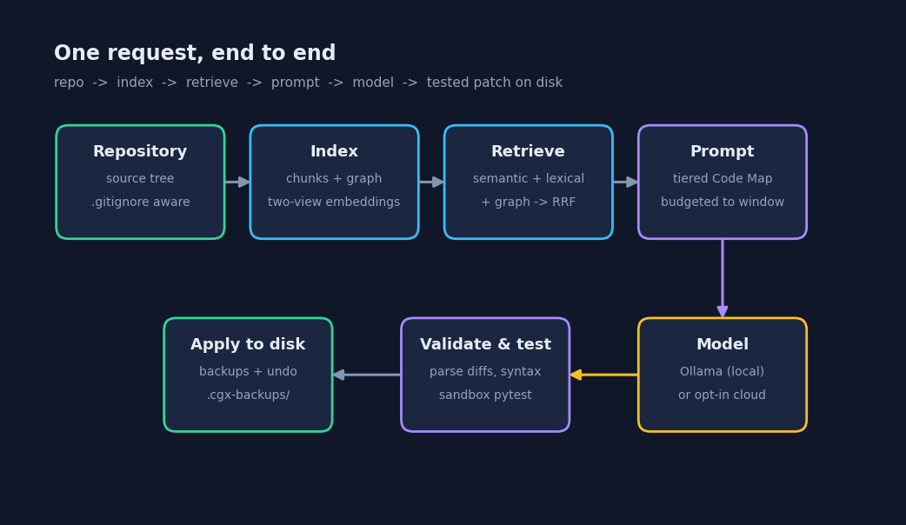
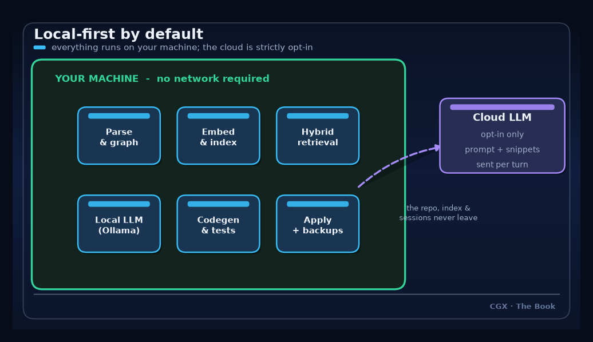
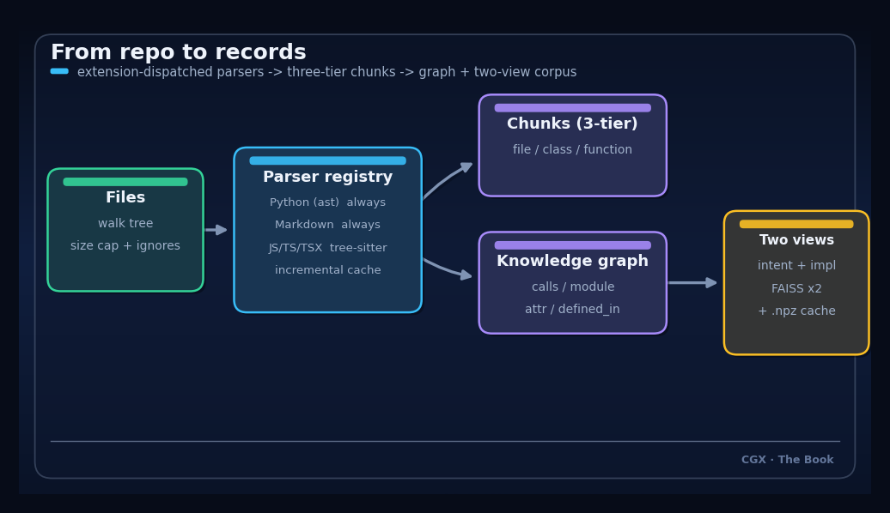
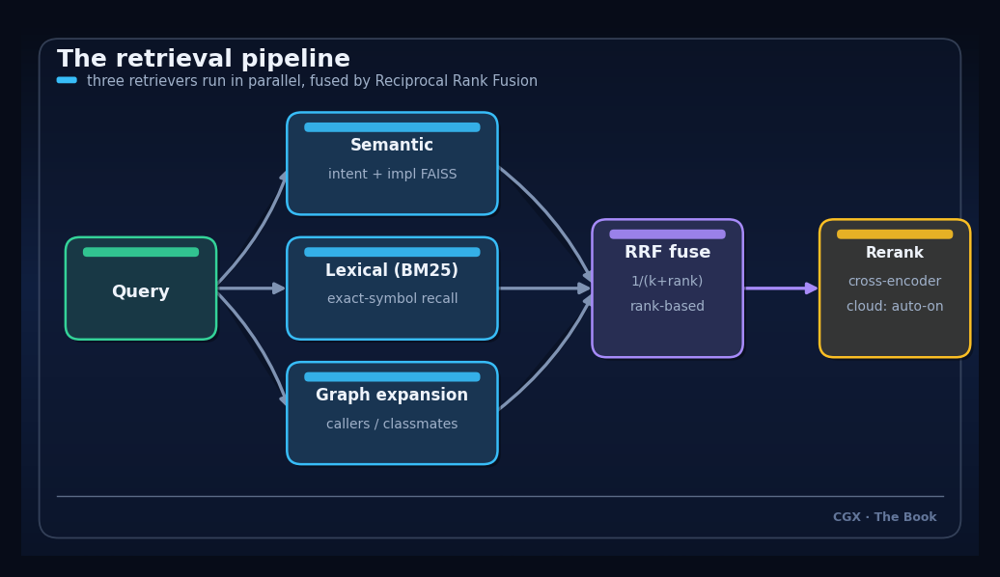
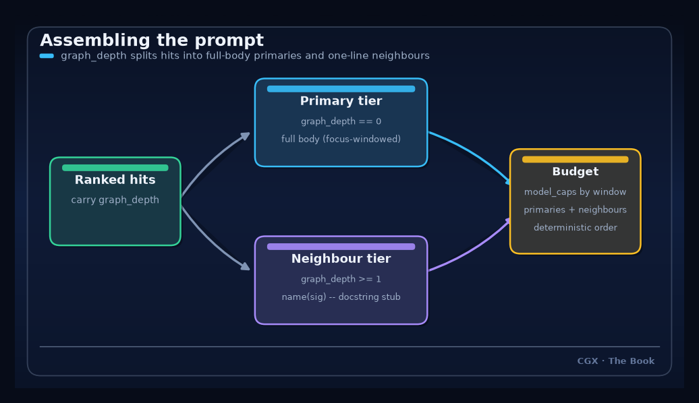
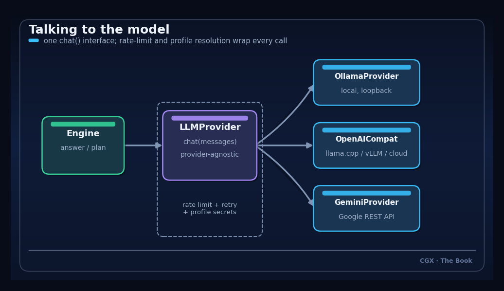
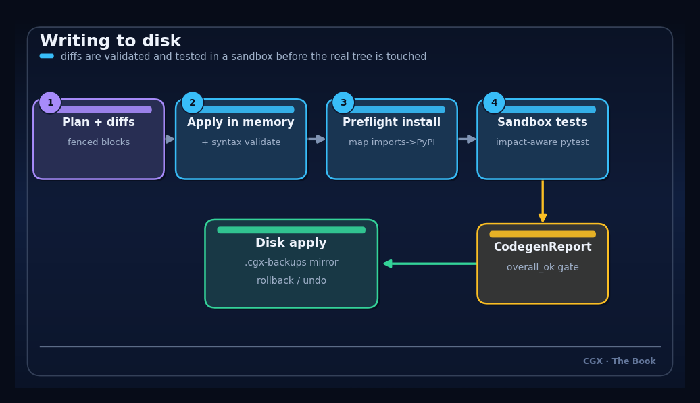
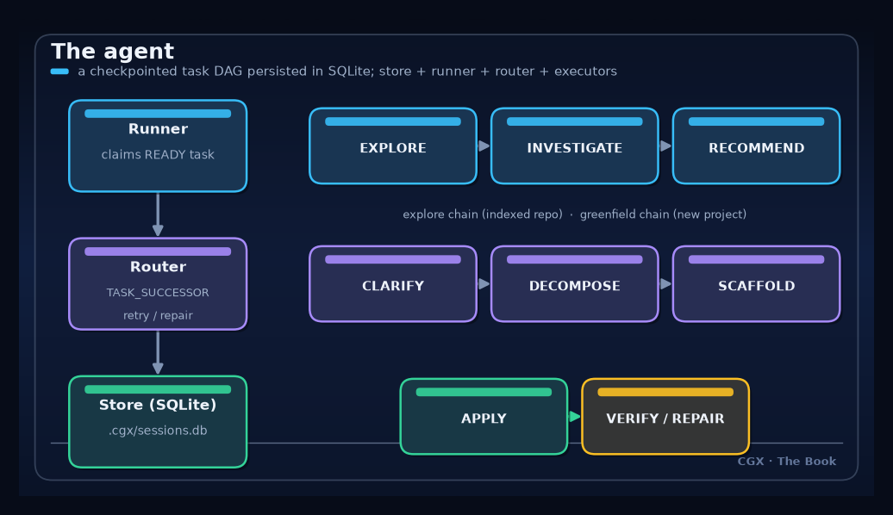

# The CGX Book

A narrative tour of how the codebase actually works. Where
[`architecture.md`](architecture.md) is a reference manual organised by
module, and [`usage.md`](usage.md) is a how-to organised by task, this
document follows a single request as it travels through CGX --
from an unindexed working tree to a tested patch on disk -- and explains
why each layer exists.

If you want the short version, read Chapter 1 (why CGX exists) and
Chapter 10 (the trust model). If you want to learn the system
end-to-end, read in order; each chapter assumes the one before it.

---

### 📖 Contents

| # | Chapter | In one line |
|--:|---------|-------------|
| 1 | [**Why CGX exists**](#chapter-1----why-cgx-exists) | Cloud assistants guess at your repo; CGX is built to know it. |
| 2 | [**From repo to records**](#chapter-2----from-repo-to-records) | How a working tree becomes chunks, a knowledge graph, and two embedding views. |
| 3 | [**The retrieval pipeline**](#chapter-3----the-retrieval-pipeline) | Semantic, lexical, and graph signals, fused by Reciprocal Rank Fusion. |
| 4 | [**Assembling the prompt**](#chapter-4----assembling-the-prompt) | The tiered Code Map: full-body primaries, one-line neighbours, budgeted to the window. |
| 5 | [**Talking to the model**](#chapter-5----talking-to-the-model) | One chat() interface fronting Ollama, OpenAI-compatible, and Gemini. |
| 6 | [**Writing to disk**](#chapter-6----writing-to-disk) | Parse, apply in memory, syntax-check, sandbox-test -- then write with backups. |
| 7 | [**The agent**](#chapter-7----the-agent) | A checkpointed task DAG in SQLite that explores or scaffolds, one step at a time. |
| 8 | [**The front door**](#chapter-8----the-front-door) | The FastAPI + React surface: SSE streaming and tab-switch replay. |
| 9 | [**Choosing a model**](#chapter-9----choosing-a-model) | An offline catalogue that matches runnable models to your hardware. |
| 10 | [**The trust model**](#chapter-10----the-trust-model) | Where does my code go? Nowhere, unless you ask it to. |
| 11 | [**Reading the source**](#chapter-11----reading-the-source) | A guided reading order through the modules, in the sequence this book introduces them. |

---

## Chapter 1 -- Why CGX exists
 <i>Cloud assistants guess at your repo; CGX is built to know it.</i>

Modern code assistants live in the cloud. They are excellent at language
modelling and abysmal at one thing that matters most to people who write
software for a living: knowing what is already in your repository. A
hosted assistant sees the file you opened and the few tabs around it; it
guesses at the rest, and when it guesses wrong it confidently
re-implements a helper you already wrote, imports a package you've
already aliased, or invents an API that does not exist.

CGX is built on the opposite premise. The model is a small,
interchangeable component; the heavy lifting is done by a retrieval
pipeline that runs on the developer's own machine and knows the whole
codebase. The same machine parses the source, computes embeddings,
serves the search index, runs the LLM (by default, through Ollama), and
applies the resulting patch. Nothing has to leave the host, and when it
does -- because the user has explicitly configured a cloud provider --
only the snippets and prompts required for the next turn are sent.

This local-first stance shapes every design decision downstream. The
core parser needs no third-party libraries -- Python and Markdown are
handled with the standard library, and Tree-sitter is an optional extra
that only unlocks the JavaScript/TypeScript grammars. The graph layer
does not require a database. The embedding cache is a pair of per-view
`.npz` files. Conversational history is JSONL; the agent-session and
task registries are SQLite. There is no daemon to install and no service
to log in to. Open the project, run `cgx serve`, and you are done.

The second design force is *small models matter*. A 3-billion-parameter
local model is a different animal from a 200-billion-parameter cloud
model: it has a smaller context window, it is more easily confused by
irrelevant text, and it cannot self-correct as fluently. Most of the
machinery in CGX exists to put a small model on equal footing with a
big one by feeding it sharper, smaller, more grounded prompts.

## Chapter 2 -- From repo to records
 <i>How a working tree becomes chunks, a knowledge graph, and two embedding views.</i>

Indexing begins with `cgx.parser.parse_codebase`. The walker respects
`.gitignore`, a user-supplied ignore-glob list, and a 1 MB file-size cap
that keeps generated artefacts (lockfiles, minified bundles, vendored
dependencies) out of the corpus. For every file that survives the
filter, an extension-dispatched parser registry produces a stream of
*chunks*. Python (standard-library `ast`) and Markdown/RST are always
registered; JavaScript, JSX, TypeScript, and TSX join them when the
optional `parsers` extra (Tree-sitter) is installed. Every parser is a
`BaseParser` subclass keyed on file extension, so adding a language is a
self-contained change that never touches the rest of the pipeline, and
the walker simply skips any extension with no registered parser.

A chunk is a `TypedDict` defined in `cgx.parser.schema`. Its fields are
deliberately frugal: a stable id of the form `path::kind::symbol`, the
source text of the chunk, the kind (`file`, `class`, `function`,
`method`), line and column anchors, an `imports` summary, and a small
`provenance` bag the retrieval layer fills in later. There is one chunk
per file (a *file stub* with module-level docstring and top-level
member signatures), one per class (with method signatures), and one
per function or method (with full body). This three-tier shape is what
lets retrieval return a useful neighbourhood from a single hit -- you can
walk from a function up to its class up to its file.

The Python parser is the canonical implementation. It uses the standard
library `ast` module, lifts helpers like `_build_file_code_stub`,
`_collect_top_level_members`, and `_class_signature` to module scope so
they can be unit-tested, and never imports a third-party parsing library.
The Tree-sitter parsers in `cgx.parser.js_ts_parser` extend the same
three-tier shape to JavaScript and TypeScript, and
`cgx.parser.markdown_parser` chunks prose so a repository's design notes
are retrievable next to its code. Because the walker skips any extension
with no registered parser, a core install (without the `parsers` extra)
still indexes Python and Markdown cleanly -- multi-language support is
additive, never required.

Re-parsing is incremental. `cgx.parser.incremental` keeps a
`parse_cache.json` manifest keyed on each file's content hash (with its
mtime and the schema version recorded alongside); on a re-index,
unchanged files replay their cached chunks and only added or modified
files reach a parser, mirroring the content-addressed embedding cache one
layer down.

After parsing comes the graph. `cgx.graph.build_graph.build_knowledge_graph`
walks the chunk list once and emits several kinds of edges: `defines`
(a file or class owns an entity), `calls` (a function references
another), `uses_module` (a chunk imports a module), `reads_attr` /
`writes_attr` (an attribute access on a known symbol), and `raises`
(a function raises an exception). The graph is a NetworkX `DiGraph` --
the only place in CGX that depends directly on NetworkX -- and is
persisted as JSON so reload is fast. Retrieval and embeddings never
touch the raw `DiGraph`; they go through `cgx.graph.backend.CodeGraphBackend`,
a small facade that exposes exactly the operations they need
(`neighbors`, `bfs`, `shortest_path`). If the project ever needs to
swap NetworkX for something else, that swap happens in one file.

Finally `cgx.embeddings.records.make_index_records` turns the chunk
stream into the on-disk records and `prepare_embedding_corpus` derives
two text views per chunk. The *intent* view is natural-language-leaning:
the docstring, the symbol name, the module path. The *impl* view is
implementation-leaning: the full source with comments stripped. Each
view is embedded separately, producing two FAISS indices, because a
question phrased in English ("how do we authenticate users?") matches
the intent view well and a question phrased in code (`def login(`)
matches the impl view well. The retriever fuses both at query time.

Embedding the corpus is expensive enough that CGX never does it twice
for the same text. `cgx.embeddings.cache` is a content-addressed store
keyed on the sha256 of the corpus text and tagged with the embedder's
model name, vector dimension, and normalisation flag. On every
re-index, hits skip the model entirely; misses go to the embedder and
are written back. The cache invalidates itself automatically when the
model changes, so there is no risk of serving stale vectors against a
different encoder. In practice this means a typical re-index of a
moderate-sized repository touches the embedder only for the chunks
that actually changed.

## Chapter 3 -- The retrieval pipeline
 <i>Semantic, lexical, and graph signals, fused by Reciprocal Rank Fusion.</i>

A query enters CGX through `cgx.retrieval.orchestrator.hybrid_retrieve_two_view`.
Three independent retrievers run against the index in parallel.

The first is *semantic* search. The query is embedded once with the
same encoder that produced the corpus vectors, and the resulting vector
is searched against both FAISS indices -- the intent index returns
candidates whose docstring/name view sits close in vector space, the
impl index returns candidates whose source view sits close. Two ranked
lists come back.

The second is *lexical* search. A BM25 ranker scores the query against
the same chunks, treating their text as a bag of tokens. BM25 is
useless at synonyms ("auth" vs "authentication") but unbeatable at
exact-symbol recall -- when the user types a function name verbatim,
BM25 will find it whether the embedding model agrees or not.

Both retrievers depend on a subtlety that took the project several
iterations to get right: the tokenizer. Source code is written in
`camelCase` and `snake_case`, but a user typing "fetch user profile"
will not match a symbol named `fetchUserProfile` unless the tokenizer
splits identifiers the same way at query time as at indexing time.
`cgx.retrieval.tokenize` provides `split_identifier` and
`expand_with_subwords` for exactly this purpose, and the same functions
are wired into both the embeddings helpers (where they shape the impl
view) and the orchestrator's symbol-token extractor (where they shape
the query). The result is a *symmetric* tokenizer: every sub-word the
indexer sees is a sub-word the query can match against, and vice
versa. The lexical and catalog caches are keyed on the schema version
so a tokenizer change invalidates them automatically.

The third retriever is *graph expansion*. The top-N candidates from
the fused list are used as seeds, and `CodeGraphBackend` walks one
hop out -- calls, callers, classmates -- to surface chunks that are
relevant by structure rather than by text. A function and its only
caller usually need to be read together; the graph layer makes sure
they end up in the same result set even when the caller has no
keyword overlap with the question.

The three result sets are fused with *Reciprocal Rank Fusion*. RRF
takes the rank position of each candidate in each list, computes
`1 / (k + rank)` for each appearance (with `k = 60` by default), and
sums. A chunk that lands in the top of all three lists rises to the
top of the fused list; a chunk that lands deep in any one is pushed
down. RRF is rank-based, not score-based, which means it composes
across retrievers that produce wildly different score scales without
needing to learn calibration weights.

After RRF, the orchestrator optionally hands the candidates to a
cross-encoder *reranker* for a final, more expensive pass. Whether
the reranker runs at all is a policy decision, not a per-query flag:
`cgx.answer.profiles` resolves `enable_reranker = "auto"` against the
provider type -- local providers (Ollama, on-disk models) default to
`False` because the whole point of a local stack is that nothing
should require a separately-downloaded encoder; cloud providers
default to `True` because the latency cost is dwarfed by the model
call that follows. Either setting can be overridden in the profile.

## Chapter 4 -- Assembling the prompt
 <i>The tiered Code Map: full-body primaries, one-line neighbours, budgeted to the window.</i>

Retrieval returns a ranked list of chunks. Turning that into a prompt
that fits in a 3B model's context window is the job of
`cgx.answer.context_map.build_tiered_context`.

The naïve approach is to concatenate the top-K chunks in full until the
budget is exhausted. This works for cloud models and fails for local
ones, because graph expansion deliberately pulls in chunks the user
did not ask about -- neighbours that provide structural context but
whose bodies are mostly noise. A 3B model handed five full function
bodies will weight all five equally and produce muddled answers.

The Code Map classifies every hit into one of two tiers using the
`provenance.graph_depth` field the orchestrator stamps onto each
result. `graph_depth == 0` hits are *primary*: they matched the query
directly and their bodies are rendered in full (focus-windowed if
they are oversized). `graph_depth >= 1` hits are *neighbours*: they
were pulled in by graph expansion and are rendered as a compact stub
of the form `[class.]name(signature) -- first sentence of docstring`.
The neighbour entries also carry a `tier=neighbor` annotation so a
sufficiently sophisticated downstream consumer can re-rank them.

The budget that decides how many primaries and how many neighbours
fit comes from `cgx.answer.model_caps.get_context_map_budget`. It
exposes a five-key budget record (`primary_max`, `neighbor_max`,
`primary_chars`, `neighbor_chars`, `total_chars`) scaled across four
model-window tiers: below 16K, below 64K, below 200K, and 200K or more. A 3B model
on a 32K-token window gets a tight budget that prioritises one or
two full primaries and many small neighbour stubs; a frontier cloud
model on a 1M-token window gets a generous budget that can afford
several full primaries. The ordering is deterministic -- primaries
first, then neighbours, both in retrieval-rank order -- so citations
remain stable across runs and the same query produces the same
prompt.

`cgx.answer.engine` activates the Code Map automatically: if any hit
has `graph_depth >= 1`, the tiered builder runs; otherwise the engine
falls back to the older full-body formatter. There is no flag to set
and no user intervention required -- the activation is purely a
function of whether graph expansion contributed to the result set.

## Chapter 5 -- Talking to the model
 <i>One chat() interface fronting Ollama, OpenAI-compatible, and Gemini.</i>

The prompt assembled by the Code Map is handed to a provider in
`cgx.answer.providers`. Three are shipped: `OllamaProvider` for
locally-served models, `OpenAICompatProvider` for any HTTP endpoint
that speaks the OpenAI chat API (used for self-hosted llama.cpp,
vLLM, LM Studio, and cloud OpenAI itself), and `GeminiProvider` for
Google's REST API. All three present the same `chat(messages, ...)`
interface so the engine never knows which one it is talking to.

Two cross-cutting concerns wrap every provider call. The first is
*rate limiting*. `cgx.answer.ratelimit` implements a token-bucket
limiter plus an exponential-backoff retry for 429 and 5xx responses.
The numbers -- requests per second, max retries -- come from the
profile, so a cloud account with a strict quota can throttle itself
without leaking the quota into every call site.

The second is *profile resolution*. `cgx.answer.profiles` is a small
keyring-backed config layer where each profile names a provider, a
model, a temperature, a context window, the reranker policy
discussed above, and any secrets. Secrets are stored in the OS
keyring when available and fall back to a plain config file with a
warning otherwise. The web UI's *Setup* tab is the user-facing front
end of this module.

The engine itself lives in `cgx.answer.engine`. Two entry points
matter. `answer_with_llm` handles a read-only question: it runs
retrieval, builds the Code Map, calls the provider, returns the
answer plus the citations. `generate_code_plan` does the same but
asks the provider for a structured plan-with-diffs response. A
third entry point, `generate_project_scaffold`, drives the
new-project branch of the agent loop where no index exists yet.

## Chapter 6 -- Writing to disk
 <i>Parse, apply in memory, syntax-check, sandbox-test -- then write with backups.</i>

The model returns a plan -- free-form markdown wrapped around fenced
`diff path=...` blocks. `cgx.codegen.pipeline.validate_and_test`
parses those blocks with `parse_fenced_diffs`, applies them in
memory with `apply_diffs_in_memory`, runs each result through the
language-aware syntax validator in `cgx.codegen.validate`, and
(if requested) copies the project to a sandbox and runs the
impacted tests. It returns a `CodegenReport` with four sections:
`patches` (one per file, with `ok` / `rejected_hunks` / `error`),
`diagnostics` (one per file that failed syntax), `tests` (pytest
outcome), and a `summary` dict whose `overall_ok` flag the agent
loop uses as its self-test signal.

`validate_and_test` never touches the real working tree. It exists
so the planner can ask itself "would this plan work?" before the
user commits to applying it; the agent loop runs it as a self-test
between the plan task and the apply task, and the UI surfaces the
result as the green/red bar above the diff view.

The disk write lives in `cgx.codegen.disk_apply.apply_diffs_to_disk`.
It deduplicates incoming diff entries, normalises their paths,
applies the same syntax smoke test in memory, and only then writes
to the working tree. Before any file is overwritten it is mirrored
into `<project_root>/.cgx-backups/<run_id>/`, preserving directory
structure. New files (where the source did not exist) are recorded
with an empty mirror so a rollback can delete them rather than
restoring them. The returned dict carries `applied_files`,
`failed_files`, and `backup_dir`; the UI surfaces `backup_dir` as
the *Undo* button and `cgx.webui.routes.rollback` exposes
`POST /api/rollback` to act on it.

Where the plan describes an *insertion* -- adding a new method to a
class, adding a new import, splicing into a specific location --
`cgx.codegen.ast_insert` takes over. The orchestrator's
`suggest_insertion_points` returns line-anchored candidates in the
form `likely_caller_loc` and `similar_signature_neighbor_loc`,
each carrying `start_line`, `end_line`, and `indent_col`. When such
an anchor is present, `ast_insert` splices the new code at that
exact line range; when it is not, it falls back to its older AST-walk
that finds the right class or function by name. The line-anchored
path is preferred because it survives formatting changes that would
confuse a name-based walker.

Before tests run, one more layer fires.
`cgx.codegen.env_manager.preflight_install` scans the generated
files for imports, filters out stdlib modules and first-party
packages, translates import names to PyPI distribution names where
they differ (`PIL` → `Pillow`, `google.generativeai` →
`google-generativeai`), and pip-installs any genuine misses into
the project's environment. This means a plan that picks up a new
dependency does not silently fail with `ImportError` -- pytest
receives a working environment and the retry loop sees the *real*
errors in the new code, not the missing-package noise.

The test runner itself is `cgx.codegen.test_runner.run_tests_on_disk`,
which is impact-aware: it walks the dependency graph from the
changed files and only invokes pytest on the affected tests. For a
standalone verify task (no prior apply), the agent loop instead
calls `run_pytest_paths` against every discovered test file.

## Chapter 7 -- The agent
 <i>A checkpointed task DAG in SQLite that explores or scaffolds, one step at a time.</i>

`cgx.session` ties the disk-writing pieces of Chapter 6 to the
prompt machinery of Chapter 5 with a persistent, checkpointed loop
built from four parts: a **store**, a **runner**, a **router**, and
a registry of **executors**.

A session is a durable aggregate -- one `Session` row plus its
`TaskNode`s, `Fact`s, `Decision`s, and `Artifact`s -- persisted by
`cgx.session.store.SessionStore` in SQLite at
`<project_root>/.cgx/sessions.db`. Tasks form a DAG: each node
declares `depends_on` edges, and a task becomes READY only when its
dependencies are DONE. Because every state transition is written
through the store, a session survives a process restart and can be
resumed from the web UI, the terminal dashboard, or `cgx agent` --
they all drive the same rows.

The **executors** (`cgx.session.tasks`, one module per `TaskKind`)
are the atomic units of work. The explore-mode chain is
`EXPLORE → INVESTIGATE → RECOMMEND → PLAN_CHANGE → APPLY → VERIFY`
with `ASK_USER` checkpoints interleaved; the greenfield chain is
`CLARIFY_REQUIREMENTS → DECOMPOSE → SCAFFOLD → APPLY →
BOOTSTRAP_ENV → VERIFY`, with `API_CHECK`, `SMOKE`,
`RUNTIME_VERIFY`, and `REPAIR` joining the tail as the run demands.
Each executor makes at most one focused LLM call, reads typed
inputs, writes typed artifacts, and returns an `ExecutorResult`
that says succeeded, failed (optionally *retryable*), or
needs-user. `ASK_USER` is itself a task kind: a checkpoint node
that pauses the session until the user posts a typed `Decision`
(choose a path, approve a plan, answer a clarify question).

The **router** (`cgx.session.router.Router`) owns the policy. On a
completed task it consults the `TASK_SUCCESSOR` table to spawn the
next node(s) in the chain; on a failed task, `on_task_failed`
decides between recovery and a terminal FAILED. Two recovery
channels matter. A mid-run SCAFFOLD failure re-plans from the last
good checkpoint. And any executor may mark a failure *retryable* --
DECOMPOSE does this when its manifest fails the coherence gate --
in which case the router re-dispatches the same task with the
failure folded into its constraints, bounded by a per-task retry
cap, instead of ending the session over one bad LLM reply.

Mode detection (`cgx.session.mode.detect_mode`) picks the root
task: a project root with a usable index seeds `EXPLORE`; a
missing, empty, or unindexed root seeds `CLARIFY_REQUIREMENTS` and
the greenfield chain. In greenfield mode DECOMPOSE plans a layered
file manifest, SCAFFOLD generates one file per task, APPLY writes
the batch to disk with the same `apply_diffs_to_disk` backup
mechanics as Chapter 6 (files that fail the smoke check land in
`failed_files` and are re-scaffolded individually rather than
failing the batch), `BOOTSTRAP_ENV` preflight-installs any
undeclared imports, and VERIFY runs the generated tests.

When VERIFY fails, the loop tries to fix itself through
`cgx.session.repair`: `classify` parses the pytest output into
typed failure kinds and extracts the traceback, `locate` maps the
traceback to the offending symbol in the generated source, and
`propose` builds a focused REPAIR prompt that contains only the
relevant source snippet. The repair loop is progress-aware: it keeps
funding rounds while the failing-test count strictly drops, with
every retry counter read and spent through the typed
`cgx.session.budget.LoopBudget` (absolute ceiling `REPAIR_BUDGET=4`),
and the whole session is bounded by budgets set at `start_session`
-- `max_task_runs`, `max_wall_seconds`, and `headless` (pause on an
`ASK_USER` when interactive; fail terminally when there is no user
to ask).

The **runner** (`cgx.session.runner.SessionRunner`) connects the
parts: `run_next` claims the next READY task, invokes its executor
with an `ExecutorDeps` bundle (project root, index, provider,
store), hands the result to the router, and persists the outcome.
`post_message` and `post_decision` are the two write surfaces the
UIs share -- a message becomes a follow-up objective or answers an
open `ASK_USER`, and a decision resolves a checkpoint so the loop
can continue.

## Chapter 8 -- The front door
 <i>The FastAPI + React surface: SSE streaming and tab-switch replay.</i>

The web UI is a FastAPI app composed in `cgx.webui.server.create_app`
and served by `uvicorn` on `:8765`. Routes are split per feature
under `cgx.webui.routes` -- `ask`, `plan`, `agent_session`,
`agent_profiles`, `index`, `embed`, `hardware`, `sessions`, `tasks`,
`rollback`, `setup`, `profiles`, `settings`, `skills`, `status` -- and a
single SPA
fallback serves the prebuilt React bundle from `cgx/webui/static`
for every non-API URL so React Router's client-side routing works
on a hard refresh.

The streaming endpoints `POST /api/ask` and `POST /api/plan` share
a common pattern. Each registers a row in the task store, calls the
corresponding handler in `cgx.webui.handlers` to obtain a
synchronous generator of events, and wraps that generator with
`cgx.webui.sse.bridge_generator` into an `EventSourceResponse`
(from `sse-starlette`). The bridge adapts the synchronous Python
generator to an asyncio-driven SSE stream, persists every event
into `task_events` as it goes, and checks a per-task
`threading.Event` cancel token between events so a *Cancel* click
from the UI terminates the underlying generator cleanly. The agent
has its own streaming surface: `GET /api/agent-session/{sid}/events`
subscribes to the session store's event bus (Chapter 7) rather than
the task store.

The task store (`cgx.webui.task_store`) is a SQLite database at
`~/.cgx/tasks.db` with two tables. `tasks` records one row per
operation: `id`, `type` (`ask`/`plan`/`index`), `status`
(`running`/`done`/`cancelled`/`error`), creation and completion
timestamps, the request payload as JSON, and any error text.
`task_events` records one row per SSE event with a foreign-key
`task_id`, an `event_type`, the payload as JSON, and a wall-clock
timestamp. The schema is plain -- no migrations, no ORM -- and the
indexes are kept to one (`idx_task_events_task_id`) because
replay reads are the only hot path.

This persistence is what enables *tab-switch replay*. The Ask and
Plan tabs do not hold the SSE stream open; if the user navigates to
Index and back, the React route reads `GET /api/tasks/{id}/events`
from the registry and replays the events it missed, then resumes
the live stream from the last `seq`. The Agent tab gets the same
property from a different store: it re-fetches the session snapshot
from `sessions.db` and re-subscribes to the session event feed, so
a long-running scaffold can be left to its own devices and the UI
rebuilds its state from scratch on every visit.

Conversational state lives in `cgx.sessions`, a dependency-free
JSONL store under `~/.cgx/sessions/`. Each session is one
append-only `<id>.jsonl` file of message records
(`{role, content, at, meta}`); a separate `index.json` carries
the per-session header (`id`, `title`, `message_count`,
`created_at`, `updated_at`). Writes go through `os.replace` so a
crash mid-write cannot corrupt either the index or a thread file.
The Ask tab's sidebar reads and writes through the public API
(`create_session`, `append_message`, `list_sessions`,
`delete_session`); nothing else in CGX talks directly to those
files.

## Chapter 9 -- Choosing a model
 <i>An offline catalogue that matches runnable models to your hardware.</i>

A user who has never run a local LLM has no way to know whether
their machine will hold a 7B coder or only a 1.5B chat model.
`cgx.answer.hardware_matrix` is a static, offline catalogue of
locally-runnable models -- Qwen Coder, Code Llama, Mistral,
Phi, and friends -- annotated with parameter count, minimum RAM,
recommended VRAM, and context window. `compute_local_fit(hw)`
takes a hardware probe and returns a verdict per model (`fit`,
`tight`, `unfit`) plus a reason, sorted by parameter count so the
UI can render the smallest viable model first. A second table,
`tradeoffs_rows`, gives the editorial local-vs-cloud comparison
the *Hardware* tab uses for the dimension/winner grid.

The dynamic side is `cgx.answer.ollama_discovery`, which talks to
a running Ollama instance over its HTTP API to discover which
models are actually downloaded. The web UI combines the two: it
shows the user which models fit their hardware, which of those
they already have, and a one-click *Pull* button for the rest.
Nothing in this module reaches outside Ollama; the catalogue is
hard-coded and the probe is a localhost call.

## Chapter 10 -- The trust model
 <i>Where does my code go? Nowhere, unless you ask it to.</i>

Everything in the chapters above can be summarised by one
question: *where does my code go?* The answer in CGX is *nowhere,
unless you ask it to*.

By default the entire pipeline -- parsing, embeddings, FAISS,
retrieval, prompt assembly, LLM inference, codegen, tests --
runs on the developer's host. The default provider is Ollama,
which serves models over `localhost` and never makes outbound
network calls. The embedding model is downloaded once by Hugging
Face Transformers on first use and cached locally. The task
store, the session store, the embedding cache, and the backups
all live under `~/.cgx/` (or `$CGX_CONFIG_DIR`); the FAISS
indices and JSONL records live wherever the user pointed
`--out-dir`. There is no telemetry by default;
`cgx.telemetry` exposes an opt-in anonymous startup ping that
is off until the user explicitly enables it.

When a cloud provider is configured -- OpenAI-compatible, Gemini,
or anything served over `OpenAICompatProvider` -- only the prompts
and snippets needed for the next turn leave the machine. The
retrieval, the graph expansion, the Code Map assembly, the
symbol-table context, and the codegen pipeline all run locally;
the cloud LLM sees the final prompt and nothing else. Secrets
sit in the OS keyring when available; the fallback is a config
file with a warning. Rate limits and retry policies are per
profile so a leaked quota stays inside its profile.

A separate guarantee applies to the working tree.
`apply_diffs_to_disk` mirrors every file it is about to
overwrite into `.cgx-backups/<run_id>/` before writing.
`rollback_from_backup` (exposed as `POST /api/rollback`) restores
originals and deletes files that did not exist before the run,
returning `restored_files`, `deleted_files`, and `failed_files`.
The user always has an exit door.

## Chapter 11 -- Reading the source
 <i>A guided reading order through the modules, in the sequence this book introduces them.</i>

For someone landing on the repository for the first time, the
fastest way to internalise the system is to read the modules in
the order this book introduces them:

1. `cgx/parser/parse_codebase.py`, `cgx/parser/base.py`,
   `cgx/parser/python_parser.py`, `cgx/parser/js_ts_parser.py`,
   `cgx/parser/markdown_parser.py`, and `cgx/parser/incremental.py`
   -- the ingestion entry point, the `BaseParser` seam, the registered
   parsers (Python, JS/TS via Tree-sitter, Markdown), and the
   incremental parse cache.
2. `cgx/embeddings/records.py` and `cgx/embeddings/cache.py` --
   the two-view corpus builder and the content-addressed cache.
3. `cgx/graph/build_graph.py` and `cgx/graph/backend.py` -- the
   raw NetworkX builder and the facade everyone else uses.
4. `cgx/retrieval/orchestrator.py`, `cgx/retrieval/tokenize.py`,
   and `cgx/retrieval/rrf.py` -- semantic + lexical + graph fusion,
   the symmetric tokenizer, and the RRF formula.
5. `cgx/answer/context_map.py` and `cgx/answer/model_caps.py` --
   the tiered Code Map and its budget table.
6. `cgx/answer/engine.py`, `cgx/answer/providers.py`, and
   `cgx/answer/profiles.py` -- the three glue modules between
   retrieval and the LLM.
7. `cgx/codegen/pipeline.py`, `cgx/codegen/disk_apply.py`,
   `cgx/codegen/ast_insert.py`, and `cgx/codegen/env_manager.py`
   -- validate-and-test, the disk writer with backups, the
   line-anchored splicer, and the preflight installer.
8. `cgx/session/models.py`, `cgx/session/store.py`,
   `cgx/session/runner.py`, `cgx/session/router.py`, and
   `cgx/session/tasks/` -- the session aggregate, the SQLite
   store, the loop engine, the routing policy, and the executors.
9. `cgx/webui/server.py`, `cgx/webui/handlers.py`,
   `cgx/webui/sse.py`, and `cgx/webui/task_store.py` -- the
   FastAPI app, the SSE bridge, and the SQLite registry that
   makes tab-switch replay possible.

The reference documents pick up where this narrative leaves off.
[`docs/architecture.md`](architecture.md) catalogues every public
function with its signature and contract; [`docs/usage.md`](usage.md)
walks the user-facing surfaces tab by tab; [`docs/flowcharts.md`](flowcharts.md)
pairs hand-drawn SVG diagrams with prose for the visual learners;
[`CHANGELOG.md`](../CHANGELOG.md) records what changed and why.
This book is the connective tissue between them.

