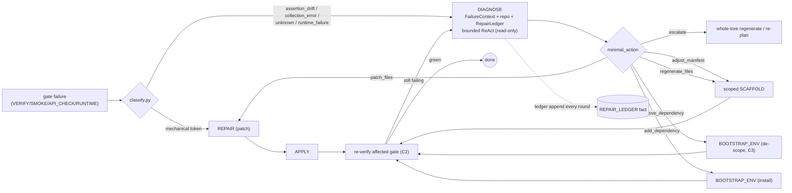

# DIAGNOSE — the adaptive recovery rung (design)

**Status:** draft for sign-off · **Owner:** agent team · **Phase:** 2
(prereq design for [`docs/Agent.md`](Agent.md) and the autonomous repair
loop in [`docs/flowcharts.md`](flowcharts.md)).

This document specifies `DIAGNOSE`, a new **reasoning executor** inserted
between the mechanical `REPAIR` patch and the nuclear whole-tree
regenerate. It is the core of the shift from a *deterministic recovery
ladder* (`patch → regenerate-whole-tree → re-plan-whole-tree → FAIL`) to
an *adaptive diagnose-fix-recheck* model, while preserving the property
the architecture depends on: **the router stays a pure, replayable,
LLM-free state machine**. All adaptivity lives in the executor.

## 1. Problem restated

Today, when `repair/classify.py` returns a token in `_REGENERATE_CLASSES`
(`assertion_drift`, `collection_error`, `runtime_failure`, `unknown`, …)
and the bounded LLM patch is a no-op, `tasks/repair.py` sets
`strategy='regenerate'`. The `_COMPLETION_GUARDS` chain in `router.py`
then runs `_repair_regenerate_actions`, which **abandons the live subtree
and re-authors from the manifest**. When the *manifest itself* was the
root cause, regenerate reproduces the defect until `REPAIR_BUDGET=4` /
`repair_regenerate` budget forces a `_replan_or_fail` — a full restart.
There is no rung where an agent *reasons over the concrete failure + the
real repo + what was already tried* and makes a surgical fix.

## 2. Design principle: keep the router pure

The router must remain a deterministic table (`TASK_SUCCESSOR`) plus an
ordered guard chain (`_COMPLETION_GUARDS`). It never calls an LLM. The
new intelligence is confined to the `DIAGNOSE` executor, which emits a
**typed `DIAGNOSIS` artifact**. The router only *reads*
`DIAGNOSIS.minimal_action` (a closed enum) and dispatches deterministic
successors — exactly how it already reads `REPAIR`'s `strategy` field.
This keeps every branch replayable and unit-testable without a model.

## 3. New typed model additions (`src/cgx/session/models.py`)

- `TaskKind.DIAGNOSE = "diagnose"` — the reasoning rung.
- `ArtifactKind.DIAGNOSIS = "diagnosis"` — the executor's typed output.
- `FactKind.REPAIR_LEDGER = "repair_ledger"` — durable working memory of
  attempted actions + outcomes across one repair chain (§7).

## 4. `FailureContext` — one normalized input (Workstream D1)

`VERIFY_REPORT`, `SMOKE_REPORT`, `API_CHECK_REPORT`, and `RUNTIME_REPORT`
have bespoke shapes. `DIAGNOSE` consumes a single normalized dataclass
built from whichever upstream report drove the repair, reusing the
existing `classify.py` plumbing (no new parsing):

```
@dataclass(frozen=True)
class FailureContext:
    gate: str                 # "verify" | "smoke" | "api_check" | "runtime"
    classification: str       # classify.py token (may be "unknown")
    failure_signature: str    # classify.failure_signature(content)
    failure_text: str         # classify._failure_text(content), bounded
    traceback_files: tuple[str, ...]   # classify.traceback_source_files(content)
    installed_packages: tuple[str, ...]  # from BUILD_REPORT.installed_packages
    goal: str                 # session goal / requirements summary
    manifest_files: tuple[str, ...]     # current SCAFFOLD manifest paths
```

`FailureContext` lives in a new `src/cgx/session/repair/context.py` and is
pure (no I/O) so it is trivially testable and traceable.

## 5. `DIAGNOSIS` artifact schema

`Artifact(kind=ArtifactKind.DIAGNOSIS, content=…)` where `content` is:

```
{
  "root_cause": str,                 # one-line human-readable cause
  "minimal_action": str,             # closed enum, see below
  "target_files": [str, ...],        # files to patch/regenerate (scoped)
  "add_dependencies": [str, ...],    # for add_dependency
  "remove_dependencies": [str, ...], # for remove_dependency (Workstream C3)
  "remove_tests": [str, ...],        # unrunnable tests to drop (C3)
  "manifest_edits": [ ... ],         # for adjust_manifest
  "rationale": str,                  # why this action, for the ledger
  "failure_signature": str,          # echoes FailureContext for flap guard
  "confidence": float                # 0..1; low => escalate
}
```

`minimal_action ∈ {patch_files, add_dependency, remove_dependency,
adjust_manifest, regenerate_files, escalate}`. Each maps to a
deterministic router successor (§8). `escalate` is the explicit hand-off
to today's whole-tree regenerate / `_replan_or_fail`, so behavior can
never be *worse* than the current ladder.

## 6. Executor contract (`src/cgx/session/tasks/diagnose.py`)

```
@register_executor(TaskKind.DIAGNOSE)
def run_diagnose(task: TaskNode, deps: ExecutorDeps) -> ExecutorResult
```

- **Input** (`task.inputs`): the source report artifact id, the
  `LoopBudget` repair-chain keys, and the `REPAIR_LEDGER` fact id.
- **Behavior:** build `FailureContext`; run a **bounded ReAct loop**
  (read a file, grep a symbol, list installed packages from
  `BUILD_REPORT.installed_packages`) for at most `DIAGNOSE_STEPS`
  iterations, then emit exactly one `DIAGNOSIS`. Read-only tools only —
  the executor proposes; `APPLY`/`BOOTSTRAP_ENV`/`SCAFFOLD` mutate.
- **Bound:** the loop is charged against the shared `REPAIR_BUDGET` via
  `LoopBudget.spend_repair`, so termination is preserved.
- **Deterministic fallback (E2):** if the provider is unavailable or the
  loop yields nothing, emit `minimal_action="escalate"` with the
  classifier token as `root_cause` — i.e. exactly today's regenerate
  path. `DIAGNOSE` is strictly additive.
- **Output:** `ExecutorResult(outputs={"diagnosis_artifact_id", ...,
  "minimal_action", "failure_signature", "repair_attempt"},
  artifact=<DIAGNOSIS>, facts=[<updated REPAIR_LEDGER>])`.
- **Tracing:** the executor is auto-wrapped by `register_executor`'s
  `traced("executor")`; every model call goes through the session
  `TracingProvider` so it surfaces as an `llm_call` record. The ReAct
  tool steps emit `emit_trace("diagnose_step", ...)` when tracing is on.

## 7. `RepairLedger` — working memory (Workstream B4)

The single biggest difference from today's *stateless* ladder. A
`FactKind.REPAIR_LEDGER` fact is threaded along the repair chain and
appended to on every round:

```
{
  "attempts": [
    {"action": "patch_files", "targets": ["backend/app.py"],
     "outcome": "still_failing", "signature": "ab12…"},
    {"action": "add_dependency", "targets": ["flask-cors"],
     "outcome": "regressed", "signature": "cd34…"}
  ]
}
```

`DIAGNOSE` reads the ledger to **never repeat a failed action** and to
reason "patch X didn't work, the real issue is Y". The ledger id rides
`LoopBudget.repair_chain_inputs()` so it survives every hop without the
router understanding its contents (router stays pure).

## 8. Router wiring (pure; `router.py` + `greenfield_edges.py`)

Two deterministic changes, both table/guard-driven and LLM-free:

1. **Enter DIAGNOSE instead of jumping to regenerate.** In the repair
   gates (`_verify_to_repair_or_terminal`, `_smoke_to_verify_or_repair`,
   `_api_check_to_smoke_or_repair`, `_runtime_verify_to_repair_or_terminal`)
   a *fixable* failure whose classification is in the "needs reasoning"
   set (`assertion_drift`, `collection_error`, `unknown`, `runtime_failure`)
   spawns `TaskKind.DIAGNOSE` rather than a mechanical `REPAIR`. Mechanical
   tokens keep the fast path straight to `REPAIR` (Workstream D2). The
   same `REPAIR_BUDGET` + flap guard apply verbatim.
2. **Dispatch the verdict.** Add `DIAGNOSE` to `TASK_SUCCESSOR` and a
   `DIAGNOSE` block to `_COMPLETION_GUARDS` that maps `minimal_action`
   to existing successors — no new mutation machinery:

   | `minimal_action`   | Router successor                                        |
   |--------------------|--------------------------------------------------------|
   | `patch_files`      | `REPAIR` (targeted) → `APPLY` (reuses patch path)      |
   | `add_dependency`   | `BOOTSTRAP_ENV` (reuses `_repair_install_deps_actions`)|
   | `remove_dependency`| `BOOTSTRAP_ENV` de-scope path (new, C3)                |
   | `adjust_manifest`  | scoped `SCAFFOLD` via `propose_regenerate(regenerate_files=…)` |
   | `regenerate_files` | targeted `propose_regenerate` (C1)                     |
   | `escalate`         | today's whole-tree regenerate / `_replan_or_fail`      |

   Every row already exists as a code path; `DIAGNOSE` just *chooses*
   among them with reasoning + memory instead of the current fixed jump.

## 9. Observability (cross-cutting requirement)

- Executor enter/exit: automatic via `traced("executor")`.
- Model calls: automatic `llm_call` records via `TracingProvider`.
- New curated events (guarded by `is_trace_enabled()`):
  `diagnose_step` (each ReAct tool use), `diagnose_verdict`
  (`minimal_action`, `confidence`, `signature`). These land in the
  project `agent.log` and the admin trace explorer with the existing
  `session_id`/`task_id`/`request_id` correlation — no new plumbing.
- The `REPAIR_LEDGER` fact is visible in the session store / facts view.

## 10. Testing strategy

- **Router (pure):** table-driven tests that each `minimal_action` maps
  to the expected successor `TaskKind`, and that mechanical tokens still
  bypass `DIAGNOSE`. No LLM.
- **Executor:** stub `ExecutorDeps.provider` to return canned diagnoses;
  assert the `DIAGNOSIS` schema, ledger append, and deterministic
  `escalate` fallback on provider error.
- **`FailureContext`/ledger:** pure unit tests.
- **Budget:** assert `DIAGNOSE` spends `REPAIR_BUDGET` and terminates.

## 11. The adaptive loop (chart)



## 12. Open questions for sign-off

1. **`DIAGNOSE_STEPS` bound** — start at 3 read-only tool calls per
   round? Higher = smarter but more tokens.
2. **Provider tier** — do we target the local small model
   (qwen2.5-coder) or a larger hosted one for `DIAGNOSE`? This decides
   how much we lean on the ReAct loop vs. a tighter schema-constrained
   single call.
3. **Where the "needs reasoning" gate lives** — extend
   `_REGENERATE_CLASSES` into an explicit `_DIAGNOSE_CLASSES` set, or add
   a `needs_reasoning` flag to the classifier registry?
