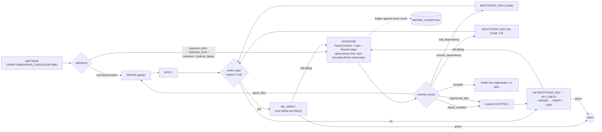

# DIAGNOSE — the adaptive recovery rung (design)

**Status:** in progress · **Owner:** agent team · **Phase:** 2
(prereq design for [`docs/Agent.md`](Agent.md) and the autonomous repair
loop in [`docs/flowcharts.md`](flowcharts.md)).

**Implementation status:** the typed model additions (§3), the
`FailureContext` normalizer (§4), the `DIAGNOSE` executor itself (§6), the
`RepairLedger` working memory (§7), and the router wiring (§8) have all
landed (`src/cgx/session/tasks/diagnose.py`,
`src/cgx/session/repair/ledger.py`, `src/cgx/session/router.py`,
`src/cgx/session/greenfield_edges.py`). The reasoning rung is now reachable
from the greenfield edges: reasoning-class gate failures enter `DIAGNOSE`
and its verdict dispatches to a scoped successor, and the `remove_dependency`
verdict (C3) scrubs `requirements.txt` via the `BOOTSTRAP_ENV`
`descope_packages` hook. Every branch is covered by table-driven router
tests in `tests/test_session.py`.

This document specifies `DIAGNOSE`, a new **reasoning executor** inserted
between the mechanical `REPAIR` patch and the nuclear whole-tree
regenerate. It is the core of the shift from a *deterministic recovery
ladder* (`patch → regenerate-whole-tree → re-plan-whole-tree → FAIL`) to
an *adaptive diagnose-fix-recheck* model, while preserving the property
the architecture depends on: **the router stays a pure, replayable,
LLM-free state machine**. All adaptivity lives in the executor.

## 1. Problem restated

Today, when `repair/classify.py` returns a token in `_REGENERATE_CLASSES`
(`assertion_drift`, `collection_error`, `runtime_failure`, `unknown`, …)
and the bounded LLM patch is a no-op, `tasks/repair.py` sets
`strategy='regenerate'`. The `_COMPLETION_GUARDS` chain in `router.py`
then runs `_repair_regenerate_actions`, which **abandons the live subtree
and re-authors from the manifest**. When the *manifest itself* was the
root cause, regenerate reproduces the defect until `REPAIR_BUDGET=4` /
`repair_regenerate` budget forces a `_replan_or_fail` — a full restart.
There is no rung where an agent *reasons over the concrete failure + the
real repo + what was already tried* and makes a surgical fix.

## 2. Design principle: keep the router pure

The router must remain a deterministic table (`TASK_SUCCESSOR`) plus an
ordered guard chain (`_COMPLETION_GUARDS`). It never calls an LLM. The
new intelligence is confined to the `DIAGNOSE` executor, which emits a
**typed `DIAGNOSIS` artifact**. The router only *reads*
`DIAGNOSIS.minimal_action` (a closed enum) and dispatches deterministic
successors — exactly how it already reads `REPAIR`'s `strategy` field.
This keeps every branch replayable and unit-testable without a model.

## 3. New typed model additions (`src/cgx/session/models.py`)

- `TaskKind.DIAGNOSE = "diagnose"` — the reasoning rung.
- `ArtifactKind.DIAGNOSIS = "diagnosis"` — the executor's typed output.
- `FactKind.REPAIR_LEDGER = "repair_ledger"` — durable working memory of
  attempted actions + outcomes across one repair chain (§7).

## 4. `FailureContext` — one normalized input (Workstream D1)

`VERIFY_REPORT`, `SMOKE_REPORT`, `API_CHECK_REPORT`, and `RUNTIME_REPORT`
have bespoke shapes. `DIAGNOSE` consumes a single normalized dataclass
built from whichever upstream report drove the repair, reusing the
existing `classify.py` plumbing (no new parsing):

```
@dataclass(frozen=True)
class FailureContext:
    gate: str                 # "verify" | "smoke" | "api_check" | "runtime"
    classification: str       # classify.py token (may be "unknown")
    failure_signature: str    # echoes the report's cached signature,
                              # else classify.failure_signature(content)
    failure_text: str         # gate-normalized failure blob, bounded to
                              # FAILURE_TEXT_LIMIT (4000 chars)
    traceback_files: tuple[str, ...]   # classify.traceback_source_files(text)
    installed_packages: tuple[str, ...]  # from BUILD_REPORT.installed_packages
    goal: str                 # session goal / requirements summary
    manifest_files: tuple[str, ...]     # current SCAFFOLD manifest paths
```

`FailureContext` lives in `src/cgx/session/repair/context.py` and is pure
(no I/O) so it is trivially testable and traceable. The
`FailureContext.from_report(gate, content, …)` factory folds each gate:

- `verify` → `classify.classify_verify_report` + `classify.failure_text`
- `runtime` → `classify.classify_runtime_report` + `classify.runtime_failure_text`
- `smoke` / `api_check` → no dedicated classifier, so `classification`
  defaults to `"unknown"` (a caller with a sharper verdict passes
  `classification=`), and `failure_text` is rendered locally from the
  failing modules' / references' stderr tails.

`traceback_files` reuses `classify.traceback_source_files` over the
normalized blob so every gate localizes to `.py` files with no second
parser; `to_dict()` renders the tuple fields as lists for tracing.

## 5. `DIAGNOSIS` artifact schema

`Artifact(kind=ArtifactKind.DIAGNOSIS, content=…)` where `content` is:

```
{
  "root_cause": str,                 # one-line human-readable cause
  "minimal_action": str,             # closed enum, see below
  "target_files": [str, ...],        # files to patch/regenerate (scoped)
  "add_dependencies": [str, ...],    # for add_dependency
  "remove_dependencies": [str, ...], # for remove_dependency (Workstream C3)
  "remove_tests": [str, ...],        # unrunnable tests to drop (C3)
  "manifest_edits": [ ... ],         # for adjust_manifest
  "rationale": str,                  # why this action, for the ledger
  "failure_signature": str,          # echoes FailureContext for flap guard
  "confidence": float                # 0..1; low => escalate
}
```

`minimal_action ∈ {patch_files, add_dependency, remove_dependency,
adjust_manifest, regenerate_files, escalate}`. Each maps to a
deterministic router successor (§8). `escalate` is the explicit hand-off
to today's whole-tree regenerate / `_replan_or_fail`, so behavior can
never be *worse* than the current ladder.

## 6. Executor contract (`src/cgx/session/tasks/diagnose.py`)

```
@register_executor(TaskKind.DIAGNOSE)
def run_diagnose(task: TaskNode, deps: ExecutorDeps) -> ExecutorResult
```

- **Input** (`task.inputs`): the source report artifact id, the
  `LoopBudget` repair-chain keys, and the `REPAIR_LEDGER` fact id.
- **Behavior — deterministic-first:** the executor runs a model-free
  check first. An import/boot failure (`runtime_failure`) whose
  `FailureContext.traceback_files` already localize to on-disk first-party
  `.py` files is resolved with **no model call at all** — a *targeted*
  `regenerate_files` over exactly those files (implementation first, the
  test that surfaced it only as a fallback). The genuinely ambiguous
  classes (`assertion_drift`, `collection_error`, `unknown`, plus a
  `runtime_failure` that localized nothing on disk) fall through to the
  **bounded ReAct loop** (read a file, grep a symbol, list installed
  packages from `BUILD_REPORT.installed_packages`) for at most
  `DIAGNOSE_STEPS` tool calls, then emit exactly one `DIAGNOSIS`.
  Read-only tools only — the executor proposes;
  `APPLY`/`BOOTSTRAP_ENV`/`SCAFFOLD` mutate.
- **Provider-agnostic:** the LLM is whatever the user configured (small
  or large). The executor makes no tier assumptions — it uses a tight,
  schema-constrained request and is tolerant of terse outputs, so a
  small local model degrades to `escalate` rather than misbehaving.
- **Bound:** the loop is charged against the shared `REPAIR_BUDGET` via
  `LoopBudget.spend_repair`, so termination is preserved.
- **Deterministic fallback (E2):** if the provider is unavailable or the
  loop yields nothing, emit `minimal_action="escalate"` with the
  classifier token as `root_cause` — i.e. exactly today's regenerate
  path. `DIAGNOSE` is strictly additive.
- **Output:** `ExecutorResult(outputs={"diagnosis_artifact_id",
  "minimal_action", "failure_signature", "repair_attempt", "confidence",
  "target_files", "used_model", "repair_ledger_fact_id", <source-report
  id>, ...}, facts=[<appended REPAIR_LEDGER>], artifact=<DIAGNOSIS>)`. The
  new ledger fact id rides `repair_ledger_fact_id` so the next round reads
  the same working memory (§7).
- **Tracing:** the executor is auto-wrapped by `register_executor`'s
  `traced("executor")`; every model call goes through the session
  `TracingProvider` so it surfaces as an `llm_call` record. The ReAct
  tool steps emit `emit_trace("diagnose_step", ...)` when tracing is on.

## 7. `RepairLedger` — working memory (Workstream B4)

The single biggest difference from today's *stateless* ladder. A
`FactKind.REPAIR_LEDGER` fact is threaded along the repair chain and
appended to on every round:

```
{
  "attempts": [
    {"action": "patch_files", "targets": ["backend/app.py"],
     "outcome": "still_failing", "signature": "ab12…"},
    {"action": "add_dependency", "targets": ["flask-cors"],
     "outcome": "regressed", "signature": "cd34…"}
  ]
}
```

`DIAGNOSE` reads the ledger to **never repeat a failed action** and to
reason "patch X didn't work, the real issue is Y". The ledger id rides
`LoopBudget.repair_chain_inputs()` so it survives every hop without the
router understanding its contents (router stays pure).

**Implemented (`src/cgx/session/repair/ledger.py`).** `RepairLedger` is a
pure, frozen value type (a tuple of `RepairAttempt`s) with four operations
the executor drives each round:

- `finalize_pending(signature)` — the previous round left its proposal as
  `outcome="pending"`. Now that the executor is back at `DIAGNOSE` the
  outcome is known: an *unchanged* live signature marks it
  `still_failing` (a proven dead end); a moved one marks it `changed`.
- `has_attempted(action, targets)` — the repeat guard. A candidate verdict
  (deterministic or model) whose `(action, targets)` already carries a
  `still_failing` outcome is coerced to `escalate` rather than re-run.
  Targets are normalized (sorted, de-duped) so attempt identity is
  order-insensitive.
- `append(action, targets, signature, rationale)` — records this round's
  proposal as a fresh `pending` attempt.
- `render()` — a bounded (`LEDGER_RENDER_LIMIT`) summary folded into the
  ReAct prompt so the model also sees what was already tried.

The executor is append-only against the store: it emits the appended
ledger as a **new** `REPAIR_LEDGER` fact (`facts=[…]`, persisted by the
runner) and marks the superseded fact `stale=True`, so the facts view
shows exactly one live ledger per chain. The new fact id is threaded via
`outputs["repair_ledger_fact_id"]`; `LoopBudget` carries it on
`repair_ledger_fact_id` (emitted by `repair_chain_inputs` only when set,
so a chain that never opened a ledger keeps the identical wire shape).

## 8. Router wiring (pure; `router.py` + `greenfield_edges.py`)

Two deterministic changes, both table/guard-driven and LLM-free:

1. **Enter DIAGNOSE instead of jumping to regenerate.** In the repair
   gates (`_verify_to_repair_or_terminal`, `_smoke_to_verify_or_repair`,
   `_api_check_to_smoke_or_repair`, `_runtime_verify_to_repair_or_terminal`)
   a *fixable* failure whose classification is in the "needs reasoning"
   set (`assertion_drift`, `collection_error`, `unknown`, `runtime_failure`)
   spawns `TaskKind.DIAGNOSE` rather than a mechanical `REPAIR`. Mechanical
   tokens keep the fast path straight to `REPAIR` (Workstream D2). The
   same `REPAIR_BUDGET` + flap guard apply verbatim.
2. **Dispatch the verdict.** A `DIAGNOSE` guard in `_COMPLETION_GUARDS`
   (`_diagnose_dispatch_actions`) maps `minimal_action` to existing
   successors — no new mutation machinery. The guard always returns at
   least one action (the `escalate` arm regenerates or fails terminally),
   so `DIAGNOSE` needs no `TASK_SUCCESSOR` fallback entry and is never
   stranded:

   | `minimal_action`   | Router successor                                        |
   |--------------------|--------------------------------------------------------|
   | `patch_files`      | `REPAIR` (targeted) → `APPLY` (reuses patch path)      |
   | `add_dependency`   | `BOOTSTRAP_ENV` (reuses `_repair_install_deps_actions`)|
   | `remove_dependency`| `BOOTSTRAP_ENV` de-scope path (new, C3)                |
   | `adjust_manifest`  | scoped `SCAFFOLD` via `propose_regenerate(regenerate_files=…)` |
   | `regenerate_files` | targeted `propose_regenerate` (C1)                     |
   | `escalate`         | today's whole-tree regenerate / `_replan_or_fail`      |

   Every row already exists as a code path; `DIAGNOSE` just *chooses*
   among them with reasoning + memory instead of the current fixed jump.
3. **Re-verify only the affected gate (C2, implemented).** When the
   diagnosed source was a `VERIFY` failure, the fix builders stamp a
   `reverify_origin_gate` + `reverify_report_id` marker onto the spawned
   `REPAIR`/`BOOTSTRAP_ENV` node. That marker rides `inputs` down the fix
   chain and, at the edge that would normally re-enter verification
   (`_apply_to_verify` after a patch, `_bootstrap_to_api_check` after a
   dependency add/de-scope), the router splices a `TaskKind.RE_VERIFY`
   node via the shared `_re_verify_node` helper instead of the full
   `BOOTSTRAP_ENV → API_CHECK → SMOKE → VERIFY` chain. `RE_VERIFY` re-runs
   pytest against **only** the origin report's failing test file(s) and
   emits a `VERIFY_REPORT` identical in shape (same `classification` +
   `failure_signature` + progress counts), so its successor
   (`_re_verify_successors`) simply delegates to `_verify_successors`:
   green hands off to `RUNTIME_VERIFY`, a still-failing reasoning-class
   outcome routes back to `DIAGNOSE` under the shared budget. Non-`VERIFY`
   origins (and the `regenerate_files` / `adjust_manifest` scoped-scaffold
   arm) return no marker and run the full chain, so behavior is never
   worse than before.

## 9. Observability (cross-cutting requirement)

- Executor enter/exit: automatic via `traced("executor")`.
- Model calls: automatic `llm_call` records via `TracingProvider`.
- New curated events (guarded by `is_trace_enabled()`):
  `diagnose_step` (each ReAct tool use), `diagnose_verdict`
  (`minimal_action`, `confidence`, `signature`). These land in the
  project `agent.log` and the admin trace explorer with the existing
  `session_id`/`task_id`/`request_id` correlation — no new plumbing.
- The `REPAIR_LEDGER` fact is visible in the session store / facts view.

## 10. Testing strategy

- **Router (pure):** table-driven tests that each `minimal_action` maps
  to the expected successor `TaskKind`, and that mechanical tokens still
  bypass `DIAGNOSE`. No LLM.
- **Executor:** stub `ExecutorDeps.provider` to return canned diagnoses;
  assert the `DIAGNOSIS` schema, ledger append, and deterministic
  `escalate` fallback on provider error.
- **`FailureContext`/ledger:** pure unit tests.
- **Budget:** assert `DIAGNOSE` spends `REPAIR_BUDGET` and terminates.

## 11. The adaptive loop (chart)



## 12. Resolved design decisions (signed off)

1. **Deterministic-first, LLM-second.** `DIAGNOSE` never reaches for the
   model until the existing deterministic classifiers/locators have been
   tried and produced no actionable fix. The LLM is the fallback rung,
   not the default. This keeps the cheap, instant path primary and bounds
   token cost.
2. **Provider-agnostic.** The configured LLM may be small or large; the
   executor makes no tier assumptions and uses a tight schema-constrained
   request so a small model degrades cleanly to `escalate`.
3. **`DIAGNOSE_STEPS` = 3** read-only tool calls per round as the default
   bound (revisit in the Phase 4 eval harness).
4. **The "needs reasoning" gate** is an explicit `_DIAGNOSE_CLASSES` set
   (a subset of today's `_REGENERATE_CLASSES`), so the mechanical tokens
   keep their fast path and only the genuinely ambiguous ones route to
   `DIAGNOSE`.
