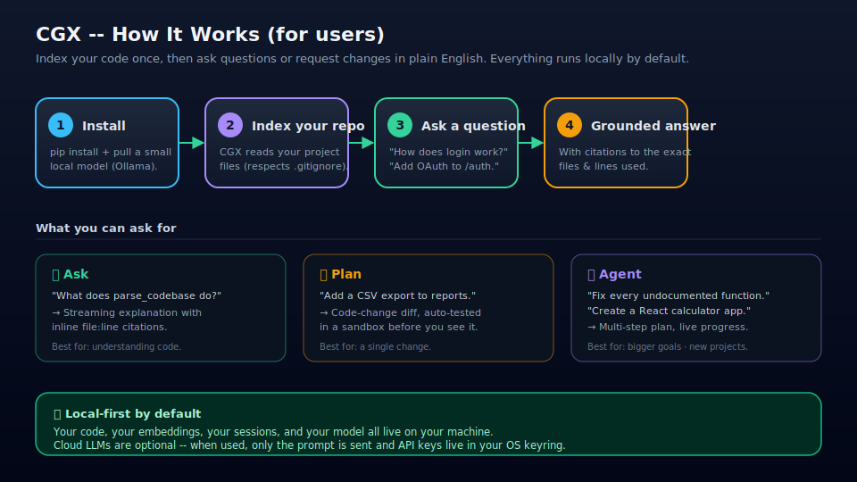
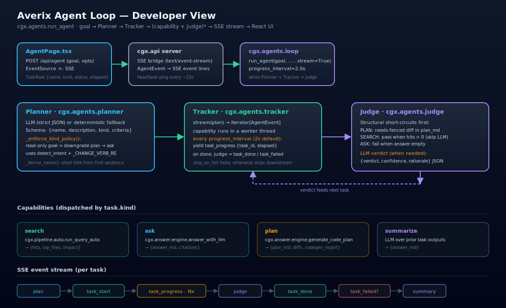
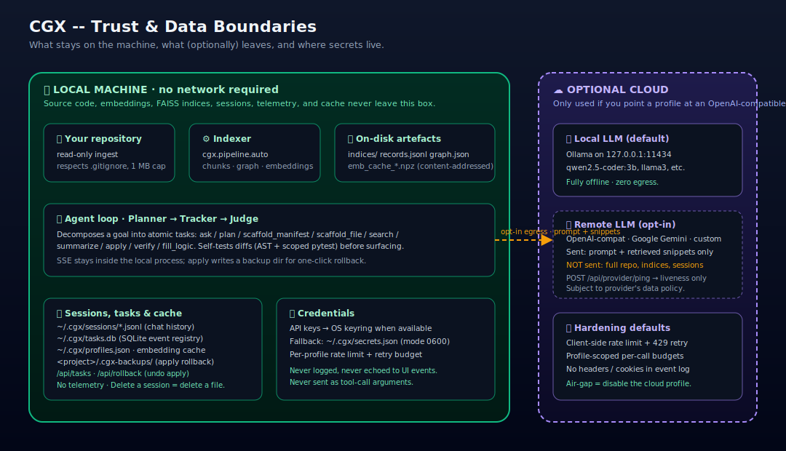

# CGX — Flowcharts

Three audience-specific views of the same system. Each SVG is hand-authored,
scales cleanly, and renders inline on GitHub.

---

## For users

Install once, point CGX at a repo, then ask questions or request changes in
plain English. The **Ask** tab returns a streaming, cited explanation; the
**Plan** tab returns a self-tested code-change diff; the **Agent** tab handles
larger goals — including generating brand-new projects from scratch — by
decomposing them into 1–6 atomic tasks with live progress. Everything runs
locally by default — cloud LLMs are strictly opt-in.

---

## For developers

`cgx.agents.run_agent` wires the **Planner → Tracker → Judge** loop. The
Planner asks the LLM for a strict-JSON
`[{name, description, kind, criteria}]` plan (ten kinds:
`ask`, `plan`, `scaffold`, `scaffold_manifest`, `scaffold_file`,
`search`, `summarize`, `apply`, `verify`, `fill_logic`) and applies
`_enforce_kind_policy()` to route the goal down one of four branches:
**SCAFFOLD** (new-project goals — detected via `_SCAFFOLD_RE`, a verb
paired with `_TECH_RE`, a verb paired with a supported skill from
`skills.detect_skills`, or LLM-emitted `scaffold` tasks with no
existing-codebase hint) — emits `[scaffold_manifest, apply, verify]`
where the manifest's runtime output injects one `scaffold_file` task
per planned file before `apply` runs, **VERIFY-ONLY**, **READ-ONLY**
(any `plan` task downgraded to `ask`), or **CHANGE-GOAL** (`apply` +
`verify` appended after `plan`). The Planner also attaches
`task.inputs["skills"]` to every SCAFFOLD/PLAN task so downstream
capabilities receive deterministic technology context.

The Tracker dispatches each task's `kind` to a capability on a worker
thread and yields `task_progress {task_id, elapsed}` events every
`progress_interval` (2.0 s default). The `plan` capability injects a
compressed **symbol-table** map (`cgx.codegen.symbol_map`) into the LLM
prompt so local models stop re-implementing helpers that already exist;
the `verify` capability runs `cgx.codegen.env_manager.preflight_install`
to auto-`pip install` any missing imports and append them to
`requirements.txt`; the `apply` capability performs a **partial apply**
that writes passing files and records failing files in `failed_files`,
plus a **cross-file coherence** check that catches a Python test
importing a `.jsx` module before anything hits disk. After every apply
the Tracker updates `plan.owned_files[path] = "applied" | "failed"` so
the retry loop knows what is already correct on disk.

The Judge runs cheap structural short-circuits per kind. For SCAFFOLD
and PLAN it consults the active **skills/** validators (`react`,
`nextjs`, `vue`, `tailwind`, `fastapi`, `flask`, `django`, `express`,
`python_cli`, `sqlite`); a failing `SkillVerdict` short-circuits to a
Judge fail with the skill name prefixed (`[react] …`). A scaffold that
passes structural + skill checks short-circuits to `pass` without
invoking the LLM judge — small local models hallucinate criteria fails
too often on demonstrably-correct scaffolds. When the LLM judge is
invoked, the SCAFFOLD branch of `_render_artifact` exposes `plan_md`,
the generated file list, and source-prioritised per-file previews
(capped at 7.5 KB total) so the verdict is grounded in the real code.

On verify failure `_stream_with_retry` calls `_diagnose_failure` to
classify the error (`import_error`, `syntax_error`, `logic_error`),
extracts a ±5-line snippet around the traceback line with
`# <-- ERROR HERE` (the **10-line buffer rule**), and emits a targeted
re-plan goal that names exactly the broken files and tells the LLM not
to touch the files already in `plan.owned_files`. Apply failures and
Judge rejections trigger the same recursive retry (up to `max_retries`).
The loop emits a final `summary` event and all events
(`plan`, `task_start`, `task_progress`, `task_done`, `task_skipped`,
`task_failed`, `judge`, `summary`) stream as SSE to `AgentPage.tsx`,
persisted into the SQLite task registry (`~/.cgx/tasks.db`) for replay
on tab switch. Every routing branch, skill attachment, and judge
verdict is written to stdout as `[INFO]` log lines.

---

## For companies

Source code, embeddings, FAISS indices, chat sessions, the SQLite task
registry (`~/.cgx/tasks.db`), and the embedding cache all live on the
local machine under `~/.cgx/` and `indices/`. The agent loop runs
in-process and streams SSE over localhost; the task registry persists
every event so the UI can replay a tab on remount and `DELETE
/api/tasks/{id}` can cancel a running stream — there is no analytics
or telemetry channel. Credentials live in the OS keyring when
available (`0600`-permissioned file fallback) and are never echoed to
event payloads or tool-call arguments. The only opt-in egress is when
a profile points at a remote provider — **OpenAI-compatible**, **Google
Gemini**, or a **custom** OpenAI-shape endpoint (with optional
`allow_no_auth` for private subnets) — in which case the prompt plus
the retrieved snippets are sent; the repository, indices, sessions,
and task registry are not. `POST /api/provider/ping` performs a
liveness check (e.g. Gemini `generateContent` with `maxOutputTokens:
1`, Ollama `GET /api/tags`) and returns only `{ok, latency_ms,
error}`. Air-gapped operation is the default once an Ollama model is
pulled.
