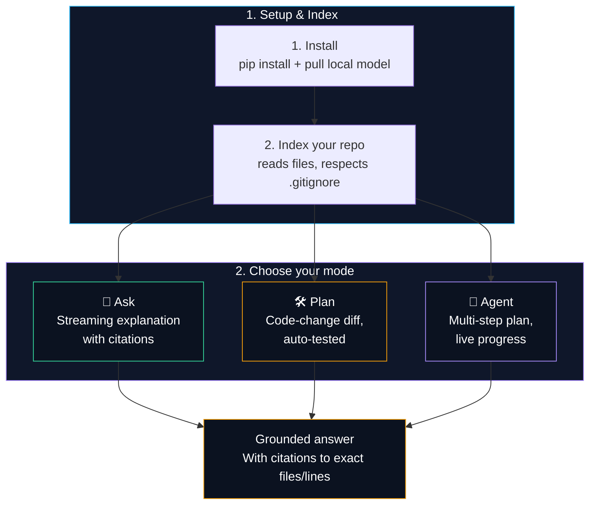
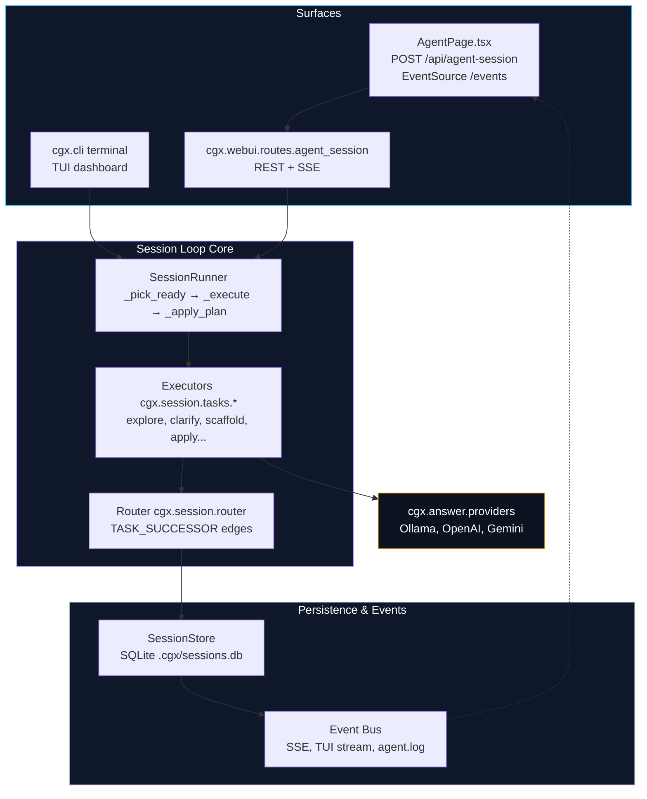
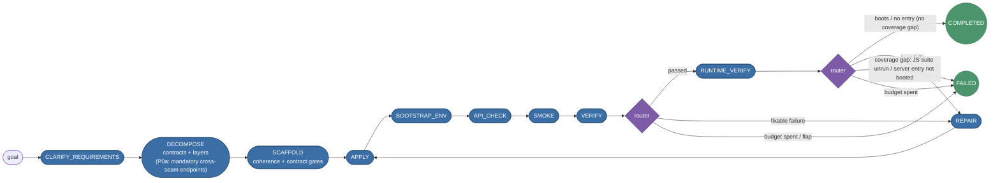
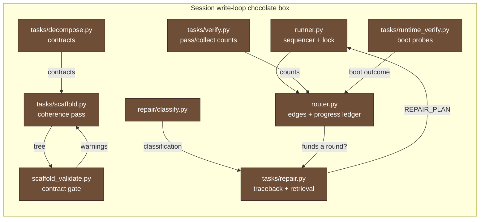
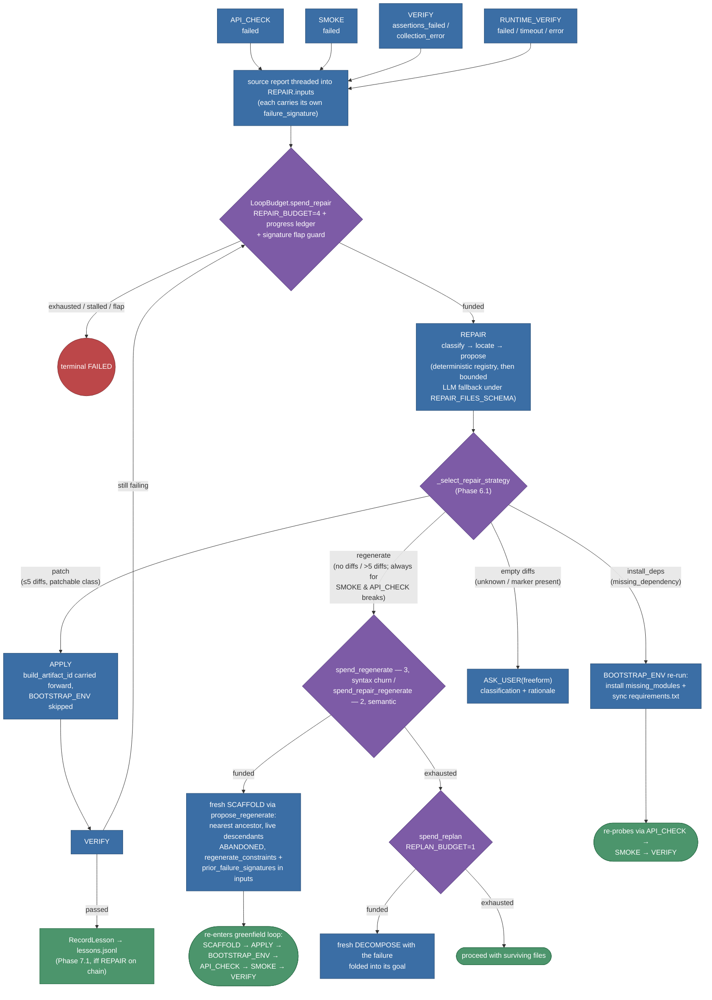
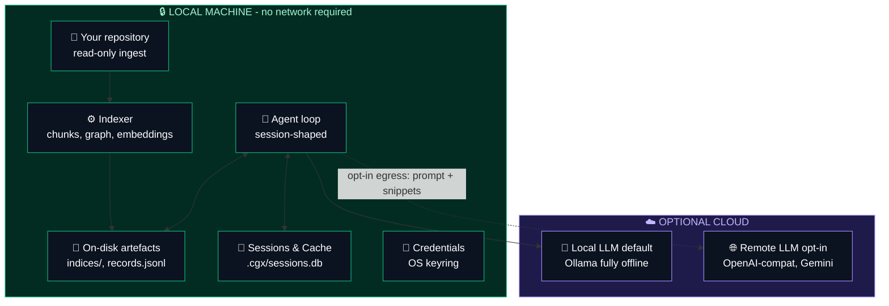

# CGX -- Flowcharts

Three audience-specific views of the same system, plus a deep dive on the
agent's write loop. Every diagram is authored in **Mermaid**, so it renders
inline on GitHub and stays editable in a pull request.

**Pick your view:** [For users](#for-users) ·
[For developers](#for-developers) ·
[Session-shaped write loop](#session-shaped-write-loop-agent) ·
[For companies](#for-companies)

---

<details>
<summary>

## For users
</summary>


```mermaid
flowchart TD
    subgraph Setup[1. Setup & Index]
        direction LR
        I[1. Install<br/>pip install + pull local model] --> N[2. Index your repo<br/>reads files, respects .gitignore]
    end

    subgraph Usage[2. Choose your mode]
        direction TB
        A[💬 Ask<br/>Streaming explanation<br/>with citations]
        P[🛠️ Plan<br/>Code-change diff,<br/>auto-tested]
        AG[🤖 Agent<br/>Multi-step plan,<br/>live progress]
    end

    N --> A
    N --> P
    N --> AG

    A --> G[Grounded answer<br/>With citations to exact files/lines]
    P --> G
    AG --> G

    style Setup fill:#0f172a,stroke:#38bdf8,color:#fff
    style Usage fill:#0f172a,stroke:#a78bfa,color:#fff
    style G fill:#0b1220,stroke:#f59e0b,color:#fff
    style A fill:#0b1220,stroke:#34d399,color:#fff
    style P fill:#0b1220,stroke:#f59e0b,color:#fff
    style AG fill:#0b1220,stroke:#a78bfa,color:#fff
```

Install once, point CGX at a repo, then ask questions or request changes in
plain English. The **Ask** tab returns a streaming, cited explanation; the
**Plan** tab returns a self-tested code-change diff; the **Agent** tab
(`/agent`) now drives a **persistent, session-shaped** loop with two
modes: **explore** surveys an existing codebase, surfaces typed
options, asks the user to pick a direction at every branch, and only
commits a change after an explicit approval checkpoint; **greenfield**
scaffolds a brand-new project from scratch -- the agent asks
clarification questions, proposes a layered file manifest, generates
each file with cross-file context, and only writes to disk after the
user approves the plan. The
[session-shaped write loop](#session-shaped-write-loop-agent) below
walks through both modes. Everything runs locally by default -- cloud
LLMs are strictly opt-in.

---

</details>
<details>
<summary>

## For developers
</summary>


```mermaid
flowchart TD
    subgraph Surfaces
        UI[AgentPage.tsx<br/>POST /api/agent-session<br/>EventSource /events]
        Web[cgx.webui.routes.agent_session<br/>REST + SSE]
        CLI[cgx.cli terminal<br/>TUI dashboard]
    end

    subgraph Core[Session Loop Core]
        Runner[SessionRunner<br/>_pick_ready → _execute → _apply_plan]
        Execs[Executors cgx.session.tasks.*<br/>explore, clarify, scaffold, apply...]
        Router[Router cgx.session.router<br/>TASK_SUCCESSOR edges]
    end

    subgraph Data[Persistence & Events]
        Store[SessionStore<br/>SQLite .cgx/sessions.db]
        Events[Event Bus<br/>SSE, TUI stream, agent.log]
    end

    Providers[cgx.answer.providers<br/>Ollama, OpenAI, Gemini]

    UI --> Web
    CLI --> Runner
    Web --> Runner

    Runner --> Execs
    Execs --> Router
    Execs --> Providers

    Router --> Store
    Store --> Events
    Events -.-> UI

    style Surfaces fill:#0f172a,stroke:#38bdf8,color:#fff
    style Core fill:#0f172a,stroke:#a78bfa,color:#fff
    style Data fill:#0f172a,stroke:#94a3b8,color:#fff
    style Providers fill:#0b1220,stroke:#f59e0b,color:#fff
```

`cgx.session` is the loop behind the `/agent` UI, the TUI dashboard,
and the `cgx agent` CLI -- one loop, three surfaces, all sharing the
same SQLite store. The diagram above traces a single turn: a surface
posts an objective (or a decision, or a follow-up message), the Router
seeds or extends the task DAG, and the caller drains the loop by
calling `SessionRunner.run_next` until nothing is READY.

**SessionRunner** (`cgx.session.runner`) claims exactly one READY task
per `run_next` call under a per-session lock, checks the loop budgets
(escalating to a *budget ASK_USER* checkpoint instead of spinning), and
dispatches the task to its executor. There is no worker pool: the web
route's drain scheduler, the TUI, and the CLI each drive the loop at
their own pace, which is what makes a session resumable after a
restart.

**Executors** (`cgx.session.tasks.*`) are plain functions registered
per `TaskKind` via `@register_executor` -- fifteen of them, from
EXPLORE and INVESTIGATE through SCAFFOLD, APPLY, the verification
ladder (BOOTSTRAP_ENV → API_CHECK → SMOKE → VERIFY → RUNTIME_VERIFY),
and REPAIR. Each returns an `ExecutorResult` carrying typed facts and
artifacts plus a `retryable` flag. The apply executor performs a
**partial apply** (write passing files, record `failed_files`) and a
**cross-file coherence** check that catches a Python test importing a
`.jsx` module before anything hits disk; BOOTSTRAP_ENV runs
`cgx.codegen.env_manager.preflight_install` to auto-install missing
imports and append them to `requirements.txt`.

**Router** (`cgx.session.router`) owns every transition. Success routes
through the `TASK_SUCCESSOR` table -- fourteen deterministic edges, one
per kind (ASK_USER has none: it resolves through a decision instead).
Failure routes through `on_task_failed`: a `retryable`
failure (a DECOMPOSE dependency cycle, invalid LLM JSON, a syntax
error) folds the failure note into the goal and re-runs the same task
under a per-kind bound; a failure at a mid-run checkpoint re-plans from
the last decision; anything else ends the session as FAILED with a
lesson recorded. The Router never touches the store directly -- it
returns a `RouterPlan` of actions (`CreateTask`, `UpdateTaskStatus`,
`RecordDecision`, `RecordLesson`) that the runner applies atomically.

**SessionStore** (`cgx.session.store`) persists sessions, tasks, facts,
decisions and artifacts as JSON blobs in `<project>/.cgx/sessions.db`
and publishes a typed `Event` on the shared `EventBus`
(`cgx.session.events`) on every write. Those events fan out to the SSE
endpoint (`GET /api/agent-session/{sid}/events`) the React UI's
`RunTab.tsx` subscribes to and to the TUI stream; the runner
separately writes the project-local `agent.log` trace
(`<project_root>/.cgx/agent.log`, mirrored under
`~/.cgx/agent-sessions/<sid>/` when the project tree is gone) --
replayable from the store on remount.

The [session-shaped write loop](#session-shaped-write-loop-agent)
section below walks the two mode chains (explore and greenfield)
checkpoint by checkpoint.

<details>
<summary>

### Inside the retrieval & codegen layers
</summary>

The executors sit on a layered retrieval / codegen pipeline that is
documented in detail in [architecture.md](architecture.md) and
exercised by the test suite. The notes below map the pipeline stages
the executors call into to the modules that implement them.

Retrieval-backed executors (EXPLORE, INVESTIGATE) call
`cgx.pipeline.auto.run_query_auto`, which
fans out two ANN queries (intent view + impl view) against FAISS,
unions them with a BM25 lexical retriever, and fuses with Reciprocal
Rank Fusion. Identifier matching is **symmetric** -- both indexer
(`cgx.embeddings.helpers`) and query (`cgx.retrieval.orchestrator`)
sides go through `cgx.retrieval.tokenize.split_identifier`, so a
query for `parseConfig` and an index entry for `parse_config` agree.
The fused head is optionally re-scored by a cross-encoder; the
**reranker is automatically on for cloud profiles** (OpenAI-compat,
Gemini) and off for local / air-gapped profiles, governed by
`cgx.answer.profiles.resolve_enable_reranker`. Graph expansion
walks one or two hops from the top hits via
`cgx.graph.backend.CodeGraphBackend`, which is a thin facade over
the small set of `networkx` operations the orchestrator actually
needs (decoupling retrieval from the graph library so a future
backend swap is local).

The ASK executor and the Ask tab call
`cgx.answer.engine.answer_with_llm`; PLAN_CHANGE and the Plan tab call
`generate_code_plan`. Both detect whether the
retriever surfaced graph-expanded neighbors (any hit with
`provenance.graph_depth >= 1`) and, when present, build the prompt
SOURCES list with `cgx.answer.context_map.build_tiered_context`
instead of the legacy single-tier builder. Direct matches keep their
focus-windowed code body (the **primary tier**); graph-discovered
neighbors collapse to one-line stubs of the form
`[class.]name(signature) -- doc_first_sentence`, tagged
`tier=neighbor` in the prompt metadata (the **neighbor tier**). The
per-tier budget scales by the provider's model context window via
`cgx.answer.model_caps.get_context_map_budget`, so small local
models don't spend their whole window on structural references they
only need to *know* about.

The diff-application stage routes through
`cgx.codegen.ast_insert`, which can now prefer **line-anchored
splicing** when records carry the new `start_line` / `end_line` /
`col_offset` fields (schema v3) and falls back to its existing
AST-walk path for older indices. The companion anchor fields
`likely_caller_loc` and `similar_signature_neighbor_loc` are
emitted by `cgx.retrieval.orchestrator.suggest_insertion_points`
so an insertion target can be located without re-parsing the file.

The parser side is fronted by a small registry keyed on file
extension, all sharing the `BaseParser` ABC in `cgx.parser.base`.
`PythonASTParser` (stdlib `ast`) registers for `.py` and is always
available; `cgx.parser.js_ts_parser` registers tree-sitter parsers
for `.js`, `.jsx`, `.ts`, and `.tsx` when the optional `parsers`
extra is installed. The project walker in `parse_codebase`
dispatches on extension and gracefully skips files with no
registered parser, so a core install still indexes Python cleanly.
Re-indexing is incremental at the parse layer via
`cgx.parser.incremental`: a `parse_cache.json` manifest keyed on
each file's mtime/sha lets unchanged files reuse their cached
chunks. Adding a language later means writing a new `BaseParser`
subclass and registering its extensions -- no changes to the
orchestrator or codegen layers.

---

</details>

</details>
<details>
<summary>

## Session-shaped write loop (`/agent`)
</summary>

The default Agent UI is backed by `cgx.session`, a stateful
orchestrator that progresses one task at a time and pauses at every
branch for a typed human decision. Two loop shapes share the same
runner / store / decision plumbing -- the **mode** chosen at session
creation (auto-detected by `cgx.session.mode.detect_mode`, or
overridden via the launcher) determines which root task is seeded:

* **explore** mode -- the project root exists with a usable FAISS
  index. The session walks the retrieval-grounded flow that surveys
  candidates and modifies existing code.
* **greenfield** mode -- the project root is missing, empty, or has
  no index. The session walks a goal-driven scaffold flow that
  clarifies requirements, plans the file manifest, generates each
  file with cross-file context, and only then writes anything to
  disk.

Both loops converge on a shared write-loop tail. Explore mode goes
directly `APPLY → VERIFY`; greenfield mode inserts
`BOOTSTRAP_ENV → API_CHECK → SMOKE` between `APPLY` and `VERIFY` so
the project's runtime is provisioned, third-party imports are
statically resolved, and a runtime `python -c "import …"` smoke
batch catches third-party import breaks (e.g. a stale
`Flask 2.1.x` pulling Werkzeug 3.x that removes `url_quote`) before
pytest collection runs. A green greenfield `VERIFY` then hands off to
a `RUNTIME_VERIFY` gate that boots the scaffolded app before the
session is declared complete. Every `ASK_USER` in either path is a
structured checkpoint, not a freeform prompt.

<details>
<summary>

### The session write loop as two maps
</summary>

Before the exit-by-exit ASCII, two analogies for the same greenfield
pipeline. Contributors tend to hold one of these in their head.

**Interstate highway system (flow).** Tasks are highways, the router
is the interchange system, artifacts are the freight, and the progress
ledger is the roadside weigh-station that closes the `REPAIR` on-ramp
once the load stops getting lighter.


```mermaid
flowchart LR
    U([goal]) --> CQ(["CLARIFY_REQUIREMENTS"]) --> DEC(["DECOMPOSE<br/>contracts + layers<br/>(P0a: mandatory cross-seam endpoints)"])
    DEC --> SCA(["SCAFFOLD<br/>coherence + contract gates"]) --> APP(["APPLY"])
    APP --> BS(["BOOTSTRAP_ENV"]) --> AC(["API_CHECK"]) --> SM(["SMOKE"]) --> VER(["VERIFY"])
    VER --> IC{"router"}
    IC -- "passed" --> RUN(["RUNTIME_VERIFY"])
    IC -- "fixable failure" --> REP(["REPAIR"])
    RUN --> IC2{"router"}
    IC2 -- "boots / no entry (no coverage gap)" --> DONE((COMPLETED))
    IC2 -- "boot fails" --> REP
    IC2 -- "coverage gap: JS suite unrun / server entry not booted" --> FAIL((FAILED))
    REP --> APP
    IC -- "budget spent / flap" --> FAIL
    IC2 -- "budget spent" --> FAIL

    classDef road fill:#3b6ea5,stroke:#274c73,color:#fff;
    classDef gate fill:#7d5ba6,stroke:#4c3575,color:#fff;
    classDef term fill:#4c956c,stroke:#2c6e49,color:#fff;
    class CQ,DEC,SCA,APP,BS,AC,SM,VER,RUN,REP road;
    class IC,IC2 gate;
    class DONE,FAIL term;
```

**Chocolate box map (components).** Each module is a chocolate; a
connector is a flavour pairing (a typed value handed between modules).


```mermaid
flowchart TB
    subgraph BOX["Session write-loop chocolate box"]
      direction TB
      RUNR["runner.py<br/>sequencer + lock"]
      ROUT["router.py<br/>edges + progress ledger"]
      DEC["tasks/decompose.py<br/>contracts"]
      SCA["tasks/scaffold.py<br/>coherence pass"]
      SVAL["scaffold_validate.py<br/>contract gate"]
      RTV["tasks/runtime_verify.py<br/>boot probes"]
      VER["tasks/verify.py<br/>pass/collect counts"]
      REP["tasks/repair.py<br/>traceback + retrieval"]
      CLS["repair/classify.py"]
    end
    RUNR --> ROUT
    DEC -->|contracts| SCA
    SCA -->|tree| SVAL
    SVAL -->|warnings| SCA
    VER -->|counts| ROUT
    RTV -->|boot outcome| ROUT
    CLS -->|classification| REP
    ROUT -->|funds a round?| REP
    REP -->|REPAIR_PLAN| RUNR

    classDef choc fill:#6f4e37,stroke:#3e2723,color:#fff;
    class RUNR,ROUT,DEC,SCA,SVAL,RTV,VER,REP,CLS choc;
```

</details>
<details>
<summary>

### Explore loop
</summary>

```
                       user message
                            |
                            v
                     +-----------+      (no tasks yet -> spawn root)
                     |  EXPLORE  |  produces DIRECTIONS_LIST artifact
                     +-----------+         + one ANCHOR fact per option
                            |
                            v
                +-------------------------+
                | ASK_USER(choose_path)   |   <-- waits for user pick
                +-------------------------+
                            |
                            v
                    +---------------+
                    |  INVESTIGATE  |  anchored retrieval ->
                    +---------------+    FINDINGS_BUNDLE artifact
                            |
                            v
                    +---------------+
                    |   RECOMMEND   |  typed RECOMMENDATION_LIST
                    +---------------+    (kind per recommendation:
                            |              investigate_more |
                            v              plan_change      |
            +-----------------------------+ ask_followup    |
            | ASK_USER(choose_           | done)
            |   recommendation)           |
            +-----------------------------+
                |       |        |          |
   investigate_more  plan_change |  ask_followup / done
                |       |        |          |
                v       v        v          v
       (loop back)  +-----------+  ASK_USER(   (no successor;
                    |PLAN_CHANGE|  freeform)    a new user message
                    +-----------+               spawns a sibling
                          |                     EXPLORE)
                          v
                +--------------------+
                | ASK_USER(approve)  |
                +--------------------+
                  approved=true | approved=false
                          v        |
                      +-------+    (no successor)
                      | APPLY |  writes diffs to disk +
                      +-------+   per-run .cgx-backups mirror
                          |
                          v
                      +--------+
                      | VERIFY |  pytest on impacted tests; classifies
                      +--------+    rc into outcome (passed |
                                    assertions_failed |
                                    collection_error | ...)
                                    -> VERIFY_REPORT artifact
```

</details>
<details>
<summary>

### Greenfield loop
</summary>

```
                       user message
                            |
                            v
              +------------------------------+
              |   CLARIFY_REQUIREMENTS       |  3-6 questions emitted
              +------------------------------+    (LLM, with deterministic
                            |                     fallback bank)
                            v                  -> REQUIREMENTS_SHEET
              +------------------------------+
              | ASK_USER(clarify_answers)    |  <-- one textarea/question;
              +------------------------------+      answers folded into goal
                            |
                            v
                  +-------------------+
                  |    DECOMPOSE      |  plan_scaffold_manifest ->
                  +-------------------+   WORK_PLAN artifact
                            |              (plan_md + layered file list
                            |               + contracts; P0a fails closed
                            |               if a client/server seam has
                            |               no endpoints contract)
                            v
              +------------------------------+
              |  ASK_USER(approve_plan)      |  <-- [Approve & Scaffold |
              +------------------------------+      Reject]
                approved=true | approved=false
                            v        |
                  +-------------------+   (no successor; loop halts,
                  |    SCAFFOLD       |    no files written)
                  +-------------------+
                            |   per-file generate_single_scaffold_file,
                            |   accumulates sibling context;
                            |   failures captured in `failed[]`;
                            |   on repeated failure -> AST_REGENERATE
                            |   (symbol-by-symbol fallback)
                            v -> SCAFFOLD_PATCHES artifact
                       +-------+
                       | APPLY |  same writer as explore; inputs carry
                       +-------+  mode=greenfield
                            |
                            v
                  +-----------------+
                  | BOOTSTRAP_ENV   |  create/refresh .venv, install
                  +-----------------+  requirements.txt, preflight
                            |          undeclared imports;
                            |          `pip freeze --all` parsed into
                            |          `installed_packages` (Phase 1.1);
                            |          polyglot: also `npm install` ->
                            |          `node` sub-report (Part 5)
                            v          -> BUILD_REPORT artifact
                  +-----------------+   (outcome=succeeded|failed|
                  |   API_CHECK     |     no_venv|skipped|partial)
                  +-----------------+
                            |          static walk over applied files;
                            |          resolves `from <pkg> import <x>`
                            |          via importlib + getmembers in the
                            |          bootstrapped venv
                            |          -> API_CHECK_REPORT artifact
                            |          (Phase 2.2; outcome=passed|
                            |           failed|skipped; on `failed`
                            |           routes to REPAIR with this
                            |           report as the source artifact)
                            v
                  +-----------------+
                  |     SMOKE       |  runs `python -c "import <pkg>"`
                  +-----------------+  per top-level applied module
                            |          inside the bootstrapped venv
                            |          (30s batch budget, captures
                            |          stderr_tail per import)
                            |          -> SMOKE_REPORT artifact
                            |          (Phase 2.1; outcome=passed|
                            |           failed|skipped; on `failed`
                            |           routes to REPAIR)
                            v
                       +--------+
                       | VERIFY |  pytest inside the project venv
                       +--------+   (uses BUILD_REPORT.python_exe);
                            |        runs with `--junitxml` and parses
                            |        structured failures (Phase 3.1);
                            |        persists a single-shot
                            |        `reproduce_cmd` (Phase 1.2);
                            |        classifies rc into outcome; also
                            |        emits passing_count/collected_count
                            |        for the coverage-aware budget (#5);
                            |        in greenfield with no tests yet
                            |        -> ran=False + skipped_reason
                            v  passed (greenfield only)
                  +----------------+
                  | RUNTIME_VERIFY |  boots each detected entry module
                  +----------------+  (app.py/main.py/Flask()/FastAPI()/
                                       create_app) under the venv -> a
                                       RUNTIME_REPORT (P1; outcome=passed|
                                       failed|timeout|error|skipped).
                                       passed/skipped -> COMPLETED, unless
                                       the fail-closed policy finds a
                                       coverage gap (unrun scaffolded JS
                                       suite, or skipped boot with a
                                       server entry on disk) -> FAILED;
                                       a hard boot failure -> REPAIR (#3)
```

</details>
<details>
<summary>

### Autonomous repair loop (greenfield only)
</summary>

The router fires a deterministic repair cycle from four upstream
sources: an `API_CHECK` that ends `failed` (**Phase 2.2**), a
`SMOKE` that ends `failed` (**Phase 2.1**), a `VERIFY` that ends
`assertions_failed` / `collection_error`, or a `RUNTIME_VERIFY` whose
app boot ends `failed` / `timeout` / `error` (**P1 / #3**). Every
counter below is read and spent through the typed
`cgx.session.budget.LoopBudget`: the cycle is bounded by a
**progress-aware budget** (`_repair_progress_stalled`: keep going
while the failing-test count strictly drops round over round, backed
by a passing-count trend, #5) under an absolute `REPAIR_BUDGET=4`
ceiling AND a `failure_signature`-hash flap detector, plus a
double-capped regenerate branch (**Phase 6.1**): `REGENERATE_BUDGET=3`
for syntax churn per manifest and `REPAIR_REGENERATE_BUDGET=2` for
semantic rewrites of an already-applied tree per ancestor chain.

The deterministic classifier registry (`cgx.session.repair.classify`,
**Phase 3.2**) ships `unittest_pytest_mix`, `missing_module_pythonpath`,
`missing_fixture`, `hallucinated_api`, `third_party_import_break`
(`propose_third_party_pin` reads `BUILD_REPORT.installed_packages`,
queries `pypi.org/pypi/<pkg>/<ver>/json` via `pypi_client` with an
on-disk cache under `~/.cgx/pypi-cache/`, and emits a
`requirements.txt` diff against the peer-dependency table),
`first_party_symbol_mismatch` (**Part 3**: a `cannot import name
'<x>' from '<Y>'` where the REPAIR executor finds `Y` resolves to a
first-party module on disk via `locate._dotted_path_resolves` -- it
imported cleanly but never bound `<x>`, so no pin can help; the
executor re-classifies away from `third_party_import_break`, names the
`symbol`/`module` pairs via `import_name_breaks`, and routes to
`strategy=regenerate` forbidding a dependency pin),
`missing_dependency` (a `requires the <pkg> package to be installed`
guard or a `ModuleNotFoundError` no project file claims →
`strategy=install_deps`, a BOOTSTRAP_ENV re-run instead of a source
rewrite), `circular_import` / `relative_import_error`
(regenerate-only: the offending modules are re-authored with the
cycle folded into the constraint), and `empty_test_suite` (pytest
exit 5 with test files selected → re-scaffold). A genuine
`assertions_failed` that no mechanical classifier locates falls back to
`assertion_drift` (**Part A**: the suite imported and ran and a plain
`assert` / status-code / message-string comparison tripped), while an
*unrecognized* `collection_error` (pytest could not import the suite at
all) escalates instead. When no classifier matches, the bounded LLM
repair is **traceback-localized**
(crash-frame files first), **retrieval-fed** (remaining candidate
slots filled from the project index; a no-op in greenfield), and
**schema-constrained** (**Phase 3.1**: `REPAIR_FILES_SCHEMA` rides as
`json_schema` on the call, with one `validate_json_schema` re-ask). On
`assertion_drift`, when that bounded patch is a no-op (no provider or the
repair budget is spent) the executor falls back to a *targeted* regenerate
of only the implementation file(s) the traceback named
(`_assertion_impl_targets`, carried as `target_files` with test modules
excluded) so the handler is aligned to the test's asserted contract -- not
a whole-tree regenerate that re-rolls both sides of the seam and reproduces
the divergence (ses_a60d67a2f0164dcb):


```mermaid
flowchart TB
    AC["API_CHECK<br/>failed"] --> SRC
    SM["SMOKE<br/>failed"] --> SRC
    VF["VERIFY<br/>assertions_failed /<br/>collection_error"] --> SRC
    RV["RUNTIME_VERIFY<br/>failed / timeout / error"] --> SRC
    SRC["source report threaded into REPAIR.inputs<br/>(each carries its own failure_signature)"] --> GUARD

    GUARD{"LoopBudget.spend_repair<br/>REPAIR_BUDGET=4 + progress ledger<br/>+ signature flap guard"}
    GUARD -- "exhausted / stalled / flap" --> FAIL((terminal FAILED))
    GUARD -- funded --> REP["REPAIR<br/>classify → locate → propose<br/>(deterministic registry, then bounded<br/>LLM fallback under REPAIR_FILES_SCHEMA)"]

    REP --> STRAT{"_select_repair_strategy<br/>(Phase 6.1)"}

    STRAT -- "patch<br/>(≤5 diffs, patchable class)" --> APP["APPLY<br/>build_artifact_id carried forward,<br/>BOOTSTRAP_ENV skipped"]
    APP --> VER2["VERIFY"]
    VER2 -- passed --> LES["RecordLesson → lessons.jsonl<br/>(Phase 7.1, iff REPAIR on chain)"]
    VER2 -- "still failing" --> GUARD

    STRAT -- "regenerate<br/>(no diffs / >5 diffs; always for<br/>SMOKE & API_CHECK breaks)" --> RGUARD{"spend_regenerate — 3, syntax churn /<br/>spend_repair_regenerate — 2, semantic"}
    RGUARD -- funded --> SCA["fresh SCAFFOLD via propose_regenerate:<br/>nearest ancestor, live descendants<br/>ABANDONED, regenerate_constraints +<br/>prior_failure_signatures in inputs"]
    SCA --> LOOP(["re-enters greenfield loop:<br/>SCAFFOLD → APPLY → BOOTSTRAP_ENV →<br/>API_CHECK → SMOKE → VERIFY"])
    RGUARD -- exhausted --> RPL{"spend_replan<br/>REPLAN_BUDGET=1"}
    RPL -- funded --> DEC["fresh DECOMPOSE with the failure<br/>folded into its goal"]
    RPL -- exhausted --> SURV(["proceed with surviving files"])

    STRAT -- "install_deps<br/>(missing_dependency)" --> BOOT["BOOTSTRAP_ENV re-run:<br/>install missing_modules +<br/>sync requirements.txt"]
    BOOT --> LOOP2(["re-probes via API_CHECK →<br/>SMOKE → VERIFY"])

    STRAT -- "empty diffs<br/>(unknown / marker present)" --> ASK["ASK_USER(freeform)<br/>classification + rationale"]

    classDef road fill:#3b6ea5,stroke:#274c73,color:#fff;
    classDef gate fill:#7d5ba6,stroke:#4c3575,color:#fff;
    classDef term fill:#4c956c,stroke:#2c6e49,color:#fff;
    classDef bad fill:#bc4749,stroke:#7f2d2f,color:#fff;
    class AC,SM,VF,RV,SRC,REP,APP,VER2,SCA,DEC,ASK,BOOT road;
    class GUARD,STRAT,RGUARD,RPL gate;
    class LES,LOOP,LOOP2,SURV term;
    class FAIL bad;
```

Three pieces of code own every transition:

* **`cgx.session.router.Router`** is pure Python with no LLM calls
  and no I/O. Every transition is one of five entry points
  (`on_user_message`, `on_task_completed`, `on_task_failed`,
  `on_budget_exhausted`, `on_decision_recorded`) that returns a
  `RouterPlan` of typed actions (`CreateTask`, `UpdateTaskStatus`,
  `UpdateSessionStatus`, `RecordDecision`, `AttachDecisionToTask`,
  `RecordLesson` -- vocabulary in `cgx.session.actions`). Completion
  first runs the explicit `_COMPLETION_GUARDS` chain (guard bodies in
  `cgx.session.greenfield_edges`); a guard that declines falls
  through to the `TASK_SUCCESSOR` dispatch table. The successor for
  an `ASK_USER` is driven by the shape of the resolving `Decision`,
  and every bounded retry counter is spent through the typed
  `cgx.session.budget.LoopBudget`.
* **`cgx.session.runner.SessionRunner`** is the orchestrator the
  HTTP routes call. It sequences router plans through the store,
  acquires a per-session lock so concurrent requests can't interleave
  half-applied plans, dispatches each `READY` task to its registered
  executor, and centralises failure handling (missing executor /
  uncaught exception → task transitions to `FAILED` with a helpful
  message; facts surfaced before the error are still persisted).
* **`cgx.session.tasks.*`** are the per-`TaskKind` executors. Pure
  functions `(TaskNode, ExecutorDeps) -> ExecutorResult`; the runner
  persists their `outputs`, `facts`, and `artifact` after the call so
  executors are unit-testable without a database.

The HTTP surface (`/api/agent-session`) has eight endpoints -- seven
JSON (create / list / get / message / decision / cancel / delete) plus
a `GET /{sid}/events` **SSE** stream. Mutating endpoints return the
full `AgentSessionState` snapshot, so the React UI re-renders the whole
tree in one round-trip; `DELETE` returns `{deleted: sid}` and the UI
refreshes the session list. While a task is `IN_PROGRESS` (other than
an `ASK_USER`) the UI follows progress over the SSE feed and falls back
to polling `GET /api/agent-session/{sid}` only when the stream is
unhealthy. Sessions persist to `<project_root>/.cgx/sessions.db` (one
SQLite file per project root, WAL mode, JSON-blob rows with indexed
columns).

The decision contract is pinned by `build_decision` in
`cgx.session.tasks.ask`: `choose_path` requires `anchor_chunk_id`,
`choose_recommendation` requires `kind ∈ {investigate_more,
plan_change, ask_followup, done}` (and `anchor_chunk_id` when
`kind=investigate_more`), `approve` requires `approved: bool`,
`clarify_answers` requires a non-empty `answers` dict keyed by
question id, `approve_plan` requires `approved: bool`, `freeform`
requires only `text`. A mismatch returns HTTP `400` without spawning
a successor task, so the frontend can surface the exact failure and
let the user resubmit.

Where to look in the repo:

| Concern                  | Module |
|--------------------------|--------|
| State / data model       | `src/cgx/session/models.py` |
| Mode auto-detection      | `src/cgx/session/mode.py :: detect_mode` |
| Transitions              | `src/cgx/session/router.py` |
| Orchestrator             | `src/cgx/session/runner.py` |
| Persistence              | `src/cgx/session/store.py` |
| Project-local agent log  | `src/cgx/session/agent_log.py` (Phase 1.3) |
| Cross-session lessons    | `src/cgx/session/lessons.py` (Phase 7.1) |
| LLM tracing              | `src/cgx/session/llm_trace.py` (Phase 5.1) |
| SCAFFOLD pin validator   | `src/cgx/session/scaffold_validate.py` (Phase 4.1) |
| Repair classify / locate / propose | `src/cgx/session/repair/{classify,locate,propose}.py` |
| PyPI metadata client     | `src/cgx/session/repair/pypi_client.py` (Phase 3.2) |
| Explore executors        | `src/cgx/session/tasks/{explore,investigate,recommend,plan_change}.py` |
| Greenfield executors     | `src/cgx/session/tasks/{clarify_requirements,decompose,scaffold,bootstrap_env,api_check,smoke,runtime_verify,repair}.py` |
| Contract + coherence gates | `src/cgx/session/scaffold_validate.py :: {check_contract_compliance, cross_check_first_party_imports, check_client_server_payload_coherence}` |
| Frontend coherence passes | `src/cgx/session/tasks/scaffold.py :: {_synthesize_missing_frontend_stylesheets, _js_import_coherence_failures}` |
| Targeted build-smoke repair | `src/cgx/session/repair/classify.py :: unresolved_import_sources` + `src/cgx/session/tasks/repair.py :: _build_smoke_target_files` |
| Terminal fail-closed policy | `src/cgx/session/router.py :: {_coverage_gap, _verify_terminal_session_actions, _runtime_verify_terminal_session_actions}` |
| Shared write executors   | `src/cgx/session/tasks/{apply,verify,ask}.py` |
| Decision validation      | `src/cgx/session/tasks/ask.py :: build_decision` |
| HTTP routes              | `src/cgx/webui/routes/agent_session.py` |
| Wire models              | `src/cgx/webui/models.py :: AgentSession*` |
| Frontend page            | `frontend/src/pages/AgentPage.tsx` + `frontend/src/components/agent/` |
| Integration tests        | `tests/test_webui_agent_session.py`, `tests/test_session.py` |

---

</details>

</details>
<details>
<summary>

## For companies
</summary>


```mermaid
flowchart TB
    subgraph LocalMachine[🔒 LOCAL MACHINE - no network required]
        Repo[📁 Your repository<br/>read-only ingest]
        Indexer[⚙️ Indexer<br/>chunks, graph, embeddings]
        Artifacts[💾 On-disk artefacts<br/>indices/, records.jsonl]
        Agent[🤖 Agent loop<br/>session-shaped]
        State[💬 Sessions & Cache<br/>.cgx/sessions.db]
        Creds[🔑 Credentials<br/>OS keyring]

        Repo --> Indexer
        Indexer --> Artifacts
        Agent <--> Artifacts
        Agent <--> State
    end

    subgraph Cloud[☁️ OPTIONAL CLOUD]
        LocalLLM[🧠 Local LLM default<br/>Ollama fully offline]
        RemoteLLM[🌐 Remote LLM opt-in<br/>OpenAI-compat, Gemini]
    end

    Agent --> LocalLLM
    Agent -.->|opt-in egress: prompt + snippets| RemoteLLM

    style LocalMachine fill:#022c22,stroke:#10b981,color:#a7f3d0
    style Cloud fill:#1e1b4b,stroke:#a78bfa,color:#c4b5fd
    style Repo fill:#0b1220,stroke:#10b981,color:#fff
    style Indexer fill:#0b1220,stroke:#10b981,color:#fff
    style Artifacts fill:#0b1220,stroke:#10b981,color:#fff
    style Agent fill:#0b1220,stroke:#10b981,color:#fff
    style State fill:#0b1220,stroke:#10b981,color:#fff
    style Creds fill:#0b1220,stroke:#10b981,color:#fff
    style LocalLLM fill:#0b1220,stroke:#a78bfa,color:#fff
    style RemoteLLM fill:#0b1220,stroke:#a78bfa,color:#fff
```

Source code, embeddings, FAISS indices, chat sessions, the SQLite
task registry (`~/.cgx/tasks.db`), the session-based agent's
persistent state (`<project_root>/.cgx/sessions.db`, or
`~/.cgx/sessions.db` when no project root is configured), the
project-local agent log (`<project_root>/.cgx/agent.log`, Phase 1.3),
the cross-session lesson store (`~/.cgx/lessons.jsonl`, Phase 7.1),
the PyPI metadata cache (`~/.cgx/pypi-cache/`, Phase 3.2), and the
embedding cache all live on the local machine under `~/.cgx/` and
`indices/`. The Ask and Plan tabs stream SSE over localhost and
persist every event into the task registry so the UI can replay a
tab on remount and `DELETE /api/tasks/{id}` can cancel a running
stream; the session-based agent at `/api/agent-session/*` streams
its own SSE feed from the store's event bus and writes every task,
fact, artifact, and decision into `sessions.db` so a session can be
resumed days later without an intervening process surviving.
Neither surface has an analytics or
telemetry channel. Credentials live in the OS keyring when
available (`0600`-permissioned file fallback) and are never echoed to
event payloads or tool-call arguments. The only opt-in egress is when
a profile points at a remote provider -- **OpenAI-compatible**, **Google
Gemini**, or a **custom** OpenAI-shape endpoint (with optional
`allow_no_auth` for private subnets) -- in which case the prompt plus
the retrieved snippets are sent; the repository, indices, sessions,
and task registry are not. `POST /api/provider/ping` performs a
liveness check (e.g. Gemini `generateContent` with `maxOutputTokens:
1`, Ollama `GET /api/tags`) and returns only `{ok, latency_ms,
error}`. Air-gapped operation is the default once an Ollama model is
pulled.

</details>
