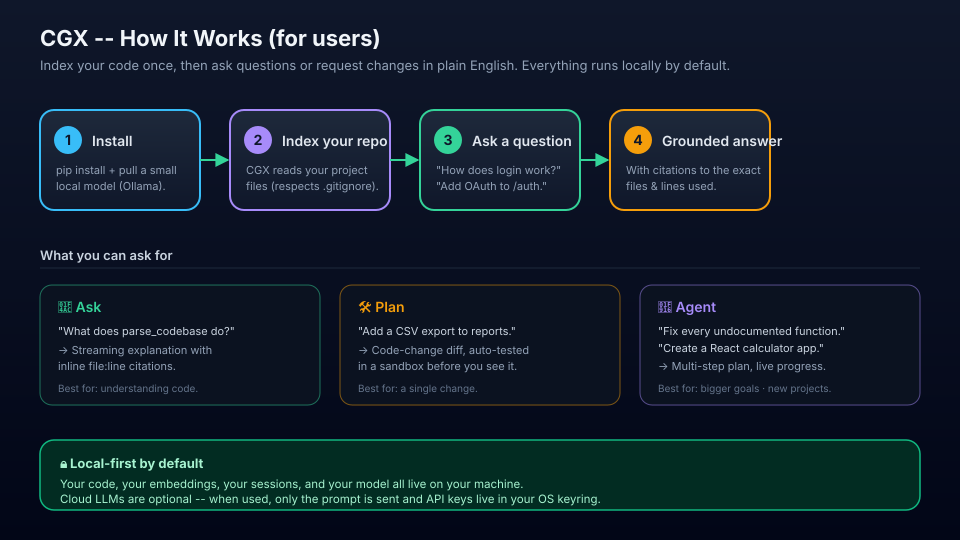
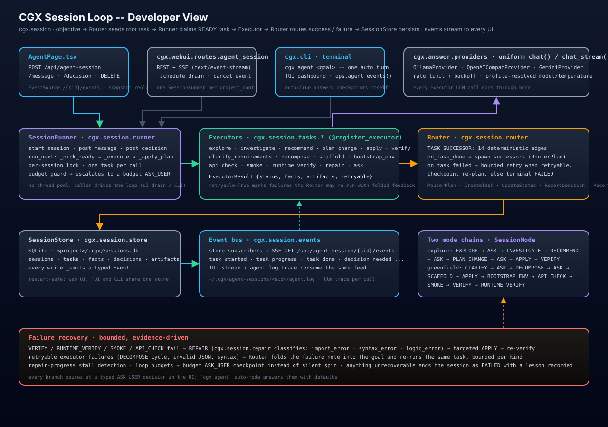
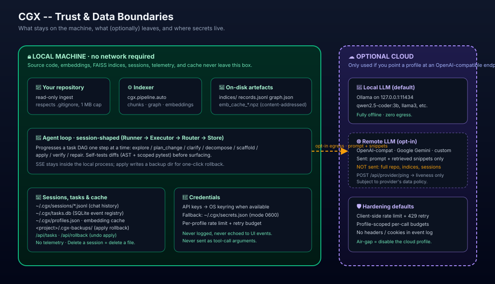

# CGX -- Flowcharts

Three audience-specific views of the same system. Each SVG is hand-authored,
scales cleanly, and renders inline on GitHub.

---

## For users



Install once, point CGX at a repo, then ask questions or request changes in
plain English. The **Ask** tab returns a streaming, cited explanation; the
**Plan** tab returns a self-tested code-change diff; the **Agent** tab
(`/agent`) now drives a **persistent, session-shaped** loop with two
modes: **explore** surveys an existing codebase, surfaces typed
options, asks the user to pick a direction at every branch, and only
commits a change after an explicit approval checkpoint; **greenfield**
scaffolds a brand-new project from scratch -- the agent asks
clarification questions, proposes a layered file manifest, generates
each file with cross-file context, and only writes to disk after the
user approves the plan. The
[session-shaped write loop](#session-shaped-write-loop-agent) below
walks through both modes. The original one-shot Planner → Tracker →
Judge view (still useful for fire-and-forget goals) is preserved at
`/agent-legacy`. Everything runs locally by default -- cloud LLMs are
strictly opt-in.

---

## For developers



> The developer SVG above describes the **legacy batch agent** that
> still backs `/agent-legacy` and the `cgx agent` CLI. The default
> `/agent` route in the UI is now driven by the
> [session-shaped write loop](#session-shaped-write-loop-agent)
> described below; the two loops coexist and share the underlying
> retrieval / codegen / provider stacks.

`cgx.agents.run_agent` wires the **Planner → Tracker → Judge** loop. The
Planner asks the LLM for a strict-JSON
`[{name, description, kind, criteria}]` plan (ten kinds:
`ask`, `plan`, `scaffold`, `scaffold_manifest`, `scaffold_file`,
`search`, `summarize`, `apply`, `verify`, `fill_logic`) and applies
`_enforce_kind_policy()` to route the goal down one of four branches:
**SCAFFOLD** (new-project goals -- detected via `_SCAFFOLD_RE`, a verb
paired with `_TECH_RE`, a verb paired with a supported skill from
`skills.detect_skills`, or LLM-emitted `scaffold` tasks with no
existing-codebase hint) -- emits `[scaffold_manifest, apply, verify]`
where the manifest's runtime output injects one `scaffold_file` task
per planned file before `apply` runs, **VERIFY-ONLY**, **READ-ONLY**
(any `plan` task downgraded to `ask`), or **CHANGE-GOAL** (`apply` +
`verify` appended after `plan`). The Planner also attaches
`task.inputs["skills"]` to every SCAFFOLD/PLAN task so downstream
capabilities receive deterministic technology context.

The Tracker dispatches each task's `kind` to a capability on a worker
thread and yields `task_progress {task_id, elapsed}` events every
`progress_interval` (2.0 s default). The `plan` capability injects a
compressed **symbol-table** map (`cgx.codegen.symbol_map`) into the LLM
prompt so local models stop re-implementing helpers that already exist;
the `verify` capability runs `cgx.codegen.env_manager.preflight_install`
to auto-`pip install` any missing imports and append them to
`requirements.txt`; the `apply` capability performs a **partial apply**
that writes passing files and records failing files in `failed_files`,
plus a **cross-file coherence** check that catches a Python test
importing a `.jsx` module before anything hits disk. After every apply
the Tracker updates `plan.owned_files[path] = "applied" | "failed"` so
the retry loop knows what is already correct on disk.

The Judge runs cheap structural short-circuits per kind. For SCAFFOLD
and PLAN it consults the active **skills/** validators (`react`,
`nextjs`, `vue`, `tailwind`, `fastapi`, `flask`, `django`, `express`,
`python_cli`, `sqlite`); a failing `SkillVerdict` short-circuits to a
Judge fail with the skill name prefixed (`[react] …`). A scaffold that
passes structural + skill checks short-circuits to `pass` without
invoking the LLM judge -- small local models hallucinate criteria fails
too often on demonstrably-correct scaffolds. When the LLM judge is
invoked, the SCAFFOLD branch of `_render_artifact` exposes `plan_md`,
the generated file list, and source-prioritised per-file previews
(capped at 7.5 KB total) so the verdict is grounded in the real code.

On verify failure `_stream_with_retry` calls `_diagnose_failure` to
classify the error (`import_error`, `syntax_error`, `logic_error`),
extracts a ±5-line snippet around the traceback line with
`# <-- ERROR HERE` (the **10-line buffer rule**), and emits a targeted
re-plan goal that names exactly the broken files and tells the LLM not
to touch the files already in `plan.owned_files`. Apply failures and
Judge rejections trigger the same recursive retry (up to `max_retries`).
The loop emits a final `summary` event and all events
(`plan`, `task_start`, `task_progress`, `task_done`, `task_skipped`,
`task_failed`, `judge`, `summary`) stream as SSE to `AgentPage.tsx`,
persisted into the SQLite task registry (`~/.cgx/tasks.db`) for replay
on tab switch. Every routing branch, skill attachment, and judge
verdict is written to stdout as `[INFO]` log lines.

### Inside the retrieval & codegen capabilities

The boxes labelled **search / ask / plan** in the developer diagram
hide a layered pipeline that is documented in detail in
[architecture.md](architecture.md) and exercised by the test suite.
The notes below are a quick map from the diagram to the modules.

The `search` box calls `cgx.pipeline.auto.run_query_auto`, which
fans out two ANN queries (intent view + impl view) against FAISS,
unions them with a BM25 lexical retriever, and fuses with Reciprocal
Rank Fusion. Identifier matching is **symmetric** -- both indexer
(`cgx.embeddings.helpers`) and query (`cgx.retrieval.orchestrator`)
sides go through `cgx.retrieval.tokenize.split_identifier`, so a
query for `parseConfig` and an index entry for `parse_config` agree.
The fused head is optionally re-scored by a cross-encoder; the
**reranker is automatically on for cloud profiles** (OpenAI-compat,
Gemini) and off for local / air-gapped profiles, governed by
`cgx.answer.profiles.resolve_enable_reranker`. Graph expansion
walks one or two hops from the top hits via
`cgx.graph.backend.CodeGraphBackend`, which is a thin facade over
the small set of `networkx` operations the orchestrator actually
needs (decoupling retrieval from the graph library so a future
backend swap is local).

The `ask` and `plan` boxes call `cgx.answer.engine.answer_with_llm`
and `generate_code_plan` respectively. Both detect whether the
retriever surfaced graph-expanded neighbors (any hit with
`provenance.graph_depth >= 1`) and, when present, build the prompt
SOURCES list with `cgx.answer.context_map.build_tiered_context`
instead of the legacy single-tier builder. Direct matches keep their
focus-windowed code body (the **primary tier**); graph-discovered
neighbors collapse to one-line stubs of the form
`[class.]name(signature) -- doc_first_sentence`, tagged
`tier=neighbor` in the prompt metadata (the **neighbor tier**). The
per-tier budget scales by the provider's model context window via
`cgx.answer.model_caps.get_context_map_budget`, so small local
models don't spend their whole window on structural references they
only need to *know* about.

The `plan` box's diff-application stage routes through
`cgx.codegen.ast_insert`, which can now prefer **line-anchored
splicing** when records carry the new `start_line` / `end_line` /
`col_offset` fields (schema v3) and falls back to its existing
AST-walk path for older indices. The companion anchor fields
`likely_caller_loc` and `similar_signature_neighbor_loc` are
emitted by `cgx.retrieval.orchestrator.suggest_insertion_points`
so an insertion target can be located without re-parsing the file.

The parser side is fronted by a small registry keyed on file
extension, all sharing the `BaseParser` ABC in `cgx.parser.base`.
`PythonASTParser` (stdlib `ast`) registers for `.py` and is always
available; `cgx.parser.js_ts_parser` registers tree-sitter parsers
for `.js`, `.jsx`, `.ts`, and `.tsx` when the optional `parsers`
extra is installed. The project walker in `parse_codebase`
dispatches on extension and gracefully skips files with no
registered parser, so a core install still indexes Python cleanly.
Re-indexing is incremental at the parse layer via
`cgx.parser.incremental`: a `parse_cache.json` manifest keyed on
each file's mtime/sha lets unchanged files reuse their cached
chunks. Adding a language later means writing a new `BaseParser`
subclass and registering its extensions -- no changes to the
orchestrator or codegen layers.

---

## Session-shaped write loop (`/agent`)

The default Agent UI is backed by `cgx.session`, a stateful
orchestrator that progresses one task at a time and pauses at every
branch for a typed human decision. Two loop shapes share the same
runner / store / decision plumbing -- the **mode** chosen at session
creation (auto-detected by `cgx.session.mode.detect_mode`, or
overridden via the launcher) determines which root task is seeded:

* **explore** mode -- the project root exists with a usable FAISS
  index. The session walks the retrieval-grounded flow that surveys
  candidates and modifies existing code.
* **greenfield** mode -- the project root is missing, empty, or has
  no index. The session walks a goal-driven scaffold flow that
  clarifies requirements, plans the file manifest, generates each
  file with cross-file context, and only then writes anything to
  disk.

Both loops converge on a shared write-loop tail. Explore mode goes
directly `APPLY → VERIFY`; greenfield mode inserts
`BOOTSTRAP_ENV → API_CHECK → SMOKE` between `APPLY` and `VERIFY` so
the project's runtime is provisioned, third-party imports are
statically resolved, and a runtime `python -c "import …"` smoke
batch catches third-party import breaks (e.g. a stale
`Flask 2.1.x` pulling Werkzeug 3.x that removes `url_quote`) before
pytest collection runs. Every `ASK_USER` in either path is a
structured checkpoint, not a freeform prompt.

### Explore loop

```
                       user message
                            |
                            v
                     +-----------+      (no tasks yet -> spawn root)
                     |  EXPLORE  |  produces DIRECTIONS_LIST artifact
                     +-----------+         + one ANCHOR fact per option
                            |
                            v
                +-------------------------+
                | ASK_USER(choose_path)   |   <-- waits for user pick
                +-------------------------+
                            |
                            v
                    +---------------+
                    |  INVESTIGATE  |  anchored retrieval ->
                    +---------------+    FINDINGS_BUNDLE artifact
                            |
                            v
                    +---------------+
                    |   RECOMMEND   |  typed RECOMMENDATION_LIST
                    +---------------+    (kind per recommendation:
                            |              investigate_more |
                            v              plan_change      |
            +-----------------------------+ ask_followup    |
            | ASK_USER(choose_           | done)
            |   recommendation)           |
            +-----------------------------+
                |       |        |          |
   investigate_more  plan_change |  ask_followup / done
                |       |        |          |
                v       v        v          v
       (loop back)  +-----------+  ASK_USER(   (no successor;
                    |PLAN_CHANGE|  freeform)    a new user message
                    +-----------+               spawns a sibling
                          |                     EXPLORE)
                          v
                +--------------------+
                | ASK_USER(approve)  |
                +--------------------+
                  approved=true | approved=false
                          v        |
                      +-------+    (no successor)
                      | APPLY |  writes diffs to disk +
                      +-------+   per-run .cgx-backups mirror
                          |
                          v
                      +--------+
                      | VERIFY |  pytest on impacted tests; classifies
                      +--------+    rc into outcome (passed |
                                    assertions_failed |
                                    collection_error | ...)
                                    -> VERIFY_REPORT artifact
```

### Greenfield loop

```
                       user message
                            |
                            v
              +------------------------------+
              |   CLARIFY_REQUIREMENTS       |  3-6 questions emitted
              +------------------------------+    (LLM, with deterministic
                            |                     fallback bank)
                            v                  -> REQUIREMENTS_SHEET
              +------------------------------+
              | ASK_USER(clarify_answers)    |  <-- one textarea/question;
              +------------------------------+      answers folded into goal
                            |
                            v
                  +-------------------+
                  |    DECOMPOSE      |  plan_scaffold_manifest ->
                  +-------------------+   WORK_PLAN artifact
                            |              (plan_md + layered file list)
                            v
              +------------------------------+
              |  ASK_USER(approve_plan)      |  <-- [Approve & Scaffold |
              +------------------------------+      Reject]
                approved=true | approved=false
                            v        |
                  +-------------------+   (no successor; loop halts,
                  |    SCAFFOLD       |    no files written)
                  +-------------------+
                            |   per-file generate_single_scaffold_file,
                            |   accumulates sibling context;
                            |   failures captured in `failed[]`
                            v -> SCAFFOLD_PATCHES artifact
                       +-------+
                       | APPLY |  same writer as explore; inputs carry
                       +-------+  mode=greenfield
                            |
                            v
                  +-----------------+
                  | BOOTSTRAP_ENV   |  create/refresh .venv, install
                  +-----------------+  requirements.txt, preflight
                            |          undeclared imports;
                            |          `pip freeze --all` parsed into
                            |          `installed_packages` (Phase 1.1)
                            v          -> BUILD_REPORT artifact
                  +-----------------+   (outcome=succeeded|failed|
                  |   API_CHECK     |     no_venv|skipped|partial)
                  +-----------------+
                            |          static walk over applied files;
                            |          resolves `from <pkg> import <x>`
                            |          via importlib + getmembers in the
                            |          bootstrapped venv
                            |          -> API_CHECK_REPORT artifact
                            |          (Phase 2.2; outcome=passed|
                            |           failed|skipped; on `failed`
                            |           routes to REPAIR with this
                            |           report as the source artifact)
                            v
                  +-----------------+
                  |     SMOKE       |  runs `python -c "import <pkg>"`
                  +-----------------+  per top-level applied module
                            |          inside the bootstrapped venv
                            |          (30s batch budget, captures
                            |          stderr_tail per import)
                            |          -> SMOKE_REPORT artifact
                            |          (Phase 2.1; outcome=passed|
                            |           failed|skipped; on `failed`
                            |           routes to REPAIR)
                            v
                       +--------+
                       | VERIFY |  pytest inside the project venv
                       +--------+   (uses BUILD_REPORT.python_exe);
                                    runs with `--junitxml` and parses
                                    structured failures (Phase 3.1);
                                    persists a single-shot
                                    `reproduce_cmd` (Phase 1.2);
                                    classifies rc into outcome; in
                                    greenfield with no tests yet
                                    -> ran=False + skipped_reason
```

### Autonomous repair loop (greenfield only)

The router fires a deterministic repair cycle from three upstream
sources: an `API_CHECK` that ends `failed` (**Phase 2.2**), a
`SMOKE` that ends `failed` (**Phase 2.1**), or a `VERIFY` that ends
`assertions_failed` / `collection_error`. The cycle is capped by
`repair_attempt < 2` AND a `failure_signature`-hash flap detector,
plus a per-ancestor-chain `_REGENERATE_BUDGET=1` for the regenerate
branch added in **Phase 6.1**:

```
   +-----------+   +-------+   +--------+
   | API_CHECK |   | SMOKE |   | VERIFY |   any of these can route
   +-----------+   +-------+   +--------+   to REPAIR
        | failed       | failed     | assertions_failed|collection_error
        +--------------+------------+
                            |  (source artifact threaded into REPAIR.inputs:
                            |   API_CHECK_REPORT | SMOKE_REPORT |
                            |   VERIFY_REPORT, each carrying its own
                            |   failure_signature)
                            v
                       +--------+
                       | REPAIR |  classify via cgx.session.repair.classify
                       +--------+  (Phase 3.2 registry):
                            |        - unittest_pytest_mix
                            |        - missing_module_pythonpath
                            |        - missing_fixture
                            |        - hallucinated_api
                            |        - third_party_import_break
                            |             (Phase 3.2; propose_third_party_pin
                            |              reads BUILD_REPORT.installed_packages,
                            |              queries pypi.org/pypi/<pkg>/<ver>/json
                            |              via pypi_client (~/.cgx/pypi-cache/),
                            |              emits a requirements.txt diff against
                            |              the peer-dependency table)
                            |        - unknown
                            |
                            v
                _select_repair_strategy()  (Phase 6.1)
                /                       \
               /  patch                   \  regenerate
              v   (<=5 diffs in a          v  (no diffs in a regenerate-
        +----------+ patchable class)   +----------+ eligible class, or
        |  APPLY   |                    | SCAFFOLD | >5 diffs; always for
        +----------+                    +----------+ SMOKE / API_CHECK
              |   carries build_artifact_id    |     breaks)
              |   forward, BOOTSTRAP_ENV       |   propose_regenerate:
              |   is skipped on this pass      |     - walks up to nearest
              v                                |       SCAFFOLD ancestor
        +----------+                           |     - marks live descendants
        |  VERIFY  |                           |       ABANDONED
        +----------+                           |     - re-queues fresh
              | passed                         |       SCAFFOLD with bumped
              v                                |       regenerate_attempt +
   +------------------+                        |       regenerate_constraints
   | RecordLesson     |  Phase 7.1: emitted    |       in inputs
   | -> lessons.jsonl |  iff a REPAIR is on    |     - capped at
   +------------------+  the ancestor chain    |       _REGENERATE_BUDGET=1
                                               v
                                          (re-enters greenfield loop:
                                           SCAFFOLD -> APPLY ->
                                           BOOTSTRAP_ENV -> API_CHECK ->
                                           SMOKE -> VERIFY)

   empty diffs (classification=unknown OR proposer marker already
   present) -> ASK_USER(freeform) carrying classification + rationale

   loop guards (terminal if any fires):
     - repair_attempt >= 2
     - new failure_signature already in prior_failure_signatures
     - regenerate_attempt would exceed _REGENERATE_BUDGET on the chain
```

Three pieces of code own every transition:

* **`cgx.session.router.Router`** is pure Python with no LLM calls
  and no I/O. Every transition is one of three entry points
  (`on_user_message`, `on_task_completed`, `on_decision_recorded`)
  that returns a `RouterPlan` of typed actions (`CreateTask`,
  `UpdateTaskStatus`, `RecordDecision`, `AttachDecisionToTask`,
  `RecordLesson`). The successor for any non-ASK kind comes from the
  `TASK_SUCCESSOR` dispatch table; the successor for an `ASK_USER`
  is driven by the shape of the resolving `Decision`.
* **`cgx.session.runner.SessionRunner`** is the orchestrator the
  HTTP routes call. It sequences router plans through the store,
  acquires a per-session lock so concurrent requests can't interleave
  half-applied plans, dispatches each `READY` task to its registered
  executor, and centralises failure handling (missing executor /
  uncaught exception → task transitions to `FAILED` with a helpful
  message; facts surfaced before the error are still persisted).
* **`cgx.session.tasks.*`** are the per-`TaskKind` executors. Pure
  functions `(TaskNode, ExecutorDeps) -> ExecutorResult`; the runner
  persists their `outputs`, `facts`, and `artifact` after the call so
  executors are unit-testable without a database.

The HTTP surface (`/api/agent-session`) is JSON-only with six
endpoints (create / list / get / message / decision / delete).
Mutating endpoints return the full `AgentSessionState` snapshot, so
the React UI re-renders the whole tree in one round-trip; `DELETE`
returns `{deleted: sid}` and the UI refreshes the session list.
While a task is
`IN_PROGRESS` (other than an `ASK_USER`) the UI polls
`GET /api/agent-session/{sid}` until it pauses. Sessions persist to
`<project_root>/.cgx/sessions.db` (one SQLite file per project root,
WAL mode, JSON-blob rows with indexed columns).

The decision contract is pinned by `build_decision` in
`cgx.session.tasks.ask`: `choose_path` requires `anchor_chunk_id`,
`choose_recommendation` requires `kind ∈ {investigate_more,
plan_change, ask_followup, done}` (and `anchor_chunk_id` when
`kind=investigate_more`), `approve` requires `approved: bool`,
`clarify_answers` requires a non-empty `answers` dict keyed by
question id, `approve_plan` requires `approved: bool`, `freeform`
requires only `text`. A mismatch returns HTTP `400` without spawning
a successor task, so the frontend can surface the exact failure and
let the user resubmit.

Where to look in the repo:

| Concern                  | Module |
|--------------------------|--------|
| State / data model       | `src/cgx/session/models.py` |
| Mode auto-detection      | `src/cgx/session/mode.py :: detect_mode` |
| Transitions              | `src/cgx/session/router.py` |
| Orchestrator             | `src/cgx/session/runner.py` |
| Persistence              | `src/cgx/session/store.py` |
| Project-local agent log  | `src/cgx/session/agent_log.py` (Phase 1.3) |
| Cross-session lessons    | `src/cgx/session/lessons.py` (Phase 7.1) |
| LLM tracing              | `src/cgx/session/llm_trace.py` (Phase 5.1) |
| SCAFFOLD pin validator   | `src/cgx/session/scaffold_validate.py` (Phase 4.1) |
| Repair classify / locate / propose | `src/cgx/session/repair/{classify,locate,propose}.py` |
| PyPI metadata client     | `src/cgx/session/repair/pypi_client.py` (Phase 3.2) |
| Explore executors        | `src/cgx/session/tasks/{explore,investigate,recommend,plan_change}.py` |
| Greenfield executors     | `src/cgx/session/tasks/{clarify_requirements,decompose,scaffold,bootstrap_env,api_check,smoke,repair}.py` |
| Shared write executors   | `src/cgx/session/tasks/{apply,verify,ask}.py` |
| Decision validation      | `src/cgx/session/tasks/ask.py :: build_decision` |
| HTTP routes              | `src/cgx/webui/routes/agent_session.py` |
| Wire models              | `src/cgx/webui/models.py :: AgentSession*` |
| Frontend page            | `frontend/src/pages/AgentPage.tsx` + `frontend/src/components/agent/` |
| Integration tests        | `tests/test_webui_agent_session.py`, `tests/test_session.py` |

---

## For companies



Source code, embeddings, FAISS indices, chat sessions, the SQLite
task registry (`~/.cgx/tasks.db`), the session-based agent's
persistent state (`<project_root>/.cgx/sessions.db`, or
`~/.cgx/sessions.db` when no project root is configured), the
project-local agent log (`<project_root>/.cgx/agent.log`, Phase 1.3),
the cross-session lesson store (`~/.cgx/lessons.jsonl`, Phase 7.1),
the PyPI metadata cache (`~/.cgx/pypi-cache/`, Phase 3.2), and the
embedding cache all live on the local machine under `~/.cgx/` and
`indices/`. The legacy batch agent streams SSE over localhost and
persists every event into the task registry so the UI can replay a
tab on remount and `DELETE /api/tasks/{id}` can cancel a running
stream; the session-based agent at `/api/agent-session/*` is
JSON-only and writes every task, fact, artifact, and decision into
`sessions.db` so a session can be resumed days later without an
intervening process surviving. Neither surface has an analytics or
telemetry channel. Credentials live in the OS keyring when
available (`0600`-permissioned file fallback) and are never echoed to
event payloads or tool-call arguments. The only opt-in egress is when
a profile points at a remote provider -- **OpenAI-compatible**, **Google
Gemini**, or a **custom** OpenAI-shape endpoint (with optional
`allow_no_auth` for private subnets) -- in which case the prompt plus
the retrieved snippets are sent; the repository, indices, sessions,
and task registry are not. `POST /api/provider/ping` performs a
liveness check (e.g. Gemini `generateContent` with `maxOutputTokens:
1`, Ollama `GET /api/tags`) and returns only `{ok, latency_ms,
error}`. Air-gapped operation is the default once an Ollama model is
pulled.
