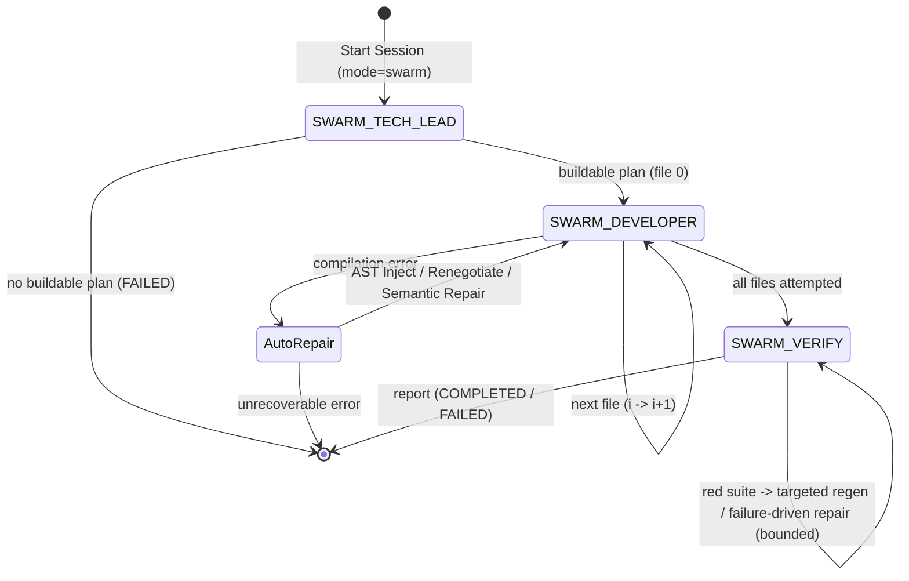

# Swarm Agent Design

This document details the architecture and flow of `SessionMode.SWARM` in
the `Averix` (`cgx`) framework. Swarm is a **plan-driven, one-file-at-a-time**
build engine: rather than a free-form agent loop, a Tech Lead authors a
validated plan, a Developer implements exactly one planned file per turn in
dependency order, and a Verifier gates the whole tree. Every stage follows a
**propose-then-validate** contract -- the model proposes, deterministic
invariants (coherence, toposort, contracts, syntax) enforce.

## Overview
The workflow is split into three router-driven roles:
1. **Tech Lead (`SWARM_TECH_LEAD`)** -- authors and validates the build plan.
2. **Developer (`SWARM_DEVELOPER`)** -- generates one planned file per turn,
   grounded on the on-disk content of its dependencies.
3. **Verifier (`SWARM_VERIFY`)** -- runs the graded verification ladder over
   the finished tree.

## Router State Machine
The routing loop (`src/cgx/session/router.py`) controls the lifecycle. The
Developer chain is a linear walk over the plan's topologically-ordered files
(one task per file), not a Tech Lead round-trip per file.

- `--mode swarm` seeds the session with a `SWARM_TECH_LEAD` root task.
- `_swarm_tech_lead_to_successors`: a buildable plan spawns `SWARM_DEVELOPER`
  for file 0; an empty/unbuildable plan (`file_count == 0`) goes terminal FAILED.
- `_swarm_developer_to_successors`: chains file *i* -> *i+1* until every planned
  file is attempted, then spawns a single `SWARM_VERIFY`.
- Terminal session actions set COMPLETED when no `failed_paths` remain, else
  FAILED; `on_task_failed` ends a SWARM session FAILED.

## Tech Lead -- propose-then-validate planner
**File:** `src/cgx/session/tasks/swarm_tech_lead.py`

1. Prompts the provider for a draft JSON plan (files, `depends_on` edges,
   per-file `contracts`).
2. `normalize_plan` (dedupe + prune dangling edges) -> `ordered_paths`
   (shared Kahn toposort, `toposort_manifest_files`) -> `plan_is_buildable`
   gate, with a bounded **3-attempt** corrective re-ask on an unbuildable draft.
3. **Deterministic completeness injection** (`swarm_plan.py`) runs *after*
   normalization, so structural completeness is a guarantee rather than a
   request a weak model may decline:
   - `ensure_scaffolding` appends any missing `README.md`, dependency manifest
     (`requirements.txt` / `pyproject.toml`), and -- for a `src/` layout -- a
     root `conftest.py`. `README.md` and `requirements.txt` are given a
     `depends_on` of every planned `.py` so they are generated last, after the
     sources they describe and scan exist on disk.
   - `ensure_test_coverage` injects a `tests/test_<module>.py` (depending on
     that module) for every source module no planned test already covers, so a
     plan can never ship with zero or partial test coverage.
4. `verify_plan` is the final pre-flight gate: it rejects unsafe/absolute/
   escaping paths, a plan with no buildable source, a dependency cycle, an
   orphan test with no target module, and (via `_scaffolding_problems`) a plan
   still missing README / manifest / conftest. Concrete problems are appended
   to the re-ask; an empty list means the plan is fit for the Developer chain.
5. Persists a `WORK_PLAN` artifact (`goal`, `layers`, `contracts`, ordered
   `paths`, `project_root`) and emits `{work_plan_artifact_id, swarm_paths,
   file_count}`.

## Developer -- incremental generation ladder
**Files:** `swarm_developer.py`, `swarm_generate.py`, `swarm_ground.py`

Each Developer task implements exactly one file (`file_index` into the plan):
1. **Ground** the file's `depends_on` from their *real on-disk content*
   (`swarm_ground`: `describe_file` / `file_skeleton` / `list_symbols` /
   `get_signature`), so generation sees the actual sibling symbols.
2. **Route by kind** (`generate_file`): a non-source planned file is not put on
   the Python ladder. `requirements.txt` and `conftest.py` are emitted from
   deterministic, source-derived templates and `README.md` from a grounded
   free-form call, so scaffolding never has to survive an `ast.parse` gate.
3. **Generate ladder** (source `.py` only): full-file
   (`generate_single_scaffold_file`, gated on `ast.parse` / `syntax_ok`, one
   re-ask) -> deterministic `ASTAssembler` header + per-symbol path, with the
   required symbols derived from the plan `contracts`; empty / symbol-less
   modules are rejected. Three additional auto-repair mechanisms run here:
   - **AST Import Injector**: Identifies missing standard library or first-party
     imports and injects them directly into the AST, bypassing the LLM.
   - **Contract Renegotiation**: If a signature changes during implementation,
     the contract is dynamically renegotiated rather than failing the build.
   - **Semantic Repair Fallback**: For more complex logical errors, a targeted
     fallback repair is attempted.
   - **Phantom-import gate** (`import_audit.py`): a provably-unused, non-side-
     effecting import fails the file (re-ask, then strip as a last resort).
   - **No-stub gate** (`_contract_stub_symbols` / `_body_is_stub`): a contract
     function or method pinned to this module whose body is a placeholder
     (`pass` / `...` / docstring-only / `raise NotImplementedError`) is
     rejected with a hardened re-ask naming the offenders.
4. **Write**: `edit_file` for a greenfield (new) file; `patch_file` +
   `query_codebase` seeding for a brownfield (existing) edit.
5. Emits per-file progress beats and a structured per-turn log; outputs
   `{file_index, path, file_ok, failed_paths}`. `failed_paths` is threaded
   along the chain into `SWARM_VERIFY`.

## Verifier -- graded verification ladder
**File:** `src/cgx/session/tasks/swarm_verify.py`

The ladder moves from fast static analysis to slow dynamic execution:
1. **Static structural checks** (via `scaffold_validate` helpers): coverage
   gaps (a planned test module that parses but defines no collectible test is a
   gap), first-party import coherence, and contract compliance. Named files
   drive a bounded targeted regeneration (`_MAX_VERIFY_ROUNDS`) before the
   dynamic step.
2. **Environment dry-run** (only when hard structural checks pass):
   `preflight_install` to satisfy missing dependencies, then
   `run_tests_on_disk` over the impacted tests.
3. **Failure-driven repair** for a structurally-clean tree whose suite is
   nonetheless red -- the defect the static gates cannot see:
   - `ImportError` / `ModuleNotFoundError` are parsed from the pytest output
     and mapped to the *planned* file expected to provide the missing module
     (`_dynamic_regen_targets`), never widening the blast radius to a stray
     dependency frame.
   - The red suite's own output plus the implicated file bodies are threaded
     through `generate_repair_files`, which diagnoses the concrete failure and
     returns corrected complete files -- the step that turns "detected the
     failure" into "produced working code". Only files it actually rewrote and
     that pass a per-language syntax check are written back; if it declines, a
     single blind regeneration of the import targets is the fallback.
   - The repair prompt is allowed to fix **either side** of the contract: when
     a test asserts a fabricated magic literal the goal never specified, or
     calls the source with arguments/attributes it does not accept, the
     repairer rewrites *that test* (asserting an invariant or round-trip
     against the real API) instead of forcing the source to emit an impossible
     value.
   - `check_contract_compliance` resolves a dotted `Class.method` contract
     against the generated class's method set, so a passing, correct tree is no
     longer failed by a false "not defined" warning. Contract warnings are
     *soft*: they never suppress the pytest-driven repair loop.

Test authoring is disciplined at the source: `_SINGLE_FILE_SYSTEM` instructs
the model to call imported code only with argument values it accepts,
construct all inputs inline / via `tmp_path` (never read an external data file
that will not exist when the suite runs), and assert invariants and
round-trips (`decode(encode(x)) == x`, length/ordering properties, idempotence)
rather than fabricated magic literals -- a general discipline, not a
symptom-specific negative directive.

It writes a `SWARM_VERIFY_REPORT` artifact (`coverage_gaps`, `import_warnings`,
`contract_warnings`, `regen_rounds`, `dynamic_regen_rounds`, the env dry-run
outcome, and `verify_ok`) identifying the specific files implicated by any
static or dynamic failure.

## Plan-aware drain ceiling
A drain pass carries a flat 64-step safety valve for explore/greenfield. A
SWARM plan spawns one Developer task per file plus a Verify, so
`drain_step_ceiling` (`src/cgx/session/budget.py`) raises the ceiling to the
plan's file count (with retry/overhead headroom) for SWARM sessions only,
so a large build is not truncated mid-chain while a runaway stays bounded.
Both the webui drain (`agent_session.py`) and the TUI drive (`cli/tui/ops.py`)
recompute it per loop, since the Developer tasks only exist once the Tech
Lead's `WORK_PLAN` lands.

## Wrapper-tolerant plan parsing
**File:** `src/cgx/session/tasks/swarm_parse.py`

Small local models routinely wrap JSON in prose or fenced code blocks. The
parser tolerates those wrappers and extracts the plan object, feeding the
typed `SwarmPlan` schema (`swarm_plan.py`) that the validation stages rely on.
