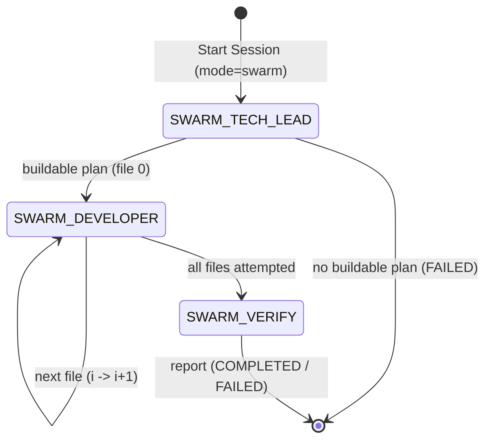

# Swarm Agent Design

This document details the architecture and flow of `SessionMode.SWARM` in
the `Averix` (`cgx`) framework. Swarm is a **plan-driven, one-file-at-a-time**
build engine: rather than a free-form agent loop, a Tech Lead authors a
validated plan, a Developer implements exactly one planned file per turn in
dependency order, and a Verifier gates the whole tree. Every stage follows a
**propose-then-validate** contract -- the model proposes, deterministic
invariants (coherence, toposort, contracts, syntax) enforce.

## Overview
The workflow is split into three router-driven roles:
1. **Tech Lead (`SWARM_TECH_LEAD`)** -- authors and validates the build plan.
2. **Developer (`SWARM_DEVELOPER`)** -- generates one planned file per turn,
   grounded on the on-disk content of its dependencies.
3. **Verifier (`SWARM_VERIFY`)** -- runs the graded verification ladder over
   the finished tree.

## Router State Machine
The routing loop (`src/cgx/session/router.py`) controls the lifecycle. The
Developer chain is a linear walk over the plan's topologically-ordered files
(one task per file), not a Tech Lead round-trip per file.

- `--mode swarm` seeds the session with a `SWARM_TECH_LEAD` root task.
- `_swarm_tech_lead_to_successors`: a buildable plan spawns `SWARM_DEVELOPER`
  for file 0; an empty/unbuildable plan (`file_count == 0`) goes terminal FAILED.
- `_swarm_developer_to_successors`: chains file *i* -> *i+1* until every planned
  file is attempted, then spawns a single `SWARM_VERIFY`.
- Terminal session actions set COMPLETED when no `failed_paths` remain, else
  FAILED; `on_task_failed` ends a SWARM session FAILED.

## Tech Lead -- propose-then-validate planner
**File:** `src/cgx/session/tasks/swarm_tech_lead.py`

1. Prompts the provider for a draft JSON plan (files, `depends_on` edges,
   per-file `contracts`).
2. `normalize_plan` (dedupe + prune dangling edges) -> `ordered_paths`
   (shared Kahn toposort, `toposort_manifest_files`) -> `plan_is_buildable`
   gate, with a bounded **3-attempt** corrective re-ask on an unbuildable draft.
3. Persists a `WORK_PLAN` artifact (`goal`, `layers`, `contracts`, ordered
   `paths`, `project_root`) and emits `{work_plan_artifact_id, swarm_paths,
   file_count}`.

## Developer -- incremental generation ladder
**Files:** `swarm_developer.py`, `swarm_generate.py`, `swarm_ground.py`

Each Developer task implements exactly one file (`file_index` into the plan):
1. **Ground** the file's `depends_on` from their *real on-disk content*
   (`swarm_ground`: `describe_file` / `file_skeleton` / `list_symbols` /
   `get_signature`), so generation sees the actual sibling symbols.
2. **Generate ladder** (`generate_file`): full-file
   (`generate_single_scaffold_file`, gated on `ast.parse` / `syntax_ok`, one
   re-ask) -> deterministic `ASTAssembler` header + per-symbol path, with the
   required symbols derived from the plan `contracts`; empty / symbol-less
   modules are rejected.
3. **Write**: `edit_file` for a greenfield (new) file; `patch_file` +
   `query_codebase` seeding for a brownfield (existing) edit.
4. Emits per-file progress beats and a structured per-turn log; outputs
   `{file_index, path, file_ok, failed_paths}`. `failed_paths` is threaded
   along the chain into `SWARM_VERIFY`.

## Verifier -- graded verification ladder
**File:** `src/cgx/session/tasks/swarm_verify.py`

The ladder moves from fast static analysis to slow dynamic execution:
1. **Static structural checks** (via `scaffold_validate` helpers): first-party
   import coherence, contract compliance, and JS/Python payload coherence.
2. **Environment dry-run** (only when static checks pass): `preflight_install`
   to satisfy missing dependencies, then `run_tests_on_disk` over the impacted
   tests.

It writes a `SWARM_VERIFY_REPORT` artifact identifying the specific files
implicated by any static or dynamic failure (candidates for targeted
regeneration under budget).

## Plan-aware drain ceiling
A drain pass carries a flat 64-step safety valve for explore/greenfield. A
SWARM plan spawns one Developer task per file plus a Verify, so
`drain_step_ceiling` (`src/cgx/session/budget.py`) raises the ceiling to the
plan's file count (with retry/overhead headroom) for SWARM sessions only,
so a large build is not truncated mid-chain while a runaway stays bounded.
Both the webui drain (`agent_session.py`) and the TUI drive (`cli/tui/ops.py`)
recompute it per loop, since the Developer tasks only exist once the Tech
Lead's `WORK_PLAN` lands.

## Wrapper-tolerant plan parsing
**File:** `src/cgx/session/tasks/swarm_parse.py`

Small local models routinely wrap JSON in prose or fenced code blocks. The
parser tolerates those wrappers and extracts the plan object, feeding the
typed `SwarmPlan` schema (`swarm_plan.py`) that the validation stages rely on.
