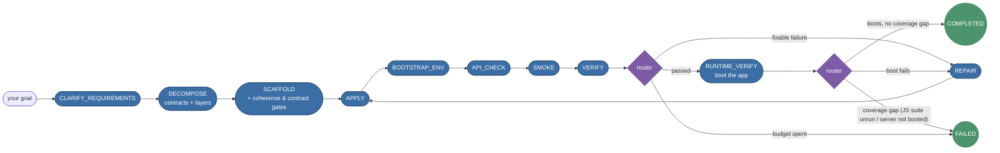
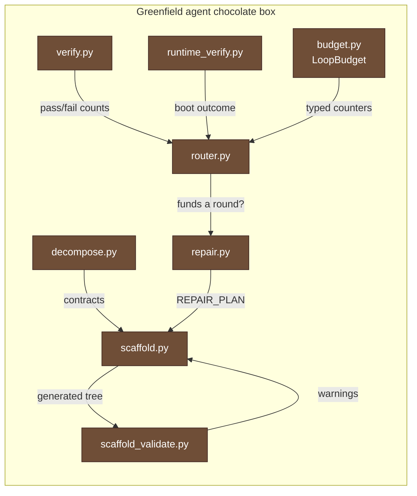

# Usage

CGX is driven from three surfaces that share one engine: a **terminal
dashboard**, a set of scriptable **CLI subcommands**, and a **Python API**.
This guide walks each capability in order -- install, provider, index, ask,
plan, and the session-based agent -- one numbered section at a time.

**Jump to:** [Install](#0-install) · [Terminal dashboard](#the-terminal-dashboard)
· [CLI](#the-cli-non-interactive-subcommands) · [Pick a provider](#1-pick-a-provider)
· [Index](#2-index-a-project) · [Ask](#3-ask-a-question) · [Plan](#4-generate-a-change-plan)
· [Tune retrieval](#5-tune-retrieval-optional) · [Agent](#6-session-based-agent-agent)
· [Chat sessions](#8-persistent-chat-sessions-ask-tab-sidebar)
· [Hardware](#9-hardware-aware-model-picker-hardware-tab) · [Safety defaults](#15-safety-defaults)

<details>
<summary>

## 0. Install
</summary>

CGX splits dependencies into a **core** layer (always required) and an
**ML extras** layer (only needed for local embedding models and the
optional cross-encoder reranker).

```bash
# Core only -- small, no torch:
pip install -r requirements.txt
pip install -e ".[codegen]"

# Add ML extras for local Jina embeddings / reranker:
pip install -r requirements-ml.txt
```

The UI and the Ollama / remote-LLM answer paths run on the core install;
`torch`, `transformers`, and `sentence_transformers` are imported lazily
only when an embedding or reranker step is actually invoked.

**NVIDIA / CUDA note.** `pip install torch` from PyPI tracks the newest
CUDA series and frequently outruns the installed driver, in which case
`torch.cuda.is_available()` returns False and embeddings silently fall
back to CPU. Match the wheel to your driver's "CUDA Version" column
from `nvidia-smi` -- e.g. `pip install --index-url
https://download.pytorch.org/whl/cu128 torch` for a CUDA 12.8 driver.
See `requirements-ml.txt` for the full recipe.

</details>
<details>
<summary>

## The terminal dashboard
</summary>

For a terminal-first workflow, run `cgx` with no arguments (or `cgx
dash`) to open the interactive dashboard -- a full-screen REPL that
unifies indexing, questions, and the agent loop in one place:

```bash
cgx                                  # bare invocation -> dashboard
cgx dash --project-root /path/to/repo
```

The screen has four zones: an ASCII banner, a **status bar** (current
directory, index state, active model and remaining context window), a
**tips** panel, and a bordered input box. Type a plain message to route
it through the session agent loop -- it can answer a question, plan an
edit, or scaffold new code. Lines starting with `/`
are commands:

| Command            | Action                                            |
| ------------------ | ------------------------------------------------- |
| `/help`            | Show the command reference.                       |
| `/ask <question>`  | Fast, read-only grounded answer (streams live).   |
| `/index [path]`    | Build/refresh the code graph for the project.     |
| `/project <path>`  | Switch the active project directory.              |
| `/model <name>`    | Set the model for the current provider.           |
| `/provider <name>` | Use a saved profile, or `ollama`/`openai`/`gemini`. |
| `/status`          | Show provider, index, and hardware status.        |
| `/serve`           | Launch the web UI (FastAPI + React).              |
| `/clear`           | Clear the screen and scrollback.                  |
| `/quit`, `/exit`   | Leave the dashboard.                              |

The dashboard shares its engines with the web UI: `/ask` and `/index`
run through `cgx.webui.handlers` (`stream_ask` / `stream_index`), and
plain-text agent goals drive the same `SessionRunner` behind the web
UI's `/agent` tab (sessions persist in the shared SQLite store).
Heavy work runs on a background thread while a Braille spinner shows
elapsed time, so the prompt never looks frozen and answer tokens stream
into the terminal as they arrive. Press **Ctrl-C** to cancel the
running task and return to the prompt -- it flips the same `cancel_event`
the web UI's Stop button uses, so the backend halts between tokens
rather than the process dying. Ctrl-C at an empty prompt just clears the
line; only `/quit` or EOF (Ctrl-D) leave the dashboard.

The dashboard is stdlib-only: it uses ANSI escape sequences directly
with no `rich`/`textual` dependency, so it works cleanly over SSH.
Colour is auto-disabled when stdout is not a TTY or when `NO_COLOR` /
`CGX_NO_COLOR` is set (`CGX_FORCE_COLOR` forces it back on). All the
explicit subcommands below (`cgx index`, `cgx ask`, `cgx serve`, ...)
remain available for scripted, non-interactive use.

</details>
<details>
<summary>

## The CLI (non-interactive subcommands)
</summary>

Every capability the dashboard and web UI expose is also available as a
plain, scriptable subcommand. Run `cgx <command> --help` for the full,
authoritative flag list; this section is the reference.

| Command       | What it does                                                        |
| ------------- | ------------------------------------------------------------------- |
| `cgx`         | Open the interactive dashboard (same as `cgx dash`).                |
| `cgx index`   | Parse → embed (two views) → FAISS → persist an index on disk.       |
| `cgx query`   | Raw hybrid retrieval; prints the ranked chunks as JSON (no LLM).    |
| `cgx ask`     | Grounded, read-only LLM answer streamed to the terminal.            |
| `cgx plan`    | Generate a code-change plan (`plan_md` + structured diffs).         |
| `cgx agent`   | Run the session agent loop toward a goal (unattended).              |
| `cgx status`  | Print provider, hardware, and index status for a project.           |
| `cgx serve`   | Launch the FastAPI + React web UI (`--host` / `--port`).            |
| `cgx dash`    | Launch the interactive terminal dashboard.                          |

`ask`, `plan`, `agent`, and `status` stream the same way the dashboard
does: tokens and task events arrive live under a Braille spinner, and
**Ctrl-C** cancels the running task
(exit code `130`) by flipping the same `cancel_event` the UI's Stop
button uses. Any other failure exits non-zero (`1`). Colour follows the
same TTY / `NO_COLOR` / `CGX_FORCE_COLOR` rules as the dashboard, so
piping to a file yields clean, escape-free text.

<details>
<summary>

### Shared provider & index flags
</summary>

`ask`, `plan`, `agent`, and `status` accept a common set of flags:

| Flag             | Default                    | Purpose                                                     |
| ---------------- | -------------------------- | ---------------------------------------------------------- |
| `--project-root` | current directory          | Project whose index is queried / written.                  |
| `--provider`     | `ollama`                   | One of `ollama`, `openai`, `openai-compat`, `gemini`, `custom`. |
| `--model`        | provider default           | LLM name; always overrides a profile's model when given.   |
| `--base-url`     | `http://localhost:11434`   | Provider endpoint (Ollama / OpenAI-compatible).            |
| `--profile`      | none                       | A saved provider profile (see §1) — takes precedence over `--provider`/`--base-url`. |
| `--index-dir`    | auto-discovered            | Override the FAISS `indices/` directory to read.           |
| `--records`      | auto-discovered            | Override the `records.jsonl` path to read.                 |

**Provider resolution.** `--profile` wins: its `kind`, `model`, and
`base_url` are loaded from `~/.cgx/profiles.json`, with `--model` still
able to override the model. Otherwise the explicit `--provider` /
`--model` / `--base-url` values are used. When the provider is `ollama`
and no model is given, CGX picks a hardware-appropriate default via
`ollama_discovery.recommend_default_model()`. **API keys are never passed
on the command line** — cloud providers read them from the environment
(`OPENAI_API_KEY`, `GEMINI_API_KEY`) or the keyring-backed profile store,
so nothing secret lands in your shell history.

**Index discovery.** `ask`, `plan`, and `status` look for a *completed*
index at `<project-root>/.cgx/index` (the same layout the dashboard's
`/index` builds); `agent` uses it when present and can also run without
one for greenfield generation. To make an index discoverable, build it
into that path:

```bash
cgx index --project-root . --out-dir .cgx/index
cgx ask "How does parse_codebase work?"
```

Or build it anywhere and point the reader at it explicitly:

```bash
cgx index --project-root . --out-dir /tmp/cgx_index
cgx ask "How does parse_codebase work?" \
        --index-dir /tmp/cgx_index/indices \
        --records  /tmp/cgx_index/records.jsonl
```

> The index is read back with the **default Jina code-embedding model**,
> so an index passed via `--index-dir` / `--records` must have been built
> with that model (a mismatched embedding dimension is rejected at load).

</details>
<details>
<summary>

### `cgx ask` — grounded question answering
</summary>

```bash
cgx ask "What does the retrieval orchestrator fuse?" \
        --provider openai --model gpt-4o-mini --think
```

Streams a read-only, citation-grounded answer over the project's index.
Add `--think` to also stream the model's reasoning sketch before the
answer. The multi-word question is a positional argument (no quoting
required, though quoting is fine).

</details>
<details>
<summary>

### `cgx plan` — self-testing change plans
</summary>

```bash
cgx plan "Add a --json flag to the query command" \
         --self-test --run-tests --profile my-ollama
```

Emits a markdown plan plus structured diffs. `--self-test` has the
planner validate and repair its own diffs (parse + dry-apply +
`ast.parse`); `--run-tests` executes the project's impacted tests in a
sandbox. See §4 for the UI equivalent and the report shape.

</details>
<details>
<summary>

### `cgx agent` — session agent loop
</summary>

```bash
cgx agent "Add docstrings to every public function in cgx.parser"
```

Runs one unattended turn of the session agent loop (§6) and streams
each task's start / done / failed events. The goal drives the same
`SessionRunner` as the web UI and dashboard, in auto-answer mode:
clarify questions take their first suggested option and plan/change
approvals are approved, so the run never blocks on a checkpoint;
questions with no safe default (freeform, choose-path) end the turn
with the question printed. With no discoverable index the loop
scaffolds a brand-new project into `--project-root`. The session
persists in `<project_root>/.cgx/sessions.db`, so it can be resumed
from the dashboard or web UI afterwards.

</details>
<details>
<summary>

### `cgx status` — environment & index summary
</summary>

```bash
cgx status --provider ollama
```

Prints the resolved provider and model, a live Ollama reachability check
(when applicable), detected RAM / VRAM, and whether the project's index
is built (with its build timestamp and embedding model). This is the
non-interactive form of the dashboard's `/status` command.

</details>

</details>
<details>
<summary>

## 1. Pick a provider
</summary>

CGX supports four provider types, each selectable from the **⚙️ Setup**
tab's **Provider Type** dropdown. (The non-interactive CLI's
`--provider` flag exposes them as the five kind strings listed in the
[shared-flags table](#shared-provider--index-flags) above -- `ollama`,
`openai`, `openai-compat`, `gemini`, `custom` -- since a bare OpenAI-
compatible endpoint and a fully custom server are distinct kinds under
the hood.) A **Ping** button appears on both the inline config card and
the profile edit form -- it performs a live connection test and reports
latency or the exact error message.

<details>
<summary>

### Ollama (default, local)
</summary>

```bash
ollama serve   # in another terminal
ollama pull qwen2.5-coder:3b
```

Set **Provider Type → Ollama (Local)**. The default base URL is
`http://localhost:11434`. Ping exercises `GET /api/tags`.

</details>
<details>
<summary>

### OpenAI (cloud)
</summary>

Set **Provider Type → OpenAI (Cloud)**, enter your `OPENAI_API_KEY`,
and choose a model (`gpt-4o-mini`, `gpt-4o`, etc.). The default base URL
is `https://api.openai.com`. Any OpenAI-compatible endpoint (Groq,
Together, DeepSeek, vLLM, etc.) also works here.

</details>
<details>
<summary>

### Google Gemini (cloud)
</summary>

Set **Provider Type → Google Gemini (Cloud)**, enter your
`GEMINI_API_KEY`, and choose a model (`gemini-1.5-flash`,
`gemini-1.5-pro`, etc.). Ping sends a minimal `generateContent` request
with `maxOutputTokens: 1` to verify the key and model are valid.

Programmatic usage:

```python
from cgx.answer.providers import GeminiProvider
prov = GeminiProvider(model="gemini-1.5-flash", api_key="YOUR_KEY")
# or set GEMINI_API_KEY in the environment and omit api_key
```

</details>
<details>
<summary>

### Custom Server (OpenAI-Compatible)
</summary>

Set **Provider Type → Custom Server (OpenAI-Compatible)** to configure a
self-hosted model endpoint:

- **Host IP/URL** -- e.g. `http://100.10.20.10:8080`
- **Endpoint Path** -- the exact path suffix, e.g. `/completion` or
  `/v1/chat/completions` (default)
- **Bearer Token** -- optional; leave blank and tick **Skip auth** for
  servers on private subnets that do not require authentication

```python
from cgx.answer.providers import OpenAICompatProvider
prov = OpenAICompatProvider(
    model="my-model",
    base_url="http://100.10.20.10:8080",
    endpoint_path="/completion",
    allow_no_auth=True,
)
```

Save any provider configuration as a named **Profile**; the profile
persists `endpoint_path` and `allow_no_auth` alongside the other fields.
API keys are stored in the OS keyring when available, otherwise in
`~/.cgx/secrets.json` with `0600` permissions.

</details>

</details>
<details>
<summary>

## 2. Index a project
</summary>

```bash
cgx index --project-root /path/to/repo --out-dir /tmp/cgx_index
```

or use the **Index** tab in the UI, which also accepts a `.zip` upload.

Artefacts written under `out_dir`:

```
indices/                   # FAISS files + per-view metadata (.npy + .json)
records.jsonl              # canonical records (one per chunk)
chunks.jsonl               # raw parser chunks
graph.json                 # NetworkX node-link graph
repo_map.json              # cached hierarchical repo map (planning context)
parse_cache.json           # per-file parse cache (incremental re-parse)
emb_cache_intent.npz       # content-addressed embedding cache (intent view)
emb_cache_impl.npz         # content-addressed embedding cache (impl view)
```

<details>
<summary>

### Multi-language parsing
</summary>

`parse_codebase` dispatches each file to a parser by extension through an
internal registry. Python (`.py`) is always parsed with the stdlib `ast`
and needs no extra dependencies. JavaScript / TypeScript / TSX
(`.js`, `.jsx`, `.ts`, `.tsx`) are parsed via tree-sitter when the
optional `parsers` extra is installed:

```bash
pip install "cgx[parsers]"
```

Without that extra, JS/TS files are simply skipped and Python-only
indexing continues to work -- the pipeline degrades gracefully rather
than failing. Every parser emits the same chunk/call-relation shape, so
retrieval, the graph, and the agent loop are language-agnostic
downstream.

</details>
<details>
<summary>

### Parallel two-view build and GPU detection
</summary>

`run_index_auto()` builds the intent-view and impl-view FAISS indices
concurrently using a `ThreadPoolExecutor`, roughly halving indexing time
on multi-core machines. `build_embeddings()` auto-detects the best
available compute device at runtime (CUDA > MPS > CPU) -- no manual
configuration is needed.

The **Index** tab in the UI displays a **Cancel** button while indexing
is in progress; clicking it terminates the SSE stream cleanly.

</details>
<details>
<summary>

### Incremental re-indexing
</summary>

Re-indexing is cheap at **two** layers. First, at the *parse* layer
(`cgx.parser.incremental`): a `parse_cache.json` manifest keyed on each
file's mtime + sha lets unchanged files reuse their cached chunks, so
only edited files are actually re-parsed. Second, at the *embedding*
layer, described below.

The two `emb_cache_*.npz` files make re-embedding cheap. Each file
stores `{sha256(corpus_text): np.ndarray}` pairs; on the next
`run_index_auto` call, unchanged chunks reuse their cached vectors and
only modified chunks reach the embedder.

```python
from cgx.pipeline.auto import run_index_auto
result = run_index_auto(project_root=".", out_dir="/tmp/cgx_index")
print(result["incremental"])       # True
print(result["embedding_cache"])
# {'intent': {'hits': 412, 'misses': 5,  'dim': 768},
#  'impl':   {'hits': 410, 'misses': 7,  'dim': 768}}
```

`hits` is the count of chunks served from the cache (the embedder is
**not** called); `misses` is the count of new / changed chunks that
were sent through the embedder and written back. `hits + misses`
always equals the number of chunks in the view. The same numbers are
also logged to the server, one line per view:

```
Embedding cache view=intent hits=412 misses=5
Embedding cache view=impl   hits=410 misses=7
```

Expected ratios: a first-time index of a project is all misses; a
re-index with no source changes is all hits (sub-second); a re-index
after editing a handful of files lands in the high-99% hits range.

> Not to be confused with retrieval `hits` (the top-k chunks returned
> by a query). Cache `hits` measure index reuse; retrieval `hits`
> measure search results -- same word, different layers.

The cache is invalidated automatically when the embedding `model_name`,
`dim`, or `normalize` flag changes -- there is no risk of serving stale
vectors against a different model.

Force a clean rebuild:

```python
run_index_auto(project_root=".", out_dir="/tmp/cgx_index",
               incremental=False)
```

Implementation lives in `src/cgx/embeddings/cache.py`.

</details>

</details>
<details>
<summary>

## 3. Ask a question
</summary>

There are two CLI entry points here. `cgx query` runs **raw hybrid
retrieval** and prints the ranked chunks as JSON — no LLM is involved,
which is ideal for debugging retrieval or piping into other tooling:

```bash
cgx query --index-dir /tmp/cgx_index/indices \
          --records  /tmp/cgx_index/records.jsonl \
          --query    "What does parse_codebase do?"
```

`cgx ask` runs the full **grounded-answer** path — retrieval plus an LLM
that streams a cited answer to the terminal (see the CLI reference above
for provider flags and index discovery):

```bash
cgx ask "What does parse_codebase do?" --think
```

Or open the **Ask** tab. The streaming panel shows the model's
reasoning sketch; the structured grounded answer (with citations and a
debug payload) appears below it.

A **Stop** button is visible while the stream is in progress; clicking
it closes the SSE connection and cancels the running task. Switching to
another tab mid-stream does **not** lose the answer -- the connection
keeps streaming in the background and the accumulated messages are
restored when you return to the Ask tab.

</details>
<details>
<summary>

## 4. Generate a change plan
</summary>

From the CLI:

```bash
cgx plan "Add a --json flag to the query command" --self-test --run-tests
```

`--self-test` maps to **Validate diffs** and `--run-tests` to **Run
impacted tests** (both described below); the plan and its report stream
to the terminal.

The **Plan** tab accepts a free-form task description. Recommended
options:

- ✅ **Validate diffs** -- parses + dry-applies fenced diffs and runs
  `ast.parse` on each affected Python file.
- ✅ **Run impacted tests** -- copies the project into a sandbox,
  materialises the diffs, and runs pytest scoped to the impacted files.

Failures feed a one-shot retry. The full report is rendered as a
markdown table under the plan and is also available as
`result["codegen_report"]` when called programmatically.

A **Cancel** button is shown while planning is in progress; clicking it
closes the SSE connection and terminates the backend stream. Tab
switching is non-destructive -- the plan output accumulated so far is
preserved in session state and displayed when you return.

</details>
<details>
<summary>

## 5. Tune retrieval (optional)
</summary>

The hybrid retriever fuses semantic + lexical + graph signals via
Reciprocal Rank Fusion. The post-fusion rerank stage is controlled by
`HybridConfig` in `cgx.retrieval.orchestrator`:

```python
from cgx.retrieval.orchestrator import HybridConfig
cfg = HybridConfig(
    # graph-aware reranking -- pulls in neighbors of top hits.
    graph_depth=1,
    graph_bonus=0.2,        # set 0.0 to ignore graph-only neighbors
    # symbol-match bonus -- rewards files/funcs whose name appears
    # verbatim in the query.
    symbol_boost=0.5,       # 0.0 disables
    # optional cross-encoder rerank over the top-N RRF hits.
    enable_reranker=True,
    reranker_model="cross-encoder/ms-marco-MiniLM-L-6-v2",
    reranker_top_n=30,
    reranker_weight=1.0,    # 1.0 = pure cross-encoder, 0.0 = pure RRF
)
```

`enable_reranker=True` lazy-loads `sentence_transformers`. If the ML
extras aren't installed, the call silently falls back to the RRF order
-- no crash, just no rerank. Install `requirements-ml.txt` to opt in.

Each chunk's `provenance` dict in the search result records which signals
fired (`semantic_intent`, `semantic_impl`, `lexical`, `graph_depth`,
`symbol_match`, `reranker_score`), so the **Ask** tab's "thought process"
panel shows exactly why a chunk ranked where it did.

<details>
<summary>

### Tiered SOURCES (Code Map)
</summary>

When the retriever's graph expansion (`graph_depth >= 1`) pulls in
callers, callees, or import-neighbors of the top hits, CGX switches the
prompt-time SOURCES list to a **two-tier "Code Map"** instead of
packing every chunk with a full code body:

- **Primary tier** -- chunks that matched directly (semantic / lexical /
  symbol-boosted). Rendered with the focus-windowed code body, exactly
  as before.
- **Neighbor tier** -- chunks reached by walking the call/import graph
  one or more hops from a primary seed. Rendered as a one-line stub:
  `[class.]name(signature) -- first sentence of docstring`. Each part
  drops silently when the record doesn't carry it. The block is tagged
  `tier=neighbor` in the prompt metadata so the LLM treats it as a
  structural reference rather than the focal body.

This kicks in automatically -- there is no flag to flip. If a query's
top results don't trigger graph expansion (e.g. very short queries, or
`graph_bonus=0.0`), the prompt falls back to the legacy single-tier
SOURCES list and behaves bit-identically to earlier CGX versions.

**Why it matters**: when running against a local 3B/7B model with a 16K
or 32K context window, a half-dozen graph-expanded neighbors can blow
the entire prompt budget on code that the model only needs to *know
exists*. Stubs keep that structural context visible (the model can
still cite the chunk and reason about the call shape) while reserving
the bulk of the window for the bodies that actually need to be read.

The per-tier budget scales by the provider's advertised context
window -- see `get_context_map_budget` in
`src/cgx/answer/model_caps.py`. The defaults are:

| Window         | Per primary chunk | Per neighbor stub | Max primary | Max neighbors | Total cap |
|----------------|-------------------|-------------------|-------------|---------------|-----------|
| < 16 K         | 900 chars         | 220 chars         | 8           | 12            | 6 000     |
| < 64 K         | 1 400 chars       | 320 chars         | 12          | 24            | 18 000    |
| < 200 K        | 2 200 chars       | 420 chars         | 20          | 40            | 48 000    |
| ≥ 200 K        | 3 500 chars       | 520 chars         | 32          | 60            | 120 000   |

Ordering is deterministic: primary first (in retrieval order), then
neighbors. The total-chars cap is enforced as a hard ceiling -- once
the cumulative body length would exceed it, trailing items are
dropped, so citation indices stay stable across reruns.

The architecture doc has the full developer-facing treatment under
[Tiered SLM context (Code Map)](architecture.md#tiered-slm-context-code-map),
including the classifier rule, the `cgx.answer.context_map` public
API, and the engine-level activation gate.

</details>

</details>
<details>
<summary>

## 6. Session-based Agent (`/agent`)
</summary>

The **🤖 Agent** tab (`/agent`) is the default agentic surface. It
drives a **persistent, session-shaped** orchestrator under
`cgx.session` whose state survives restarts and whose every branch is
an explicit, replayable user decision. The agent runs in one of two
**modes**, auto-detected by `cgx.session.mode.detect_mode` at session
creation and overridable from the launcher's mode picker
(*auto / explore / greenfield*):

* **Explore mode** -- the project root exists and has a usable FAISS
  index. Use it for exploratory questions ("how should we refactor
  this layer?") and grounded code changes on an existing codebase.
* **Greenfield mode** -- the project root is missing, empty, or has
  no index. Use it to scaffold a brand-new project from scratch;
  the agent asks clarification questions, plans a layered file
  manifest, and only writes anything to disk after you approve the
  plan.

<details>
<summary>

### The Explore Write Loop
</summary>

In explore mode the router seeds a root `EXPLORE` task and the agent
walks the following chain, pausing at each `ASK_USER` for a typed
user decision:

```
EXPLORE      -> ASK_USER(choose_path)
                    |
                    v
INVESTIGATE  -> RECOMMEND -> ASK_USER(choose_recommendation)
                                          |
                                  +-------+-------+----------------+
                                  v               v                v
                          investigate_more   plan_change      ask_followup / done
                                  |               |
                                  v               v
                          (loop back)       PLAN_CHANGE -> ASK_USER(approve)
                                                                  |
                                                          approved=true
                                                                  v
                                                              APPLY -> VERIFY
```

`EXPLORE` produces a `DIRECTIONS_LIST` artifact + one `ANCHOR` fact
per option. The user picks one direction; `INVESTIGATE` runs a deeper
anchored retrieval and produces a `FINDINGS_BUNDLE`. `RECOMMEND`
synthesises typed next-step recommendations; each one carries a
`kind ∈ {investigate_more, plan_change, ask_followup, done}` that
determines what the router spawns when the user picks it. The
`plan_change` path produces a `CODE_CHANGE_PLAN`, gates on an
`APPROVE` checkpoint, applies the diffs (with the same per-run
`.cgx-backups/` mirror the batch loop uses), and runs `VERIFY`. A
`done` recommendation closes the focus and lets the user post a fresh
follow-up message that spawns a sibling EXPLORE for a different
objective.

</details>
<details>
<summary>

### The Greenfield Write Loop
</summary>

In greenfield mode the router seeds a root `CLARIFY_REQUIREMENTS`
task instead. The agent never queries an index; the entire loop is
goal-driven and consults the LLM at each step:

```
CLARIFY_REQUIREMENTS -> ASK_USER(clarify_answers)
                                  |
                                  v
                            DECOMPOSE -> ASK_USER(approve_plan)
                            (contracts + layers)   |
                                          approved=true | approved=false
                                                  v        |
                                              SCAFFOLD     (loop halts;
                          (contract gate + coherence pass)  no files written)
                                                  |
                                                  v
                                              APPLY
                                                  |
                                                  v
                                          BOOTSTRAP_ENV    (pip freeze ->
                                                  |         installed_packages,
                                                  v         Phase 1.1)
                                          API_CHECK -------+ (failed -> REPAIR;
                                                  |         Phase 2.2)
                                                  v
                                            SMOKE  ---------+ (failed -> REPAIR;
                                                  |          Phase 2.1)
                                                  v
                                              VERIFY <-----+
                                                  |        |
                          passed (greenfield) |   | fixable failure
                                              v   |
                                      RUNTIME_VERIFY (boot the app; P1)
                                          |       |
                          passed/skipped  |       | failed/timeout/error
                                          v       v
                                     COMPLETED   REPAIR ------+ (progress-aware
                                                  |            budget: keep going
                                          patch | regenerate  while failing count
                                          (<=5 diffs) | (6.1)  strictly drops, #5)
                                              v        v
                                            APPLY    SCAFFOLD (re-enters loop)
```

`CLARIFY_REQUIREMENTS` emits 3–6 clarification questions about the
user's objective (stack, storage strategy, schema, target
environment, …) via an LLM call with JSON-forced output; if the
provider is unavailable or returns fewer than three well-formed
questions, a deterministic fallback bank keeps the loop alive. The
output is a `REQUIREMENTS_SHEET` artifact. `DECOMPOSE` folds each
`Q: A` answer pair into the goal, calls `plan_scaffold_manifest`,
and emits a `WORK_PLAN` artifact (`plan_md` + a layered file
manifest). `SCAFFOLD` walks the approved manifest layer-by-layer,
calls `generate_single_scaffold_file` for each entry while
accumulating sibling-file context (so cross-file imports resolve
correctly), captures per-file failures into a `failed` list, and
emits a `SCAFFOLD_PATCHES` artifact. As of the contract-first work,
the `WORK_PLAN` also carries a `contracts` block (the declared
endpoints / schemas / functions / constants every file must share);
it is threaded into each `generate_single_scaffold_file` call, and
after the per-file loop four best-effort gates run before `APPLY`: a
**coherence pass** that regenerates only importer files referencing a
first-party symbol no sibling defines, a **contract enforcement
gate** that flags declared interfaces no generated file satisfies, a
**client/server payload-coherence gate** (P0b) that flags a JS `fetch`
body whose keys disagree with the Python handler it targets (a
cross-language rename the Python-only gates miss), and a
**response-contract coherence gate** (P0c) that flags a handler whose
success HTTP status disagrees with the endpoint's declared status.
All attach `import_warnings` / `contract_warnings` to
`SCAFFOLD_PATCHES` rather than failing the scaffold; a payload or
response mismatch drives a targeted regenerate of only the offending
client/server file. The shared `APPLY` executor
accepts either a `CODE_CHANGE_PLAN` (explore) or `SCAFFOLD_PATCHES`
(greenfield). In greenfield mode a `BOOTSTRAP_ENV` step then
provisions a project-local `.venv` (via
`cgx.codegen.test_runner.ensure_project_venv`), installs declared
requirements, and preflight-installs any undeclared top-level
imports found in the applied files (successful adds are appended
back to `requirements.txt`); it also pre-installs `httpx` when the
applied files use the fastapi/starlette `TestClient` (an optional
extra needed only at test-import time) and installs any
`missing_modules` requested by an `install_deps` repair verdict;
the resulting `BUILD_REPORT` artifact
carries the venv path, the manifests installed from, the list of
installed/failed packages, and an `outcome` token
(`succeeded` / `failed` / `no_venv` / `skipped` / `partial`).
`APPLY` drops any file whose source does not parse and records it in
`failed_files`; in greenfield mode a non-empty `failed_files` means a
core module is silently missing, so rather than limping into
`BOOTSTRAP_ENV` the router re-scaffolds within its regenerate budget
with an `invalid_scaffold_syntax` constraint that enumerates each
dropped file and its concrete error (Fix G1). `VERIFY` then runs
pytest inside that venv and classifies the exit
code into an `outcome` token (`passed` / `assertions_failed` /
`collection_error` / `no_tests_collected` / `timeout` /
`pytest_missing` / `skipped`) so a missing dependency reads as
"collection error" instead of an unexplained test failure; when no
tests have been discovered yet `VERIFY` reports `ran=False` with a
`skipped_reason` rather than failing the run. The report also
carries a `failure_signature` (sha1 of outcome + returncode + first
error line) which the autonomous repair loop uses as a progress
detector.

If `VERIFY` ends with `outcome=assertions_failed` or
`collection_error` in greenfield mode, the router spawns a `REPAIR`
task that runs a deterministic, LLM-free classifier
(`cgx.session.repair.classify`) against the captured pytest output.
The deterministic registry recognises, among others:

* `unittest_pytest_mix` -- scaffolded tests call `self.assertLogs` /
  `self.assertEqual` / etc. on a class that does not inherit from
  `unittest.TestCase`. The locator walks the changed test files
  with an AST scan; the proposer rewrites each offending class
  header to inherit `unittest.TestCase` (preserving any existing
  bases) and inserts `import unittest` if missing.
* `missing_module_pythonpath` -- pytest reports
  `ModuleNotFoundError: No module named '<name>'` during collection
  and `<name>` resolves to a project-root sibling (a `.py` file or
  a directory containing `__init__.py` / `.py` files). Third-party
  packages with no matching project file are skipped (that's
  `BOOTSTRAP_ENV`'s domain). The proposer creates (or prepends to)
  a `<project_root>/conftest.py` carrying a marker comment plus a
  `sys.path.insert(0, str(Path(__file__).parent))` snippet so pytest
  can resolve the scaffolded package on the next pass; a marker
  check makes the proposer idempotent (re-running it after a
  successful fix yields zero diffs, which escalates the loop to
  `ASK_USER` instead of repeating). Fix G2: the locator only proposes
  this `conftest.py` fix when the missing module's *full* dotted path
  resolves on disk. A missing *leaf* (e.g. `tests.auth` where
  `tests/` exists but `tests/auth.py` was never authored) yields no
  diff -- no `sys.path` entry can conjure a module nobody wrote -- so
  the classification routes to a regenerate instead of a no-op patch.
* `missing_fixture` -- pytest reports `fixture '<name>' not found`
  during collection. The locator scans every `.py` file under the
  project root (skipping `.venv`, `__pycache__`, dotfile directories,
  and the well-known build / cache subtrees) for a top-level
  `@pytest.fixture`-decorated function whose name matches; the bare
  attribute decorator (`@pytest.fixture` / `@pytest.fixture(...)`) and
  the imported form (`@fixture` / `@fixture(...)`) are both accepted.
  When a definition is found, the proposer hoists the verbatim source
  span (decorators + def + body) into `tests/conftest.py` when a
  `tests/` directory exists at the project root, otherwise into
  `<project_root>/conftest.py`, adding `import pytest` if missing and
  wrapping each hoisted def in a `# cgx-repair: missing_fixture
  <name>` marker so a second pass is a no-op. When no on-disk
  definition exists the diffs are empty and the router escalates to
  `ASK_USER` -- a fixture nobody wrote isn't something the loop can
  invent without an LLM.
* `missing_dependency` -- a `RuntimeError: ... requires the <pkg>
  package to be installed` guard (e.g. the fastapi/starlette
  TestClient's `httpx`, a transitive extra no first-party file
  imports directly) names the exact distribution, or a
  `ModuleNotFoundError` names a top-level module that no file or
  directory under the project root claims. Regenerating source can
  never install a package, so the plan carries
  `strategy=install_deps`: the router re-runs `BOOTSTRAP_ENV`,
  which installs the package(s), syncs `requirements.txt`, and
  flows back through `API_CHECK` / `SMOKE` / `VERIFY`.
* `first_party_symbol_mismatch` -- pytest reports `ImportError:
  cannot import name '<x>' from '<Y>'` where `Y` is one of the
  project's *own* modules: it imported cleanly but never defined
  `<x>` (a symbol the scaffold forgot to author). The same message
  from a genuinely third-party `Y` is a `third_party_import_break`
  and gets a PyPI version pin instead, so the REPAIR executor
  disambiguates by resolving `Y` against disk under the project root
  (`locate._dotted_path_resolves`); a pin can never add a first-party
  symbol, so a first-party `Y` routes to a regenerate that names the
  exact missing `symbol`/`module` pairs and forbids a dependency
  pin, rather than flapping the loop against a package that does not
  exist.
* `circular_import` -- pytest collection dies with `ImportError:
  cannot import name ... from partially initialized module ...
  (most likely due to a circular import)`. No single-file patch can
  decide which import to break, so the cycle members are folded
  into a regenerate constraint and the offending module(s) are
  re-authored. (`SCAFFOLD` also runs a static circular-import gate
  -- Tarjan SCC over the generated batch's first-party import graph
  -- so most cycles are broken before the tree is ever applied.)

When no deterministic classifier matches, `REPAIR` falls back to a
bounded LLM repair that is **traceback-localized** (candidate files
come from the crash frames first, then the files `APPLY` wrote) and
**retrieval-fed** (any remaining candidate slot is filled by hybrid
retrieval over the project index -- a no-op in greenfield, where there
is no index).

A plain `assertions_failed` that no mechanical classifier can locate is
treated as **assertion drift** -- the suite imported and ran, but a
status code, message, or value the test asserts diverged from what the
implementation produced. The tests encode the intended contract, so when
the bounded LLM patch is a no-op (no provider, or the repair budget is
spent) the loop falls back to a *targeted* regenerate of only the
implementation file(s) the traceback named -- never the tests -- so the
handler is realigned to the asserted contract instead of a whole-tree
regenerate that re-rolls both sides of the seam and reproduces the same
divergence.

The executor emits a `REPAIR_PLAN` artifact shaped exactly like a
`CODE_CHANGE_PLAN`. The shared `APPLY` executor consumes it,
carries the `build_artifact_id` forward (so `BOOTSTRAP_ENV` is
skipped on the repair pass), and re-runs `VERIFY`. The cycle is no
longer a flat two-shot cap: a **progress-aware budget** keeps the loop
running while the failing-test count strictly drops round over round
(backed by a passing-count trend so a repair that trades a failure for
a new pass still counts as progress), under an absolute ceiling of four
rounds and a `failure_signature` flap backstop. A fix that "succeeds"
without actually shrinking the failure -- or that churns the same
signature -- escalates to a freeform `ASK_USER` instead of looping.
The flap ledger survives a repair-driven regenerate too:
`prior_failure_signatures` are folded into the fresh `SCAFFOLD` and
threaded down its new `APPLY` → … → `VERIFY` chain, so a regenerated
tree that reproduces the identical failure escalates instead of
burning the regenerate budget.

Once `VERIFY` is green in greenfield mode, the router runs a
`RUNTIME_VERIFY` gate before declaring the session complete: it boots
each detected entry module (`app.py` / `main.py` / any file that
constructs a Flask / FastAPI app or defines `create_app`) under the
bootstrapped venv and emits a `RUNTIME_REPORT`. Entry detection scans
the whole applied project tree (pruning `node_modules` / `.venv` /
build / cache dirs), not just the last `APPLY`'s file list, so a nested
`backend/app.py` written in an earlier chain is still booted rather than
skipped. A clean boot (`passed`) -- or a run with no detectable entry to
boot (`skipped`) -- COMPLETES the session; a hard boot failure routes
back to `REPAIR` under the same budget. This is what turns "the tests
the model wrote pass" into "the app actually runs".

Completion is additionally held to a **fail-closed policy** so "green"
is honest. A terminal that would report `COMPLETED` is downgraded to
`FAILED` when either (a) a JS test suite was scaffolded on disk but no
JS runner actually executed it (a passing Python half must not mask an
unrun React suite), or (b) `RUNTIME_VERIFY` `skipped` while a bootable
server entry was present on disk (a server the tree contains that was
never exercised -- typically a missing bootstrapped interpreter). These
are environmental coverage gaps a regenerate cannot fix, so the loop
fails closed rather than spin; the code-shaped failures (a boot crash, a
JS build/resolve error) are already routed to `REPAIR`. A `completed`
greenfield session therefore provably ran every scaffolded suite and
booted every detected server.

Every greenfield failure path is terminal. A *hard* executor
failure -- one that returns no `outputs`, such as a `BOOTSTRAP_ENV`
whose `pip install` fails -- ends the session `FAILED` via the
router's `on_task_failed` entry point (Fix F3) instead of leaving it
hung in `active`; and a regenerate whose budget is spent (no SCAFFOLD
ancestor left to retry) also ends `FAILED`. The loop never asks the
user to hand-fix AI-generated code, and it never proceeds on a
known-broken tree.

`BOOTSTRAP_ENV` runs a complementary preflight test-style lint
(`cgx.session.repair.locate.lint_test_style`) after
`preflight_install`: it AST-scans the applied test files (paths
starting with `tests/` or basenames starting with `test_`) for the
same `unittest_pytest_mix` pattern and attaches a `style_issues`
list to the `BUILD_REPORT` artifact. The lint is informational --
it does not change the bootstrap outcome -- but the UI renders the
list under the manifests block so the user sees a named issue
before `VERIFY` runs, even though `REPAIR` will still auto-fix it.

<details>
<summary>

#### Two maps of the greenfield loop
</summary>

To make the write loop legible at a glance, here it is as **flow** and
as **components** -- the same picture the architecture doc uses, kept
here so a first-time user can follow along without switching files.

**The interstate highway system (data flow).** Each task is a highway,
the router is the interchange choosing the next on-ramp, and artifacts
are the freight.



**The chocolate box map (components).** Each module is a chocolate; a
connector is a flavour pairing (a typed value handed between modules).



</details>

</details>
<details>
<summary>

### UI controls
</summary>

- **Session list** -- left panel; create a new session or resume an
  existing one. Hover a row to reveal a trash icon that calls
  `DELETE /api/agent-session/{sid}` (confirms first) and removes the
  whole aggregate. Persisted to `localStorage` under
  `cgx-agent-session` so a tab switch / reload returns to the same
  session and the same selected task. If the persisted active id
  no longer exists on the backend (session deleted out-of-band,
  project root switched to a different SQLite file) the page's
  state-load hook catches the typed `ApiError` with `status === 404`,
  clears the stale id from the store, refreshes the sidebar, and
  drops the user on the launcher -- no manual `localStorage` reset
  required.
- **Task tree** -- hierarchical DAG keyed on `parent_task_id`.
  Status icons: `pending` / `ready` / `in_progress` (spinner) /
  `done` (check) / `failed` (cross). Depth-based indentation; the
  selected node carries an emerald ring.
- **Active task pane** -- description, status, and outputs of the
  currently selected task. For `ASK_USER` tasks the appropriate
  decision form is rendered inline.
- **Side panel** (right) -- tabbed Knowledge Base (Facts) and
  Artifacts. Each artifact has a per-kind renderer.
- **Resizable columns** -- drag the thin vertical gutter between
  the session list, task tree, and side panel to retune widths;
  each handle clamps to per-column bounds (session bar 160-360 px,
  task tree 180-420 px, side panel 220-480 px). The session and
  side panels also have a header chevron that collapses them to a
  28 px rail for narrow viewports; click the rail icon to restore.
  All three widths and both collapsed flags persist under the
  `cgx-agent-session` `localStorage` key.
- **Project Root** -- shared with the rest of the UI; persisted to
  the workspace store.

</details>
<details>
<summary>

### Decision contract
</summary>

Every `ASK_USER` task carries `inputs.expected_kind` indicating which
`chosen` payload the route layer (`build_decision` in
`cgx.session.tasks.ask`) will accept. The forms in
`frontend/src/components/agent/AskUserForm.tsx` post exactly these
shapes:

| `expected_kind`         | `chosen` shape                                                                            |
|-------------------------|-------------------------------------------------------------------------------------------|
| `choose_path`           | `{anchor_chunk_id: string, title?: string}`                                               |
| `choose_recommendation` | `{id, title, rationale, kind, anchor_chunk_id?}` where `kind ∈ {investigate_more, plan_change, ask_followup, done}` |
| `approve`               | `{approved: boolean}`                                                                     |
| `clarify_answers`       | `{answers: {[question_id: string]: string}}` (non-empty)                                  |
| `approve_plan`          | `{approved: boolean}`                                                                     |
| `freeform`              | `{text: string}`                                                                          |

A mismatch (e.g. empty `anchor_chunk_id` on a `choose_path`, or an
empty `answers` dict on `clarify_answers`) returns HTTP `400` with a
clear error so the UI can surface the failure without re-posting.

</details>
<details>
<summary>

### HTTP surface
</summary>

Seven JSON endpoints plus a `GET /{sid}/events` SSE stream. While a
task is `in_progress` (other than an `ASK_USER`) the UI follows
progress over the SSE feed and falls back to polling
`GET /api/agent-session/{sid}` only when the stream is unhealthy:

| Method | Path                                  | Body / params |
|--------|---------------------------------------|---------------|
| `POST` | `/api/agent-session`                  | `{objective, project_root?, title?, mode?, provider, index, run_initial_task?}` -- creates a session, seeds the root task (`EXPLORE` in explore mode, `CLARIFY_REQUIREMENTS` in greenfield mode; `mode` defaults to `detect_mode(project_root)` when absent), drains READY tasks until something pauses. |
| `GET`  | `/api/agent-session?project_root=...` | List sessions for the project. |
| `GET`  | `/api/agent-session/{sid}`            | Full snapshot: `{session, tasks, artifacts, facts, decisions}`. |
| `GET`  | `/api/agent-session/{sid}/events`     | **SSE** stream of live session events (a `snapshot` frame first, then one frame per store write, 15 s `ping` keep-alives). Subscribe with an `EventSource`. |
| `POST` | `/api/agent-session/{sid}/message`    | `{message, provider, index, run_initial_task?}` -- post a follow-up; spawns a sibling `EXPLORE` when no `ASK_USER` is open. |
| `POST` | `/api/agent-session/{sid}/decision`   | `{task_id, chosen, rationale?, provider, index, run_initial_task?}` -- resolve a pending `ASK_USER`. |
| `POST` | `/api/agent-session/{sid}/cancel`     | Cooperative stop -- the running drain halts after the current task finishes; a later message/decision re-drives from where it stopped. |
| `DELETE` | `/api/agent-session/{sid}?project_root=...` | Discard the session and its tasks / facts / decisions / artifacts (SQLite `ON DELETE CASCADE`). Returns `{deleted: sid}` or 404. |

Every mutating endpoint except `DELETE` returns the full
`AgentSessionState` snapshot, so the UI can render the updated tree
in one round-trip; `DELETE` returns `{deleted: sid}` and the UI
refetches the session list.

</details>
<details>
<summary>

### Programmatic use
</summary>

The session backbone is plain Python; the route layer is a thin
wrapper. To drive it from a script, instantiate a `SessionRunner`
directly:

```python
from cgx.answer.providers import OllamaProvider
from cgx.session import SessionRunner, SessionStore
from cgx.session.models import Decision, DecisionKind
from cgx.session.tasks import _explore  # noqa: F401 - register executors
from cgx.session.tasks.base import ExecutorDeps

store = SessionStore(project_root="/path/to/proj")
runner = SessionRunner(store)
session = runner.start_session(
    objective="explore the parser layer's symbol resolution",
    project_root="/path/to/proj",
)

deps = ExecutorDeps(
    project_root="/path/to/proj",
    index_dir="/tmp/cgx_index/indices",
    records_path="/tmp/cgx_index/records.jsonl",
    provider=OllamaProvider(model="qwen2.5-coder:3b"),
    store=store,
)
task = runner.run_next(session_id=session.session_id, deps=deps)
# `task` is now an ASK_USER waiting for a choose_path decision.

# Resolve the ASK_USER with a typed Decision.
chosen_anchor = "src/cgx/parser/python_parser.py::class::PythonASTParser"
runner.post_decision(
    session_id=session.session_id,
    decision=Decision.new(
        session_id=session.session_id,
        resolved_task_id=task.task_id,
        kind=DecisionKind.CHOOSE_PATH,
        question=task.description,
        chosen={"anchor_chunk_id": chosen_anchor, "title": "PythonASTParser"},
    ),
)
runner.run_next(session_id=session.session_id, deps=deps)  # INVESTIGATE
```

The session database lives at `<project_root>/.cgx/sessions.db` (or
`~/.cgx/sessions.db` when no project root is supplied). Tables:
`sessions`, `tasks`, `facts`, `decisions`, `artifacts`; one row per
aggregate stored as a JSON blob plus indexed columns.

<details>
<summary>

#### Session budgets (autonomous-loop safety valve)
</summary>

A greenfield session runs an autonomous Plan → Scaffold → Apply →
Bootstrap → Verify → Repair loop. The per-loop regenerate/repair caps
bound individual retries, but a **session budget** bounds the whole
run so a pathological loop can never spin forever. Configure it on
`start_session` (all default to unlimited/off, so existing callers are
unaffected):

```python
session = runner.start_session(
    objective="build a FastAPI todo API with tests",
    project_root="/path/to/proj",
    mode=SessionMode.GREENFIELD,   # from cgx.session.models
    max_task_runs=40,              # cap on compute-bearing task runs
    max_wall_seconds=1800,         # 30-minute wall-clock cap
    headless=True,                 # no user to ask -> fail terminally
)
```

* `max_task_runs` -- ceiling on how many compute-bearing tasks the
  session may run (an `ASK_USER` pause is free and never counts).
* `max_wall_seconds` -- wall-clock ceiling measured from the first
  work task (`first_task_started_at`).
* `headless` -- picks the exhaustion behaviour. Either cap tripping
  triggers escalation *before* the next task is dispatched:
  * **interactive** (`headless=False`, the default): the loop pauses
    on a fresh `ASK_USER(freeform)` that surfaces the exhaustion, and
    the session goes `PAUSED`. Resume it by posting a `Decision`
    (e.g. raise the budget and continue, or stop).
  * **headless** (`headless=True`): there is no user to ask, so the
    READY work is abandoned and the session ends terminally `FAILED`.

The HTTP `POST /api/agent-session` route uses the unlimited defaults;
drive budgeted / headless runs through the programmatic `SessionRunner`
API above (or a thin wrapper of your own).

</details>

</details>
<details>
<summary>

### Skills (technology-aware scaffolding)
</summary>

CGX ships with a registry of per-technology *skills* (`skills/<name>/`)
that activate automatically when the objective mentions them. Each
active skill injects technology-specific instructions into the
scaffold / plan prompts composed by `cgx.answer.engine`, and defines a
structural validator (`skills.validate_scaffold` / `validate_plan`)
callers can run against the produced diffs, so a goal asking for React
never silently passes a Python-only output.

| Skill        | Activates on (examples)                                  | Structural check            |
|--------------|----------------------------------------------------------|-----------------------------|
| `react`      | "react app", "react component", "react ui"               | At least one `.jsx`/`.tsx`/`.js`/`.ts` file; `package.json` with `react` dep |
| `nextjs`     | "next.js", "nextjs app", "app router"                    | `next.config.*` or `pages/` / `app/` directory |
| `vue`        | "vue app", "vue 3", "single-file component"              | At least one `.vue` file |
| `tailwind`   | "tailwind", "tailwind css", "utility-first"              | `tailwind.config.*` present |
| `fastapi`    | "fastapi", "fastapi backend", "python rest api"          | At least one Python file importing `fastapi` |
| `flask`      | "flask", "flask app", "flask api"                        | At least one Python file importing `flask` |
| `django`     | "django", "django app", "django project"                 | `manage.py` and at least one `settings.py` |
| `express`    | "express", "express.js", "node backend"                  | `package.json` with `express` dep |
| `python_cli` | "python cli", "argparse cli", "command line tool"        | Entrypoint with `argparse` / `click` / `typer` |
| `sqlite`     | "sqlite", "sqlite db", "sqlite storage"                  | `sqlite3` / `aiosqlite` import or `.db` reference |

Multi-skill objectives compose naturally -- *"Create a calculator
project with a React UI and a FastAPI backend"* activates both `react`
and `fastapi`, so the LLM sees both prompt fragments. To extend the
registry, add a folder under `skills/<name>/` with a single `Skill`
subclass and append it to `SKILLS` in `skills/__init__.py`; no
agent-layer changes are required. See
[architecture.md](architecture.md#skills) for the full protocol.

---

</details>

</details>
<details>
<summary>

## 7. SLM-grade execution engine
</summary>

The following features are active by default whenever the session loop
runs and require no extra configuration. They are particularly important
when using a local 7B model that would otherwise hallucinate dependencies
or degrade on large files.

<details>
<summary>

### Dynamic Dependency Management (`cgx.codegen.env_manager`)
</summary>

Before VERIFY runs the project's tests, the `BOOTSTRAP_ENV` task scans
every generated `.py` file for `import` statements and cross-references
them against `requirements.txt`. Any new package the model chose but
did not declare is installed (`preflight_install`) before tests run.

If the tests pass, the newly installed packages are appended to
`requirements.txt` (`update_requirements`) so the dependency becomes
permanent.

```
Generated src/auth.py imports: bcrypt
bcrypt not in requirements.txt → pip install bcrypt → tests run → OK
requirements.txt updated: +bcrypt
```

Failures (e.g. a misspelled package name) are logged but never abort
the run -- pytest still executes and gives the retry loop a real
`ModuleNotFoundError` to diagnose rather than a false pass.

For a **polyglot** repo (a Python backend beside a JS/TS frontend, i.e.
a `package.json` alongside the Python manifests) `BOOTSTRAP_ENV`
provisions both stacks in the same pass: after the venv work it runs a
bounded `npm install` and records a `node` sub-report on the
`BUILD_REPORT`. This step is non-fatal (a missing `npm` or an offline
registry degrades to `skipped`) and keeps `project_type=python`, so the
Python-only gates are unchanged while VERIFY's JS runner now exercises
the frontend against real, already-installed dependencies.

</details>
<details>
<summary>

### Granular error context (repair loop)
</summary>

Instead of dumping the full pytest log into a retry prompt, the
session REPAIR loop (`cgx.session.repair`) works from the failure
site: `classify` parses the pytest output into typed failure kinds
and extracts the traceback, `locate` maps it to the offending symbol
in the generated source, and `propose` builds a focused fix prompt
containing only the relevant source snippet (plus the fixture source
when a test fixture is implicated).

This keeps the repair prompt small and lets local models focus on the
precise failure site rather than guessing from a wall of pytest
output.

</details>

</details>
<details>
<summary>

## 8. Persistent chat sessions (Ask tab sidebar)
</summary>

The Ask tab's sidebar holds the local conversation store:

- **➕ New** creates a session, sets it as the active thread, and
  starts an empty history.
- **🗑️ Delete** removes the selected session file.
- Selecting an entry from the dropdown renders prior turns inline.

User and assistant turns are appended automatically as each answer
stream finishes (failed answers -- those starting with `ERROR` -- are
not persisted). The `meta` blob on each assistant message captures the
detected intent and the cited sources for later inspection.

Storage layout (under `~/.cgx/sessions/`, overridable via the
`CGX_CONFIG_DIR` env var):

```
~/.cgx/sessions/
├── index.json                 # session headers: id, title, message_count, ts
└── <uuid>.jsonl               # one JSON message per line, append-only
```

Programmatic API (`cgx.sessions`, stdlib-only):

```python
from cgx import sessions
m = sessions.create_session(title="refactor parse_codebase")
sessions.append_message(m.id, role="user", content="What does it return?")
sessions.append_message(m.id, role="assistant", content="A tuple of...")
for header in sessions.list_sessions():
    print(header.id, header.title, header.message_count)
sessions.delete_session(m.id)
```

Writes go through `os.replace` so a crash mid-write cannot corrupt
either the index or a thread file.

</details>
<details>
<summary>

## 9. Hardware-aware model picker (Hardware tab)
</summary>

Click **🧠 Detect hardware** to populate the local-model fit table.
The computation is pure-local -- it reads the RAM/VRAM detected by
`cgx.answer.ollama_discovery.detect_hardware()` and compares against
the static catalogue in `cgx.answer.hardware_matrix.LOCAL_MODEL_CATALOG`.

Verdict semantics:

| Symbol | Meaning                                                           |
|--------|-------------------------------------------------------------------|
| ✅     | Budget ≥ 1.2× the model's minimum RAM and any GPU has ≥0.75× the recommended VRAM. |
| ⚠️     | Within 20% of the minimum RAM, or GPU VRAM below the recommended threshold.        |
| ❌     | Budget is less than 90% of the model's minimum RAM -- won't fit.   |
| ❓     | No RAM / VRAM detected; the verdict is suppressed.                |

The "effective budget" used to compare against `min_ram_gb` is
`max(ram_gb, gpu_vram_gb * 2.0)` when a GPU is present, otherwise just
`ram_gb` (see `_effective_budget_gb` in
`src/cgx/answer/hardware_matrix.py`).

The second table is the editorial **local vs cloud** trade-off across
privacy, marginal cost, quality ceiling, cold and warm latency,
offline use, setup effort, and operational risk. Every value is a
short string and `winner ∈ {local, cloud, tie}` -- see
[`docs/hardware_matrix.md`](hardware_matrix.md) for the rationale
behind each row.

The same data is exported as `docs/hardware_matrix.json` for
downstream tooling.

</details>
<details>
<summary>

## 10. Rate limiting and retries
</summary>

Every HTTP-backed provider (Ollama and OpenAI-compatible) goes through
`cgx.answer.ratelimit`, which provides:

- A thread-safe token-bucket limiter -- `RateLimiter(rate=…)`. Set
  `rate=0` (or `None` at the profile level) to make it a no-op.
- Exponential-backoff retry with jitter, honouring `Retry-After` when
  the server provides one. Triggers on **HTTP 429** and **5xx**.

Configure per-profile in the **Profiles** tab, or programmatically:

```python
from cgx.answer.profiles import Profile, save_profile
save_profile(Profile(
    name="my-cloud",
    kind="openai-compat",
    model="gpt-4o-mini",
    base_url="https://api.openai.com/v1",
    rate_limit=2.0,      # requests/sec; bucket capacity == rate
    max_retries=4,       # 0 = no retry (default)
))
```

When you load a profile from the UI, the provider is instantiated
with the persisted `rate_limit` / `max_retries`, so the budget is
applied transparently to every subsequent call.

</details>
<details>
<summary>

## 11. Anonymous telemetry (opt-in)
</summary>

`cgx.telemetry` ships an ultra-light startup ping that exists solely
to count active installs (MAU/DAU). It is **off by default** and emits
*only* a random install UUID + the CGX version -- no prompts, no
code, no file paths, no model names, no PII.

Enable:

```bash
export CGX_TELEMETRY=1
```

Disable: unset the variable, or set `CGX_TELEMETRY=0`. To rotate the
install id, delete `~/.cgx/install_id` and restart. The full payload
shape lives in `src/cgx/telemetry.py`; review it before opting in.

</details>
<details>
<summary>

## 12. VS Code extension
</summary>

[`extension/`](../extension/) hosts the CGX web UI inside a VS Code
webview. The scaffold ships source-only; build it locally:

```bash
cd extension
npm install
npm run compile        # emits out/extension.js
```

Then open the `extension/` folder in VS Code and press **F5** to
launch an Extension Development Host. Run **CGX: Open UI** from
the command palette. The URL is read from the `cgx.ui.url` setting
(default `http://localhost:8765`).

The extension does *not* spawn the server -- start it first with
`cgx-ui` (or `python app.py`) from the repo root.

To produce a `.vsix` for side-loading:

```bash
npm install -g @vscode/vsce
vsce package        # → cgx-0.0.1.vsix
```

</details>
<details>
<summary>

## 13. Terminal logging
</summary>

All operations emit structured log lines to stdout from the moment the
server starts. `setup_logging(level="INFO")` is called once in
`cgx.webui.launch` (the `cgx-ui` / `python app.py` entry point) and
configures the root logger with a timestamped, module-prefixed formatter.

What each module logs:

| Module                     | Log lines emitted                                            |
|----------------------------|--------------------------------------------------------------|
| Handlers (ask/plan/index)  | Request received; SSE stream opened / closed; errors.       |
| `cgx.webui.task_store`     | Task created; status transitions (running → done/cancelled/error). |
| `cgx.session` (runner/router) | Recoverable loop issues as `[WARNING]` lines (unknown routing action, decision targeting a non-ask task, lesson-recording failures). |
| SSE bridge (`cgx.webui.sse`) | Stream opened; each event forwarded; cancellation detected. |

The session loop's full per-task lifecycle is captured separately as a
JSONL trace in `<project_root>/.cgx/agent.log` (with a stable
per-session mirror under `~/.cgx/agent-sessions/<session_id>/agent.log`);
see "Function-call tracing" below for the verbose variant.

Severity levels used are `[INFO]` for normal progress and `[WARNING]`
for recoverable issues (e.g. LLM fallback, missing cancel token). To
increase verbosity set the `CGX_LOG_LEVEL` environment variable, or
call `setup_logging` with the desired level before importing other cgx
modules.

<details>
<summary>

### Function-call tracing (troubleshooting)
</summary>

When a session fails in a non-obvious place -- a REPAIR loop looping,
an LLM call returning nothing, a codegen apply that silently no-ops --
flip the **Function-call tracing** toggle on the `/settings` page (or
export `CGX_TRACE=1` before launching `cgx serve`) and rerun the failing
step. While the toggle is on, an amber `TRACE` pill appears in the
header and every curated entry point on the agent loop -- router,
runner, executor, repair (`classify` / `locate` / `propose`), LLM
(`cgx.answer.engine`), retrieval (`cgx.retrieval.orchestrator`,
`cgx.pipeline.auto`), and codegen (`disk_apply`, `env_manager`,
`test_runner`) -- appends `trace_enter` / `trace_exit`
(with `elapsed_ms`) or `trace_error` (with `error_type` +
truncated message) records to `<project_root>/.cgx/agent.log`.
Calls made outside a session (retrieval / codegen driven from the CLI,
HTTP middleware) fall through to a rotating fallback at
`~/.cgx/cgx-trace.log` (2 MiB × 3 backups). `$CGX_TRACE` pins the
flag when set -- the UI reports `source: "env"` and refuses to
mutate it (HTTP `409`) so you can tell env-pinned from UI-pinned at
a glance. Toggle it off once you have the failing trace: the
decorator is a single `bool` check when disabled, but each `@traced`
call still writes a JSONL row while it's on, so long-running sessions
can produce thousands of lines.

</details>

</details>
<details>
<summary>

## 14. Task REST API
</summary>

Every SSE operation creates a task record in `~/.cgx/tasks.db` (via
`cgx.webui.task_store`). The REST API mounted at `/api/tasks` lets you
inspect or cancel tasks programmatically:

| Method   | Path                      | Description                                          |
|----------|---------------------------|------------------------------------------------------|
| `GET`    | `/api/tasks`              | List up to 50 most-recent tasks (newest first).      |
| `GET`    | `/api/tasks/{id}`         | Retrieve a single task record (status, kind, goal).  |
| `GET`    | `/api/tasks/{id}/events`  | Full ordered event log -- use this for tab replay.    |
| `DELETE` | `/api/tasks/{id}`         | Cancel a running task; no-op if already completed.   |

Example -- cancel a running task:

```bash
curl -X DELETE http://localhost:8765/api/tasks/<task-id>
```

Example -- replay the event log after switching tabs:

```bash
curl http://localhost:8765/api/tasks/<task-id>/events | jq '.[].event_type'
```

The in-UI **Cancel / Stop** buttons on each tab call
`DELETE /api/tasks/{id}` under the hood.

<details>
<summary>

### Rollback an `apply` run
</summary>

When the Agent's `apply` task writes to `project_root`, it first
mirrors every overwritten file into a timestamped directory under
`<project_root>/.cgx-backups/<run_id>/` and returns the path on
the task output as `backup_dir`. To undo the run, POST to
`/api/rollback`:

```bash
curl -X POST http://localhost:8765/api/rollback \
  -H 'Content-Type: application/json' \
  -d '{"project_root": "/path/to/proj",
       "backup_dir": "/path/to/proj/.cgx-backups/<run_id>"}'
```

The response shape is
`{restored_files, deleted_files, failed_files, error}`. Files that
existed before the run are restored from the backup; files the
`apply` step created from scratch are deleted. The same call powers
the **Undo** button surfaced by the Agent tab after a successful
apply.

</details>

</details>
<details>
<summary>

## 15. Safety defaults
</summary>

- **Plan tab** -- CGX never writes to your project directory during
  plan generation. The "Run impacted tests" sandbox uses a temporary
  copy; disk writes only happen when you explicitly click **Apply**.
- **Agent tab (apply / scaffold tasks)** -- the `apply` task *does*
  write diffs to `project_root`. A timestamped backup of every
  original file is created under `<project_root>/.cgx-backups/`
  before any file is overwritten, so you can roll back with
  `cgx.codegen.disk_apply.rollback_from_backup()` directly or via
  `POST /api/rollback` (see [Rollback an `apply` run](#rollback-an-apply-run)).
- Embedder specs (`module:attr`) execute Python on import -- only use
  modules you trust.
- API keys live in your OS keyring (or `~/.cgx/secrets.json` with
  `0600` permissions); they are never echoed back through the UI or
  LLM transcripts.
- Session files live under `~/.cgx/sessions/` and inherit the user's
  umask. Once a profile has been saved (or the profile store has been
  initialised), `cgx.answer.profiles._ensure_dir` chmods `~/.cgx/` to
  `0700` (owner-only). Override the root via `CGX_CONFIG_DIR`.

</details>
