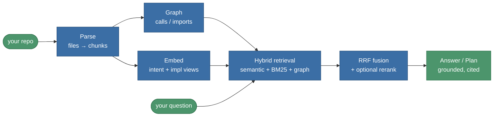

# How It Works

CGX is a one-way pipeline — **parse → graph → embed → retrieve → answer /
codegen** — with the **[[Session Based Agent]]** orchestrating that
pipeline one typed task at a time. This page is the conceptual tour; the
contributor-facing deep dive is **[[Architecture]]** and
[`docs/architecture.md`](https://github.com/raminmohammadi/CGX/blob/main/docs/architecture.md).

---

## 1. Parse — code becomes chunks

`parse_codebase` walks the repo (respecting `.gitignore`, ignore globs,
and a 1 MB per-file cap) and emits **one chunk per file / class /
function**. Files are dispatched by extension:

- **Python** (`.py`) — the stdlib `ast`; always available.
- **JavaScript / TypeScript / TSX** — tree-sitter, when the optional
  `parsers` extra is installed. Absent it, those files are skipped and
  Python-only indexing still works.

Re-parsing is incremental: a `parse_cache.json` manifest keyed on each
file's mtime/sha lets unchanged files reuse cached chunks, so only edited
files are re-parsed. Every parser emits the same chunk/call-relation
shape, so everything downstream is language-agnostic.

## 2. Graph — how the code connects

`build_knowledge_graph` derives a NetworkX graph with `defines`, `calls`,
`uses_module`, `reads_attr` / `writes_attr`, and `raises` edges. This
graph later lets retrieval expand from a direct hit to its callers,
callees, and import neighbors.

## 3. Embed — two views of every chunk

Records are materialised, then **two corpora** are built per chunk:

- **intent** — a natural-language-friendly summary (docstrings, names).
- **impl** — the implementation text (signatures + bodies).

Each view is embedded and persisted as a FAISS index. Embeddings flow
through a **content-addressed cache** (one `.npz` per view, keyed on the
sha256 of the corpus text), so a re-index only re-embeds changed chunks.
Both views build **concurrently**, and the embedder auto-selects the
fastest device (CUDA > MPS > CPU). See **[[Configuration and Tuning]]**
for incremental-index details.

## 4. Retrieve — hybrid search

`HybridRetriever.search` fuses several signals with **Reciprocal Rank
Fusion (RRF)**:

- semantic search on each view (intent + impl, run concurrently),
- **BM25** lexical search,
- **graph expansion** from the top hits (`graph_bonus`),
- **symbol-match boosting** (`symbol_boost`) for chunks whose identifier
  or path matches a query token,
- an optional **cross-encoder rerank** (`enable_reranker`) that
  lazy-loads `sentence_transformers` and silently falls back to the RRF
  order when the ML stack is absent.

Every hit carries a `provenance` dict recording which signals fired, so
the Ask tab's "thought process" panel can show *why* a chunk ranked where
it did. Tuning knobs live in `HybridConfig` — see
**[[Configuration and Tuning]]**.

## 5. Answer / codegen — grounded generation

`answer_with_llm` selects an intent-conditioned system prompt, builds
line-windowed SOURCES around the focus symbol, and asks the configured
provider for a JSON answer with citations. `generate_code_plan` does the
same but routes through the self-testing retry loop —
see **[[Self Testing Code Generation]]**.

---

## The Code Map: tiered context for small models

When graph expansion surfaces neighbors of the top hits, CGX switches to
a **two-tier "Code Map"** prompt so a local 3B/7B model does not spend its
whole context window on structural references:

- **Primary tier** — direct matches keep their full, focus-windowed code
  bodies.
- **Neighbor tier** — graph-expanded chunks collapse to a one-line stub:
  `[class.]name(signature) — first sentence of docstring`, tagged
  `tier=neighbor`.

Per-tier budgets scale by the provider's advertised context window
(bands at 16K / 64K / 200K). This is automatic; if a query triggers no
graph expansion, the prompt falls back to the legacy single-tier list and
behaves identically. Full treatment:
[`docs/architecture.md` § Tiered SLM context](https://github.com/raminmohammadi/CGX/blob/main/docs/architecture.md#tiered-slm-context-code-map).

---

## Where the agent fits

The **[[Session Based Agent]]** is the orchestration layer above this
pipeline. It turns a natural-language goal into a persistent DAG of typed
tasks — exploring an existing codebase or scaffolding a new project —
pausing at each branch for a human decision, and reusing the same
retrieval, codegen, and provider stacks described here.

---

## See also

- **[[Architecture]]** — module map and data-flow reference.
- [`docs/flowcharts.md`](https://github.com/raminmohammadi/CGX/blob/main/docs/flowcharts.md) — user / developer /
  company diagrams.
- **[[Configuration and Tuning]]** — the knobs behind each stage.
