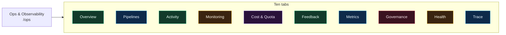
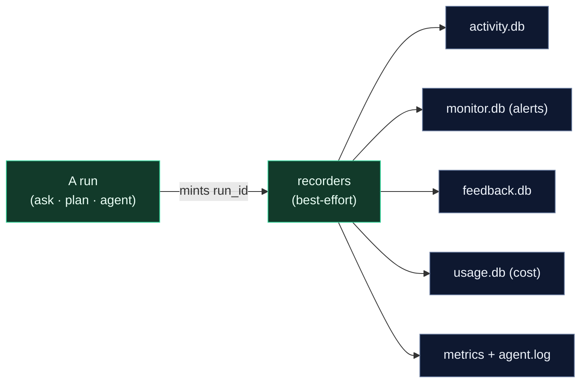
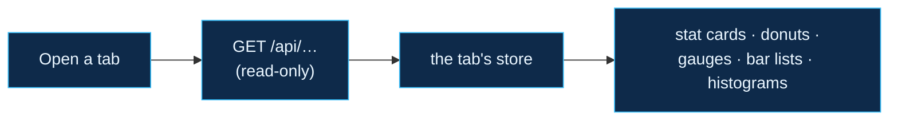
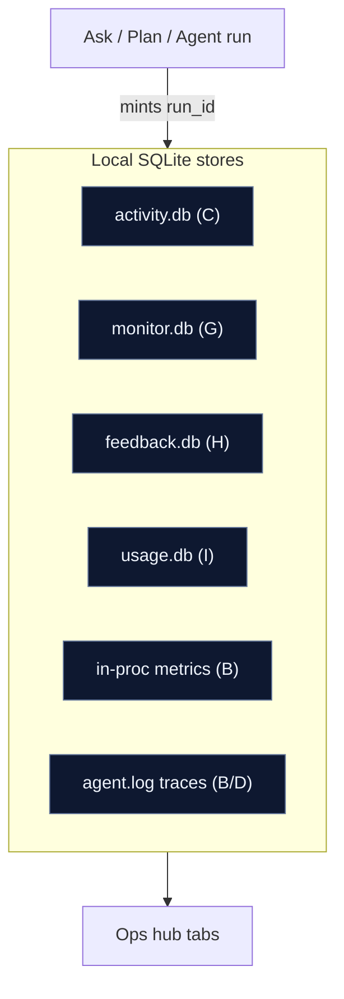
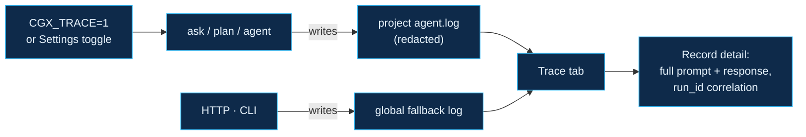

# Ops & Observability

The **Ops & Observability** hub (sidebar → **Observability → Ops &
Observability**, route `/ops`) is one screen over the entire production
MLOps layer. It surfaces every subsystem documented in
[`docs/mlops.md`](https://github.com/raminmohammadi/Averix/blob/main/docs/mlops.md) —
metrics, activity, alerts, cost, feedback, governance, health and traces —
as ten tabs of cards, charts and controls.

This page is the field guide to those cards. Users told us the hub has "a
lot of buttons and figures"; below, **every stat card, chart, filter and
button is named and explained**, tab by tab, with the exact API it reads and
the backing subsystem. If you only read one section, read
[Reading the figures](#reading-the-figures) first — it decodes the shapes
that repeat on every tab.

> **Everything here is read-only telemetry** except three write actions on
> the **Governance** tab and the **Delete** buttons on **Trace**. Nothing on
> this hub ever sends your prompts or code to a third party — the stores are
> local SQLite files. See **[[Privacy and Security]]**.

---

## Opening the hub and the global controls

The header carries two controls that apply to whatever tab is open:

| Control | What it does |
|---------|--------------|
| **Auto on/off** | Toggles a 10-second auto-refresh. Turns green (`on`) while polling; off by default so an idle tab makes no requests. |
| **Refresh** | Re-fetches the current tab once. Every tab re-reads its data on refresh (there is no cache to go stale). |

Below the header is the **tab bar**. Tabs load lazily — a tab makes its API
calls only when you open it — so the hub stays cheap until you dig in.

---

## How the hub works, in two pictures

The whole hub rests on two independent paths. Keeping them separate is what
lets telemetry be **rich without ever slowing a run** and the UI stay **cheap
until you look**.

**1. The write path — recording (always on, best-effort).** Every ask / plan /
agent run mints a `run_id` and fans that key out to a set of recorders as it
executes. Each recorder writes to its own local SQLite store (or the in-process
metrics registry). Every write is wrapped best-effort, so a telemetry failure
can **never** break the actual run.

**2. The read path — viewing (lazy, per tab).** Opening a tab fires its own
read-only API calls, which query those same stores and render the cards and
charts. Tabs load lazily and there is no cache, so what you see is always live
and an idle tab costs nothing.

The one thread tying both paths together is the **`run_id`**: it is stamped on
the write path and is the join key the read path uses to line up a run's
metrics, activity row, alerts and feedback across every tab.

---

## Reading the figures

The hub reuses a small set of chart primitives. Learn these five shapes once
and every tab reads the same way. Each card has an **eyebrow** (small caps
label) naming its subsystem, often with a letter — `(C)`, `(G)`, `(I)` — that
maps to the [subsystem legend](#subsystem-legend) at the bottom.

| Figure | Looks like | Reads as |
|--------|------------|----------|
| **Stat card** | A big number with a small label | A single headline count/amount. Turns **red** for a bad state (errors present, budget exceeded) and **green/neon** for the primary metric. |
| **Donut** | A ring with a number in the middle | A part-to-whole split. The centre is the total; each coloured arc is one category (e.g. ask/plan/agent, or critical/warning/info). |
| **Gauge** | A half-ring dial 0–100% | One ratio: satisfaction, readiness (`3/4`), or budget used. Green = healthy, amber = warning, red = bad. |
| **Bar list** | Horizontal bars, longest first | A ranked breakdown (spend by owner, alerts by code, models observed). The bar length is the value; a sub-label adds context. |
| **Histogram** | A row of vertical bars | A latency/size distribution. Each bar is a bucket (`≤50ms`, `≤100ms`, … `∞`); taller = more observations in that bucket. |

Colour is consistent everywhere: **emerald** = ask / healthy / "fits",
**blue** = plan / neutral series, **purple** = agent / router, **amber** =
warning / tight, **red** = error / critical / won't-fit, **slate** = info.

Every run stamps a single **`run_id`** onto its metrics, activity row, alerts
and feedback, so the same run can be followed across tabs. That join key is
the thread the whole hub is woven on.

---

## Tab 1 — Overview

The landing tab: a one-screen status board that pulls one figure from each
major subsystem. It reads five endpoints at once (`activity/summary`,
`feedback/stats`, `monitor/alerts`, `usage/summary`, `readyz`).

**Top row — four stat cards:**

| Card | Meaning |
|------|---------|
| **Runs** | Total ask/plan/agent runs recorded (all time). |
| **Cost recorded** | Summed metered cost across all runs. |
| **Tokens** | Total tokens across all runs. |
| **Errors** | Runs that ended in error — **red** when non-zero. |

**Middle row — three cards:**

- **Runs by kind** *(Activity C)* — a donut splitting runs into ask
  (emerald) / plan (blue) / agent (purple); the centre is the run total.
- **Alerts by severity** *(AIOps G)* — a donut of critical/warning/info
  counts. The **View all** button jumps to the **Monitoring** tab.
- **Two gauges** — **Satisfaction (H)** (thumbs-up ratio) and **Ready (J)**
  (passing readiness checks, e.g. `3/4`; green when ready, red when not).

**Bottom — Spend by owner (today)** *(Cost & quota I)*: a bar list of the top
six owners by cost for the current UTC day. The **Details** button opens the
**Cost & Quota** tab.

> Overview is the "is anything on fire?" glance. Every figure here is a
> shortcut into the dedicated tab that owns it.

---

## Tab 2 — Pipelines

The most information-dense tab: it renders CGX's live processing pipelines
from always-on metrics plus recent activity, so you can watch indexing,
retrieval and the three run modes without enabling tracing. It reads
`activity/runs`, `monitor/alerts`, `admin/metrics` and `activity/summary`.

**Index builds** *(Incremental indexing)* — from `run_index_auto`:

- Four mini-stats: **builds** (`cgx_index_builds_total`), **records** and
  **files** (gauges of current index size), **avg build** (mean of the
  `cgx_index_build_duration_ms` histogram).
- A **histogram** of build durations, and a **bar list** of build outcomes by
  status (`ok` emerald / `error` red / other amber).

**Retrieval queries** *(Hybrid retrieval)* — from `run_query_auto`:

- Mini-stats: **queries** (`cgx_retrieval_queries_total`), **avg latency**
  (`cgx_retrieval_latency_ms`), **avg cands** (candidates considered), and
  **errors**.
- A **histogram** of retrieval latency.

**Three throughput cards** — one per run mode, each showing runs / cost /
tokens / errors for that kind:

| Card | Kind | Describes |
|------|------|-----------|
| **Contextual answers** | `ask` | retrieve → rerank → answer with citations |
| **Self-testing plans** | `plan` | diffs, tests and guardrail scans |
| **Autonomous runs** | `agent` | explore → act → verify → repair |

**Lineage & registry (F)** — two bar lists: **Models observed** (distinct
models across recent runs) and **Prompt versions** (fingerprinted prompt
templates). Both join on `run_id`.

**Defensive layers (Guardrails K)** — a card counting **guardrail events**
(`cgx_guardrail_events_total`), **guardrail alerts**, and naming the
**`CGX_LLM_DISABLED`** kill-switch. The header pill shows total findings
(amber if any, neon if none). Findings are advisory — mirrored to metrics and
the alert store, never silently blocking.

**Two reference cards** — **Offline eval + CI gate (E)** (the `python -m
cgx.eval …` commands and the down-vote flywheel) and **Containers &
Kubernetes (L)** (Dockerfile / Compose / Helm and the `/healthz`, `/readyz`
probes).

---

## Tab 3 — Activity

The per-run drill-down. Same four **stat cards** as Overview (Runs / Cost /
Tokens / Errors) computed from `activity/summary`.

- **Kind filter** — four buttons **all · ask · plan · agent**; the active one
  is green and refetches the run list for that kind.
- **Recent runs** *(User activity C)* — newest-first list. Each row shows a
  **kind pill**, the question text, a **red status pill** if the run failed,
  an **amber "ungrounded" pill** if the answer wasn't grounded, the run cost,
  and a relative timestamp. Click a row to load its detail.
- **By kind** — a donut of the run mix (mirrors Overview).
- **Run** detail panel — for the selected run: `run_id`, `model`,
  `prompt_version`, `owner`, latency, tokens, **sources/cites**
  (`n_sources`/`n_citations`), and counts of attached feedback and alerts.
  This is the `run_id` join key made visible.

---

## Tab 4 — Monitoring

The alert console *(AIOps G + Guardrails K)*, reading `monitor/alerts`.

**Four stat cards:** **Alerts** (total, amber), **Critical** (red when > 0),
**Warning** (amber when > 0), **Info**.

- **Alerts by code** — a bar list grouping alerts by their `code`
  (groundedness, drift, cost-anomaly, repair-health, and `guardrail_*`
  findings). Guardrail codes render purple, everything else amber.
- **Alert stream** — newest-first list with a **severity filter** (all /
  critical / warning / info). Each row: a **severity pill**, the `code`, the
  message, the observed **value/threshold** (amber), the originating
  `run_id`, and a relative time. This is where a drift or cost-anomaly alert
  points you back at the offending run.

---

## Tab 5 — Cost & Quota

Token and dollar accounting *(Cost & quota I)*, reading `usage/summary`
(all owners) and `usage` (your own budget).

**Four stat cards** for the current UTC day: **Spend today**, **Tokens
today**, **Calls today**, **Owners** (distinct metered owners).

- **Spend by owner** — a bar list of the top eight owners by cost, each with a
  token sub-label.
- **Budget** *(You)* — your personal card: two **gauges**, **cost** (used ÷
  limit; green/amber/red by state) and **tokens**; a **state pill**
  (`ok` / `warn` / `exceeded`); and the raw `used / limit` line (`∞` when no
  limit is set). Budgets are enforced at the provider choke-point via
  `CGX_BUDGET_*` — see **[[Configuration and Tuning]]**.
- **Per-owner usage** — a full table: Owner, Cost, **Tokens in**, **Tokens
  out**, Calls.

---

## Tab 6 — Feedback

The satisfaction loop *(Feedback H)*, reading `feedback/stats` and
`feedback` (recent list).

**Four stat cards:** **Ratings** (total), **Up**, **Down** (red when > 0),
**Satisfaction** (up ÷ total, as a %).

- A **satisfaction gauge**, a **donut** of up vs down, and a **bar list**
  *By kind* pairing an up (▲, emerald) and down (▼, red) bar per run kind.
- **Recent ratings** — list with a thumbs-up/down icon, the run kind, the
  comment (or question / `run_id`), and a relative time. Down-votes drain into
  the eval-candidate flywheel (**Subsystem E**), so a thumbs-down here can
  become a golden-set case later.

---

## Tab 7 — Metrics

The raw metrics registry *(Observability B)*, reading `admin/metrics` — the
same numbers Prometheus scrapes at `GET /api/metrics`.

**Four mini-stats** (summed counters): **HTTP requests**
(`cgx_http_requests_total`), **LLM calls** (`cgx_llm_calls_total`), **LLM
tokens** (`cgx_llm_tokens_total`), **Guardrail events**
(`cgx_guardrail_events_total`).

- **LLM call latency** — a histogram of the `…latency…` series with a
  header summary (`N calls · avg Xms`).
- **Top counters** — a bar list of the ten largest counters, each labelled by
  metric name plus any Prometheus labels (`{status=ok}`).
- **Gauges** — a scrollable list of point-in-time gauge values.

A footer notes the Prometheus scrape path and that full time-series
dashboards ship with the deploy stack (Grafana).

---

## Tab 8 — Governance

The only tab with **destructive write actions** *(Data governance M)*. The
top **four stat cards** report the active policy: **Retention** (days),
**Store full text** (`yes` / `preview`), **Scrub PII** (`on` / `off`;
amber when off), **Preview cap** (chars). Read from `govdata` policy.

Three action cards:

| Card | Button | Effect |
|------|--------|--------|
| **PII scan** | **Scan** | *Non-destructive.* Counts email / card / IPv4 / phone matches in pasted text and returns a **scrubbed preview**. Finding pills show per-type counts. |
| **Purge expired** | **Run TTL purge** | Deletes rows older than the retention window across **every** observation store. Guarded by a `window.confirm`. |
| **Erase by run / owner** | **Erase subject** | Right-to-erasure: deletes **every** row for one `run_id` **or** one `owner` (the two inputs are mutually exclusive). Guarded by a confirm. |

Both destructive actions report how many rows were removed, per store, when
they finish.

---

## Tab 9 — Health

Kubernetes-style probes *(Reliability & health J)*, reading `healthz`
(liveness) and `readyz` (readiness).

**Four stat cards:** **Liveness** (`ok`/red), **Readiness**
(`ready`/`not ready`), **Checks passing** (`3/4`), **Critical failing** (red
when any critical check is down).

- A **readiness gauge** (passing ÷ total).
- **Readiness probes** — a list of every check with a ✓/✗ icon, a
  **critical/info pill**, and the check's detail key-values. Only **critical**
  checks gate `/readyz` (HTTP 503 when failing); the rest are informational.

A footer names the probe endpoints — wired to Kubernetes liveness/readiness in
the Helm chart.

---

## Tab 10 — Trace

The function-call trace explorer *(Admin explorer D · Tracing B)* — the UI
over the redacted `@traced` log. This is the deepest view: every LLM call with
its **full prompt and response**, plus router, executor, codegen, scaffold and
repair spans.

> **Tracing is off by default.** Enable it with `CGX_TRACE=1` or the
> **Settings → Observability** toggle, then run an ask/plan/agent. The rich
> records land in that **project's `agent.log`** — the Global source only
> collects HTTP/CLI traces.

**Controls (top-right):**

| Control | What it does |
|---------|--------------|
| **Source** select | Switches between **Global (HTTP · CLI)** and any project's `agent.log`. Project roots are drawn from recent activity runs — an agent turn records to `activity.db` when it quiesces, which is what puts its project root on this list. If you have run an agent but the project is missing here, its turns never reached `activity.db` (see **[[Troubleshooting and FAQ]]**). If the project's local `agent.log` is gone (a re-scaffolded greenfield tree takes it along), the reader automatically falls back to the durable **session-stable mirror** (`~/.cgx/agent-sessions/<session_id>/agent.log`) for that project's agent runs, so the trace still resolves. |
| **filter event/fn…** | Free-text filter on the event or function name. |
| **HTTP hidden / shown** | Hides the high-volume HTTP request spans (on by default) so agent/LLM records stand out. |
| **Delete** | Removes the current source's log file only. Confirmed. |
| **Delete all** | Removes every trace log (global + all known projects). Confirmed. |

Deletion is **hard-limited to trace/log files** (`cgx-trace.log` /
`agent.log` and their backups), refuses symlinks, and never touches other
files — see **[[Privacy and Security]]**.

**Below the controls:**

- **Category chips** — `all` plus one chip per derived category (llm, router,
  retrieval, codegen, repair, http, …) with live counts; click to filter.
- **Record list** — each row: an **event pill** (`enter`/`exit`/`error`/
  `llm_call`), a **category pill**, a one-line label (the function, or the
  model for an LLM call), elapsed time, and a relative timestamp.
- **By category** — a bar list of the category breakdown.
- **Record detail** — click any row. For an **LLM call** you get component,
  model, latency, prompt→response char counts, sampling (`temp`,
  `max_tokens`), the correlation IDs (`run_id`, `request_id`, `session_id`,
  `task_id`), and the **full prompt and response** blocks. Other records show
  their `fn`, elapsed, args and any error. Secrets are redacted server-side
  before they ever reach the browser.

---

## Subsystem legend

The eyebrow letters on the cards map to the subsystems in
[`docs/mlops.md`](https://github.com/raminmohammadi/Averix/blob/main/docs/mlops.md):

| Letter | Subsystem | Module / store | Appears on |
|--------|-----------|----------------|------------|
| **B** | Observability (metrics & tracing) | `cgx.metrics`, `cgx.trace` | Metrics, Trace |
| **C** | User activity | `cgx.activity` (`activity.db`) | Overview, Activity |
| **D** | Admin explorer | `cgx.webui.routes.admin` | Trace |
| **E** | Evaluation | `cgx.eval`, `evals/` | Pipelines, Feedback |
| **F** | Lineage & registry | `cgx.registry` | Pipelines |
| **G** | AIOps monitoring | `cgx.monitor` (`monitor.db`) | Overview, Monitoring |
| **H** | Feedback loop | `cgx.feedback` (`feedback.db`) | Overview, Feedback |
| **I** | Cost & quota | `cgx.usage`, `cgx.governance` (`usage.db`) | Overview, Cost & Quota |
| **J** | Reliability & health | `cgx.health` | Overview, Health |
| **K** | Guardrails & safety | `cgx.guardrails` | Monitoring, Pipelines |
| **L** | Packaging & deployment | `Dockerfile`, `deploy/helm/cgx` | Pipelines |
| **M** | Data governance | `cgx.govdata` | Governance |

---

## See also

- **[[MLOps and Production]]** — the subsystems behind these tabs, end to end.
- **[[Providers and Models]]** — the Hugging Face and Hardware panels in Settings.
- **[[Web UI Guide]]** — the rest of the UI, tab by tab.
- **[[Configuration and Tuning]]** — the `CGX_MON_*`, `CGX_BUDGET_*`,
  `CGX_RETENTION_DAYS` and tracing environment variables.
- **[[Privacy and Security]]** — redaction, the trace-delete threat model,
  and what stays local.
- [`docs/mlops.md`](https://github.com/raminmohammadi/Averix/blob/main/docs/mlops.md)
  — the exhaustive operator reference (endpoints, env vars, store layout).
