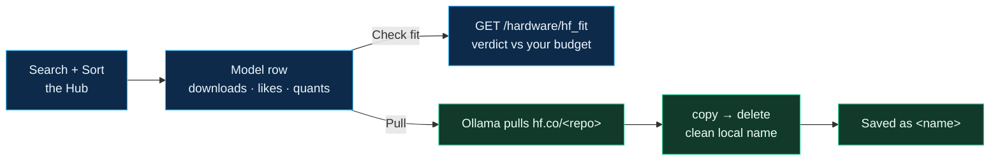
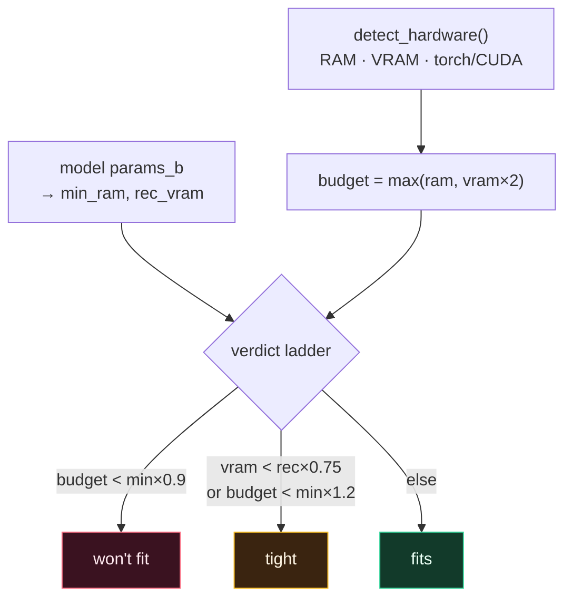

# Providers and Models

CGX is model-agnostic. Every generation path (Ask, Plan, Agent) talks to
an `LLMProvider` through a uniform `chat()` / `chat_stream()` interface,
so switching backends never changes the rest of the system. This page
covers the provider types and the hardware-aware model picker.

---

## Supported providers

| Provider type          | Kind string(s)              | Where it runs |
|------------------------|-----------------------------|---------------|
| **Ollama (local)**     | `ollama`                    | `http://localhost:11434` (loopback) |
| **OpenAI (cloud)**     | `openai`                    | `https://api.openai.com` |
| **OpenAI-compatible**  | `openai-compat`             | Any `/v1/chat/completions` endpoint (Groq, Together, DeepSeek, vLLM, …) |
| **Google Gemini**      | `gemini`                    | `generativelanguage.googleapis.com` |
| **Hugging Face**       | `huggingface`               | `router.huggingface.co` (OpenAI-compatible Inference Providers) |
| **Custom server**      | `custom`                    | Your self-hosted endpoint (custom path, optional auth-bypass) |

Choose a provider under **Settings → Active Provider** from the *Provider
Type* dropdown, or pass `--provider` on the CLI. A **Ping** button (and
`POST /api/provider/ping`) runs a live connection test that reports
latency or the exact error.

---

## Ollama (default, local)

```bash
ollama serve
ollama pull qwen2.5-coder:3b
```

Set **Provider Type → Ollama (Local)**. Default base URL
`http://localhost:11434`; Ping exercises `GET /api/tags`. This path is
fully offline — nothing leaves your machine.

## OpenAI / OpenAI-compatible (cloud)

Set **Provider Type → OpenAI (Cloud)**, supply `OPENAI_API_KEY`, and pick
a model (`gpt-4o-mini`, `gpt-4o`, …). Any OpenAI-compatible endpoint works
here — set the base URL accordingly.

## Google Gemini (cloud)

Set **Provider Type → Google Gemini (Cloud)**, supply `GEMINI_API_KEY`,
and pick a model (`gemini-1.5-flash`, `gemini-1.5-pro`, …). Ping sends a
minimal `generateContent` request with `maxOutputTokens: 1`.

```python
from cgx.answer.providers import GeminiProvider
prov = GeminiProvider(model="gemini-1.5-flash", api_key="YOUR_KEY")
# or set GEMINI_API_KEY and omit api_key
```

## Hugging Face Inference (cloud)

Set **Provider Type → Hugging Face (Cloud)**, paste a Hugging Face token
(`hf_…`), and pick a model. HF's **Inference Providers** expose an
OpenAI-compatible router at `https://router.huggingface.co/v1`, so CGX
reuses `OpenAICompatProvider` verbatim — the host and endpoint path are
hardcoded and only the token varies. The token is also read from the
`HF_TOKEN` / `HUGGINGFACEHUB_API_TOKEN` environment variables when not
supplied inline.

The model dropdown is populated from the router's **public**
`/v1/models` list (no token required to browse), so you can see what's
available before pasting a key; the token is only needed for the actual
inference call. Ping validates the token with a 1-token completion when a
model is set, or falls back to the public model list otherwise.

### Browse Hugging Face → pull GGUFs locally

The **Settings → Browse Hugging Face** panel lists GGUF repositories from
the Hub and pulls any one of them straight into your local Ollama daemon.
No HF token is required to browse or to pull — the download goes through
Ollama's `hf.co/<repo>` mechanism.

**Panel controls, element by element:**

| Element | What it is |
|---------|------------|
| **Search box** | Free-text Hub search (`llama`, `qwen`, `gemma`, …). Submitting the form (or **Refresh**) reloads the list. |
| **Sort** dropdown | **Trending** (default) · **Most downloaded** · **Most liked** · **Recently updated**. Changing it reloads immediately. |
| **Refresh** | Re-runs the current search/sort. |

**Each model row shows:** the repo id (a link to `huggingface.co/<repo>`),
a **downloads** count and a **likes** count (compacted, e.g. `12.3k`), and a
**gated** pill when the repo requires access approval. On the right sit up to
four controls:

| Control | Behaviour |
|---------|-----------|
| **quant** select | Lists the quantization labels detected in the repo (`q4_k_m`, `q8_0`, …) plus **default quant**. The choice becomes the Ollama tag suffix. |
| **Check fit** | Sizes the model against your detected hardware **without downloading** — calls `GET /hardware/hf_fit`. Renders the [fit result](#the-fit-verdict) inline. |
| **Pull** | Downloads via Ollama and re-aliases to a clean local name (below). |
| **Cancel** | Appears while that repo is pulling; aborts the in-flight download. |

A **PullProgress** bar streams the download beneath the row.

**Clean local naming.** Once the download completes, the model is
**re-aliased** so it isn't stored under the full `hf.co/…` web address:
`hf.co/ornith-ai/Ornith-1.0-9B-GGUF` becomes `ornith-1.0-9b-gguf` (with the
chosen quant as the tag, e.g. `…:q4_k_m`). The panel derives this name from
the repo id and passes it as the optional `local_name` on
`POST /api/ollama/pull`; the backend then runs Ollama's `POST /api/copy`
followed by `DELETE /api/delete` (instant — no re-download) and reports the
final name back over the progress stream ("Download complete — saved as
`<name>`"). The re-alias is best-effort: if it fails, the original tag is
kept and the download is never reported as an error.



## Custom server (OpenAI-compatible)

For a self-hosted model on a private subnet:

- **Host IP/URL** — e.g. `http://100.10.20.10:8080`
- **Endpoint Path** — the exact path suffix, e.g. `/completion` (default
  `/v1/chat/completions`)
- **Bearer Token** — optional; leave blank and tick **Skip auth** for
  servers that need no authentication.

```python
from cgx.answer.providers import OpenAICompatProvider
prov = OpenAICompatProvider(
    model="my-model",
    base_url="http://100.10.20.10:8080",
    endpoint_path="/completion",
    allow_no_auth=True,
)
```

---

## Profiles

Save any configuration as a named **Profile** (Profiles tab or
`cgx.answer.profiles.save_profile`). A profile persists `kind`, `model`,
`base_url`, sampling params, `endpoint_path`, `allow_no_auth`,
`enable_reranker`, and optional per-profile `rate_limit` / `max_retries`.

API keys are stored in the OS keyring when the `keyring` extra is
installed; otherwise in `~/.cgx/secrets.json` with `0600` permissions.
**Keys are never passed on the command line** — cloud providers read them
from the environment or the keyring-backed store. See
**[[Privacy and Security]]**.

---

## Schema-constrained decoding

Every `chat()` accepts an optional `json_schema`. When combined with
`force_json`, each provider requests structured output natively (Ollama
`format`, OpenAI `response_format`, Gemini `responseSchema`). Any backend
that rejects the schema degrades gracefully down a
`json_schema → json_object → plain` ladder, with a balanced-brace
extractor as the final safety net — so weaker models fall back cleanly
instead of failing.

---

## Rate limiting & retries

Every HTTP-backed provider goes through `cgx.answer.ratelimit`: a
thread-safe token-bucket limiter plus exponential-backoff retry
(honouring `Retry-After`) on HTTP **429** and **5xx**. Configure per
profile with `rate_limit` (req/sec) and `max_retries`. Setting
`rate_limit=None` (the default) makes the limiter a no-op. Details in
**[[Configuration and Tuning]]**.

---

## Hardware detection & the fit matrix

**Settings → Hardware** is the *Hardware-Aware Local Catalog*: it detects
what your machine can run and cross-references a curated catalogue of
locally-runnable models against those limits. It is **pure-offline for the
catalogue** — annotating rows fires no network call (only the optional
Hugging Face fit checker below reaches the Hub).

### What "Detect Hardware Budget" probes

The **Detect Hardware Budget** button (top-right; shows *Detecting…* while it
runs) calls `GET /hardware/matrix`, which re-runs `detect_hardware()` on every
request. That probe is best-effort and dependency-light:

| Signal | How it's measured |
|--------|-------------------|
| **System RAM** | Reads `MemTotal` from `/proc/meminfo`. |
| **GPU VRAM** | Runs `nvidia-smi --query-gpu=memory.total`; takes the largest GPU. Absent → "no GPU". |
| **torch / CUDA** | Imports `torch` once (cached) to check `torch.cuda.is_available()`. |

If an NVIDIA GPU is present but `torch.cuda` is unavailable (a common
CUDA-wheel/driver mismatch), the probe returns a **`torch_cuda_warning`** —
embeddings would silently fall back to CPU (~10× slower), and the message
tells you which `cu1XX` torch wheel to reinstall.

### The four stat cards

| Card | Meaning |
|------|---------|
| **System RAM** | Detected RAM in GB. |
| **GPU VRAM** | Detected VRAM in GB, or `--` when no GPU is found. |
| **Catalog rows** | Number of models in the annotated table. |
| **Installed** | How many of those you've already pulled into Ollama. |

### The catalogue table

One row per model. **Rows you've already pulled are highlighted** and carry a
green **Downloaded** pill in the *Status* column; hovering a row shows the fit
`reason` as a tooltip. The matrix endpoint merges your installed Ollama tags
(`GET /api/tags`) into the static catalogue, appending any installed-only
model that isn't curated.

| Column | Meaning |
|--------|---------|
| **Model** | Ollama tag (e.g. `qwen2.5-coder:3b`). |
| **Params** | Approx parameter count (billions). |
| **Min RAM** | Lower bound for 4-bit quantised inference. |
| **Rec VRAM** | VRAM for smooth throughput. |
| **Family** | `coder` / `general` / `reasoning` (rows group in that order). |
| **Status** | **Downloaded** pill when installed locally, else `—`. |
| **Fit** | ✅ **fits** / ⚠️ **tight** / ❌ **won't fit**, with the `reason` and any `notes`. |

### The fit verdict

Both the table and the Hugging Face checker share one scorer. First a single
**budget** number is derived — VRAM dominates when a GPU is present, else RAM:

```
budget_gb = max(ram, vram * 2)   if a GPU is present
          = ram                  otherwise
```

Then the verdict ladder (min-RAM and rec-VRAM come from the catalogue, or are
estimated for arbitrary models — see below):

| Verdict | Condition |
|---------|-----------|
| **unknown** | budget is 0 (probe returned nothing) or params can't be determined |
| **won't fit** | `budget < min_ram × 0.9` |
| **tight** | GPU present and `vram < rec_vram × 0.75`, **or** `budget < min_ram × 1.2` |
| **fits** | otherwise |

For models not in the catalogue (installed-only tags, or any Hugging Face
repo), requirements are estimated from the parameter count for a 4-bit quant:
`rec_vram ≈ params×1.1 + 0.7` and `min_ram ≈ params×1.3 + 2.5` GB.



### Test a Hugging Face model

Below the table, the **Test a Hugging Face model** card takes any Hub repo id
(e.g. `Qwen/Qwen2.5-Coder-7B-Instruct`) and runs the same **Check fit** as the
Browse panel. It calls `GET /hardware/hf_fit`, which fetches the repo's public
metadata and resolves the parameter count from the exact **`safetensors.total`**
when the Hub reports it, otherwise from the **size hint in the repo name**
(shown as `(est.)`). Repo ids are validated to a strict `owner/name` pattern
and only ever used as a path segment against a fixed host (an SSRF barrier); an
unresolvable repo degrades to an **unknown** verdict rather than erroring.

The **fit result** panel (shared with the Browse panel) shows the colour-coded
verdict and reason, plus four spec tiles: **Params**, **Min RAM**, **Rec
VRAM**, and **Your budget** (your detected `RAM / VRAM`).

### Local-First vs Cloud trade-offs

The final card is an editorial comparison — a grid of decision dimensions
(privacy/egress, marginal cost, quality ceiling, cold/warm latency, offline
use, setup effort, operational risk). Each tile states the **Local** and
**Cloud** position and a **winner** badge (emerald `local`, purple `cloud`, or
`tie`). It is pure guidance — no live numbers. The same data is exported to
[`docs/hardware_matrix.json`](https://github.com/raminmohammadi/Averix/blob/main/docs/hardware_matrix.json)
and documented in
[`docs/hardware_matrix.md`](https://github.com/raminmohammadi/Averix/blob/main/docs/hardware_matrix.md).

---

## MCP tool servers

Beyond the LLM provider, the **swarm agent** can call external tools through the
**Model Context Protocol (MCP)** — an optional layer installed with
`pip install cgx[mcp]` (see **[[Installation]]**).

The server roster is a **local JSON config** at `~/.cgx/mcp.json` (override the
path with `CGX_MCP_CONFIG`). Adding a tool server is a config edit — no code
change. Both `stdio` and `http` transports are supported, each server has an
`enabled` flag, and bearer auth is expressed as an env-var name via `token_env`
so the **token is never stored in the JSON**:

```json
{
  "servers": [
    {"name": "fetch", "transport": "stdio",
     "command": "uvx", "args": ["mcp-server-fetch"], "enabled": true},
    {"name": "docs", "transport": "http",
     "url": "http://localhost:3000/mcp", "enabled": true,
     "auth": {"type": "bearer", "token_env": "DOCS_TOKEN"}}
  ]
}
```

The swarm gets three registry tools — `mcp_list_servers`, `mcp_list_tools`, and
`mcp_call` (HIGH risk, so gated by the approval gate when active). Discovery is
**lazy** so many servers don't flood the prompt, and MCP tools are only
advertised to the agent when at least one server is configured.

It **degrades gracefully**: without the `mcp` SDK installed, discovery from the
config still works and the call tools return an "install `cgx[mcp]`" message
rather than failing. Over the web API, `GET /api/mcp/servers` lists the servers
with an `sdk_installed` flag and `POST /api/mcp/toggle` enables/disables one.
See **[[Swarm Agent]]** and **[[Privacy and Security]]**.

---

## See also

- **[[Ops and Observability]]** — the observability hub and its Metrics tab.
- **[[Configuration and Tuning]]** — sampling, rate limits, embeddings.
- **[[Privacy and Security]]** — where credentials live and egress paths.
